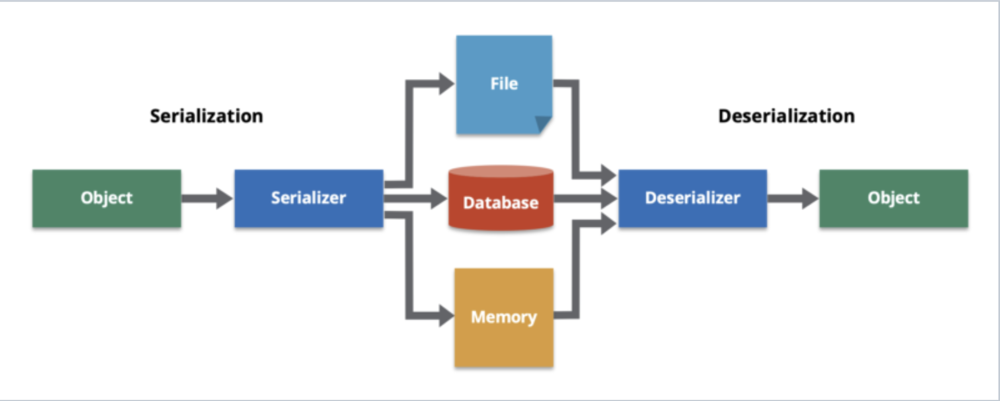

### Lambda & Functional Interface

Lambda表达式本质上是一个匿名内部类（anonymous class），但它们与函数式接口（functional interface）密切相关，并在使用函数式接口时提供了更简洁（concise）的语法。

Lambda表达式通常与函数式接口一起使用。函数式接口是一个只包含一个抽象方法的接口，它定义了Lambda表达式的签名。这里 `MyFunction add = (x, y) -> x + y;` 左边就是functional interface, 右边是anonymous class. 

**Lambda表达式用于实现该接口的抽象方法**。尽管Lambda表达式提供了一种简洁的语法，但它们实际上是匿名内部类的实例，用于实现函数式接口的方法。

``````java
// 定义一个函数式接口
interface MyFunction {
    int apply(int x, int y);
}

public class LambdaExample {
    public static void main(String[] args) {
        // 使用Lambda表达式来实现函数式接口的抽象方法
        MyFunction add = (x, y) -> x + y;
        MyFunction subtract = (x, y) -> x - y;

        // 调用Lambda表达式实现的方法
        System.out.println("Addition: " + add.apply(5, 3));
        System.out.println("Subtraction: " + subtract.apply(5, 3));
    }
}

``````

一般的anonymous class:

``````java
Thread thread = new Thread(new Runnable() {
    public void run() {
        // 线程执行的代码
    }
});
thread.start();

``````


### Memory Management of Java 8

Java 8 introduced several memory management improvements and features, including enhancements to the garbage collector and the introduction of the "Metaspace" memory area. Here are some of the key memory management features in Java 8:

1. **PermGen Removal:** Although the PermGen space was removed in Java 8 and replaced by Metaspace, it's worth mentioning that this change had a significant impact on memory management, as it eliminated common issues related to PermGen space, such as memory leaks caused by excessive class loading.
2. **Metaspace:** In Java 8, the permanent generation (PermGen) was replaced by the Metaspace memory area. Metaspace is responsible for storing class metadata, such as class names, methods, and fields. Unlike PermGen, which had a fixed size, Metaspace dynamically manages memory and can expand or contract as needed. This helps prevent "OutOfMemoryError" caused by running out of space in the permanent generation.
3. **Garbage Collection Improvements:** Java 8 introduced several improvements to the garbage collector, including the introduction of the G1 Garbage Collector (Garbage-First). The G1 collector aims to provide better throughput and latency characteristics than the previous collectors like the Parallel Garbage Collector or the CMS collector.
4. **Lambda Expression Memory Management:** Java 8 introduced lambda expressions, which are implemented as anonymous classes under the hood. The JVM optimizes the memory usage of lambda expressions by reusing instances when possible, thus reducing memory overhead.
5. **Stream API:** While not directly related to memory management, the Stream API introduced in Java 8 encourages a more functional and memory-efficient style of programming. It allows developers to process large data sets efficiently without creating intermediate collections, which can help save memory.


### Memory Leak in Java & How to detect it

Memory Leak: a program allocates memory space to store objects or data but fails to release or deallocate that memory when it is no longer needed. This results in a continuous occupation of memory, potentially leading to performance issues or program crashes. Memory leaks in Java typically occur in the following scenarios:

1. **Unreleased Object References**: When an object is allocated memory, if there are still references to that object even when the program no longer needs it, the garbage collector cannot reclaim the memory.
2. **Improper Cleanup of Collection Objects**: Using collection classes (e.g., ArrayList, HashMap) without properly removing objects that are no longer needed can cause those objects to continue occupying memory.
3. **Failure to Close Resources**: Not closing files, database connections, network connections, or other system resources after using them can result in resource leaks, ultimately consuming a significant amount of memory.

Common methods for detecting memory leaks in Java:

1. **Garbage Collector**: Java includes a built-in garbage collector that automatically reclaims memory from objects that are no longer in use.
2. **Memory Analysis Tools**: Java provides various memory analysis tools such as **VisualVM**, **Eclipse Memory Analyzer (MAT)**, and **YourKit**. These tools help you analyze memory usage patterns and identify potential memory leaks.
3. **Memory Leak Detection Tools**: There are third-party tools and libraries available for detecting memory leaks in Java programs.
4. **Code Review**: Carefully review your code to ensure that references or resources are released or closed when they are no longer needed.


### Garbage Collection In Java

- Java programs perform automatic memory management. 
- When Java programs run on the JVM, objects are created on the heap
- Eventually, some objects will no longer be needed. The garbage collector finds these unused objects and deletes them to free up memory.

- Reference counting
  - 给对象中添加一个引用计数器，每当一个地方应用了对象，计数器加1；当引用失效，计数器减1；当计数器为0表示该对象已死、可回收。
  - 简单但速度很慢
  - 缺陷: 不能处理循环引用的情况
- Mark-and-Sweep
  - 分标记和清除两个阶段：首先标记处所需要回收的对象，在标记完成后统一回收所有被标记的对象
  - 速度较快，占用空间少
  - 标记清除后会产生大量的碎片。
- Stop-and-Copy
  - 将可用内存按容量划分为大小相等的两块，每次只需要使用其中一块。当一块内存用完了，将还存活的对象复制到另一块上面，然后再把刚刚用完的内存空间一次清理掉
  - 效率低，需要的空间大
  - 优点: 不会产生碎片。

Overall, java would choose the suitable way for different situations


### Comparable VS Comparator

- Comparable

`Comparable` 接口用于定义**对象的自然排序（类的默认排序方法）**，即对象本身具有比较其他同类型对象的能力。如果一个类实现了`Comparable` 接口，实例可以直接使用 `Arrays.sort()` 或 `Collections.sort()` 方法进行排序。

实现了 `Comparable` 接口的类都必须实现 `compareTo` 方法

- Comparator

`Comparator` 接口用于定义一个**外部的比较器**，可以用来提供不同于对象自然排序的排序逻辑。可以在**不修改对象类的情况下，创建不同的排序逻辑**。这在类没有实现 `Comparable` 接口或者你需要除自然排序以外的其他排序时非常有用。

实现 `Comparator` 接口的类需要实现 `compare` 方法


### UUID

UUID是一个128位长的数字，被设计为在空间和时间上都具有唯一性，通常用于在分布式系统中无需中央协调就能生成唯一的标识符。UUID在序列化对象时可以**用作唯一标识**，确保即使是对象的不同实例也可以被唯一地标识。以下是UUID的一些典型用途：

1. **数据库主键**：在数据库中，UUID常被用作表的主键，确保每条记录的唯一性，尤其是在分布式数据库系统中或者需要合并多个数据库时。
2. **分布式系统**：在分布式系统中，UUID可以用来唯一标识系统中的每个元素，比如事务ID、会话ID、消息ID等，以便在系统的不同部分之间传输和识别这些元素。
3. **Web开发**：在Web开发中，UUID常用于跟踪用户会话、唯一标识上传的文件或者是任何需要全局唯一标识的地方。

UUID的使用主要是因为它能提供一个足够大的空间以确保生成的标识符的唯一性，这对于避免冲突和数据的一致性至关重要。


### Serialization/Deserialization & Jackson

- https://hazelcast.com/glossary/serialization/

Serialization means **converting an object into a sequence of bytes** (e.g. JSON String), Deserialization is exactly the opposite.

Serialization（序列化）通常用于将 Java 对象转换为可传输或可存储的格式，比如将对象转换为字节流、JSON、XML 等格式，以便 **网络传输 Internet Transfer** 或 **持久化存储 Persistant Storage**。在 Spring 框架中，Serialization 有多种应用场景：

- 数据传输
- RESTful 服务
- 缓存
- Session 管理
- 消息传递

In Java, Serialization and deserialization play a great role in the transfer of data and saving it to a database or disk. In Spring project, we use `Jackson` library as the tool.




### SerialVersionUID

`serialVersionUID` 在 Java 序列化中的使用主要是为了确保序列化和反序列化过程的版本一致性。当你序列化一个对象时，对象的类定义（即类的版本）是一个重要的部分。如果你序列化了一个对象，并在之后对该对象的类进行了修改（例如添加了新的字段），然后尝试反序列化之前序列化的对象，就可能会遇到问题，因为现在的类定义和序列化时的类定义不匹配。

这里是 `serialVersionUID` 发挥作用的地方：

1. **在序列化过程中**:
   - 当一个对象被序列化时（即被转换成字节流时），`serialVersionUID` 也被写入到序列化的数据中。
2. **在反序列化过程中**:
   - 当一个对象被反序列化时（即从字节流恢复成对象时），Java 反序列化机制会检查字节流中的 `serialVersionUID` 与当前类的 `serialVersionUID` 是否匹配。
   - 如果两者匹配，Java 认为类的版本是一致的，于是可以成功地反序列化对象。
   - 如果两者不匹配，表明类的定义已经变化，反序列化机制无法确定是否能够正确地解析新类和旧数据之间的关系，因此会抛出 `InvalidClassException`。

### 如何使用 `serialVersionUID`

1. **显式声明 `serialVersionUID`**:

   - 在你的类中显式声明 `serialVersionUID`，这是一个 `static final long` 字段。

   ```java
   javaCopy code
   public class MySerializableClass implements Serializable {
       private static final long serialVersionUID = 1L;
       // 类的其他内容
   }
   ```

2. **在类变化时管理 `serialVersionUID`**:

   - 如果你更新了类（比如添加、删除字段，或修改方法），你需要决定是否要更新 `serialVersionUID`。
     - 如果你认为新版本的类与旧版本兼容（即你认为新旧版本的对象可以相互替换），你可以保留相同的 `serialVersionUID`。
     - 如果新旧版本不兼容，你应该修改这个 `serialVersionUID`（通常是增加这个数字），以防止尝试用新类定义来反序列化旧版本的对象。

通过管理类的 `serialVersionUID`，你可以控制序列化对象的版本控制，确保序列化和反序列化过程的稳定性和兼容性。

### SerialVersionUID判断的机制

### 通过什么判断

- **判断过程：**
  - `serialVersionUID` 的比较是由 Java序列化机制自动完成的。当你使用 `ObjectInputStream` 读取对象时，它会检查流中的 `serialVersionUID` 和相应类的当前 `serialVersionUID` 是否一致。

- **实现机制**：
  - Java 序列化机制内部会进行这一检查。如果你尝试使用 `ObjectInputStream` 反序列化一个对象，而该对象的类在编译后被修改过（且 `serialVersionUID` 也发生了变化），则反序列化过程会抛出 `InvalidClassException`。
- **异常情况**：
  - 如果 `serialVersionUID` 比较失败，即值不匹配，会抛出 `InvalidClassException`。这个异常告诉你尝试反序列化的对象的类定义和当前的类定义不兼容，因此无法保证能够正确地反序列化对象。

通过这种方式，`serialVersionUID` 为对象的序列化提供了一种版本控制的机制，确保了即使在类定义变化的情况下，对象的序列化和反序列化也能安全、准确地进行。

### 需要进行序列化的数据

1. **网络通信**：
   - 当对象需要通过网络从一个Java应用传输到另一个Java应用时。例如，使用RMI（Remote Method Invocation）或Web服务传输对象时，对象需要被序列化为字节流，以便通过网络发送，然后在另一端被反序列化。
2. **数据持久化**：
   - 如果需要将对象的状态持久保存到磁盘上（比如文件系统或数据库BLOB字段），以便之后可以恢复对象状态，那么这些对象需要序列化。例如，Java Web应用中的HTTP会话状态经常需要序列化到磁盘，以支持服务器重启后的会话恢复。
3. **深度复制**：
   - 通过序列化/反序列化可以创建对象的深度副本（深拷贝）。对象被序列化为字节流，然后这个字节流被反序列化为新的对象，与原始对象相比，新对象在内存中占据不同的位置，且其引用的任何对象都是新创建的。
4. **分布式计算**：
   - 在分布式应用中，任务可能需要在不同的JVM实例或不同的物理服务器上执行。这通常需要将任务（作为对象）进行序列化，然后发送到远程节点执行，执行完毕后可能还需要将结果对象序列化并发送回原节点。

### 什么样的类需要实现序列化：

1. **DTOs（Data Transfer Objects）**：
   - 用于跨网络传输的数据对象，如客户端和服务器之间的请求和响应对象。
2. **POJOs（Plain Old Java Objects）**：
   - 如果POJOs需要持久化或通过网络传输，它们应该是可序列化的。
3. **Session对象**：
   - 在Web应用程序中，用户的会话状态通常需要序列化，以便可以在不同请求之间、服务器重启后或服务器之间共享。
4. **JMS消息**：
   - 如果使用Java消息服务（JMS）发送对象消息，那么这些对象应该是可序列化的。

通常，任何需要在不同JVM实例之间共享或持久存储的对象都应该实现序列化。但是，在序列化类时，需要谨慎处理，确保类的私有性、安全性和版本兼容性得到妥善管理。


### Java hashmap implementation (hashcode chain vs red black tree)

Two ways of Implementation: 

1. **Hashcode Chain (Default, less hash collision)**

   当多个键具有相同的哈希码（即哈希冲突发生时），`HashMap`会将这些键值对存储在同一个哈希桶（bucket）中，通过链表的形式连接起来。

   **查找/插入/删除键值对**：当你尝试通过键来查找对应的值时，`HashMap`首先会计算键的哈希码，然后根据哈希码找到对应的桶（bucket），接着在该桶的链表中顺序搜索，直到找到匹配的键或到达链表末尾。插入在末尾，删除同于链表删除元素。

2. **Red Black Tree (Self-Balanced BST, more hash collision)**

- 当哈希冲突变得严重，即一个桶中的链表长度达到一定阈值（默认为8），`HashMap`会将这个链表转换为红黑树，以提高查找、插入和删除操作的效率。
- 红黑树的查找和插入操作具有对数时间复杂度（O(log n)），这比链表的线性查找更高效。
- 红黑树的自平衡性质确保了在大多数情况下，性能都能得到保证。


### Implementation of HashMap

结合了数组和链表（或红黑树）的结构

数组： 存储数据。每个数组的位置也称为“bucket”或“slot”

链表：用于解决哈希冲突

- **Hashcode Chain (Default, less hash collision):** 

  - same hashcode, go to the same hash bucket which is in a linkedlist; 

  - search will scan and traverse the linkedlist

  - O(1) for search and insert

- **Red-Black Tree:** 

  - When hash collision happens more, if the length of linked list is over the limit (default 8), this bucket will change to Self-Balanced BST.

  - O(logn) for search and insert


### HashMap / HashTable / TreeMap / LinkedHashMap

- **Thread-Safe:** HashMap is non-sychronized. It's not thread safe and can't be shared between many threads whereas Hashtable is sychronized.

- **Null Key & Value:** HashMap allows one null key and multiple null values, whereas Hashtable doesn't allow any null key or null value.


**TreeMap:** 是一个基于红黑树的NavigableMap实现。

- 它存储键值对（key-value pairs），并且按照**键的自然顺序（或者根据构造时提供的Comparator）进行排序。**
- get和put操作的时间复杂度为 O(log n)。
- non-synchronized
- 保证了元素的顺序，因此它可以提供诸如firstKey、lastKey、floorKey以及ceilingKey等有序集合相关的操作。


**LinkedHashMap:** 

是 HashMap 的一个子类，在 HashMap 的基础上增加了维护元素插入顺序或者访问顺序的能力。

它内部维护着一个双向链表来记录所有元素的顺序（默认是插入顺序，也可以自己定义访问顺序）。

在LinkedHashMap中，维护一个双向链表是为了记录整个map中所有条目（entries）的顺序，而不是单个bucket里的顺序。


### Http Code

**2xx（成功）**:

- `200 OK`：请求成功。常用于GET与POST请求
- `201 Created`：请求已被实现，结果是创建了新的资源
- `202 Accepted`：已接受用于处理，但处理尚未完成

**3xx（重定向）**:

- `301 Moved Permanently`：请求的页面已永久移至新位置

**4xx（客户端错误）**:

- `400 Bad Request`：服务器无法理解请求的格式
- `401 Unauthorized`：请求未授权
- `403 Forbidden`：禁止访问
- `404 Not Found`：找不到如何与URI相匹配的资源
- `405 Method Not Allowed`：请求行中指定的请求方法不能被用于请求相应的资源
- `408 Request Timeout`：服务器等待客户端发送的请求时间过长，超时

**5xx（服务器错误）**:

- `500 Internal Server Error`：服务器内部错误，无法完成请求

- `502 Bad Gateway`：作为网关或者代理工作的服务器尝试执行请求时，从上游服务器接收到无效的响应

  

### How does thread communicate with each other?

1. shared objects: volatile

2. Wait() and Notify()

3. Concurrent Collections: CopyOnWriteArrayList, ConcurrentHashMap

   

### ConcurrentHashMap

#### 锁分离（Lock Stripping） - JDK 8 及之后版本

1. **内部结构变化**:
   - 在JDK 8中，`ConcurrentHashMap` 的内部结构发生了显著变化。它取消了Segment的概念，转而使用了一个节点（Node）数组，每个节点都是一个链表的头部。链表过长时，链表会被转化为红黑树，以提高性能。
2. **锁定机制**:
   - JDK 8引入了锁分离（Lock Stripping）的概念。这意味着并不是对整个链表或树进行锁定，而是对链表中的单个节点或树中的特定结构进行锁定。这种细粒度的锁进一步减少了锁竞争，提高了并发性能。
3. **读取操作**:
   - 读取操作通常不需要加锁，因为使用了volatile关键字保证了内存可见性。但在更新节点时，为了保证数据一致性，可能会暂时锁定特定的节点或数据结构。
4. **CAS操作（Compare and Swap）**:
   - JDK 8的`ConcurrentHashMap`在内部大量使用了CAS操作来实现无锁的并发控制。这种机制试图通过比较和替换来更新变量，仅在变量未被其他线程修改时才进行更新。这大大减少了需要使用锁的场景，进一步提高了性能。


### Multi-Thread in Java Project

在Java Spring Boot项目中，多线程主要用于提高应用程序的性能和响应能力，尤其是在处理耗时任务、增加并发处理能力或进行后台处理时。以下是一些典型的使用多线程的场景：

1. **异步处理**:
   - 在Web应用程序中，你可能希望异步处理一些耗时的任务，以避免阻塞主线程，从而提高用户界面的响应性。Spring提供了`@Async`注解，你可以很容易地在方法上使用它来使其异步执行。
2. **定时任务**:
   - 使用Spring的`@Scheduled`注解来执行定时任务。这些任务可以配置为在新的线程中运行，这样就不会干扰应用程序的主线程。
3. **并发数据处理**:
   - 当你需要处理大量数据或执行复杂的算法时，多线程可以帮助你并行化处理过程，从而提高效率。例如，在报表生成或数据分析应用中，可以使用多线程来加快数据处理的速度。
4. **用户请求的并发处理**:
   - 如果你的应用程序需要处理来自用户的高并发请求，并且每个请求都需要进行大量的计算或I/O操作，使用多线程可以帮助你更高效地利用服务器资源，提高吞吐量。
5. **消息队列的处理**:
   - 在基于消息的微服务架构中，可以使用多线程来并发处理消息队列中的消息。这对于确保高吞吐量和低延迟的消息处理是非常有用的。
6. **使用Spring Batch进行批处理**:
   - 对于大规模数据处理，Spring Batch提供了强大的批处理能力，并能利用多线程来提高数据处理的速度。

在使用多线程时，也需要注意线程安全、资源同步和错误处理等问题。不当的多线程使用可能导致数据不一致、死锁或性能问题。因此，合理设计和测试多线程代码是非常重要的。此外，Spring提供了很多与线程管理相关的工具和框架（如`@Async`、`TaskExecutor`、`CompletableFuture`），可以帮助你更安全、更有效地实现多线程。


### Functional Programming in Java

在Java中，函数式编程（Functional Programming, FP）是一种编程风格，它允许你以更声明性的方式编写代码，关注于“做什么”而不是“怎么做”。Java中的函数式编程主要是在Java 8引入的一系列新特性的基础上实现的，包括lambda表达式、方法引用、Stream API、以及新的函数式接口。

以下是Java中函数式编程的一些关键特点和组件：

1. **Lambda表达式**:

   - Lambda表达式允许你以匿名函数的形式将行为（或代码块）作为参数传递给方法。这使得编写更简洁和灵活的代码成为可能，特别是当你使用集合时。

   ```
   javaCopy code
   List<String> names = Arrays.asList("Bob", "Alice", "Charlie");
   names.sort((a, b) -> a.compareTo(b));
   ```

2. **Stream API**:

   - Stream API提供了一种高级抽象，使得对集合的操作更加直观和函数式。你可以链式调用方法来表达复杂的数据处理流程，如过滤、映射、排序和汇总。

   ```java
   List<String> filteredNames = names.stream()
                                     .filter(name -> name.startsWith("A"))
                                     .collect(Collectors.toList());
   ```
   
3. **函数式接口**:

   - 函数式接口是只有一个抽象方法的接口。Java 8在`java.util.function`包中引入了一系列标准的函数式接口，如`Function<T,R>`、`Predicate<T>`、`Consumer<T>` 和 `Supplier<T>`。

4. **方法引用**:

   - 方法引用是一种简洁的方式，用来直接引用已经存在的方法或构造函数。它与lambda表达式类似，但更简洁。

   ```java
   names.forEach(System.out::println); // 方法引用
   ```
   
5. **Optional类**:

   - `Optional<T>` 是一个容器对象，它可以包含也可以不包含非空值。通过使用`Optional`，你可以更优雅地处理可能为空的值，而不是使用`null`。

虽然Java不是一种纯函数式编程语言，但Java 8及以后的版本引入的这些特性使得在Java中应用函数式编程的概念成为可能。它们提供了强大的工具来编写更简洁、更可读且易于维护的代码，特别是在处理集合、数据流处理和并发时。


### Types of Functional Interface

在Java中，函数式接口(Functional Interface)是只包含一个抽象方法的接口，它们可以通过Lambda表达式、方法引用或构造函数引用来实例化。Java 8引入了函数式接口概念，并在`java.util.function`包中提供了多种标准的函数式接口。这些接口主要可以分为以下几类：

1. **供给型接口（Suppliers）**

供给型接口是不接受参数，返回一个值的函数式接口。它们通常用于提供或生成值。

- `Supplier<T>`：返回一个T类型的值。

  ``````java
  Supplier<String> dateSupplier = () -> LocalDate.now().toString();
  System.out.println(dateSupplier.get()); // 输出当前日期
  ``````

  ```
  Optional.orElseGet(Supplier<? extends T> other)
  ```

  

2. **消费型接口（Consumers）**

消费型接口接受一个参数，但不返回任何结果（不提供新的值），通常用于对参数执行操作。

- `Consumer<T>`：对给定的参数T执行操作。

- `BiConsumer<T, U>`：对给定的参数T和U执行操作。

  ``````java
  Consumer<String> stringConsumer = System.out::println;
  stringConsumer.accept("Hello, World!"); // 输出 "Hello, World!"
  ``````

  ``````
  Stream.forEach(Consumer c)
  ``````

  

3. **函数型接口（Functions）**

函数型接口接受一个参数，并返回单一的结果，用于对参数应用计算或转换。

- `Function<T, R>`：接受T类型的参数，返回R类型的结果。

- `BiFunction<T, U, R>`：接受T和U类型的参数，返回R类型的结果。

- `UnaryOperator<T>`：接受T类型的参数，返回T类型的结果，它是`Function<T, T>`的特例。

- `BinaryOperator<T>`：接受两个T类型的参数，返回T类型的结果，它是`BiFunction<T, T, T>`的特例。

  ``````java
  Function<String, String> toUpperCaseFunction = String::toUpperCase;
  System.out.println(toUpperCaseFunction.apply("hello")); // 输出 "HELLO"
  ``````

  ```
  Stream.map(Function f) // map(String::toUpperCase)
  ```

  

4. **断言型接口（Predicates）**

断言型接口接受一个参数，并返回一个布尔值，通常用于评估条件。

- `Predicate<T>`：确定给定的参数T是否满足某约束。

- `BiPredicate<T, U>`：确定给定的参数T和U是否满足某约束。

  ``````java
  Predicate<Integer> isPositive = x -> x > 0;
  System.out.println(isPositive.test(5)); // 输出 true
  System.out.println(isPositive.test(-5)); // 输出 false
  ``````

  ``````
  Stream.allMatch(Predicate p)
  ``````

  

5. **其他特殊的函数式接口**

除了上述分类，`java.util.function`包还提供了一些其他特殊用途的函数式接口，如：

- `ToIntFunction<T>`、`ToLongFunction<T>`、`ToDoubleFunction<T>`：接受T类型的参数，分别返回`int`、`long`或`double`结果。
- `IntFunction<R>`、`LongFunction<R>`、`DoubleFunction<R>`：接受`int`、`long`或`double`参数，返回R类型的结果。

这些函数式接口为Java中的函数式编程提供了强大的基础，使得开发者可以写出更简洁、更灵活的代码，尤其是在使用Stream API、并行计算和事件监听器等场景中。


### Generic

```KafkaConsumer<String, String>```

`<String, String>` 中的尖括号表示泛型（Generics）。在 Java 中，泛型提供了一种在编译时检查和强化类型安全性的机制，使得代码更加灵活和可重用。

在 `KafkaConsumer<String, String>` 中，`<String, String>` 指定了两个泛型类型参数。第一个参数表示 Kafka 消息的键（Key）的类型，第二个参数表示 Kafka 消息的值（Value）的类型。在这个例子中，键和值都是字符串类型，因此指定了两个 `String` 类型的参数。	

通过使用泛型，`KafkaConsumer` 可以在编译时检查消费者的键和值类型，从而提供更强的类型安全性。


