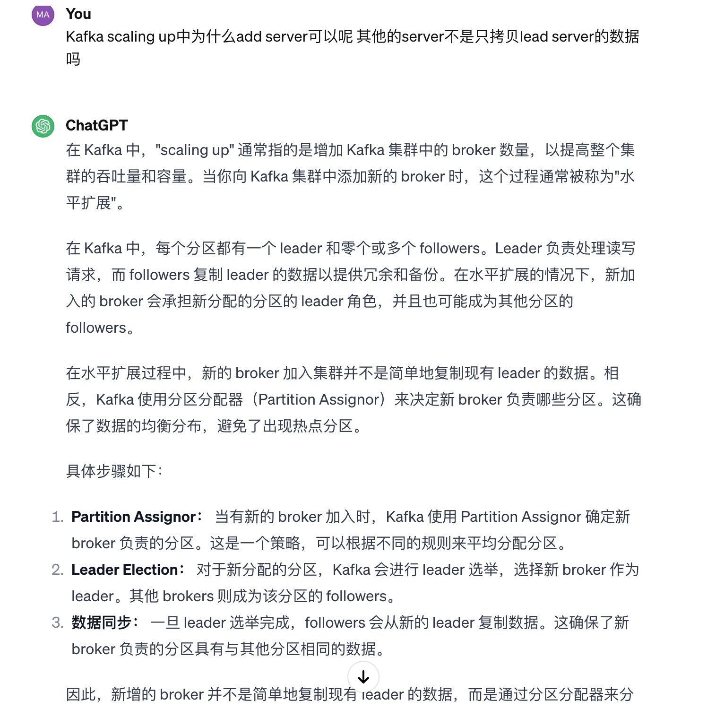
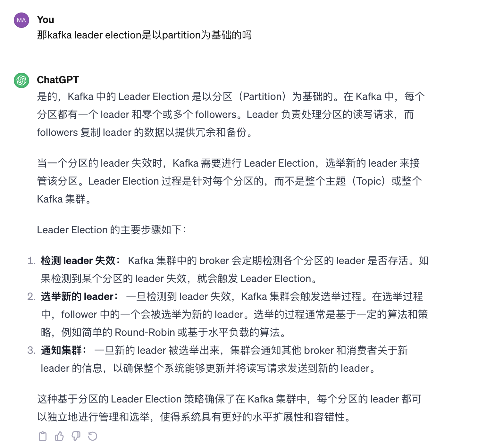

## 在 Spring Boot 项目中使用 Kafka 通常需要以下步骤：

1. 引入 Kafka 相关依赖： 在项目的 pom.xml 文件中添加 Kafka 相关的依赖，以便引入 Kafka 客户端库和 Spring Kafka 支持。示例：

```xml
   <dependency>
        <groupId>org.springframework.kafka</groupId>
        <artifactId>spring-kafka</artifactId>
   </dependency>
```

2. 配置 Kafka 连接信息： 在 application.properties 或 application.yml 文件中配置 Kafka 服务器的连接信息。
   `spring.kafka.bootstrap-servers=localhost:9092`

上述配置中，localhost:9092 是 Kafka 服务器的地址和端口，你需要根据实际情况进行配置。

3. 创建 Kafka 消息生产者（Producer）： 使用 Spring Kafka 提供的 KafkaTemplate 来发送消息。示例：

```java
import org.springframework.kafka.core.KafkaTemplate;

@Service
public class KafkaProducerService {

    private final KafkaTemplate<String, String> kafkaTemplate;

    public KafkaProducerService(KafkaTemplate<String, String> kafkaTemplate) {
        this.kafkaTemplate = kafkaTemplate;
    }

    public void sendMessage(String topic, String message) {
        kafkaTemplate.send(topic, message);
    }
}
```

4. 创建 Kafka 消息消费者（Consumer）： 使用 @KafkaListener 注解创建一个 Kafka 消费者，用于监听指定的主题，并在接收到消息时执行相应的业务逻辑。示例：

```java
import org.springframework.kafka.annotation.KafkaListener;

@Service
public class KafkaConsumerService {

    @KafkaListener(topics = "my-topic")
    public void listen(String message) {
        // 处理接收到的消息
        System.out.println("Received Message: " + message);
    }
}
```

5. 配置生产者和消费者的序列化方式： 默认情况下，Kafka 使用字符串序列化。如果你的消息是复杂的对象，需要配置相应的序列化和反序列化器。示例：

```properties
spring.kafka.producer.value-serializer=org.springframework.kafka.support.serializer.JsonSerializer
spring.kafka.consumer.value-deserializer=org.springframework.kafka.support.serializer.JsonDeserializer
```

上述配置使用了 JSON 序列化器和反序列化器。

6. 运行 Spring Boot 应用程序： 启动你的 Spring Boot 应用程序，并开始发送和接收 Kafka 消息。

上述步骤是一个简单的开始，实际使用时可能需要更复杂的配置和逻辑。你还可以配置更多的属性，如消费者组、分区、自定义序列化器等，具体取决于你的需求。Spring Kafka 提供了强大的支持，允许你更灵活地集成 Kafka 到 Spring Boot 项目中。

## Replica

Replica Partition 是不工作的，只提供备用的功能

## Leader Election in ZooKeeper - leader broker VS follower broker

- Leader Broker： Leader 负责处理特定分区的读写请求。它是该分区的"主要"负责者，负责追踪分区的写入操作，确保数据一致性，并向 followers 发送数据。

- Follower Broker： Followers 是 leader 的副本，它们复制 leader 的数据。尽管 followers 在正常情况下通常不直接处理客户端的读写请求，但它们仍然在起到非常重要的角色。具体而言，followers 承担以下主要任务：

      - 数据冗余和备份： Followers 在不断地从 leader 复制数据，以提供数据冗余和备份。如果 leader 失效，一个 follower 可以被选举为新的 leader。
      
      - 提供读取服务： 在一些情况下，followers 可能会直接处理客户端的读取请求。这种情况通常是通过配置 Kafka Consumer 来实现的，以从 followers 中读取数据，从而分担 leader 的读取负载。

  Leader 选举： 如果 leader 失效，Kafka 会从 followers 中选择一个新的 leader。Leader 选举的目的是确保即使某个 broker 失效，整个 Kafka 集群仍然能够提供服务。

总体来说，Leader 和 Follower 在 Kafka 中是通过分区进行的。每个分区有一个 leader 和多个 followers。所有的 broker 在 Kafka 集群中都是活跃的，扮演着不同的角色。Leader 负责处理写入请求，而 followers 则负责复制数据以提供冗余和备份。这种分布式设计使得 Kafka 具有高可用性、容错性和横向扩展性。

## 那 followers 上面的数据 一定能在 leader 上面找到吗

在 Kafka 中，followers 上的数据一定能在 leader 上找到，因为 followers 是从 leader 复制数据而来。Leader 负责处理所有分区的写请求，而 followers 则定期地从 leader 获取这些写入的数据，确保在整个集群中保持数据的一致性。

Kafka 使用复制机制来保证数据冗余和可用性。当 leader 接收到写入请求并成功写入本地日志后，它会将这些数据异步地发送给所有的 followers。Followers 接收到数据后，会将其追加到本地的日志中，确保 followers 上的数据与 leader 保持一致。

在正常情况下，leader 和 followers 上的数据是相同的。Leader 负责同步处理写入请求，而 followers 负责复制这些写入。但是请注意，由于异步复制的特性，可能会存在极短的时间窗口内 leader 和 followers 之间的数据略有不一致。这种情况通常是可容忍的，因为 Kafka 提供了高度的数据一致性保障，并且在 follower 上的数据迅速追赶 leader。#

## ACL Access Controll List

哪些 application 可以读哪些 topic

## Consumer Group 为什么会被 inactive

因为 move offset 的时候要 inactive consumer group
所以想 reset offset 需要进入到 inactive consumer group 界面

## Config 中 retention.ms

rentention 是退休的意思，意味着 kafka 中的数据多久被删掉
可以达到清理数据的目的-> 设置为 1ms

## Kafka 本身没有 log,借助 grafana 监控

例如：consumer lag 高了 -> consumer 处理的慢了
-> throughput 太高 (input output) 那可能是 producer 发太多消息
-> 如果 throughput 没高 那可能是 consumer 出了问题-> 去看 active consumer group -> 具体去看有多少 consumer

## Kafka 是以分区为基础的，每个分区都有一个 leader 和零个或多个 followers。 Leader Election 是针对每个 partition 的。

Partition Assignor： 当有新的 broker 加入时，Kafka 使用 Partition Assignor 确定新 broker 负责的分区。这是一个策略，可以根据不同的规则来平均分配分区。

Leader Election： 对于新分配的分区，Kafka 会进行 leader 选举，选择新 broker 作为 leader。其他 brokers 则成为该分区的 followers。

数据同步： 一旦 leader 选举完成，followers 会从新的 leader 复制数据。这确保了新 broker 负责的分区具有与其他分区相同的数据。




## Read Mode / Consume Mode / Delivery Semantics

在 Kafka 中，常见的消息传递语义包括：

1. At-Most-Once： 这是 Kafka 默认的传递语义。在这种模式下，消息可能会被重复传递，但不会丢失。

2. At-Least-Once： 通过设置 Kafka 消费者的配置 enable.auto.commit 为 false，并手动提交偏移量（offset），可以实现至少一次传递语义。

3. Exactly-Once： Kafka 从版本 0.11.0.0 开始引入了事务性生产者（Transactional Producer）和幂等性生产者（Idempotent Producer），以支持恰好一次传递语义。消费者端需要配合使用事务性消费者来达到恰好一次传递。

一般来说使用 At-Least-Once 比较常见，然后避免重复的逻辑在 Consumer 里面进行处理

## Format

可以有多种，JSON String