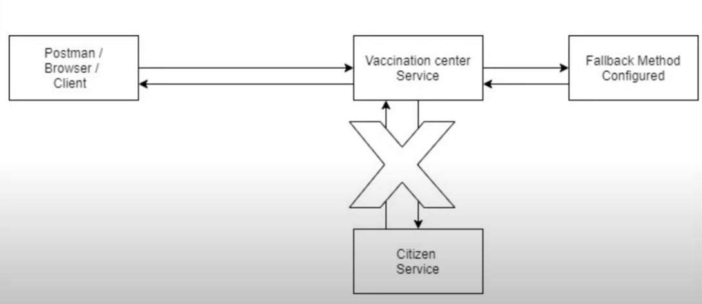
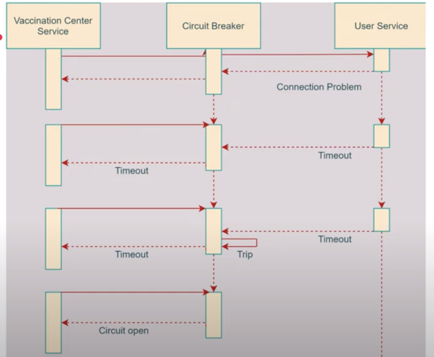
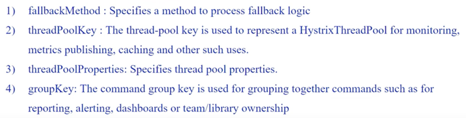
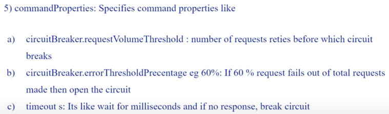
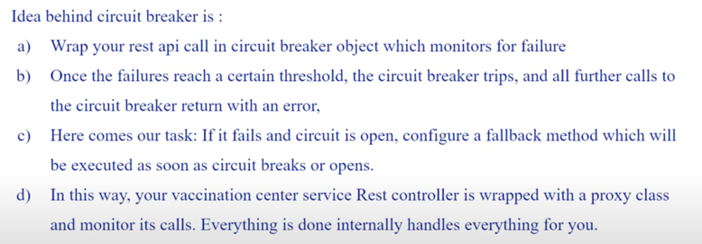

# Microservices Registry Practice
- Two Business Services: Citizens & VaccinationCenters (separate DB)
- Eureka
- API Gateway
- Hystrix

## Tutorial Videos
https://www.youtube.com/playlist?list=PLyHJZXNdCXsd2e3NMW9sZbto8RB5foBtp

Estimated time: 2 hours

## Eureka

### Dependency
Eureka配置成server
```xml
<dependency>
    <groupId>org.springframework.cloud</groupId>
    <artifactId>spring-cloud-starter-netflix-eureka-server</artifactId>
</dependency>
```

两个业务项目VaccinationCenter和CitizenCenter配置eureka-client
```xml
<dependency>
<groupId>org.springframework.cloud</groupId>
<artifactId>spring-cloud-starter-netflix-eureka-client</artifactId>
</dependency>
```

### Configuration
在CitizenService中, 因为配置了Eureka Client, 所以自动会注册在Eureka Server
- Eureka Client可在application.yml或application.properties（存储配置信息）配置自己的application name
```yml
spring:
    application:
        name: VACCINATION-CENTER-SERVICE
```
```properties
spring.application.name = VACCINATION-CENTER-SERVICE
```
- 也可以通过编写java代码手动配置
```java
@Configuration
@EnableEurekaClient
public class EurekaClientConfig {

    // 进行 Eureka Client 相关的配置
    // ...
}
```
优化：Eureka避免地址变动 by using application name in the url
- 最初版本：
`List<Citizen> citizens = restTemplate.getForObject("http://localhost:8081/citizen/id/" + id, List.class);`
- 升级版本：
`List<Citizen> citizens = restTemplate.getForObject("http://CITIZEN-SERVICE/citizens/getByCenter/" + centerId, List.class);`

## RestTemplate
当你需要 connect your server with another sever, 需要RestTemplate
在微服务架构中，各个微服务通常需要相互通信。RestTemplate 提供了一种方便的方式来进行HTTP请求，从而实现服务之间的交互。
（八股）是一种Sync Server Communication, 相对应的Kafka是Async

细节：`RestTemplate` 通过封装底层的HTTP通信细节（如连接管理、序列化/反序列化等），提供了一种高级的方式来与RESTful服务进行交互。它是同步的，意味着在HTTP响应到达之前，当前线程会被阻塞。
```java
// in VaccinationCenter Service 启动类
// 步骤一：创建RestTemplate实例
@Bean
public RestTemplate getRestTemplate() {
    return new RestTemplate();
}
```

```java
// in VaccinationCenter Service Controller类
// 步骤二： 发送请求并接收响应
List<Citizen> citizens = restTemplate.getForObject("http://CITIZEN-SERVICE/citizens/getByCenter/" + centerId, List.class);
```

## Hystrix
Circuit Breaker for Fault Tolerance
- Situation: when Citizen Service is down, the VaccinationCenter would have a following Exception 
`java.lang.IllegalStateException: No instances available for CITIZEN-SERVICE`, because we have dependency here.
- Expected: when Citi zen Service is down, the VaccinationCenter can still get its own center data.

When introduced circuit breaker, if the status is open, even Citizen Service is on, we still only go to 
`Fallback Method Configured`.



### Dependency
in VaccinationCenter Service:
```xml
<dependency>
    <groupId>org.springframework.cloud</groupId>
    <artifactId>spring-cloud-starter-netflix-hystrix</artifactId>
</dependency>
```
### Code
- Class Before `@SpringApplication`:
  - Add `@EnableCircuitBreaker` for SpringBoot < 3.0.1
  - Add `@EnableHystrix` for SpringBoot >= 3.0.1
- `@HystrixCommand(fallbackMethod = "handleCitizenDownTime")`annotations on the corresponding controller function
- Write fallback function `handleCitizenDownTime()`
### Arguments for `@hystrixCommand`



### Result:


## API Gateway
### Choosing Spring Cloud instead of Netflix Zuul: 

- Netflix era is coming to an end - All in maintenance mode. No new features will be added to Zuul, only bug-fixed.
The superseded version of Netflix Zuul is Spring Cloud Gateway.
- Zuul is blocking API, which means if threads' count is less than API requests, the rest would be blocked 
in a waiting queue for free thread. Whereas, Spring Cloud Gateway is a non-blocking API. When using it, a thread is always
available to process the incoming request. These requests are then processed asynchronously in the background and
once completed the response is returned. SO no incoming request never gets blocked.

### Advantages of API Gateway: 
- make backend only have one contact point for several services
- Centralize Common Functionalities: authorization, authentication, logging, monitoring
- Version Control: if upgraded v2 of VaccinationCenter Service is not compatible with mobile-client, 
API Gateway will make mobile-client keep using VaccinationCenter-v1 while web-client using v2.
- Proxy for all API requests, then do the routing. 

### Dependency
```xml
		<dependency>
			<groupId>org.springframework.cloud</groupId>
			<artifactId>spring-cloud-starter-gateway</artifactId>
		</dependency>
```

### Configuration
```yml
spring:
  cloud:
    gateway:
      routes:
        - id: CITIZEN-SERVICE
          uri:
            lb://CITIZEN-SERVICE
          predicates:
            - Path=/citizens/**

        - id: VACCINATION-CENTER-SERVICE
          uri:
            lb://VACCINATION-CENTER-SERVICE
          predicates:
            - Path=/vaccination_center/**
```

Several Routing Rules. And each rules has several predicates.

Reference: https://cloud.spring.io/spring-cloud-gateway/reference/html/#gateway-how-it-works

Search for: Spring Cloud Gateway Docs

### Bug
- situation: API not working when `spring-cloud-starter-gateway-mvc`
`spring-cloud-starter-gateway` 和 `spring-cloud-starter-gateway-mvc` 可能在功能上有所差异，
例如过滤器、**路由配置**等方面的实现细节可能不同。

如果可能，尝试使用更稳定和更被广泛采用的模块，比如 `spring-cloud-starter-gateway`。

### Explanation
1. API-Gateway以后，原先的Services 端口仍然可以访问，可以关掉或者禁止访问吗？

- 当你使用 API Gateway 时，内部服务的端口依然会在部署的服务器上占用，不能关掉否则会导致service失效。
- 一般的解决方案：设置网络安全组或防火墙规则 - 在你的服务实例所在的网络配置中，配置规则，允许只有 API Gateway 的 IP 地址或 IP 范围可以访问服务的内部端口。


### Others Config
#### Database: 
- CitizenDB
- VaccinationCenterDB
#### Service Ports:
- Eureka: http://localhost:8761, remember to visit the url and check the Eureka page, you will see all services in that page
- Citizen-Service: 8081
- VaccinationCenter: 8082
- API_Gateway: 8083
#### Postman APIs Collection:
attachments/microservices.postman_collection.json