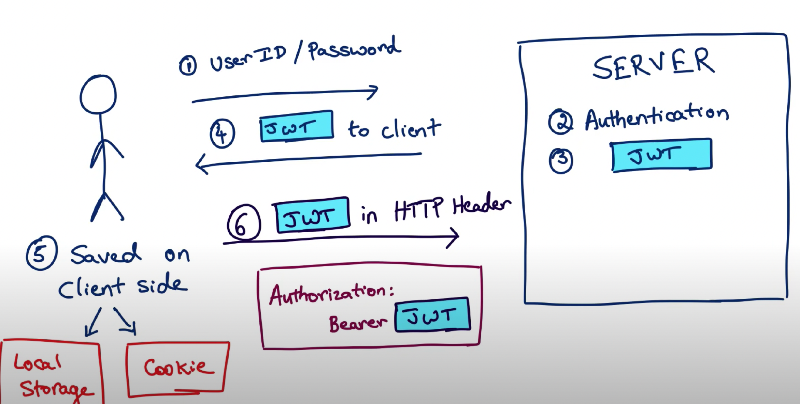

1. Learn MarkDown and show all of basic usage in the ShortQuestions/README.md
https://docs.github.com/en/get-started/writing-on-github/getting-started-with-writing-and-formattin
   g-on-github/basic-writing-and-formatting-syntax 
Heading # H1 ## H2 ### H3 
bold ** **bold text** ** 
Italic *italicized text* 
Blockquote > blockquote 
Ordered List 
    1. First item
    2. Second item
    3. Third item 

   Unordered List
   - First item
   - Second item
   - Third item 
   
    Code `code` 
    Horizontal Rule --- 
    Link [title](https://www.example.com) 
    Image 

2. practice git using the platform. list the git commands you learned https://learngitbranching.js.org/
    
   git branch 
   git checkout 
   git status 
   git add .  
   git push 
   git pull 

3. What is the basic steps to init a git repo in you local ? 
   using window power shell as tool 
   create a folder as you project name 
   git init 
   git add . 
   git commit “” 
   git status 
   git push 

4. How to clone a repo from Github ? 
   First, go to Github to find the URL. There are two ways. 1. Use git bash and git clone URL 
   to download the project in your folder. 2. for code, IntelliJ can be used for creating projects 
   through version control. 

5. How to create a new branch and checkout to that branch ? 

    git branch JunWang 
    git checkout JunWang 

6. How to merge the branch_test to master branch in command ? show me the commands 

    git checkout Jun_Wang/master 
    git merge Jun_Wang/hw1 
    git add . 
    git commit  

7. How to stash your new code before leaving branch branch_learn_stash and pop your stash when you
   checkout back to **branch_learn_stash ? try commands way and intellij way. 

    git stash save "stash changed"
    git checkout master
    git checkout branch_learn_stash
    git stash pop

   
8. How do you understand PR is based on Branch? 
   Pull Request is a way to propose and review changes made in a specific branch 
   (the "compare branch") and merge them into another branch (the "base branch"). 
   It's a fundamental mechanism for code collaboration in Git repositories, allowing developers 
   to work on features or bug fixes in isolation before integrating them into the main codebase. 

9. What is maven role ? what it be used to do ? 
   Maven is a widely used build automation and project management tool primarily used in the Java ecosystem,
   although it can be used for other programming languages as well. Its primary roles and purposes 
   include:Build Automation: Dependency Management,Project Structuring:Lifecycle Management, 
   Plugin System:Reproducible Builds:Integration with Continuous Integration (CI) Systems:Multi-Module 
   Projects, and Project Reporting. Maven plays a central role in Java software development by automating 
   build processes, managing dependencies, enforcing project structure conventions, and simplifying 
   various aspects of project management. It contributes to the reliability, consistency, and 
   maintainability of software projects. 

10. What is the lifecycle of maven? could you tell me the details ?
    Maven follows a well-defined build lifecycle that consists of phases and goals. 
    This build lifecycle helps automate various tasks associated with building, testing, packaging, 
    and deploying a project. Here are the key phases and their corresponding goals in the Maven build 
    lifecycle such as validate, compile,test,package,install,deploy. 

11. what is the difference between package and install in maven lifecycle ? 
    In summary, the main difference between the "package" and "install" phases in the Maven build lifecycle
    is in the scope of their actions: "Package" focuses on creating a distributable artifact locally within 
    your project's target directory. It's primarily for testing and local distribution. "Install" not only 
    creates the artifact but also makes it available for use by other projects on your local machine. It installs the artifact in your local Maven repository, 
    allowing you to reuse it in multiple projects without needing to publish it to a remote repository. 

12. What is plugins in maven, list some plugins. 

    In Maven, plugins are extensions or add-ons that provide specific functionality to the build process.
    Plugins are essential for customizing and extending the behavior of Maven's build lifecycle. Maven plugins
    are typically defined in a project's POM file, and they can be executed during various phases of the build
    lifecycle. 
    maven-compiler-plugin 
    maven-jar-plugin 
    maven-war-plugin 
    maven-assembly-plugin 
    maven-dependency-plugin 
    docker-maven-plugin 
     
13. In Repo/MavenProject directory, create a maven Module using Intellij, named it as belows:
groupID: com.chuwa.learn
    artifactID: java-core

14. Do Code Review: Go over the PRs in your repo, tried to leave some useful or useful comments in other
    students' PR, please don't merge it.

