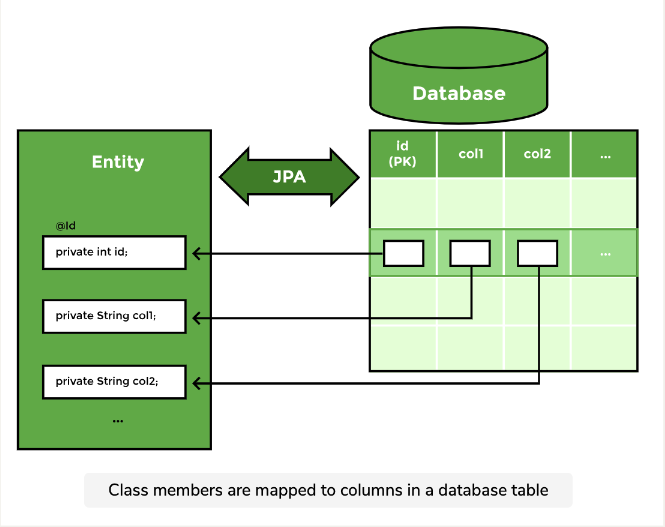
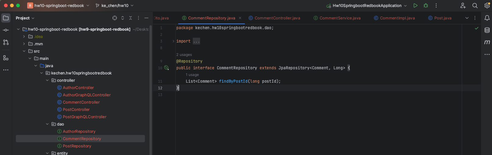
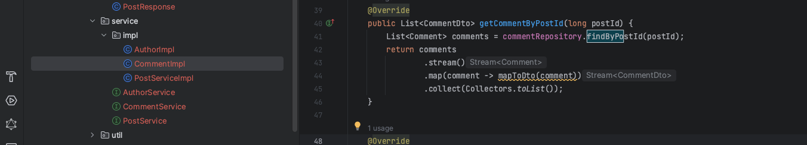
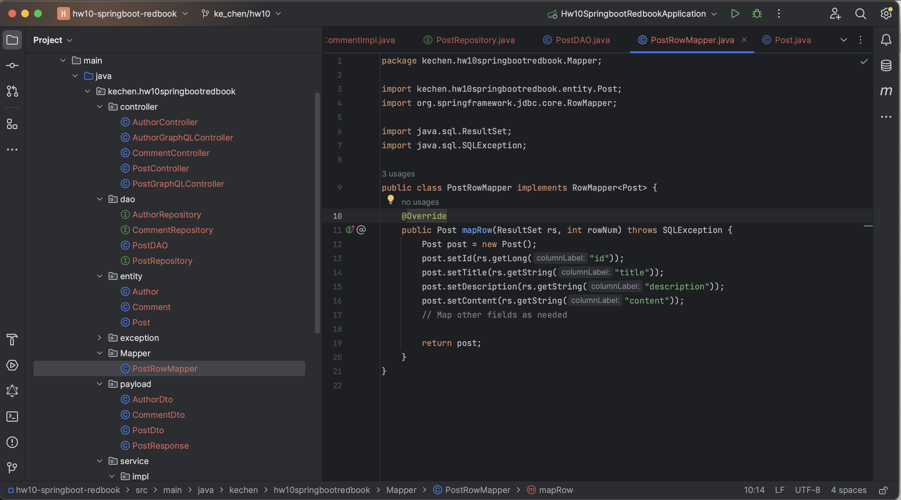
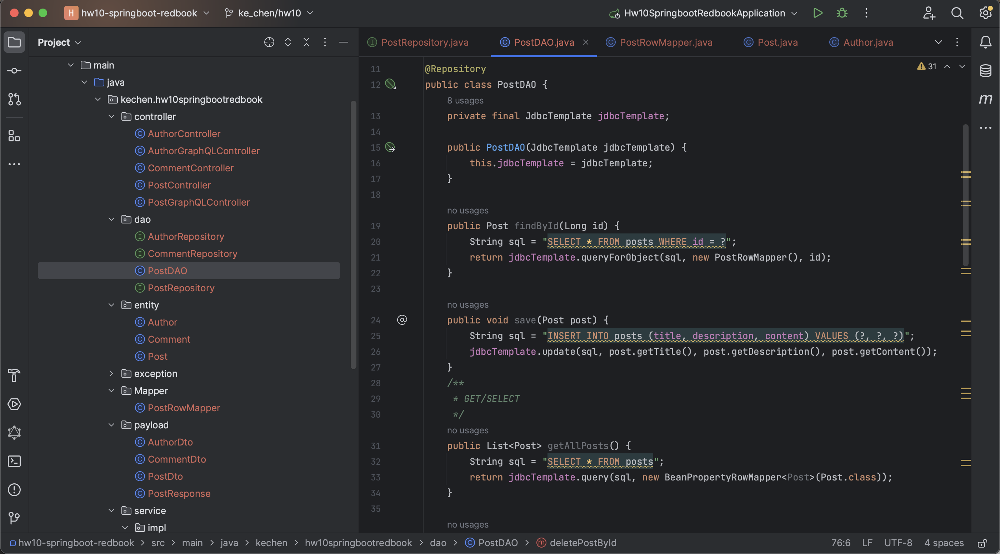
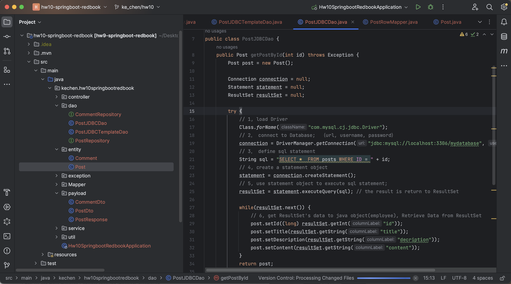
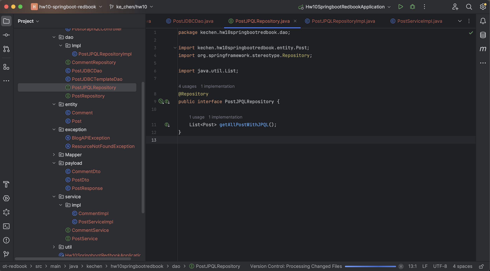
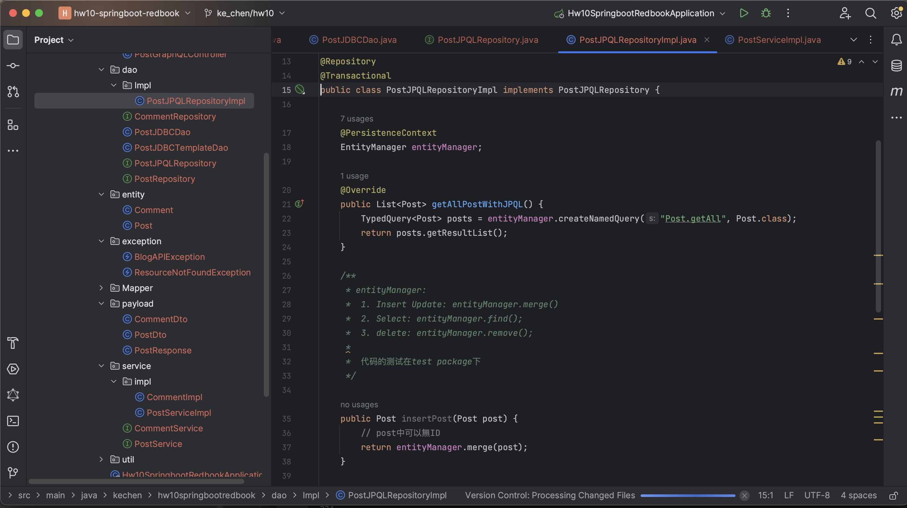
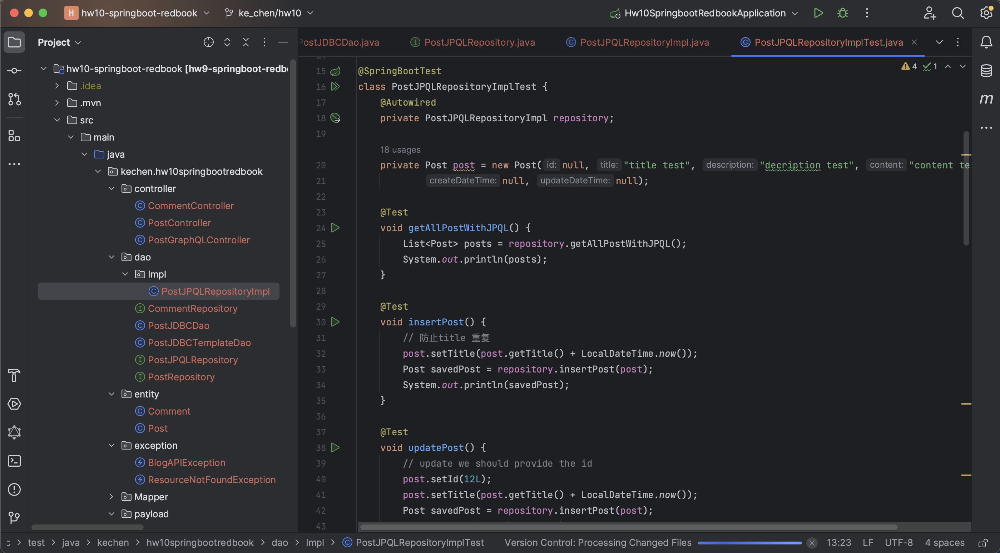
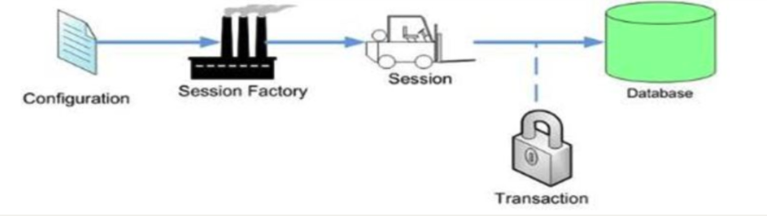

# hw10 - Ke Chen - hw42 - Spring Data

## 1.  List all of the annotations you learned from class and homework to annotaitons.md
find in ShortQuestion file: annotaitons.md


## 2.  Type the Comment feature for the class project.
find in coding file: hw10-springboot-redbook

- comment entity
   - 
- comment payload
   - 
- comment repository
   - 
- comment serviceImpl
   - 
- comment controller
   - 


## 3.  In postman, call of the APIs in PostController and CommentController.
find in coding file: hw10-springboot-redbook

**test PostController:**
- create post
   - 
- get all posts
   - 
- get post by ID
   - 
- update post
   - 
- delete post
- 

**test CommentController:**
- create comment
   - 
- get all comments by post
   - 
- get comment by Id
   - 
- update comment
   - 
- delete comment
   - 


## 4.  what is JPA? and what is Hibernate?

**what is JPA?**

<u>JPA is a standard API for Object Relational Mapping(ORM). JPA use JDBC to CRUD database, and also transfer result from database to Java Entities(mapping Java objects to relational databases)</u>.

Using JPA, we can map a Java class or bean to a table.

The members of the class map columns in the table. When this mapping is defined, JPA can write queries on its 
own. It takes the responsibility of creating and executing queries for CRUD operations. This is due to the fact that the operations performed on a database are identical and can be generalized. The types of objects change based on the database schema but the operations remain the same.




**what is Hibernate?**

<u>Hibernate is the most popular ORM framework, it implements the JPA specification and provides additional features and capabilities.</u>

Hibernate provides an Object-Relational Mapping (ORM) layer that allows you to map Java objects to database tables, generate SQL queries, and perform database operations without writing explicit SQL statements.


## 5. What is Hikari? what is the benefits of connection pool?

**What is Hikari?**

HikariCP is <u>a JDBC connection pooling library</u> for Java applications, <u>commonly used to manage database connections efficiently</u>.


**what is the benefits of connection pool?**

1. Performance Improvement: Connection pooling minimizes the overhead of connection creation, enabling faster database operations.
2. Resource Efficiency: It optimizes resource utilization by limiting simultaneous connections to the database.
3. Scalability Enhancement: Efficiently manages concurrent requests, facilitating better scalability for applications.
4. Connection Reuse: Pre-established connections are reused, reducing the need for creating new connections.
5. Customized Configuration: Provides configurable options for fine-tuning performance based on specific needs.


## 6.  What is the @OneToMany, @ManyToOne, @ManyToMany? write some examples.

`@OneToMany`, `@ManyToOne`, and `@ManyToMany` are common annotations used in JPA (Java Persistence API) and Hibernate to <u>specify one-to-many, many-to-one and many-to-many relationships between entities</u>. 


**`@OneToMany` and `@ManyToOne`**:

   ```
   @Entity
   public class Author {
      // ...
      // Specifies the field in the target entity (Book in this case) that owns the relationship
      @OneToMany(mappedBy = "author",cascade = CascadeType.ALL, orphanRemoval = true)    
      private List<Book> books;
      // ...
   }

   @Entity
   public class Book {
      // ...
      @ManyToOne(fetch = FetchType.LAZY)
      @JoinColumn(name = "author_id")
      private Author author;
      // ...
   }
   ```

**`@ManyToMany**`:**
   ```
   @Entity
   public class Student {
      // ...
      @ManyToMany
      @JoinTable(
         name = "student_course",
         joinColumns = @JoinColumn(name = "student_id"),
         inverseJoinColumns = @JoinColumn(name = "course_id")
      )
      private List<Course> courses;
      // ...
   }

   @Entity
   public class Course {
      // ...
      @ManyToMany(mappedBy = "courses")
      private List<Student> students;
      // ...
   }
   ```


## 7. What is the  cascade = CascadeType.ALL, orphanRemoval = true? and what are the other CascadeType and their features? In which situation we choose which one?

**What is the cascade = CascadeType.ALL, orphanRemoval = true?**

The cascade attribute in JPA defines how entity state transitions / propagate from one entity to its associated entities. 定义了两个表之间的连动关系。

`CascadeType.ALL`: <u>all operations (persist, merge, remove, refresh) should be cascaded to related entities.</u>

`orphanRemoval = true`: <u>when the association between entity A and entity B is removed and entity B is no longer referenced elsewhere, entity B will also be deleted.</u>


**what are the other CascadeType and their features?**
- `CascadeType.PERSIST`:  将新创建的实体持久化到数据库中
   - Propagates the persist operation to the associated entities when persisting the parent entity.
- `CascadeType.MERGE`: 
   - Propagates the merge operation to the associated entities when merging the parent entity.
- `CascadeType.REMOVE`: 
   - Propagates the remove operation to the associated entities when deleting the parent entity.
- `CascadeType.REFRESH`: 
   - Propagates the refresh operation to the associated entities when refreshing the parent entity.
- `CascadeType.DETACH`:  
   - Propagates the detach operation to the associated entities when detaching the parent entity.
   - 实体对象从持久化上下文中移除，不再被 Entity跟踪其状态的变化
   - 在调用 detach() 方法后，实体对象变为游离状态，对其所做的更改不会被自动同步到数据库中。


**In which situation we choose which one?**

The choice of which CascadeType to use depends on the specific use case and the desired behavior of associated entities when operations are performed on the parent entity.   取决于需要

For example, if you want associated entities to be removed automatically when the parent is removed, CascadeType.REMOVE or orphanRemoval = true can be suitable. 

If you want to persist associated entities when persisting the parent, you might choose CascadeType.PERSIST.


## 8.  What is the fetch = FetchType.LAZY, fetch = FetchType.EAGER? what is the difference? In which situation you choose which one?

**What is the fetch = FetchType.LAZY, fetch = FetchType.EAGER?**

fetch = FetchType.LAZY and fetch = FetchType.EAGER are attributes in JPA used to define how related entities are fetched from the database when a query is executed.

`FetchType.EAGER`：<u>when a record is fetched from the database, all the associated records from related tables are also fetched.</u>
   - when we fetch post, JPA also fetch comment at the same time

`FetchType.LAZY`" <u>fetches the records only when they are needed.</u>
   - If we don't need data from comment, JPA doesn't fetch it, Only fetch data from post
   - when we need data from comment, then JPA fecth comment data


**which situation you choose which one**:

The choice between `FetchType.LAZY` and `FetchType.EAGER` depends on the specific requirements of your application: 根据需求

If the associated entities are frequently used together with the owning entity(经常用到，需要经常fetch), eager fetching might be suitable. However, if loading these entities can be deferred until they are needed to improve performance, lazy fetching is preferred(需要提高性能). 


## 9.  What is the rule of JPA naming convention? Shall we implement the method by ourselves? Could you list some examples?


**What is the rule of JPA naming convention?**

<u>Rule: MethodName + properties(fields) + keywords + Logical Operators</u>

The JPA naming convention helps automatically generate queries in Spring Data JPA by following a specific method naming pattern. 

1. Method Name Syntax:
   - Method names should start with specific keywords like `findBy`, `getBy`, `queryBy`, `countBy`, or `deleteBy`, followed by the entity property name (in camel case) for filtering.

2. Properties:
   - The method name should reflect entity properties or fields.
   - Entity properties are case-sensitive, and they should match the entity's property names.

3. Keywords:
   - The query generation keyword (`findBy`, `getBy`, etc.) should be followed by the property name in camel case, and the property name should be capitalized.

4. Logical Operators:
   - Keywords like `And`, `Or`, `Between`, `LessThan`, `GreaterThan`, `Like`, `IsNull`, `OrderBy`, etc., can be used in the method name to create complex queries.

**Shall we implement the method by ourselves?**

No need. 

**Could you list some examples?**
- `findByFirstName(String firstName)`: Generates a query to find entities by the `firstName` field.
- `findByAgeGreaterThan(int age)`: Generates a query to find entities with an `age` greater than the provided value.
- `findByFirstNameAndLastName(String firstName, String lastName)`: Generates a query to find entities with specific `firstName` and `lastName`.
- `deleteByLastName(String lastName)`: Deletes entities based on `lastName`.
- `findByAgeBetween(int start, int end)`: Finds entities with an `age` between `start` and `end`.


## 10. Try to use JPA advanced methods in your class project. In the repository layer, you need to use the naming convention to use the method provided by JPA.

In CommentRepository, used findByPostId() to fetch comments by PostId and then get a list of comments 





## 11. (Optional) Check out a new branch replace the dao layer using JdbcTemplate.

https://github.com/TAIsRich/springboot-redbook/tree/hw02_01_jdbcTemplate

find in coding file: hw10-springboot-redbook

1. define a PostRowMapper class:


2. create PostDAO class and use JdbcTemplate to interact with the database directly



## 12. (Optional) use JDBC to read the data from database.

find in coding file: hw10-springboot-redbook




## 13. type the code, you need to checkout new branch from branch 02_post_RUD, 

https://github.com/TAIsRich/springboot-redbook/tree/hw05_01_slides_JPQL

In this branch, you need to learn JPQL controller, service, dao is changed.

JPQL & SQL:
- com.chuwa.redbook.controller
- com.chuwa.redbook.service
- com.chuwa.redbook.dao
- com.chuwa.redbook.entity

entityManager Code:
- source code: com.chuwa.redbook.dao.impl.PostJPQLRepositoryImpl
- test code: com.chuwa.redbook.dao.impl.PostJPQLRepositoryImplTest
   - session

**JPQL & SQL:**

1. add in Entity


2. create PostJPQLRepository


3. create PostJPQLRepositoryImpl


4. implement PostServiceImpl


5. add jpql methods to controller


**entityManager Code:**

1. add hibernate configuration


2. test code: entityManager



## 14. What is JPQL?

JPQL stands for <u>Java Persistence Query Language.</u>

JPQL is <u>a tool for querying and manipulating data</u>, JPQL is similar in syntax and purpose to SQL (Structured Query Language), but instead of operating on database tables and columns, JPQL <u>works with Java objects and their attributes, mapping these objects to corresponding database entities.</u>


## 15. What is @NamedQuery and @NamedQueries?

<u>annotations used by JPQL, define a signle or multiple named queries for an entity class.</u>

**@NamedQuery**:
   - an annotations used by JPQL, define a single named query for an entity class.

   ```
   @Entity
   @NamedQuery(name = "findEmployeesByDepartment", query = "SELECT e FROM Employee e WHERE e.department.name = :deptName")
   public class Employee {
       // Entity attributes, constructors, and methods
   }
   ```

**@NamedQueries**:
   - an annotations used by JPQL, define multiple named queries for an entity class.

   ```
   @Entity
   @NamedQueries({
       @NamedQuery(name = "findEmployeesByDepartment", query = "SELECT e FROM Employee e WHERE e.department.name = :deptName"),
       @NamedQuery(name = "findEmployeesBySalary", query = "SELECT e FROM Employee e WHERE e.salary >= :minSalary")
   })
   public class Employee {
       // Entity attributes, constructors, and methods
   }
   ```

   In this example, two named queries, "findEmployeesByDepartment" and "findEmployeesBySalary," are defined for the `Employee` entity.

Once you've defined named queries using `@NamedQuery` or `@NamedQueries`, you can use them in your code to retrieve data from the database. Here's an example of how to use a named query:

```java
TypedQuery<Employee> query = entityManager.createNamedQuery("findEmployeesByDepartment", Employee.class);
query.setParameter("deptName", "HR");
List<Employee> employees = query.getResultList();
```


## 16. What is @Query? In which Interface we write the sql or JPQL?

**What is @Query?**

@Query <u>define a custom queries(SQL or JPQL) for a repository using JPQL (Java Persistence Query Language) or native SQL.</u>

定义一个基于SQL/JPQL（Java Persistence Query Language）的查询方法。


**In which Interface we write the sql or JPQL?**

In a Repository Interface: 
   - use the `@Query` annotation within a Spring Data JPA repository interface, which extends the `JpaRepository` or `CrudRepository`. This allows you to define custom query methods.


```
import org.springframework.data.jpa.repository.JpaRepository;
import org.springframework.data.jpa.repository.Query;

public interface EmployeeRepository extends JpaRepository<Employee, Long> {
    
    // Using JPQL query
    @Query("SELECT e FROM Employee e WHERE e.department.name = :deptName")
    List<Employee> findEmployeesByDepartment(@Param("deptName") String deptName);

    // Using native SQL query
    @Query(value = "SELECT * FROM employees WHERE salary >= :minSalary", nativeQuery = true)
    List<Employee> findEmployeesWithMinSalary(@Param("minSalary") BigDecimal minSalary);
}
```


## 17.  What is HQL and Criteria Queries?(看一下知道有就行，没必要学)

both HQL and Criteria Queries are powerful <u>tools in Hibernate for querying databases.</u>

HQL (Hibernate Query Language) and Criteria Queries are two approaches to querying a relational database using Hibernate. They provide alternatives to standard SQL queries when working with Hibernate.
和standard SQL查询作用一样，但是是hibernate提供的。


## 18. What is EnityManager?

A JPA EntityManager <u>manages connection to a database and to database operations.</u>  对database连接的管理和operation的管理

EntityManager is associated with a PersistenceContext. All operations that are performed in a specific session are stored inside the PersistenceContext. 

EntityManager is the interface to the Persistence Context. All operations on the entity go through the EntityManager.

We will declare an EntityManager object in our class and mark it with the  @PersistenceContext annotation


Here's an example of how to create an `EntityManager` and perform basic operations:

   ```java
   EntityManagerFactory entityManagerFactory = Persistence.createEntityManagerFactory("myPersistenceUnit");
   EntityManager entityManager = entityManagerFactory.createEntityManager();

   // Start a transaction
   entityManager.getTransaction().begin();

   // Create a new entity and persist it
   Employee employee = new Employee();
   employee.setName("John Doe");
   entityManager.persist(employee);

   // Retrieve an entity by its primary key
   Employee retrievedEmployee = entityManager.find(Employee.class, 1L);

   // Update entity state
   retrievedEmployee.setName("Updated Name");

   // Commit the transaction to persist changes
   entityManager.getTransaction().commit();

   // Close the EntityManager
   entityManager.close();

   // Close the EntityManagerFactory when done
   entityManagerFactory.close();
   ```


## 19. What is SessionFactory and Session?

https://www.youtube.com/watch?v=68vPf2OGfro

对于每一次query database都会产生一个session object, using session object来operate data，完成之后，session factory会负责销毁. session不是自己产生，而是ask session factory来产生(配置文件)。 每个数据库都有一个session factory


SessionFactory: <u>an object(factory) for creating and providing Session objects in Hibernate.</u>. 

Session: <u>provides an interface between the application and data stored in the database. It encapsulates a database connection and provides methods for CRUD (Create, Read, Update, Delete) operations.</u>

```
   @Test
   void testSessionFactory() {
      // 1. 根据配置文件，创建一个sessionFactory
      SessionFactory sessionFactory = new Configuration().configure("hibernate.cfg.xml").buildSessionFactory();

      // 2. sessionFactory 创建出一个session
      Session session = sessionFactory.openSession();

      Transaction transaction = null;
      try {
         // 3. session 开始一个transaction
         transaction = session.beginTransaction();

         // 4. 执行txn
         post.setTitle(post.getTitle() + LocalDateTime.now());
         post.setCreateDateTime(LocalDateTime.now());
         post.setUpdateDateTime(LocalDateTime.now());
         Post savedPost = (Post) session.merge(post);
         System.out.println(savedPost);

         // 5. commit txn, 该txn要么成功，要么失败,是个原子操作。
         transaction.commit();
      } catch (Exception e) {
         if (transaction != null) {
               // txn 失败则回滚
               transaction.rollback();
         }
         e.printStackTrace();
      } finally {
         // 6. close session
         session.close();
      }
   }
```


## 20. What is Transaction? how to manage your transaction?



A transaction simply <u>represents a unit of work. if one step fails, the whole transaction fails.</u>

1. using annotation `Transactional` in Spring
2. using transaction APIs provided by the database or ORM framework
   - using the `Connection` object in JDBC. You can start a transaction using :connection.setAutoCommit(false)
   - use the `EntityManager` to manage transactions. You typically begin a transaction with entityManager.getTransaction().begin() (EntityManager / session)


Here are some common ways to manage transactions in Java:

1. **Java Database Connectivity (JDBC)**:
   - When working with raw JDBC, you can manually manage transactions using the `Connection` object. You can start a transaction using `connection.setAutoCommit(false)`, perform database operations, and then commit the transaction using `connection.commit()`. If an exception occurs, you can roll back the transaction using `connection.rollback()`.

   Example:
   ```java
   Connection connection = dataSource.getConnection();
   connection.setAutoCommit(false); // Start a transaction

   // Perform database operations

   connection.commit(); // Commit the transaction
   // or
   connection.rollback(); // Roll back the transaction in case of an exception
   ```

2. **Spring Framework**:
   - Spring provides a comprehensive framework for managing transactions in Java applications. You can use Spring's declarative transaction management, where you annotate methods or classes with `@Transactional`. Spring takes care of transaction demarcation, propagation, and error handling. You can configure transaction management using XML or Java configuration.

   Example:
   ```java
   @Service
   @Transactional
   public class EmployeeService {
       @Autowired
       private EmployeeRepository employeeRepository;

       public void updateEmployee(Employee employee) {
           // Perform database operations
           employeeRepository.save(employee);
       }
   }
   ```

3. **Java Persistence API (JPA)**:
   - When using JPA with a JPA provider like Hibernate or EclipseLink, you can use the `EntityManager` to manage transactions. You typically begin a transaction with `entityManager.getTransaction().begin()`, perform database operations, and then either commit or roll back the transaction using `entityManager.getTransaction().commit()` or `entityManager.getTransaction().rollback()`.

   Example:
   ```java
   EntityManager entityManager = entityManagerFactory.createEntityManager();
   EntityTransaction transaction = entityManager.getTransaction();
   transaction.begin(); // Start a transaction

   // Perform database operations

   transaction.commit(); // Commit the transaction
   // or
   transaction.rollback(); // Roll back the transaction in case of an exception
   ```


## 21. What is hibernate Caching?

Hibernate caching is <u>a mechanism to stort frequently accessed data in memory. It include 3 types of caching: first-level cache(session cache), second-level cache, and query cache.</u>

**First-Level Cache (Session Cache)**: <u>store objects retrieved during a session and ensures that the same object is not loaded multiple times from the database within the same session.</u>

**Second-Level Cache**: <u>store data that is frequently accessed and shared across sessions.</u>

**Query Cache**: <u>cache the results of queries.</u> It reduces the need to re-execute the query from the database.


## 22. What is the difference between first-level cache and second-level cache?


1. scope
   - first-level cache: stays in session level. This cache cannot be shared between multiple sessions.
   - second-level cache: stays in sessionFactory level. This cache can shared among all sessions.
2. by default
   - first-level cache: is enabled by default and there is no way to disable it.
   - second-level cache: is disabled by default, but we can enable it through configuration.
3. Lifetime
   - first-level cache: a limited lifetime and exists only for the duration of the session.
   - second-level cache: a longer lifetime and exisits for the duration of the application.


## 23. How do you understand @Transactional? 

- 不要clone，要自己抄写并测试transactional，https://github.com/TAIsRich/tutorial-transaction

find in coding file: hw10-transaction

@Transactional is <u>an annotation in Spring to manage the transcation, represents a unit of work. if one step fails, the whole transaction fails</u>.

1. create entity for Order and Payment
2. create repositoy for Order and Payment
3. create dto for Order(orderRequat, orderResponse)
4. create and implement service for Order, crate PaymentException
5. create controller

check the difference in the database, figure out @Transactional help us rollback when failing:

- comment off @Transactional then try to send request with wrong request body(credit card):


the Order table has one wrong record, but there is no record in Payment table:


- add @Transactional back then try to send request with wrong request body(Credit card). 


the Order table didn't add wrong record:


## 24. Write a simple factory design pattern.

a Shape interface and three concrete classes implementing it: Circle, Rectangle, and Triangle. 

And also create a ShapeFactory that can create instances of these shapes based on the shape's name.

```java

public interface Shape {
    void draw();
}

public class Circle implements Shape {
    @Override
    public void draw() {
        System.out.println("Drawing a Circle");
    }
}

public class Rectangle implements Shape {
    @Override
    public void draw() {
        System.out.println("Drawing a Rectangle");
    }
}

public class Triangle implements Shape {
    @Override
    public void draw() {
        System.out.println("Drawing a Triangle");
    }
}

// ShapeFactory.java (Factory class)
public class ShapeFactory {
    public Shape createShape(String shapeType) {
        if (shapeType == null) {
            return null;
        }
        if (shapeType.equalsIgnoreCase("CIRCLE")) {
            return new Circle();
        } else if (shapeType.equalsIgnoreCase("RECTANGLE")) {
            return new Rectangle();
        } else if (shapeType.equalsIgnoreCase("TRIANGLE")) {
            return new Triangle();
        }
        return null;
    }
}

// Main.java (Usage)
public class Main {
    public static void main(String[] args) {
        ShapeFactory shapeFactory = new ShapeFactory();

        Shape circle = shapeFactory.createShape("CIRCLE");
        circle.draw();

        Shape rectangle = shapeFactory.createShape("RECTANGLE");
        rectangle.draw();

        Shape triangle = shapeFactory.createShape("TRIANGLE");
        triangle.draw();
    }
}
```