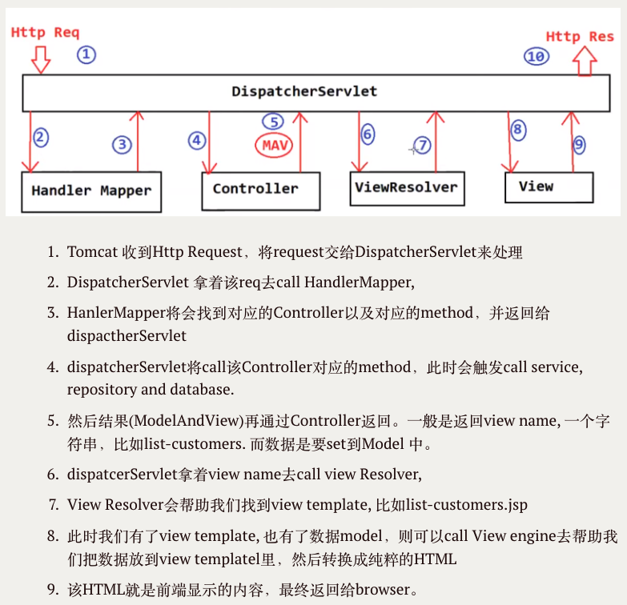

# Ke Chen - hw11 -exception-validation + MVC

# exception-validation

## 1.  List all of the annotations you learned from class and homework to annotaitons.md

**find in ShortQustion file: annotaitons.md**


## 2. what is the @configuration and @bean?

**what is the `@configuration`:**

`@Configuration` is an annotation that <u>marks a class as a source of bean definitions to define Spring beans using @Bean annotations within the class.</u>


**what is the @bean:**

`@Bean` is <u>an annotation used to declare a method that produces a bean to be managed by the Spring container.</u>

   ```java
   @Configuration
   public class AppConfig {
       @Bean
       public MyBean myBean() {
           return new MyBean();
       }
   }
   ```


## 3. How do you handle the exception in Spring?


1. create specificException class with `@ResponseStatus` to handle specific Exception and specify the HTTP status code to be returned when this specific exception is throw.

2. create globalExceptionHandler Class with `@ControllerAdvice` and `@ExceptionHandler` to handle exceptions globally.

```java
// Exception层
@ResponseStatus(value = HttpStatus.NOT_FOUND)
public class ResourceNotFoundException extends RuntimeException {
   private String resourceName;
   private String fieldName;
   private long fieldValue;

   public ResourceNotFoundException(String resourceName, String fieldName, long fieldValue) {
      // Post not found with id : '1'
      super(String.format("%s not found with %s : '%s'", resourceName, fieldName, fieldValue));
      this.resourceName = resourceName;
      this.fieldName = fieldName;
      this.fieldValue = fieldValue;
   }

   省略getter and setter
}

@ControllerAdvice
public class GlobalExceptionHandler {

   /**
   * handler specific exceptions
   * @param exception
   * @param webRequest
   * @return
   */

   @ExceptionHandler(ResourceNotFoundException.class)
   public ResponseEntity<ErrorDetails> handleResourceNotFoundException(ResourceNotFoundException exception, WebRequest webRequest) {
      ErrorDetails errorDetails = new ErrorDetails(new Date(), exception.getMessage(),
               webRequest.getDescription(false));

      return new ResponseEntity<>(errorDetails, HttpStatus.NOT_FOUND);
   }

   @ExceptionHandler(Exception.class)
   public ResponseEntity<ErrorDetails> handleGlobalException(Exception exception, WebRequest webRequest) {
      ErrorDetails errorDetails = new ErrorDetails(new Date(), exception.getMessage(),
               webRequest.getDescription(false));

      return new ResponseEntity<>(errorDetails, HttpStatus.INTERNAL_SERVER_ERROR);
   }
}
```


## 4. How do you do the validations in Spring? And list some validation annotaitons you know.

**How do you do the validations in Spring?**
1. import dependency: spring-boot-starter-validation
2. Add validation Rule like @NotNull, @Size to payload
3. Add @valid to controller to apply the Rule

**list some validation annotaitons:**

- `@NotNull`: Validates that a field is not null.
- `@NotEmpty`: Validates that a field is not empty (for Strings, Collections, etc.).
- `@NotBlank`: Validates that a String field is not null and has at least one non-whitespace character.
- `@Size`: Validates the size of a field, e.g., specifying a minimum and maximum length.
- `@Min` and `@Max`: Validates that a numeric field is within a specified range.
- `@Email`: Validates that a String field is a valid email address.
- `@Pattern`: Validates that a field matches a specified regular expression pattern.

```java
public class PostDto {
private Long id;
/**
* 1. title should not be null or empty
* 2. title should have at least 2 characters
* Question, our database have set it as nullable=false,
* why do we need to set validation here? what is the benefits?
* 在保证不为null的情况下，也要保证不为empty（null != empty）
*/
@NotEmpty
@Size(min = 2, message = "Post title should have at least 2 characters")
private String title;

@NotEmpty
@Size(min = 10, message = "Post description should have at least 10 characters")
private String description;

@NotEmpty
private String content;

private Set<CommentDto> comments;

省略getter and setter

}

// controller
@RestController
@RequestMapping("/api/v1/posts")
public class PostController {

   @Autowired
   private PostService postService;

   @PostMapping()
   public ResponseEntity<PostDto> createPost(@Valid @RequestBody PostDto postDto) {
      PostDto postResponse = postService.createPost(postDto);
      return new ResponseEntity<>(postResponse, HttpStatus.CREATED);
   }
}

// exception: global exception handler -> accept and handle
```


## 5. What is the actuator?

Spring Boot Actuator is a set of production-ready features and tools for <u>monitoring and managing Spring Boot applications</u>. 

It <u>provides built-in endpoints that expose runtime information about your application, such as health, metrics, application environment details, bean and more</u>. 


## 6. watch those videos(泛泛地看一遍，能理解多少是多少。没有必要看其它视频)
- a. Spring 简介： https://www.youtube.com/watch?v=l0MqsOADAUE&list=PLmOn9nNkQxJFbsU4Qz8CdRiVM4Qs3ci75&index=64
- b. IOC/DI: https://www.youtube.com/watch?v=PyMxNr2p0C0&list=PLmOn9nNkQxJFbsU4Qz8CdRiVM4Qs3ci75&index=65
- c.  IOC container: https://www.youtube.com/watch?v=pLa77Tw-yyI&list=PLmOn9nNkQxJFbsU4Qz8CdRiVM4Qs3ci75&index=66
- d.  Bean:
    - i.  https://www.youtube.com/watch?v=OpgMHzM7tgQ&list=PLmOn9nNkQxJFbsU4Qz8CdRiVM4Qs3ci75&index=67
    - ii. https://www.youtube.com/watch?v=OpgMHzM7tgQ&list=PLmOn9nNkQxJFbsU4Qz8CdRiVM4Qs3ci75&index=68
    - iii.  https://www.youtube.com/watch?v=OpgMHzM7tgQ&list=PLmOn9nNkQxJFbsU4Qz8CdRiVM4Qs3ci75&index=69
- e.  DI: 
    - i.  https://www.youtube.com/watch?v=MgTpBST9onM&list=PLmOn9nNkQxJFbsU4Qz8CdRiVM4Qs3ci75&index=70
    - ii. https://www.youtube.com/watch?v=yhEWZx2i1BA&list=PLmOn9nNkQxJFbsU4Qz8CdRiVM4Qs3ci75&index=71

done


# MVC:

## 1.  List all of the annotations you learned from class and homework to annotaitons.md

**find in ShortQustion file: annotaitons.md**


## 2.  What is MVC pattern?

The MVC pattern stands for Model-View-Controller to design and structure applications.

The Model <u>represents the application's data and business logic</u>

The View <u>represents the presentation layer or user interface.</u> It displays the data obtained from the model to the user and sends user input to the controller.

The Controller <u>acts as an intermediary between the Model and the View.</u> It processes user input, manipulates the model based on that input, and updates the view accordingly.


## 3.  What is Front-Controller? 

It <u>acts as a central place to manage all incoming requests, and routing them to appropriate controllers</u> or handler based on defined routes or mappings. 处理所有的imcoming request，并且进行分发他们给合适的handlers， controllers，components.


## 4.  What is DispatcherServlet? please decribe how it works.

**What is DispatcherServlet?**

It is <u>a Front-Controller acts as a central place to manage all incoming requests, and routing them to appropriate controllers</u> or handler based on defined routes or mappings.


**how DispatcherServletworks:**

1. Tomcat receives an HTTP Request and hands it over to the DispatcherServlet for processing.

2. The DispatcherServlet takes this request and calls the HandlerMapper.

3. The HandlerMapper finds corresponding Controller and method, returning this information to the DispatcherServlet.

4. The DispatcherServlet invokes the method of the Controller, which triggers calls to services, repositories, and the database.

5. The Controller return the result a view name or a view object(ModelAndView), such as 'list-customers,' and data set within the Model.

6. The DispatcherServlet uses the view name to call the View Resolver.

7. The View Resolver map this view name to an actual view and determine which view template(JavaServer Pages (JSP), Thymeleaf, FreeMarker, Velocity, and others) to render the response

8. (With the view template and data model available,) the DispatcherServlet calls the View Engine to insert the data into the view template, transforming it into pure HTML.

9. This HTML forms the content displayed in the frontend and is finally returned to the browser.




## 5.  What is JSP and What is ModelAndView？(please google to have a basic knowlege)

**what is JSP (JavaServer Pages)**:

JSP, <u>is stand for JavaServer Pages that combine java code with HTML pages to create dynamic web pages</u>. 

the server process the JSP pages and the resulting HTML is sent to the client's web browser.

**what is ModelAndView:**

ModelAndView is a class <u>to store both the model data(object) and the view name to render a web page.</u>

The `ModelAndView` object is a convenient way to package both the data and the view information, making it easy for a controller to pass data to the view and specify the view to be used for rendering the response.


For example, in a Spring MVC controller method, you might create a `ModelAndView` object as follows:
```java
@RequestMapping("/example")
public ModelAndView exampleController() {
    ModelAndView modelAndView = new ModelAndView();
    modelAndView.setViewName("exampleView"); // Set the logical view name
    modelAndView.addObject("dataKey", someData); // Add data to be passed to the view
    return modelAndView;
}
```
In this example, `"exampleView"` is the logical view name that Spring will resolve to a specific view template (e.g., a JSP file). `"dataKey"` is a key used to access the data in the view template.


## 6.  Could you please google any other servlets(理解多少是多少，不要花太多时间，知道servlet的名字就行。)

1. DispatcherServlet: a Front-Controller acts as a central place to manage all incoming requests, and routing them to appropriate controllers

2. HttpServlet: handle HTTP requests, HttpServlet provides methods like doGet(), doPost(), doPut(), etc., to handle specific HTTP request types.

3. GenericServlet: An abstract class that extends the Servlet interface and provides a generic, protocol-independent servlet.


## 7.  How many web server do you know? (Tomcat, Jetty, Jboss)

1. Apache Tomcat: An Java-based web server and Servlet container that is widely used for hosting Java web applications.

2. Nginx: often used for load balancing and serving static content.

3. Apache HTTP Server (Apache): One of the most widely used open-source web servers globally, known for its stability, robustness, and extensibility through modules.


## 8.  clone this repo, and run it in you local.

**find in coding file: hw11-springmvc5-demo**

https://github.com/TAIsRich/springmvc5-demo

Notice that you need to configure the Tomcat by yourself. tutorial in the slides.

find out the APIs in controlelr and call some APIs, In slides, I also list some API.

remeber to create a database for this project

mac m1 下载tomcat： 
   - https://tomcat.apache.org (下载tar.gz)
      - 对于类 Unix 平台，选择 tar.gz 格式的压缩包，进行解压和配置。tar.gz压缩格式用于类 unix 平台，而 zip 用于 windows 平台。

   - IntelliJ IDEA配置Tomcat: https://blog.csdn.net/m0_65731386/article/details/129014433 
   - IntelliJ IDEA配置Tomcat 有运行: https://blog.csdn.net/kk651/article/details/129725190

   
   