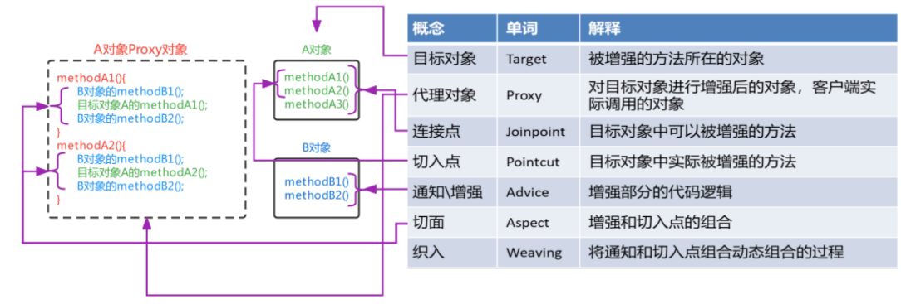
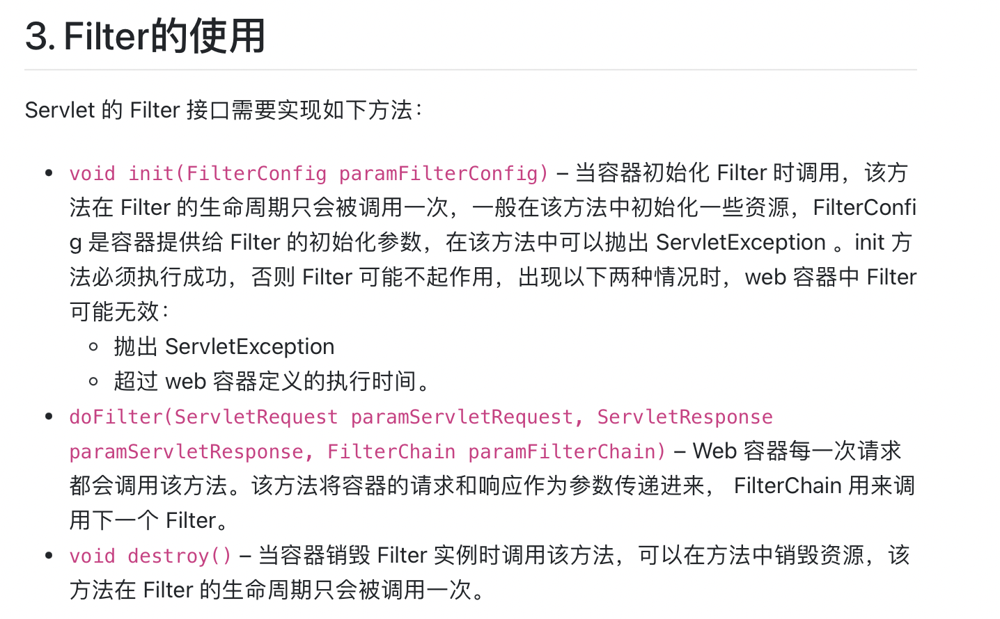

# HW13 - Ke Chen - AOP & Batch & Swagger

## 1.  List all of the annotations you learned from class and homework to annotaitons.md

see part: Spring AOP in files: annotations.md


## 2.  Briefly reading: https://www.techgeeknext.com/spring-boot/spring-aop-interview-questions

done : Spring AOP Interview Questions and Answers
1. What is Spring AOP?
2. What are the advantages and disadvantages of Spring AOP?
3. What is Aspect in Spring AOP?
4. What is Pointcut in Spring AOP
5. What is the Join point in Spring AOP?
6. What does it mean by Advice and its types in Spring AOP
7. What is the Target object in Spring AOP?
8. What is the weaving in Spring AOP?
9. What is Proxy in Spring AOP?
10. What are the differences between Spring AOP and AspectJ?
11. Where weaving can happen in the target object's lifetime in Spring AOP?
12. Which dependency is required to set up Spring AOP with Spring boot?
13. How to enable Advice in Spring AOP?
14. How you can enable or disable the Spring AOP based on configuration flag?
15. How to create Aspects with @Aspect?
16. How to create Before and After (finally) Advice AOP Advice in Spring Boot?
17. What is After Returning Advice in spring AOP?
18. How to create custom annotation using Spring AOP?
19. How to create LoggingAspect in Spring AOP?
20. How to create AfterThrowing AOP Advice in Spring Boot?


## 3.  What is the Aspect Oriented Programming?

Aspect Oriented Programming(AOP) is a programming technique that <u>supports the separation of cross-cutting concerns in order to increase modularity.</u>.

Horizontally extract multiple objects and attributes/methods in multiple objects.

AOP is typically used to implement cross-cutting concerns, which implies that it defines functionality that is required in multiple places across an application in one place(一个应用程序在一个地方的多个地方所需的功能). You <u>can add new functionality before or after a method is executed like transaction management, logging or security which cut across multiple types and objects </u>(often termed crosscutting concerns).(可以在执行跨多类型和对象（通常是术语交叉问题）的方法之前或之后添加新功能，例如事务管理、日志记录或安全性。)


## 4.  What are the advantages and disadvantages of Spring AOP?

**Advantages of Spring AOP**
- It is easy to configure.
- Spring AOP is implemented in pure Java, so separate compilation unit or separate class loader are not required.
- It utilizes Spring's IOC container for dependency injection.
- Can create aspects using @AspectJ annotation based or using XML based.
- It integrates cross-cutting concerns into the classes.

**Disadvantages of Spring AOP**
- Debugging the AOP framework-based application code is a little challenge.
- Only methods with a public visibility will be recommended, not those with a private, protected, or default visibility.
- Aspects cannot be advised by other aspects. This is because once a class is marked as an aspect (using XML or annotation), Spring prevents it from being auto-proxied.


## 5.  What is Aspect in Spring AOP?s
An aspect is <u>a cross-cutting module that combines advice and pointcuts</u>. 

<u>A standard class tagged with the @Aspect annotation can be used to implement an aspect</u>.

Aspects are mostly <u>used to enable cross-cutting concerns like logging, profiling, caching, and transaction management.</u>


## 6.  What is Pointcut in Spring AOP? 
A pointcut is an expression that <u>chooses one or more join points at which advice is given</u>. 

Pointcuts can be defined using expressions or patterns. It supports a number of expressions that correspond to the join points. 

- joinpoint: 目标对象中<u>可以</u>被advice的方法
- pointcut: 目标对象中<u>实际</u>被advice的方法
- 在joinpoint里面选择1个或多个进行advice，被adviced的方法为pointcut



## 7. What is the Join point in Spring AOP?
A join point is <u>a place in the application where an AOP aspect is applied.</u>

It could also be a specific advice execution instance. 
 
A join point in AOP can be a method execution, exception handling, changing the value of an object variable, and so on.

- joinpoint: 目标对象中<u>可以</u>被advice的方法
- pointcut: 目标对象中<u>实际</u>被advice的方法
- 在joinpoint里面选择1个或多个进行advice，被adviced的方法为pointcut


## 8.  What does it mean by Advice and its types in Spring AOP?
The advice is <u>an action which we take before or after the method execution.</u>  增强部分的代码逻辑。

In the Spring AOP framework, there are five types of advice: 
- before, 
- after, 
- around
- after-returning, 
- after-throwing

Advice is taken at a specific join point.


## 9.  Reading: https://www.javainuse.com/spring/sprbatch_interview

done： Spring Batch Interview Questions
1. Explain Spring Batch framework?
2. When to use Spring Batch?
3. Explain the Spring Batch framework architecture?
4. How Spring Batch works?
5. Explain Spring Batch framework?
6. How Spring Batch works?
7. How to configure Spring Batch with Spring Boot?
8. What is Tasklet in Spring Batch?
9. How can we schedule a Spring Batch Job?

理解Spring Batch是什么，在什么场景下要用，给出例子。
- What: 批处理数据。 
    - <u>a lightweight and comprehensive framework designed for batch processing in Java</u>.
- 场景：数据量很大 
    - <u>can process large volumes of data, perform complex processing, and integrate with various data sources</u>.
- 例子： 数据备份，产生report/bank statement
    - <u>ETL (Extract, Transform, Load) </u>Processes: When you need to extract data from various sources, transform it into a desired format, and load it into a target system. Spring Batch's chunk-oriented processing is well-suited for ETL tasks.
    - <u>Data Migration</u>: When you're migrating data from one system to another, especially if you need to perform data transformations and validations during the migration process.
    - <u>Report Generation</u>: For generating reports that involve complex data processing and formatting. Spring Batch can help automate the report generation process.

实现它的粗略步骤(job, steps)  看Q11: How Spring Batch works?
- job
- Steps


## 10. When to use Spring Batch?

从某个位置（数据库，文件或者外部推送队列(MQ)）读取大量的记录，根据业务需要实时处理读取的数据，将处理后的数据写入某个位置（可是数据库，文件或者推送到队列）。

Spring Batch is commonly used <u>in scenarios where data needs to be processed periodically, such as ETL (Extract, Transform, Load) processes, report generation, data cleansing, and data migration</u>. 

It is particularly valuable for organizations dealing with large datasets and complex processing requirements. With Spring Batch, developers can build batch applications efficiently and ensure they are maintainable and scalable.

1. <u>ETL (Extract, Transform, Load) Processes</u>: When you need to extract data from various sources, transform it into a desired format, and load it into a target system. Spring Batch's chunk-oriented processing is well-suited for ETL tasks.
2. <u>Data Migration</u>: When you're migrating data from one system to another, especially if you need to perform data transformations and validations during the migration process.
3. <u>Report Generation</u>: For generating reports that involve complex data processing and formatting. Spring Batch can help automate the report generation process.
4. Data Cleansing: When you need to clean and validate data, such as removing duplicates, standardizing formats, or fixing data integrity issues.
5. Scheduled Tasks: For running background tasks on a schedule, such as nightly data processing jobs or maintenance tasks.
6. File Processing: When you have to process large files, like log files or data exports, and want to split the processing into manageable chunks.
7. Parallel Processing: When you want to process data in parallel to improve performance, Spring Batch supports partitioning and parallel execution of batch jobs.
8. Retry and Error Handling: Spring Batch provides built-in support for handling errors and retries, making it a good choice for tasks where robust error recovery is essential.
9. Long-Running Processes: For tasks that may take a long time to complete, Spring Batch's restartability ensures that processing can resume from where it left off in case of interruptions.
10. Data Synchronization: In cases where data synchronization between systems is required, Spring Batch can help ensure consistency.
11. Large-Scale Data Processing: When dealing with large-scale data processing scenarios, like data warehouses, big data processing, or data analytics.
12. Data Transformation and Enrichment: If you need to enrich data by retrieving additional information from external sources or databases.


## 11. How Spring Batch works?

Spring Batch 入门级示例教程: https://blog.51cto.com/u_15499328/5278139

- 一个batch过程由一个job组成。这个实体封装了整个批处理过程。
- 一个job可以由一个或多个step组成。在大多数情况下，一个step将读取数据（通过ItemReader, ItemProcessor,ItemWriter）。
- JobLauncher处理启动一个job。
- 最后，JobRepository存储关于配置和执行的job的元数据。


1. **Job Configuration**: 
    - Define batch jobs with steps in configuration files.
2. **Step Configuration**: 
    - Each step within a job is configured to perform a specific task or a sequence of tasks
    - A step can use item readers to read data, item processors to transform or filter data, and item writers to write data to a destination
3. **Item Readers**: 
    - Readers retrieve data in chunks.
    - reading data from a source, such as a database, file, or remote service).
4. **Item Processors**: 
    - Processors apply business logic to data.
    - It can perform transformations, validations, enrichments, or any other processing required
5. **Item Writers**: 
    - Writers store processed data in a destination.
    - It could be a database, a file, a message queue, or any other output medium.
6. Job Execution: 
    - When a batch job is triggered, Spring Batch manages the execution of each step.
    - Each step processes data in chunks according to the configured chunk size.
    - If a step fails, Spring Batch provides mechanisms for retrying or skipping problematic items
7. Listeners: 
    - Use listeners to capture events. Listeners allow you to perform custom actions or logging.
8. Error Handling: 
    - Spring Batch provides mechanisms for handling exceptions and errors. 
    - You can configure retry policies and error handling strategies for your batch jobs.
9. Execution Context: 
    - Spring Batch provides an execution context that allows you to store and retrieve data between steps.
    - This is useful for sharing information or state between different steps
10. Parallel Processing: 
    - Process data in parallel.
11. Job Scheduling: 
    - Schedule jobs to run at specific times using tools like `Spring Task Scheduler`(Cron).
12. Monitoring and Management: 
    - Integrate with monitoring tools like `Spring Boot Actuator` for tracking job and step execution.

Spring Batch - Difference between Step, Chunk and Tasklet: https://www.javainuse.com/spring/batchtaskchunk


## 12. How can we schedule a Spring Batch Job?
pring Batch can be scheduled <u>using tools like `Spring Task Scheduler`(Cron Job)</u>.

Cron Expressions: https://docs.oracle.com/cd/E12058_01/doc/doc.1014/e12030/cron_expressions.htm
Spring Boot Batch Job + Scheduler Simple Example: https://www.javainuse.com/spring/springbootbatchtaskscheduler

```java
// Make sure that scheduling is enabled in your Spring application
@SpringBootApplication
@EnableScheduling
public class YourApplication {
    public static void main(String[] args) {
        SpringApplication.run(YourApplication.class, args);
    }
}

@Component
public class BatchJobScheduler {
    @Autowired
    private JobLauncher jobLauncher;

    @Autowired
    private Job myBatchJob;

    @Scheduled(cron = "0 0 1 * * ?") // Cron expression for daily execution at 1:00 AM
    public void runBatchJob() throws Exception {
        JobParameters jobParameters = new JobParametersBuilder()
            .addString("jobID", String.valueOf(System.currentTimeMillis()))
            .toJobParameters();

        jobLauncher.run(myBatchJob, jobParameters);
    }
}
```
In this example, the @Scheduled annotation specifies that the runBatchJob method should be executed daily at 1:00 AM using the provided cron expression.


## 13. What is the cron expression?
Cron Expressions: https://docs.oracle.com/cd/E12058_01/doc/doc.1014/e12030/cron_expressions.htm

<u>A cron expression is a string that represents a schedule or pattern for specifying when a task, job, or process should run at recurring intervals.</u> 

Cron expressions are commonly used in scheduling systems and cron jobs in Unix-like operating systems. They consist of fields that represent various time units and allow you to define schedules with high precision.


## 14. What is the spring task?
In Spring, the term "Spring Task" typically refers to the <u>Spring Framework's task scheduling capabilities provided by the `TaskScheduler` interface and `@Scheduled` annotation</u>. 

These features enable you <u>to schedule and execute tasks at specified intervals in a Spring application</u>. 

Spring's task scheduling is often used for various purposes, such as <u>triggering batch jobs, sending emails, cleaning up resources, or running background tasks</u>.

Here are the key components related to Spring Task:

1. **`TaskScheduler`**: This is an interface provided by the Spring Framework for scheduling tasks. It defines methods for scheduling tasks to run at specified times, with options for fixed-rate, fixed-delay, and cron-based scheduling.

2. **`@Scheduled` Annotation**: Spring provides the `@Scheduled` annotation, which you can use to annotate methods in Spring beans. These annotated methods will be executed at specific intervals, as defined by the annotation's attributes. The annotation supports cron expressions and simpler fixed-rate or fixed-delay configurations.

Here's a simple example of using the `@Scheduled` annotation to schedule a method to run at a fixed rate:

```java
@Component
public class MyScheduledTask {

    @Scheduled(fixedRate = 5000) // Runs every 5 seconds
    public void runScheduledTask() {
        // Your task logic here
    }
}
```
In this example, the `runScheduledTask` method will be executed every 5 seconds as specified by the `fixedRate` attribute.


## 15. When to use Spring task? 
Spring task enable you <u>to schedule and execute tasks at specified intervals in a Spring application</u>. 

Spring's task scheduling <u>is often used for various purposes, such as triggering batch jobs, sending emails, cleaning up resources, or running background tasks.</u>


## 16. What is servlet filter and any filter example?

彻底理解Spring Interceptor和Servlet Filter: https://segmentfault.com/a/1190000039996829

**What is servlet filter:**
A Servlet Filter is <u>a Java component</u> that can be used in Java EE web applications <u>to intercept and manipulate requests and responses as they pass through the web container before reaching the servlet or JSP</u>(在到达servlet或者jsp之前，当requests和responses经过web container时，进行拦截和操控). 

Filters are a part of the Java Servlet Specification and are typically used for tasks such as logging, authentication, authorization, input validation, and more. 

Filters can be applied to specific URLs or servlets, making them a powerful tool for controlling and enhancing web application behavior.

**filter example:**
- Authentication Filters
- Logging and Auditing Filters
- Image conversion Filters
- Data compression Filters
- Encryption Filters
- Tokenizing Filters
- Filters that trigger resource access events
- XSL/T filters
- Mime-type chain Filter




## 17.  What is the spring interceptor? What we can do with interceptor?

彻底理解Spring Interceptor和Servlet Filter: https://segmentfault.com/a/1190000039996829

**What is the spring interce ptor:**

In Spring Framework, an interceptor is <u>a component</u> that allows you <u>to intercept and process HTTP requests and responses before they reach the controller or after they leave the controller.</u> 

**What we can do with interceptor:**
- 执行安全检查(perform security checks)
- 格式化请求header和body(reformat request headers or bodies)
- 审查或记录日志(audit or log requests)
- 根据请求内容授权或者限制用户访问(Authentication-Blocking requests based on user identity)
- 根据请求频率限制用户访问(Limit User Access Based on Request Frequency)


## 18. In Interceptor, What is preHandle? What is postHandle?

Interceptor的执行顺序大致为:
- 请求到达DispatcherServlet
- DispatcherServlet发送至Interceptor, 执行preHandle
- 请求到达Controller
- 请求结束后，postHandle执行

Spring中主要通过HandlerInterceptor接口来实现请求的拦截，实现HandlerInterceptor接口需要实现下面三个方法:
- preHandle(): 在handle执行之前，返回boolean值，true表示继续执行，false为停止执行并返回。
- postHandle(): 在handle执行之后，可以在返回之前对返回的结果进行修改。
- afterCompletion(): 在请求完成，视图生成后调用。


**What is preHandle Method**:
   - `preHandle` is <u>a method</u> within a Spring MVC interceptor that <u>is called before the actual request handler method (controller method) is invoked.</u>
   - It is typically used for pre-processing tasks, such as security checks, authorization, or request parameter manipulation, before the controller logic is executed.
   - <u>If preHandle() returns: true, the request continues to be processed, and the controller method is invoked.</u> If it returns `false`, the request handling is halted, and the controller method is not called.

   ```java
   @Override
   public boolean preHandle(HttpServletRequest request, HttpServletResponse response, Object handler) throws Exception {
       // Pre-processing logic here
       if (/* some condition */) {
           return true; // Continue processing
       } else {
           response.sendRedirect("/access-denied"); // Redirect or handle the request as needed
           return false; // Stop processing
       }
   }
   ```

**What is postHandle Method**:
   - `postHandle` is <u>a method</u> within a Spring MVC interceptor that <u>is called after the request handler method (controller method) has been executed but before the view is rendered.</u>
   - It allows you to perform post-processing tasks on the model and view that will be rendered, <u>making it suitable for tasks like modifying the model or view, adding common attributes, or logging.</u>

   ```java
   @Override
   public void postHandle(HttpServletRequest request, HttpServletResponse response, Object handler, ModelAndView modelAndView) throws Exception {
       // Post-processing logic here
       if (modelAndView != null) {
           modelAndView.addObject("additionalData", "Some additional data");
       }
   }
   ```

To use interceptors with `preHandle` and `postHandle` methods, you need to implement the `HandlerInterceptor` interface and override these methods. 


## 19. What is Swagger?

**What is swagger:**
Swagger is <u>an open-source framework and a suite of tools</u> that enables developers to design, build, document, and consume RESTful web services and APIs.</u> 

Swagger 是一个规范且完整的框架，用于生成、描述、调用和可视化 RESTful 风格的 Web 服务以及 集成Swagger自动生成API文档。

**Advantages of Swagger:**
1. Support for Automatically Generated Online API Documentation: 
    - With Swagger, you can generate API documentation directly from your code, eliminating the need to manually write API documentation.
2. Provide Online API Testing via a Web Page: Documentation alone is not enough. 
    - The documentation generated by Swagger also supports online testing. With predefined parameters and formats, you can directly input parameter values in the interface to test the API online.

Swagger 的优势
1. 支持 API 自动生成同步的在线文档：
    - 使用 Swagger 后可以直接通过代码生成文档，不再需要自己手动编写接口文档了，对程序员来说非常方便，可以节约写文档的时间去学习新技术。
2. 提供 Web 页面在线测试 API：
    - 光有文档还不够，Swagger 生成的文档还支持在线测试。参数和格式都定好了，直接在界面上输入参数对应的值即可在线测试接口。
