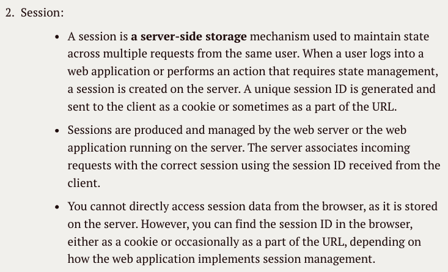
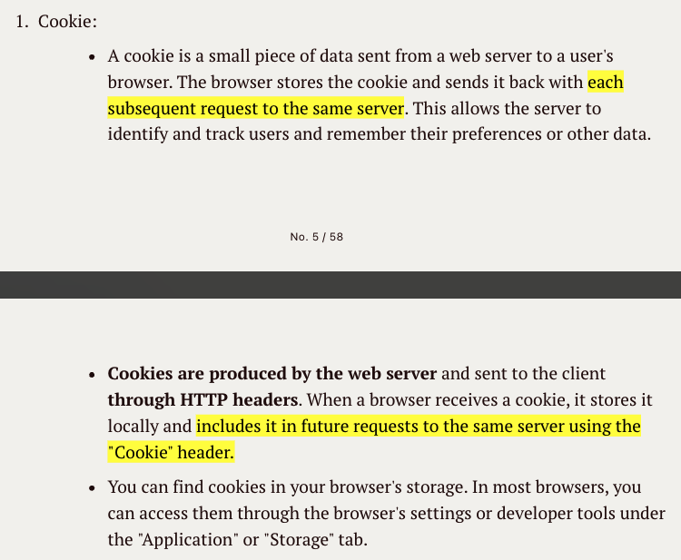
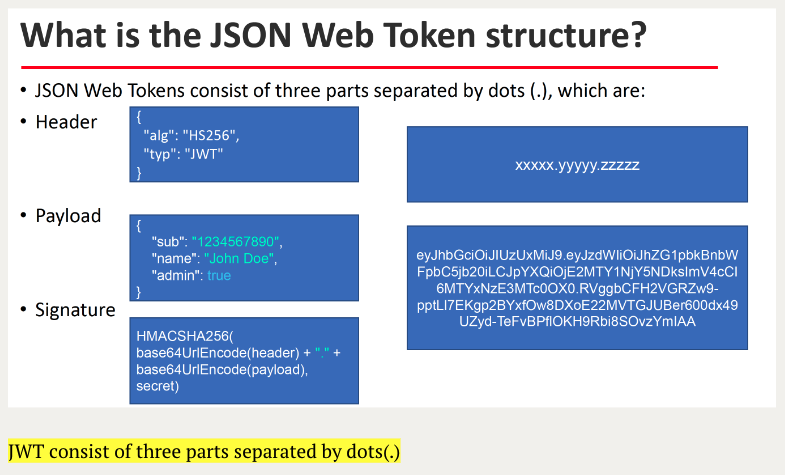

# hw12 - Ke Chen - Spring Security


## 1. List all of the annotations you learned from class and homework to annotaitons.md

**find in ShortQuestions file : annotaitons.md**


## 2.  What is the authentication? 验证

In the Spring Framework, authentication is <u>the process of verifying the identity of a user or entity, ensuring that the user is who they claim to be</U>. 

Here's a simple example of a Spring Security authentication configuration using Java-based configuration:

```java
@Configuration
@EnableWebSecurity
public class SecurityConfig extends WebSecurityConfigurerAdapter {

    @Autowired
    private UserDetailsService userDetailsService;

    @Override
    protected void configure(AuthenticationManagerBuilder auth) throws Exception {
        auth.userDetailsService(userDetailsService).passwordEncoder(passwordEncoder());
    }

    @Override
    protected void configure(HttpSecurity http) throws Exception {
        http
            .authorizeRequests()
                .antMatchers("/public/**").permitAll()
                .anyRequest().authenticated()
                .and()
            .formLogin()
                .loginPage("/login")
                .permitAll()
                .and()
            .logout()
                .permitAll();
    }
}
```
This configuration sets up form-based authentication and specifies which URLs are accessible without authentication and which require authentication.


## 3.  What is the authorization? 授权，确定是否有资格

Authorization in Spring refers to <u>the process of determines what an authenticated user is allowed to do within the application.</u>

It defines the user's permissions, rights, and access control rules.

Here's a simple example of method-level security using `@PreAuthorize`:
　
```java
@PreAuthorize("hasRole('ROLE_ADMIN') or hasRole('ROLE_MANAGER')")
public void adminOrManagerMethod() {
    // This method can be accessed by users with ROLE_ADMIN or ROLE_MANAGER.
}
```


## 4. What is the difference between authentication and authorization?

1. propose:
   - Authentication: the process of verifying the identity of a user or entity, ensuring that the user is who they claim to be
   - Authorization: the process of determines what an authenticated user is allowed to do within the application.

2. order
   - do the Authentication, then do the Authorization

3. need 
   - Authentication: need usually user's login details.
   - Authorization: need user's privilege or security levels.


## 5. What is HTTP Session?

An HTTP session is used to <u>store information about a user's interaction with a web application on the server-side. And the session is maintained using a unique session ID</u>, which is often stored in a cookie or as part of the URL.

Session可以存储更大、更敏感的数据，如用户登录信息、购物车内容等，且不受客户端影响。




## 6.  What is Cookie? 

A cookie is used to <u>store a small piece of data sent from a web server to the user's browser and stored locally.</u>

Cookie通常用于存储Session ID或其他小型数据(存储一些键值对数据比如用户首选项)




## 7. What is the difference between Session and Cookie?

1. Purpose:
   - Session: <u>store information about a user's interaction with a web application.</u>
   - cookie: <u>store a small piece of data sent from a web server to the user's browser.</u>

2. Storage Location:
   - Session: stored <u>on the server</u>. 储存在server端
   - Cookie: stored <u>on the user's device (browser)</u> 储存在客户端. 

3. Scope:
   - Session: Session data is typically <u>available for the duration of a user's session</u>. It expires when the session ends (e.g., when the user logs out or the session times out).
   - Cookie: Cookies can <u>have different lifetimes</u>. Some are session cookies, which are stored only for the duration of the user's session, while others are persistent cookies, which remain on the user's device for a specified period, even after the session ends.


## 8.  How do we use session and cookie to keep user information across the the application? 

1. when calling the api, the server produce cookie include a unique session ID and put the cookie to response header. 
2. The client stores the cookie and send it back with each subsequent request to the same server.
3. With the session ID, the server retrieves stored session data associated to customize the user experience, providing personalized content and retaining user-specific data throughout the session.


## 9.  What is JWT?

JWT is <u>stands for "JSON Web Token"</u> and it is <u>a method to transmit information securely between parties as a JSON object</u>.

一个方法： 用JSON object的形式来进行信息的传输

JWTs <u>are often used for authentication and authorization</u> in web applications and APIs, and they provide a way to encode information in a verifiable and tamper-resistant manner. 

经常用做authentication and authorization，并且他们提供了一个encode infomation的方式

Here are some key characteristics of JWTs:

1. **Compact Format**: JWTs are designed to be compact and <u>can be easily transmitted as URL parameters, in an HTTP header, or within an HTTP cookie</u>. 

2. **Self-Contained**: A JWT is self-contained and contains all the information needed to verify its authenticity. This means that <u>the necessary data is included within the token itself</u>.

3. **JSON-Based**: JWTs <u>are represented as JSON objects</u>, making them easy to work with in various programming languages.

4. **Three Parts**: A JWT typically <u>consists of three parts: a header, a payload, and a signature</u>. These parts are encoded and concatenated using a delimiter (usually a period) to form the complete JWT.

   - **Header**: The header typically specifies the type of token (JWT) and the signing algorithm being used.
   - **Payload**: The payload contains claims, which are statements about an entity (typically, the user) and additional data. Claims are categorized as registered, public, or private, depending on their intended use.
   - **Signature**: The signature is used to verify the authenticity of the token. It is generated by signing the encoded header and payload with a secret key or a private key.

   

5. **Stateless**: <u>JWTs are stateless</u>, meaning that each JWT is independent, and the server does not need to store information about the token or the user's session. This makes JWTs suitable for scaling web applications.


## 10. What is the spring security filter?

Spring Security <u>uses a filter chain to process incoming requests and outgoing responses to do authentication, authorization, session management, or handles exceptions thrown by the security filters.</u>

Each filter in the chain performs a specific task related to security, such as authentication, authorization, session management, or CSRF protection.

The Spring Security Filter Chain is a sequence of filters that execute in a specific order to enforce security policies on incoming HTTP requests.  注意order顺序。 

example of filter: 

1. UsernamePasswordAuthenticationFilter: Handles authentication for requests requiring username and password credentials.

2. AnonymousAuthenticationFilter: Provides anonymous authentication to unauthenticated users.

3. ExceptionTranslationFilter: Handles exceptions thrown by the security filters.


## 11. decribe how do JWT work(slides 里有图: how do JWT work)

1. the client do a user autehnticates by providing username and password
2. the server validate the username and password and generate the JWT using secret key.(including header, payload and signature)
3. the server return the generated JWT to client
4. the client stores the token and includes it in subsequent HTTP requests
5. the server validate JWT using secret key
6. the server return the response


## 12. Do you use any Encoder to encode Password?

1. **BCryptPasswordEncoder** by using bcrpt hashing function to encode passwords.
2. **MessageDigest class** can perform one-way hash function to hash passwords
3. **PBKDF2**(Password-Based Key Derivation Function 2) is used to hash passwords
4. **Argon2** is a password hashing algorithm to hash passwords


- BCryptPasswordEncoder: 

   Part of the Spring Security framework, it uses the bcrypt hashing function to encode passwords.

    ```java
    import org.springframework.security.crypto.bcrypt.BCryptPasswordEncoder;

    BCryptPasswordEncoder encoder = new BCryptPasswordEncoder();
    String encodedPassword = encoder.encode("your_password_here");
    ```

- MessageDigest (e.g., SHA-256, MD5): 

   Java's MessageDigest class can perform one-way hash functions. It's important to note that MD5 is not considered secure for password hashing.

    ```java
    import java.security.MessageDigest;
    import java.security.NoSuchAlgorithmException;
    import java.util.Base64;

    String passwordToHash = "your_password_here";
    MessageDigest digest = MessageDigest.getInstance("SHA-256");
    byte[] encodedHash = digest.digest(passwordToHash.getBytes());
    String encodedPassword = Base64.getEncoder().encodeToString(encodedHash);
    ```

- PBKDF2: 

   Password-Based Key Derivation Function 2 is used to hash passwords.

    ```java
    import javax.crypto.SecretKeyFactory;
    import javax.crypto.spec.PBEKeySpec;
    import java.security.NoSuchAlgorithmException;
    import java.security.spec.InvalidKeySpecException;
    import java.security.spec.KeySpec;
    import java.util.Base64;

    String password = "your_password_here";
    byte[] salt = /* generate a salt */;
    int iterations = 10000;
    int keyLength = 256;
    KeySpec spec = new PBEKeySpec(password.toCharArray(), salt, iterations, keyLength);
    SecretKeyFactory factory = SecretKeyFactory.getInstance("PBKDF2WithHmacSHA256");
    byte[] hash = factory.generateSecret(spec).getEncoded();
    String encodedPassword = Base64.getEncoder().encodeToString(hash);
    ```

- Argon2: 
   Argon2 is another modern and secure password hashing algorithm. You can use libraries like `argon2-java` to utilize this algorithm in Java.


## 13. What is UserDetailService? AuthenticationProvider? AuthenticationManager? AuthenticationFilter?(把这几个名字看熟悉也行)

`authentication filters`: <u>a chain of filters intercept and process authentication requests.</u>

`AuthenticationManager` : <u>acts as a container for AuthenticationProvider instances to route the authentication process to AuthenticationProvider.</u>

`AuthenticationProvider` : <u>authenticating a user based on their credentials and creating an Authentication object.</u>

`UserDetailsService`:  <u>provides user information from authentication and authorization.</u>


1. UserDetailsService:
   - The UserDetailsService interface in Spring Security is used to retrieve user-related data for authentication and authorization. It typically provides user information, including the username, password, and authorities, from a data source such as a database or an external system.
   - You need to implement the `loadUserByUsername(String username)` method, which takes a username as input and returns a `UserDetails` object representing the user's details. `UserDetails` includes information about the user and their granted authorities.

2. AuthenticationProvider:
   - An AuthenticationProvider is responsible for authenticating a user based on their credentials (e.g., username and password) and creating an Authentication object.
   - Spring Security typically uses one or more AuthenticationProvider instances to validate user credentials. You can configure multiple authentication providers for different authentication mechanisms, such as database authentication, LDAP authentication, and more.
   - The most common implementation of AuthenticationProvider is the `DaoAuthenticationProvider`, which validates user credentials against a `UserDetailsService`.

3. AuthenticationManager:
   - The AuthenticationManager is a central component in Spring Security that coordinates the authentication process. It acts as a container for AuthenticationProvider instances. 不干啥事，相当于一个interface
   - When a user attempts to log in, the AuthenticationManager sequentially delegates the authentication process to each configured AuthenticationProvider until one of them successfully authenticates the user.
   - Developers can customize and configure the AuthenticationManager to define how authentication should be handled.

4. AuthenticationFilter:
   - An AuthenticationFilter (or authentication filter) is not a standard component in Spring Security but refers to the various filters within the Spring Security Filter Chain.
   - Spring Security uses a series of filters (e.g., `UsernamePasswordAuthenticationFilter`, `BasicAuthenticationFilter`) to intercept and process authentication requests. These filters handle tasks like processing login forms, HTTP basic authentication, and more.
   - The filters work together to authenticate users and establish a user's security context based on the provided credentials.


## 14. What is the disadvantage of Session? how to overcome the disadvantage?

1. session stored on the server can consume server resources, particularly if many users have active sessions.
   - limit the data stored in sessions to only what is necessary 将会话中存储的数据限制为仅必要的数据。
   - Implement session timeout policies 实施会话超时策略以自动清理非活动会话。
   - use server clustering or session persistence mechanisms to distribute session data across multiple servers 考虑使用服务器集群或会话持久性机制在多个服务器之间分发会话数据，以获得更好的可扩展性

2. session is statefulness, in otherwise stateless HTTP, which can complicate scalability and load balancing.
   - Use stateless session management approaches like JSON Web Tokens (JWTs) or OAuth2

3. managing sessions can be complex, especially when dealing with distributed systems and handling aspects like session fixation, session timeout, and session data synchronization
   - Utilize established session management libraries and frameworks provided by your web application framework (e.g., Spring Session for Spring applications)


## 15. how to get value from application.properties?

<u>by using the `@Value` annotation with the syntax of `${...}` placeholders.</u>

The @Value annotation injects values from the Spring Environment and resolves them based on the property keys you specify in ${...} syntax. The `${...} placeholders are replaced with the corresponding property values defined in the application.properties file.

Additionally, if you're working with a Spring Boot application, the @Value annotation is automatically enabled, and Spring Boot loads properties from application.properties by default.

Here's how you can do it:

1. Create or Update application.properties:

   Ensure you have an application.properties file in your project's classpath. This file can be located in the src/main/resources directory. If you are using YAML format, you would use application.yml.

2. Define Properties in application.properties:
   
   In your application.properties file, define properties with key-value pairs.

   ```java
   app.title=My Application
   app.version=1.0
   app.api.key=secret_key
   ```

3. Inject Property Values:

   You can inject these property values into your Spring components, such as beans, controllers, or services, using the `@Value` annotation.

   ```java
   import org.springframework.beans.factory.annotation.Value;
   
   @Component
   public class MyComponent {
       @Value("${app.title}")
       private String applicationTitle;

       @Value("${app.version}")
       private String applicationVersion;

       @Value("${app.api.key}")
       private String apiKey;

       public void doSomething() {
           System.out.println("Title: " + applicationTitle);
           System.out.println("Version: " + applicationVersion);
           System.out.println("API Key: " + apiKey);
       }
   }
   ```

4. Use Injected Properties:

   The values of these properties are injected into the corresponding fields in your component. You can use them as needed.


## 16. What is the role of configure(HttpSecurity http) and configure(AuthenticationManagerBuilder auth)?

In Spring Security, configure(HttpSecurity http) and configure(AuthenticationManagerBuilder auth) are two important methods that you can override in a class that extends org.springframework.security.config.annotation.web.configuration.WebSecurityConfigurerAdapter. 

The primary roles of these methods are as follows:

`configure(HttpSecurity http)`: <u>configure web-based security for specific HTTP requests. It defines which URL paths should be secured and what security measures should be applied to them.</u>

`configure(AuthenticationManagerBuilder auth)`: Specifies how user authentication is handled, such as defining where user details are stored (e.g., in-memory, database, LDAP), define user credentials, roles, and authentication mechanisms.


1. configure(HttpSecurity http):

   is used to configure web-based security for specific HTTP requests. 
   
   It defines which URL paths should be secured and what security measures should be applied to them. 
   
   Within this method, you can specify authentication, authorization rules, form login, logout behavior, CSRF protection, session management, and more.

   ```java
   @Override
   protected void configure(HttpSecurity http) throws Exception {
      http
            .authorizeRequests()
               .antMatchers("/public/**").permitAll() // Public resources
               .antMatchers("/user/**").hasRole("USER") // Restricted to users with the "USER" role
               .antMatchers("/admin/**").hasRole("ADMIN") // Restricted to users with the "ADMIN" role
               .anyRequest().authenticated() // All other requests require authentication
            .and()
            .formLogin() // Enable form-based authentication
               .loginPage("/login") // Custom login page
               .permitAll()
            .and()
            .logout() // Enable logout functionality
               .logoutUrl("/logout")
               .permitAll();
   }
   ```

2. configure(AuthenticationManagerBuilder auth):

   Specifies how user authentication is handled, such as defining where user details are stored (e.g., in-memory, database, LDAP), define user credentials, roles, 
   and authentication mechanisms.

   ```java
   @Override
   protected void configure(AuthenticationManagerBuilder auth) throws Exception {
      auth
            .inMemoryAuthentication()
               .withUser("user").password("{noop}password").roles("USER")
               .and()
               .withUser("admin").password("{noop}adminpassword").roles("USER", "ADMIN");
   }
   ```


## 17. What is Spring security authentication and authorization?

1. propose:
   - Authentication: the process of verifying the identity of a user or entity, ensuring that the user is who they claim to be
   - Authorization: the process of determines what an authenticated user is allowed to do within the application.

2. order
   - do the Authentication, then do the Authorization

3. need 
   - Authentication: need usually user's login details.
   - Authorization: need user's privilege or security levels.


## 18. (Optional)Assuming that the Redbook UI supports dark mode and multiple languages, when a user signs in, their preferences (such as dark-mode=true and lang=eng) will be read from the database. For the assignment, you can set a value like in the course materials; there is no need to actually read from a database. After signing in, observe the response header and cookie for related information. Continue calling other APIs and observe the request header or cookie for other information. After signing in, Spring Security will generate a session, and the JSESSIONID will be in the cookie. 

Try to obtain the session content through the JSESSIONID, and then log the session content using the log4j tool. Write the code based on the 08_04 branch.

a. get cookie by HttpServletRequest
```java
@RestController
public class CookieController {
    @GetMapping("/read-cookie")
    public String readCookie(HttpServletRequest request) {
        Cookie[] cookies = request.getCookies();
        if (cookies != null) {
            for (Cookie cookie : cookies) {
                if ("myCookie".equals(cookie.getName())) {
                    return "Cookie value: " + cookie.getValue();
                }
            }
        }
        return "Cookie not found";
    }
}
```

b. Get cookie by @CookieValue
```java
@RestController
public class CookieController {
    @GetMapping("/read-cookie")
    public String readCookie(@CookieValue(value = "myCookie", required = false, defaultValue = "default-value") String myCookie) {
        return "Cookie value: " + myCookie;
    }
}
```

c.  Get Session
```java
import java.util.Enumeration;
import javax.servlet.http.HttpSession;
import org.slf4j.Logger;
import org.slf4j.LoggerFactory;
import org.springframework.web.bind.annotation.GetMapping;
import org.springframework.web.bind.annotation.RestController;

@RestController
public class SessionController {
    private static final Logger logger = LoggerFactory.getLogger(SessionController.class);
    
    @GetMapping("/log-session")
    public String logSession(HttpSession session) {
        Enumeration<String> attributeNames = session.getAttributeNames();
        
        logger.info("Session ID: {}", session.getId());
        
        while (attributeNames.hasMoreElements()) {
            String attributeName = attributeNames.nextElement();
            Object attributeValue = session.getAttribute(attributeName);
            logger.info("Attribute: {} - Value: {}", attributeName, attributeValue);
        }
        
        return "Session logged";
    }
}
```


## 19. Reading, 泛读一下即可，自己觉得是重点的，可以多看两眼。

Spring Security Interview Questions:

https://www.interviewbit.com/spring-security-interview-questions/#is-security-a-cross-cutting-concern