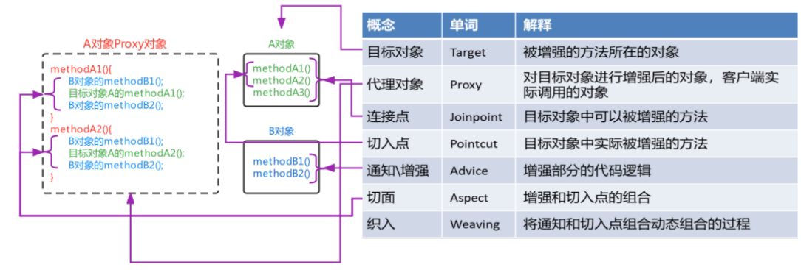

# HW13 - Ke Chen - AOP & Batch & Swagger


## 1.  List all of the annotations you learned from class and homework to annotaitons.md

**find in ShortQuestions file: annotations.md**


## 2.  Briefly reading: https://www.techgeeknext.com/spring-boot/spring-aop-interview-questions

done : Spring AOP Interview Questions and Answers

1. What is Spring AOP?
2. What are the advantages and disadvantages of Spring AOP?
3. What is Aspect in Spring AOP?
4. What is Pointcut in Spring AOP
5. What is the Join point in Spring AOP?
6. What does it mean by Advice and its types in Spring AOP
7. What is the Target object in Spring AOP?
8. What is the weaving in Spring AOP?
9. What is Proxy in Spring AOP?
10. What are the differences between Spring AOP and AspectJ?
11. Where weaving can happen in the target object's lifetime in Spring AOP?
12. Which dependency is required to set up Spring AOP with Spring boot?
13. How to enable Advice in Spring AOP?
14. How you can enable or disable the Spring AOP based on configuration flag?
15. How to create Aspects with @Aspect?
16. How to create Before and After (finally) Advice AOP Advice in Spring Boot?
17. What is After Returning Advice in spring AOP?
18. How to create custom annotation using Spring AOP?
19. How to create LoggingAspect in Spring AOP?
20. How to create AfterThrowing AOP Advice in Spring Boot?


## 3.  What is the Aspect Oriented Programming?

Aspect Oriented Programming(AOP) is a programming technique that <u>supports the separation of cross-cutting concerns in order to increase modularity, which means we can add new functionality before or after a method like transcation managementm, logging or security</u> that cut across multiple types and objects.

Horizontally extract multiple objects and attributes/methods in multiple objects.

AOP is typically used to implement cross-cutting concerns, which implies that it defines functionality that is required in multiple places across an application in one place(一个应用程序在一个地方的多个地方所需的功能). You can add new functionality before or after a method is executed like transaction management, logging or security which cut across multiple types and objects(often termed crosscutting concerns).(可以在执行跨多类型和对象（通常是术语交叉问题）的方法之前或之后添加新功能，例如事务管理、日志记录或安全性。)


## 4.  What are the advantages and disadvantages of Spring AOP?

**Advantages of Spring AOP**

1. Modularity: AOP provide separating cross-cutting concerns, making code more modular and maintainable.
2. Code Reusability: enables the reuse of aspects across multiple classes or modules, reducing code duplication.
3. Centralization: Aspects allow centralizing common functionalities, making it easier to manage changes and updates.


**Disadvantages of Spring AOP**

1. Debugging Complexity: hard to trace and debug issues due to their cross-cutting nature
2. Limited to Method-Level Interception: Spring AOP is primarily limited to method-level interception, and cannot intercept field accesses or class loading
3. Limited to Spring Beans: Spring AOP can only be applied to Spring-managed beans, which means it might not work on objects created outside of the Spring container.


## 5.  What is Aspect in Spring AOP?

An aspect is <u>a cross-cutting module that combines advice and pointcuts, class to define all aop self methods</u>. 

A standard class tagged with the @Aspect annotation can be used to implement an aspect.

Aspects are mostly used to enable cross-cutting concerns like logging, profiling, caching, and transaction management.


## 6.  What is Pointcut in Spring AOP? 

A pointcut represent <u>methods that are actually adviced in the target object</u>. 

- joinpoint: 目标对象中<u>可以</u>被advice的方法
- pointcut: 目标对象中<u>实际</u>被advice的方法
- 在joinpoint里面选择1个或多个方法进行advice，被adviced的方法为pointcut




## 7. What is the JoinPoint in Spring AOP?

A joinPoint represent <u>methods that can be adviced in the target object</u>. 

目标对象可以被增强的方法

- joinpoint: 目标对象中<u>可以</u>被advice的方法
- pointcut: 目标对象中<u>实际</u>被advice的方法
- 在joinpoint里面选择1个或多个方法进行advice，被adviced的方法为pointcut


## 8.  What does it mean by Advice and its types in Spring AOP?

**what is Advice:**

The Advice represents <u>action taken / for a particular join point</u>

增强部分的代码逻辑(插入进去的代码逻辑)


**types of Advice:**

1. before: run before the adviced method
2. after: Run after the adviced method
3. after-returning: Run after the adviced method completes its execution normally.
4. around: Run before and after the adviced method
5. after-throwing: Run after the the adviced method throws an exception


## 9.  Reading: https://www.javainuse.com/spring/sprbatch_interview

done： Spring Batch Interview Questions:

1. Explain Spring Batch framework?
2. When to use Spring Batch?
3. Explain the Spring Batch framework architecture?
4. How Spring Batch works?
5. Explain Spring Batch framework?
6. How Spring Batch works?
7. How to configure Spring Batch with Spring Boot?
8. What is Tasklet in Spring Batch?
9. How can we schedule a Spring Batch Job?


## 10. When to use Spring Batch?

Spring Batch <u>is suitable for processing high volumes of data, especially in scenarios where data needs to be processed periodically or in batch jobs, like Data Mingration, ETL processing and so on.</u>

适合处理大量的数据

从某个位置（数据库，文件或者外部推送队列(MQ)）读取大量的记录，根据业务需要实时处理读取的数据，将处理后的数据写入某个位置（可是数据库，文件或者推送到队列）。

It is used in various scenarios, including:

1. **ETL(Extract, Transform, Load) Processing**: When extracting, transforming, and loading large datasets from one system to another.

2. **Data Migration**: When migrating data from one system to another or from legacy systems to new systems.

3. **Large Data Processing**: To handle large-scale data processing efficiently and reliably.


理解Spring Batch是什么，在什么场景下要用，给出例子。
- What: 批处理数据。 
    - a lightweight and comprehensive framework designed for batch processing in Java.
- 场景：数据量很大 
    - can process large volumes of data, perform complex processing, and integrate with various data sources.
- 例子： 数据备份，产生report/bank statement
    - ETL (Extract, Transform, Load) Processes: When you need to extract data from various sources, transform it into a desired format, and load it into a target system. Spring Batch's chunk-oriented processing is well-suited for ETL tasks.
    - Data Migration: When you're migrating data from one system to another, especially if you need to perform data transformations and validations during the migration process.


实现它的粗略步骤(job, steps)  看Q11: How Spring Batch works?
- job
- Steps


## 11. How Spring Batch works?


1. Each job consists of one or more steps. 
2. Each step contains an ItemReader to read data, an ItemProcessor to process data, and an ItemWriter to write processed data.
3. The JobLauncher start and execute the job
4. The JobRepository stores metadata related to job execution, job status, parameters, etc

Spring Batch 入门级示例教程: https://blog.51cto.com/u_15499328/5278139

- 一个batch过程由一个job组成。这个实体封装了整个批处理过程。
- 一个job可以由一个或多个step组成。在大多数情况下，一个step将读取数据（通过ItemReader, ItemProcessor,ItemWriter）。
- JobLauncher处理启动一个job。
- 最后，JobRepository存储关于配置和执行的job的元数据。


Spring Batch - Difference between Step, Chunk and Tasklet: https://www.javainuse.com/spring/batchtaskchunk


## 12. How can we schedule a Spring Batch Job?

Spring Batch can be scheduled <u>using tools like `Spring Task (aka Cron)`</u>.

Cron Expressions: https://docs.oracle.com/cd/E12058_01/doc/doc.1014/e12030/cron_expressions.htm

Spring Boot Batch Job + Scheduler Simple Example: https://www.javainuse.com/spring/springbootbatchtaskscheduler


```java
// Make sure that scheduling is enabled in your Spring application
@SpringBootApplication
@EnableScheduling
public class YourApplication {
    public static void main(String[] args) {
        SpringApplication.run(YourApplication.class, args);
    }
}

@Component
public class BatchJobScheduler {
    @Autowired
    private JobLauncher jobLauncher;

    @Autowired
    private Job myBatchJob;

    @Scheduled(cron = "0 0 1 * * ?") // Cron expression for daily execution at 1:00 AM
    public void runBatchJob() throws Exception {
        JobParameters jobParameters = new JobParametersBuilder()
            .addString("jobID", String.valueOf(System.currentTimeMillis()))
            .toJobParameters();

        jobLauncher.run(myBatchJob, jobParameters);
    }
}
```
In this example, the @Scheduled annotation specifies that the runBatchJob method should be executed daily at 1:00 AM using the provided cron expression.


## 13. What is the cron expression?

A cron expression is <u>a string to represent a schedule used to define when a task or job should execute</u> 

Cron Expressions: https://docs.oracle.com/cd/E12058_01/doc/doc.1014/e12030/cron_expressions.htm


## 14. What is the spring task?

spring task is a mechanism to <u>represent a schedule used to define when a task or job should execute, it can be used to trigger batch jobs, sending emails, cleaning up resources, etc.</u>


## 15. When to use Spring task? 

is a mechanism to represent a schedule used to define when a task or job should execute, it can be used to <u>trigger batch jobs, sending emails, cleaning up resources, etc.</u>


## 16. What is servlet filter and any filter example?

**What is servlet filter:**

A Servlet Filter is <u>a Java component to perform pre-processing and post-processing on requests and responses before they reach and leave the servlet or JSP</u> as they pass through the web container. (在到达servlet或者jsp之前，当requests和responses经过web container时，进行拦截和操控). 

Filters are a part of the Java Servlet Specification and are typically used for tasks such as logging, authentication, authorization, input validation, and more. 


**filter example:**
- Authentication Filters
- Logging and Auditing Filters
- Image conversion Filters
- Data compression Filters
- Encryption Filters
- Tokenizing Filters
- Filters that trigger resource access events
- XSL/T filters
- Mime-type chain Filter

彻底理解Spring Interceptor和Servlet Filter: https://segmentfault.com/a/1190000039996829


## 17.  What is the spring interceptor? What we can do with interceptor?

**What is the spring interceptor:**

In Spring Framework, an interceptor is <u>a Java component to perform pre-processing and post-processing on requests and responses before they reach and leave the controller.</u> 


**What we can do with interceptor:**

- perform security checks 执行安全检查
- reformat request headers or bodies 格式化请求header和body
- audit or log requests: 审查或记录日志
- Authentication-Blocking requests based on user identity 根据请求内容授权或者限制用户访问
- Limit User Access Based on Request Frequency 根据请求频率限制用户访问

彻底理解Spring Interceptor和Servlet Filter: https://segmentfault.com/a/1190000039996829


## 18. In Interceptor, What is preHandle? What is postHandle?

**What is preHandle:**

preHandle is <u>a menthod is called before the Controller method is executed.</u>

**What is postHandle:**

preHandle is <u>a menthod is called after the Controller method is executed but before the view is rendred.</u>


- **preHandle**: 
    - The `preHandle` method is invoked before the Controller method is executed. 
    - It allows you to perform pre-processing logic, such as logging, authentication, validation, or modification of the request. The method returns a boolean value:
    - If preHandle() returns: true, the request continues to be processed, and the controller method is invoked.
    - If it returns `false`, the request handling is halted, and the controller method is not called.

    ```java
    @Override
    public boolean preHandle(HttpServletRequest request, HttpServletResponse response, Object handler) throws Exception {
        // Pre-processing logic here
        if (/* some condition */) {
            return true; // Continue processing
        } else {
            response.sendRedirect("/access-denied"); // Redirect or handle the request as needed
            return false; // Stop processing
        }
    }
    ```

- **postHandle**: 
    - The `postHandle` method is invoked after the Controller method is executed but before the view is rendered.
    - It allows you to perform operations on the model and view before rendering the response. It receives the ModelAndView object, which can be modified to pass additional attributes to the view or even change the view itself.

    ```java
    @Override
    public void postHandle(HttpServletRequest request, HttpServletResponse response, Object handler, ModelAndView modelAndView) throws Exception {
        // Post-processing logic here
        if (modelAndView != null) {
            modelAndView.addObject("additionalData", "Some additional data");
        }
    }
    ```

Interceptor的执行顺序大致为:
- 请求到达DispatcherServlet
- DispatcherServlet发送至Interceptor, 执行preHandle
- 请求到达Controller
- 请求结束后，postHandle执行

Spring中主要通过HandlerInterceptor接口来实现请求的拦截，实现HandlerInterceptor接口需要实现下面三个方法:
- preHandle(): 在handle执行之前，返回boolean值，true表示继续执行，false为停止执行并返回。
- postHandle(): 在handle执行之后，可以在返回之前对返回的结果进行修改。
- afterCompletion(): 在请求完成，视图生成后调用。


## 19. What is Swagger?

Swagger is <u>a framework and a suite of tools used to design, build, document, and consume RESTful APIs.</u> 

Swagger 是一个规范且完整的框架，用于生成、描述、调用和可视化 RESTful 风格的 Web 服务以及 集成Swagger自动生成API文档。


Key features of Swagger include:

1. **API Documentation**: Swagger simplifies the process of documenting APIs by generating interactive documentation from the code itself. It automatically creates a visual representation of the API endpoints, parameters, request/response bodies, and error codes.

2. **API Testing**: It allows users to perform API requests directly from the documentation interface, enabling easy testing and validation of API endpoints without the need for additional tools.

3. **Code Generation**: Swagger can generate client libraries or server stubs in multiple languages based on the API specification. This facilitates easier integration and development of client applications that consume the API.

4. **Standardization and Consistency**: By providing a standardized way to describe RESTful APIs using the OpenAPI Specification (formerly Swagger Specification), Swagger ensures consistency in API design across teams and projects.

Advantages of Swagger:

1. Support for Automatically Generated Online API Documentation: 
    - With Swagger, you can generate API documentation directly from your code, eliminating the need to manually write API documentation.
    
2. Provide Online API Testing via a Web Page: Documentation alone is not enough. 
    - The documentation generated by Swagger also supports online testing. With predefined parameters and formats, you can directly input parameter values in the interface to test the API online.

Swagger 的优势
1. 支持 API 自动生成同步的在线文档：
    - 使用 Swagger 后可以直接通过代码生成文档，不再需要自己手动编写接口文档了，对程序员来说非常方便，可以节约写文档的时间去学习新技术。
2. 提供 Web 页面在线测试 API：
    - 光有文档还不够，Swagger 生成的文档还支持在线测试。参数和格式都定好了，直接在界面上输入参数对应的值即可在线测试接口。