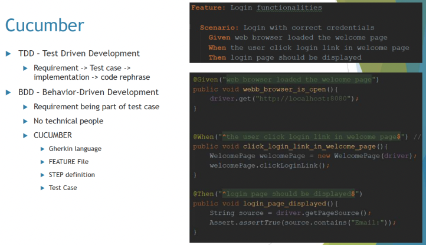

# hw14 - Ke Chen - testing

## 1.  List all of the new learned annotations to your annotations.md

find in ShortQuestions file : annotations.md


## 2.  what is selenium?

Selenium is <u>an open-source framework for automating web browsers</u>. 

It provides a way to interact with web pages and perform actions such as filling out forms, clicking buttons, navigating through web pages, and extracting data from web pages. 


## 3.  what is cucumber?

Cucumber is <u>an open-source tool</u> that <u>facilitates behavior-driven development (BDD) for software projects.</u> 

Cucumber is primarily <u>used for testing and validating software behavior by writing scenarios</u>.

Cucumber is <u>often used in conjunction with the Gherkin language</u>, which is a simple, structured, and human-readable language for describing software behavior.  <u>Gherkin uses keywords such as "Given," "When," "Then," "And," and "But" to define steps in a scenario.</u>

- Given: The "Given" keyword is used to set up the initial context or preconditions for a scenario
- When: The "When" keyword is used to describe the action or event that triggers the behavior to be tested.
- Then: The "Then" keyword is used to specify the expected outcome or result of the scenario. 




## 4.  what is JMeter?

Apache JMeter is an open-source, Java-based <u>software application designed for performance testing, load testing, and functional testing of web applications.</u> 

It is a popular tool for assessing the performance and scalability of web services, websites, and other software applications <u>by simulating a large number of users and their interactions with the application.</u> JMeter is often used in software quality assurance and testing.

Apache JMeter is widely used in the software industry to identify performance bottlenecks, assess application scalability, and ensure that web applications meet performance and reliability requirements. 


## 5.  What is the lifecircle of Junit?

 JUnit is designed to facilitate the creation and execution of test cases to ensure that your code functions correctly. 

The lifecycle of JUnit includes the following phases:

1. **Class-Level Setup (BeforeClass)**: At the beginning of the test suite, JUnit invokes any methods annotated with `@BeforeClass` once for the entire test class. These methods typically perform setup tasks that are shared among all test methods in the class, such as setting up database connections or initializing common resources.

2. **Test Setup (Before)**: Before the execution of each test method, JUnit invokes methods annotated with `@Before`. These methods perform test-specific setup tasks, such as creating or configuring objects needed for the test.

3. **Test Execution**: JUnit executes the test method, which is typically annotated with `@Test`. This is where the actual testing takes place, and assertions are used to verify that the code under test behaves as expected.

4. **Test Cleanup (After)**: After the test method has executed, JUnit invokes methods annotated with `@After`. These methods perform cleanup tasks specific to the test, such as releasing resources or cleaning up objects created during the test.

5. **Class-Level Cleanup (AfterClass)**: At the end of the test suite, JUnit invokes methods annotated with `@AfterClass` once for the entire test class. These methods perform cleanup tasks that are shared among all test methods in the class. They release any resources acquired during the class-level setup.

The order of execution is as follows:
- Class-Level Setup (BeforeClass)
- Test Setup (Before)
- Test Execution (Test method)
- Test Cleanup (After)
- Repeat the above steps for each test method in the class
- Class-Level Cleanup (AfterClass)


JUnit ensures that each test method is isolated from the others, and setup and cleanup tasks are performed consistently before and after each test. 

This lifecycle helps maintain the integrity of the tests and ensures that one test does not interfere with another. It also provides the opportunity to manage resources efficiently and consistently across multiple test methods in a test class.


## 6.  Is @BeforeAll method should be Class level(static)?

Yes, in JUnit 5, the `@BeforeAll` method (or its equivalent `@BeforeClass` in JUnit 4) should be a static method at the class level. 

<u>Because it is invoked once for the entire test class and is responsible for setting up resources or conditions that are common to all test methods.</u>

Here's an example of a class-level setup method using `@BeforeAll` in JUnit 5:

```java
import org.junit.jupiter.api.BeforeAll;
import org.junit.jupiter.api.Test;

public class MyTestClass {
    @BeforeAll
    static void classLevelSetup() {
        // Perform class-level setup tasks here, e.g., initialize shared resources.
    }

    @Test
    void testMethod1() {
        // Test method 1
    }

    @Test
    void testMethod2() {
        // Test method 2
    }
}
```
By making the method static, you ensure that it's invoked once for the entire test class and can perform class-level setup tasks effectively. This is particularly useful for scenarios where resources need to be shared among multiple test methods in the same class.


## 7. What is Mockito? and what is its limitations?  what kind of tools can give help?

### What is Mockito?
Mockito is <u>an open-source Java framework</u> for <u>creating and using mock objects in unit testing.</u>

Mock objects are used to <u>simulate the behavior of real objects or components that a class depends on, such as dependencies, collaborators, or external systems.</u> 

Mockito allows you to isolate the code you want to test by replacing these dependencies with mock objects, enabling more controlled and focused testing.


### what is its limitations?
1. **Only Works with Java**: Mockito is designed specifically for Java and does not support other languages.

2. **Cannot Mock Final Classes and Methods**: Mockito cannot be used to mock final classes and final methods.

3. **Limited Support for Static and Private Methods**: Mockito has limited support for mocking static and private methods. You may need additional tools or libraries to mock these types of methods.

4. **Limited Support for Spying on Real Objects**: While Mockito supports the creation of spy objects, it may not work correctly in all scenarios, and behavior may differ from that of true partial mocking.


### what kind of tools can give help?
1. **PowerMock**: PowerMock is a testing framework that extends Mockito and allows you to mock final classes, static methods, and private methods. It provides more advanced mocking capabilities.

2. **EasyMock**: EasyMock is another Java-based mocking framework that can be used alongside Mockito. It provides similar mocking and verification features.

3. **JMockit**: JMockit is a comprehensive mocking library for Java that can be used to mock final classes, static methods, and other complex scenarios. It offers advanced features for testing.


## 8.  What is @Mock and what is @InjectMocks?

### What is @Mock?
1. **@Mock**:
   - The `@Mock` annotation is used to <u>create a mock object for a class or interface.</u>
   - It is typically applied to a field in a test class, indicating that the field should be populated with a mock object during test execution.
   - Mock objects created with `@Mock` have their behavior and responses defined using Mockito methods, such as `when()` and `thenReturn()`.
   - The purpose of `@Mock` is to replace real dependencies or collaborators with mock objects, allowing you to isolate and control the behavior of the objects being tested.

   Example:
   ```java
   import org.mockito.Mock;

   public class MyTest {
       @Mock
       private MyDependency mockDependency;

       // Test methods
   }
   ```
### what is @InjectMocks?
2. **@InjectMocks**:

   - The `@InjectMocks` annotation is used to <u>inject mock objects (created with `@Mock`) into a test class.</u>
   - It is applied to the test class itself, and Mockito will automatically inject the mock objects into fields annotated with `@InjectMocks`.
   - `@InjectMocks` is typically used to inject mock objects into the class under test. It helps you replace the real dependencies of the class with their corresponding mock objects, allowing you to test the class in isolation.

   Example:
   ```java
   import org.mockito.InjectMocks;

   public class MyTest {
       @InjectMocks
       private MyClassUnderTest classUnderTest;

       @Mock
       private MyDependency mockDependency;

       // Test methods
   }
   ```

In the second example, `classUnderTest` is the class being tested, and `mockDependency` is a mock object that will be automatically injected into the `classUnderTest` object. This allows you to test `classUnderTest` in isolation, with its dependencies replaced by mock objects.


## 9.  What is the stubbing (define behaviors)?

Stubbing, in the context of testing and mocking frameworks like Mockito, refers to <u>the process of defining the expected behavior of mock objects.</u> 

<u>When you stub a method or behavior of a mock object, you are specifying how that method should behave when it is called during a test.</u>

This allows you to control and customize the responses of mock objects to create specific testing scenarios.

Here's an example of stubbing in Mockito to illustrate the concept:
```java
import static org.mockito.Mockito.*;

public class MyTest {
    @Mock
    private MyDependency mockDependency;

    public void myTestScenario() {
        // Stubbing: Define behavior for the mock method
        when(mockDependency.getData()).thenReturn("Mocked Data");

        // The test code that uses mockDependency
        String result = mockDependency.getData();

        // Assertion: Check that the result matches the expected behavior
        assert(result.equals("Mocked Data"));
    }
}
```
In this example:
1. `mockDependency` is a mock object.
2. `when(mockDependency.getData()).thenReturn("Mocked Data")` is the stubbing step where we define that when the `getData` method of `mockDependency` is called, it should return "Mocked Data."
3. During the test, when `mockDependency.getData()` is called, it returns "Mocked Data" as expected.


## 10. what is Mockito ArgumentMatchers?

Mockito ArgumentMatchers are <u>a set of powerful features</u> provided by the Mockito mocking framework <u>to match and verify method call arguments on mock objects.</u> 

ArgumentMatchers are particularly useful when you want to verify that a method was called with specific arguments or when you want to stub method calls with different argument conditions.

Here are some commonly used Mockito ArgumentMatchers:

1. **eq()**: This matcher is used to match an argument with a specific value. For example, `eq(42)` matches the argument that is equal to 42.

2. **any()**: This matcher matches any argument, regardless of its value. For example, `any(String.class)` matches any String argument.

3. **anyInt(), anyDouble(), anyBoolean(), etc.**: These matchers match arguments of specific primitive types, such as int, double, or boolean.

4. **anyList()**: This matcher matches a list of arguments.

5. **eqList()**: This matcher matches a list of arguments with specific values. For example, `eqList(1, 2, 3)` matches a list with elements 1, 2, and 3.

6. **contains(), argThat()**: These matchers allow you to specify custom argument matching logic. You can define your own matcher by implementing the `ArgumentMatcher` interface or using a lambda expression. For example, `argThat(list -> list.size() > 0)` matches a list with at least one element.

Here's an example of using Mockito ArgumentMatchers for verifying method calls:

```java
import org.mockito.ArgumentMatchers;
import static org.mockito.Mockito.*;

public class MyTest {
    private MyDependency mockDependency;

    public void myTestScenario() {
        mockDependency = mock(MyDependency.class);

        // Perform some actions

        // Verify that the method was called with specific arguments
        verify(mockDependency).someMethod(ArgumentMatchers.eq("expectedArg"));
    }
}
```
In this example, `verify(mockDependency).someMethod(ArgumentMatchers.eq("expectedArg"))` verifies that the `someMethod` of `mockDependency` was called with the argument `"expectedArg"`.


## 11. what is Hamcrest Matchers?

Hamcrest Matchers is <u>a library</u> for <u>writing expressive and readable assertions or matchers in Java unit testing.</u> 

It is often used in conjunction with testing frameworks like JUnit or TestNG to create more human-readable and custom assertions for your test cases.

The primary goal of Hamcrest Matchers is to <u>improve the readability of your test code by providing a wide range of matchers that can be used to make assertions about your test results or outcomes.</u> 

Here's a simple example of how Hamcrest Matchers can be used with JUnit:
```java
import static org.hamcrest.CoreMatchers.*;
import static org.hamcrest.MatcherAssert.*;
import org.junit.Test;

public class MyTest {
    @Test
    public void testExample() {
        String actualValue = "Hello, World";
        
        // Using Hamcrest Matchers for assertions
        assertThat(actualValue, is("Hello, World"));
        assertThat(actualValue, containsString("Hello"));
        assertThat(actualValue, endsWith("World"));
    }
}
```
In this example, Hamcrest Matchers like `is()`, `containsString()`, and `endsWith()` are used to express assertions in a more natural language style, making it clear what the test is checking.


## 12. do you know @spy? what is difference between @spy and @Mock?

### what is the @spy?
**@Spy**:
   - `@Spy` is used to <u>create a partially mocked object.</u> It allows you to create a mock object that retains the real behavior of the class while still allowing you to mock specific methods or behavior within that object.
   - When you annotate a field with `@Spy`, Mockito creates a spy on an existing instance of the class, and this instance retains its real behavior for non-mocked methods. Mocked methods can have their behavior defined using Mockito.
   - You typically use `@Spy` when you want to test a class that needs to interact with the real behavior of the class, while only selectively mocking certain methods or behavior.

   ```java
   import org.mockito.Spy;

   public class MyTest {
       @Spy
       private MyDependency spyDependency;
   }
   ```

###  @Spy VS @Mock?
The main difference is that `@Mock` creates a completely new mock object, while `@Spy` creates a partially mocked object that retains some of its real behavior.

In summary, `@Mock` is used for creating full mock objects, while `@Spy` is used for creating partial mock objects by wrapping an existing instance of the class.


## 13. What is assertion?

An assertion in software testing is <u>a statement or expression</u> that <u>checks whether a given condition or expectation is true during the execution of a program.</u> 

Assertions are used <u>to verify that the actual behavior of the program matches the expected behavior defined by the test case or specification.</u> 

When an assertion fails (i.e., the condition is not met), it indicates a problem in the code being tested.

1. **assertEquals(expected, actual)**: Compares if the expected value is equal to the actual value. This is used to verify that two values are equal.


2. **assertNotEquals(unexpected, actual)**: Verifies that the unexpected value is not equal to the actual value.

3. **assertSame(expected, actual)**: Checks if the expected object is the same as the actual object (i.e., they reference the same object in memory).

4. **assertNotSame(unexpected, actual)**: Ensures that the unexpected object is not the same as the actual object.

5. **assertTrue(condition)**: Validates that the given condition is true. This is commonly used to check if a Boolean expression or condition is true.

6. **assertFalse(condition)**: Checks that the given condition is false.

7. **assertNull(object)**: Verifies that the provided object is null.

8. **assertNotNull(object)**: Checks that the provided object is not null.

9. **assertArrayEquals(expectedArray, actualArray)**: Compares two arrays to ensure that they are equal, element by element.

10. **assertThrows(expectedException, executable)**: Checks if a specific exception is thrown when the executable code block is executed. This is used for testing exception handling.

11. **assertDoesNotThrow(executable)**: Ensures that no exception is thrown when the executable code block is executed.

12. **assertThat(value, matcher)**: Used in libraries like Hamcrest to create custom and expressive assertions with various matchers.

13. **fail(message)**: Manually triggers a test failure with an optional error message. This is useful for marking tests as failed when certain conditions are not met.


## 14. If you have developed a new feature, how many types of tests for this feature? and what kind of tests are written by you?    what is the purpose of each type of tests?

written by me:  Unit test and Integration test.

1. **Unit Tests**:
   - **Purpose**: Unit tests focus on testing individual units or components of the code in isolation. These units can be functions, methods, or classes. Unit tests ensure that each unit behaves correctly and that the code adheres to the specified behavior.
   - **Written by**: Developers.
   - **Purpose**: To verify that the smallest parts of the feature work as intended and to catch and fix bugs early in the development process.

2. **Integration Tests**:
   - **Purpose**: Integration tests evaluate how different components or modules of the software work together when integrated. They test the interactions and interfaces between these components.
   - **Written by**: Developers or QA((Quality Assurance)) engineers.
   - **Purpose**: To identify issues that may arise when multiple units are combined and to ensure that the feature's integration points function correctly.

3. **Regression Tests**:
   - **Purpose**: Regression tests are used to verify that the new feature does not introduce unintended side effects or break existing functionality. They ensure that the software remains stable after code changes.
   - **Written by**: QA engineers.
   - **Purpose**: To detect and prevent regression issues that may occur as a result of feature development or code changes.

4. **Performance Tests**:
   - **Purpose**: Performance tests assess the feature's speed, scalability, and resource usage. They check how well the feature performs under various conditions, including heavy loads and stress scenarios.
   - **Written by**: QA engineers or performance testing specialists.
   - **Purpose**: To ensure that the feature meets performance requirements and can handle expected workloads.

5. **Load Tests**:
    - Purpose: Load tests assess how the application performs under expected loads and beyond. They help determine the maximum capacity of the system before performance degrades.
    - Written by: Performance engineers or test engineers.
    - Purpose: Verify that the application can handle expected concurrent user loads and beyond without significant degradation.

6. **Stress Tests**:
    - Purpose: Stress tests push the application beyond its limits to identify points of failure and weaknesses in extreme conditions.
    - Written by: Performance engineers or test engineers.
    - Purpose: Ensure that the application can gracefully handle extreme scenarios and recover from failures.

7. **User Acceptance Tests (UAT)**:
   - **Purpose**: User acceptance tests are performed by users or stakeholders to validate that the feature meets their requirements and expectations. They ensure that the feature aligns with the needs of the end users.
   - **Written by**: QA engineers, users, or stakeholders.
   - **Purpose**: To gain approval from users and stakeholders, confirming that the feature is ready for production.


## 15. Add unit test for CommentServiceImpl, the coverage should be 100%.
find in coding file : hw14-testing - CommentServiceImplTest

## 16. write Integration tests for PostController. The tests should cover all scenarios.
find in coding file : hw14-testing - PostControllerTest
 
