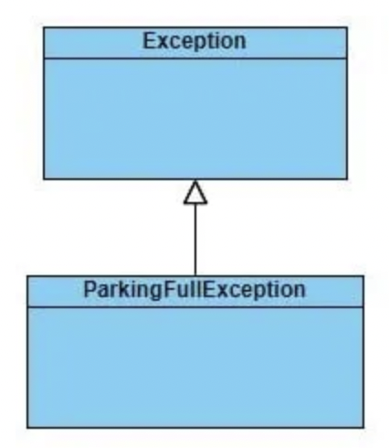
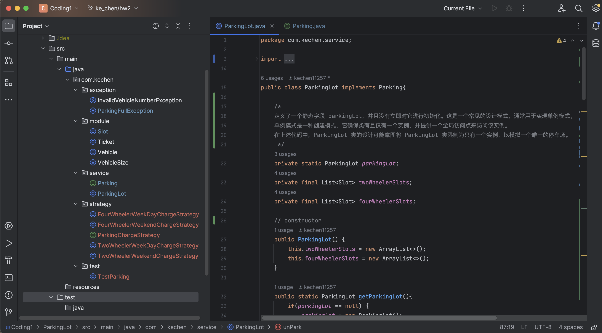

# HW2- Ke Chen - java&oop

## 1. Write up Example code to demonstrate the three foundmental concepts of OOP.(reference Code Demo repo as example))
1. Encapsulation;
2.  Polymorphism;
3.  Inheritance;

```java
public class Main {
    public static void main(String[] args) {

        // test the encapsulation + polymorphism
        Animal animal = new Animal("Lili", 2);
        System.out.println(animal.getName());
        Animal animal2 = new Animal("Lili", 2, "Mike");
        System.out.println(animal2.getName());

        // test the inheritance
        Animal animal3 = new Dog("Coco", 3);
        animal3.outPut();
    }

}

class Animal{

    // Encapsulation step1:
    // Use the private access modifier to declare all variables/fields of class as private.
    private String name;
    private int age;
    private String hostName;

    // Polymorphism : use 2 constructors with different signatures
    public Animal(String name, int age) {
        this.name = name;
        this.age = age;
    }
    public Animal(String name, int age, String hostName) {
        this.name = name;
        this.age = age;
        this.hostName = hostName;
    }

    // Encapsulation step2:
    // Define public getter and setter methods to read and modify/set the values of the abovesaid fields.
    public String getName() {

        return name;
    }

    public void outPut(){
        System.out.println("Animal~~~");
    }
 }

// Inheritance: using keyword extends and override the outPut method that also appears in parent class
class Dog extends Animal {
    public Dog(String name, int age) {
        super(name, age);
    }
    public void outPut(){
        System.out.println("Dog~~~");
    }
}
```


## 2. What is wrapper class in Java and Why we need wrapper class?

Wrapper classes are classes that allow primitive types to be accessed as objects.
In other words, we can say that wrapper classes <u>are built-in java classes which allow the conversion of objects to primitives and primitives to objects.</u>

The process of converting primitives to objects is called autoboxing, and the process of converting objects to primitives is called unboxing.


## 3. What is the difference between HashMap and HashTable?
1. synchronized
    - HashMap is not synchronized so is not thread-safe
    - HashTable is synchronized so is thread-safe
2. null 
    - HashMap can contian one null key and multiple null values
    - HashTable cannot contain any null key or null value
3. inherit class
    - HashMap inherits the AbstractMap class
    - HashTable inherits the Dictionary class


## 4. What is String pool in Java and why we need String pool?
**What is String pool:**

String pool is <u>the space reserved in the heap memory</u> that can be used to <u>store the strings</u>.
  
**why we need String pool:**

whenever we create a string literal; the JVM checks the "string constant pool" first:
- If the string already exists in the pool, a reference to the pooled instance is returned. 
- If the string doesn't exist in the pool, a new string instance is created and placed in the pool. 

Therefore, <u>String pool decreases the number of String objects created in the JVM, thereby reducing memory load and improving performance</u>.


## 5. What is Java garbage collection?
Garbage collection is <u>a process</u> of <u>reclaiming the unused runtime objects</u>.
回收未使用的运行时对象的过程.

It is performed for memory management. In other words, we can say that It is the process of <u>removing unused objects from the memory to free up space and make this space available for Java Virtual Machine.</u>


## 6. What are access modifiers and their scopes in Java?
- Public： The classes, methods, or variables which are defined as public, <u>can be accessed by any class or method.</u>
- Private： The private class, methods, or variables defined as private <u>can be accessed within the class only.</u>
- Default： Default <u>can be accessed within the package only. By default, all the classes, methods, and variables are of default scope.</u>
- Protected： Protected <u>can be accessed by the class of the same package, or by the sub-class of this class, or within the same class.</u>


## 7. What is final key word? (Filed, Method, Class)
the final variable is used to <u>restrict the user from updating it.</u>
<u>For value: stop value change, for method: stop overriding, for class: stop inheritance, for object: stop reference again</u>
    
If we initialize the final variable, we can't change its value. 
In other words, we can say that the final variable once assigned to a value, can never be changed after that. The final variable which is not assigned to any value can only be assigned through the class constructor.


## 8. What is static keyword? (Filed, Method, Class). When do we usually use it?
**Static Field:**

<u>static field and method belongs to the class rather than the object, there is no need to create an instance of the class to use it.

Static class is a nested class within the outer class. It can interact with other outside classes.</u>


## 9. What is the differences between overriding and overloading?
1. basic
    - overloading: a polymorphism technique to <u>create multiple methods with the same name but different parameters</u>.
    - overriding: <u>two methods having the same method signature are present in two different classes and they have the relationship of inheritance</u>.

2. occurs
    - overloading <u>occurs within the class</u>.
    - overriding <u>occurs in 2 classes</u> that have IS-A relationship between them.

3. parameters
    - overloading: the <u>parameters must be different</u>
    - overriding: the <u>parameters must be same</u>.


## 10. What is the differences between super and this?
1. basic
    - this keyword always points to the <u>current</u> class context.
    - super keyword always points to the <u>parent</u> class contexts 
2. use
    - this keyword primarily used to <u>differentiate between local and instance variables</u> when passed in the class constructor.(this关键字主要用于在类构造函数中传递时区分局部变量和实例变量).
    - super keyword is primarily used to <u>initialize the base class variables</u> within the derived class constructor(super关键字主要用于初始化派生类构造函数中的基类变量).


## 11. What is the Java load sequence? 类加载顺序
The class loading sequence refers to the order in which classes are loaded and initialized when a Java program is executed. 

The class loading sequence typically involves the following steps:

1. **Loading**: 

    The Java ClassLoader <u>loads the bytecode of classes into memory</u>. (加载classes的bytecode)

    When a class is first referenced in the code (e.g., when it is instantiated with new or when a static member is accessed), the ClassLoader attempts to find and load the class's bytecode (.class file). 
    If the class has not been loaded before, it is loaded into memory.
   
2. **Linking**:

    **Verification**: 
    The class loader <u>verifies the loaded bytecode</u> (验证已经加载好的bytecode) to ensure it adheres to Java's safety and security requirements. This includes checking for proper format, bytecode validity, and various security constraints.

    **Preparation**: 
    <u>Memory is allocated for class variables and set to default values.</u>(为static 和 class variables分配内存并且赋值). These variables are initialized to zero, null, or appropriate default values depending on their data types.

    **Resolution**: 
    <u>Any symbolic references in the class are resolved to direct references</u>(类中的任何符号引用都被解析为直接引用). This step involves replacing symbolic references (such as method and field references) with direct references to the actual methods or fields in other classes. Resolution can occur at compile-time or runtime.

3. **Initialization**: 

    <u>static initializers (static blocks and variable initializations) in the class are executed</u>(static blocks and variables初始化被执行) with their assigned values. Static initializers run in the order they appear in the class and only once, when the class is first initialized. 

    Initialization also occurs in a thread-safe manner, ensuring that it is done only once, even in a multi-threaded environment.


## 12. What is Polymorphism ? And how Java implements it ? 

**what is polymorphism:**

Polymorphism refers to <u>the ability of objects to take on multiple forms or behaviors</u> depending on the context. 


**compile-time polymorphism vs runtime polymorphism**
1. compile-time polymorphism：
    - compile-time polymorphism: a process that <u>a call to method is resolves at compile-time (the type of the object is determined at compile-time).</u>
    - compile-time polymorphism is also known as <u>static binding, early binding, or overloading</u>.

2. runtime polymorphism
    - runtime polymorphism: a process that <u>a call to an overridden method is resolves at runtime (the type of the object is determined at runtime).</u>
    - runtime polymorphism is also known as <u>dynamic binding</u>, late bingding, <u>overriding</u> or dynamic method dispatch.


**how to implements:** 

by overriding and overloading


## 13. What is Encapsulation ? How Java implements it? And why we need encapsulation?
**what is encapsulation:**

Encapsulation: wraps code and data into a single unit.

**how to implement it:**

We need to perform two steps to achieve the purpose of Encapsulation in Java.
1. Use the private access modifier to declare all variables/fields of class as private.
2. Define public getter and setter methods to read and modify/set the values of the abovesaid fields.

**advantage**
- By providing only the setter or getter method, you can <u>make the class read-only or write-only</u>. 
   In other words, you can skip the getter or setter methods.
- It provides the <u>control over the data</u>. 
   Suppose you want to set the value of id which should be greater than 100 only, you can write the logic inside the setter method. You can write the logic not to store the negative numbers in the setter methods.
- It is a way to <u>achieve data hiding</u> in Java because other class will not be able to access the data through the private data members.


## 14. What is Interface and what is abstract class? What are the differences between them?

**what is interface:**

An interface <u>defines a set of variables(public, static, and final) and methods(abstract, static, default) that a class must implement.</u>

Interfaces can contain only method declarations (methods without a body) and constants (variables that are implicitly public, static, and final).

after Java8, an interface may also contain constants, default methods, static methods, and nested types.

**what is abstract class:**

An abstract class is <u>a class that cannot be instantiated on its own and typically contains abstract methods and regular methods, fields, and constructors.</u>

1. A class that is declared as abstract is known as an abstract class.
2. It needs to be extended and its method needs to be implemented.
   需要对其进行扩展并实现其方法。
3. It cannot be instantiated.
   它无法实例化。
4. It can have abstract and non-abstract methods, constructors, and static methods.</u>
5. It can also have the final methods which will force the subclass not to change the body of the method. 


**differences between them**
1. method:
    - interface can only have method declarations
    - abstract class can have both abstract and concrete methods
2. multiple inheritance:
    - classes could implement multiple interface
    - a class can extend only one abstract class
3. constructor:
    - interface cannot have constructor
    - abstract class can


## 15. design a parking lot (put the code to codingQuestions/coding1 folder, if you have no ability to design it, please find the solution in internet, then understand it, and re-type it.(Do NOT just copy and paste))

find in Coding file: hw2-coding1

System Design — Parking Lot Design Interview Question Using Java： 

https://medium.com/geekculture/system-design-parking-lot-design-interview-question-using-java-3d1dea4f6a2


This implementation we will be dividing in 3 parts: 
- Discuss how we will be simulating the elevator design
- Parking Design Code — Iteration-1 — Park Vehicle
- Parking Design Code — Iteration-2 — Unpark Vehicle

### Simulate the Parking Lot design:

We will be simulating the scenario — A vehicle to be parked can be either a two-wheeler or a four-wheeler.


When the vehicle is to be parked, the owner will be provided a ticket. If there are no parking slots available, then a parking full exception will be thrown. When the vehicle is to be unparked, the owner must provide the ticket.

The parking charges will depend on:
- If it is a weekend or a weekday
- If the vehicle is a two-wheeler or a four-wheeler

### Parking Design Code — Iteration-1 — Park Vehicle:
- implementing the code to park the vehicle

#### module: Classes

1. **Enum VehicleSize 汽车类型** — This enum will have two values TWOWHEELER and FOURWHEELER.
    
2. **Class Vehicle 汽车** — The vehicle to be parked.
    - It has the vehicle number and the type of vehicle i.e. two-wheeler or four-wheeler.
    - vehicle的基本信息，定义了String vehicleNumber，VehicleSize vehicleSize 2个variables。

    
3. **Class Slot 停车位** — This class represents the space in the parking lot which will be used to park the vehicle. 
    
    - A Parking lot will have a finite number of parking slots. This number will be initialized. 

    - The parking lot will have two types of slots:
        - Two Wheeler Parking Slots
        - Four Wheeler Parking Slots
    
    - Each slot will be having a unique slot number.
    - 停车位的基本信息，定义了int slotNumber，boolean isEmpty，Vehicle parkVehicle 3个variables.

    

    - 2 methods:
        - public  void vacateSlot()   //清空停车位
        - public void occupySlot(Vehicle parkVehicle)  //占用停车位

4. **Class Ticket 小票** — Once the vehicle has been parked, the owner will be provided with the Ticket. 
    - It will have the slotNumber, vehicle number, time at which the vehicle has been parked and the vehicle size.
    - 小票的基本信息，定义了int slotNumber，String vehicleNumber，Date date，VehicleSize vehicleSize

    

#### exception:

**Class ParkingFullException 停车位已满** - creating a custom exception named ParkingFullException.
    

#### service: Interfaces

1. **Interface Parking** - an interface named Parking which will have park method
    

    implementing the above interface to write the logic for parking the vehicle and returning the ticket. This class will be a singleton class.
    

    - parking：创建一个interface Parking: 
        - public Ticket park(Vehicle vehicle) throws ParkingFullException;

2. **class ParkingLot**

    通过class ParkingLot implement Parking具体实现：
    - 定义了ParkingLot parkingLot，List<Slot> twoWheelerSlots， List<Slot> fourWheelerSlots.
    - 方法：
        - public static ParkingLot getParkingLot()  //获得停车位，首先判断是否位空，就返回ParkingLot的实例
        - public boolean initializeParkingSlots(int numberOfTwoWheelerParkingSlots, int numberOfFourWheelerParkingSlots) 初始化停车位
        - public Ticket park(Vehicle vehicle) . //停车，首先判断是否有available slot，然后根据类型返回小票活exception
        - private Slot getAvailableFourWheelerSlot()
        - private Slot getAvailableTwoheelerSlot()

#### test
**class TestParking** : 分别创建2轮和4轮的object, test the park logic


### ParkingLot Design Code — Iteration-2
- implementing the code to unpark the vehicle and calculate the charges.

#### exception:

**Class InvalidVehicleNumberException**

Create an exception class named InvalidVehicleNumberException. This exception will be thrown if due to some reason the vehicle to be unparked cannot be found in the parking lot.（由于某些原因在停车场找不到要未停车的车辆）

#### strategy: Interfaces

implementing classes to calculate the parking charges for the parked vehicles

1. **interface ParkingChargeStrategy**
    - int getCharge(int parkHours)
    - For this interface we will provide four implementations as follows:
        - If the parked vehicle is a four wheeler and it is parked on a weekday.
        - If the parked vehicle is a four wheeler and it is parked on a weekend.
        - If the parked vehicle is a two wheeler and it is parked on a weekday.
        - If the parked vehicle is a two wheeler and it is parked on a weekend.
    

2. **4 classes**
    - class FourWheelerWeekDayChargeStrategy
    - class FourWheelerWeekendChargeStrategy
    - class TwoWheelerWeekDayChargeStrategy
    - class TwoWheelerWeekendChargeStrategy

#### service: Interfaces

1. **Interface Parking** - an interface named Parking which will have park method

    add a new method named unpark in the Parking interface
    - public int unPark(Ticket ticket, ParkingChargeStrategy parkingCostStrategy)

2. **class ParkingLot** 除了之前的park logic， add unpark logic:
    - public int unPark(Ticket ticket, ParkingChargeStrategy parkingCostStrategy)   //implement the logic to unpark the vehicle: 
    - public int getHoursParked(Date startDate, Date endDate) 
    - private Slot getFourWheelerSlotByVehicleNumber(String vehicleNumber)
    - private Slot getTwoWheelerSlotByVehicleNumber(String vehicleNumber)

#### test
**class TestParking** : test the unpark logic


### Code:


test park and unpark:


## 16. What are Queue interface implementations and what are the differences and when to use what? 

In Java, the Queue interface represents a collection of elements that <u>follows the First-In-First-Out (FIFO) order</u>. 

1. LinkedList:
    - Use LinkedList when you need a general-purpose queue with fast insertions and deletions.

2. PriorityQueue:
    - Use PriorityQueue when you need a queue that orders elements by priority, and you want to access the highest-priority element first.

3. ArrayDeque
    - Use ArrayDeque when you need a queue that supports fast insertions and removals from both ends and need a stack-like behavior as well.

4. ConcurrentLinkedQueue:
    - Use ConcurrentLinkedQueue when you need a thread-safe queue for use in a multi-threaded environment.

5. BlockingQueue Implementations (e.g., LinkedBlockingQueue, ArrayBlockingQueue):
    - Use LinkedBlockingQueue or ArrayBlockingQueue when implementing producer-consumer scenarios in multi-threaded applications, and you need to control the capacity of the queue.