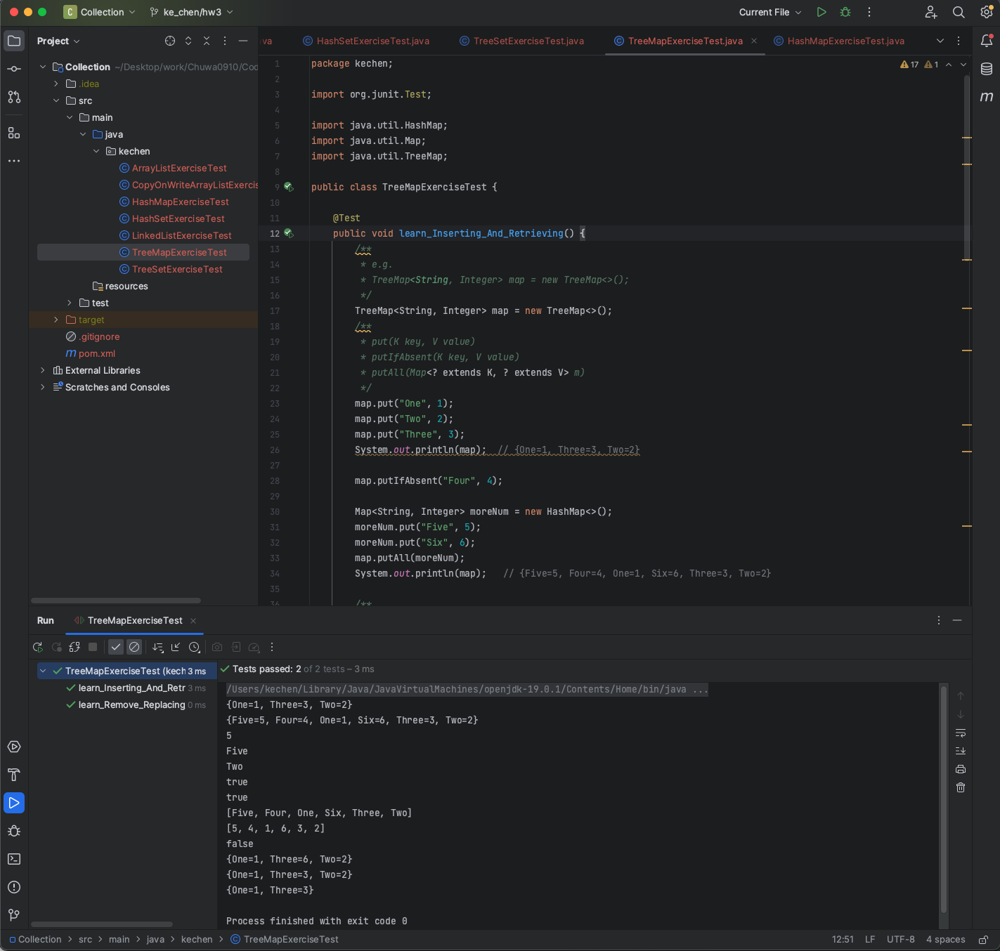

# HW3 - Ke Chen - Exception & Enum & Collection

## Problem : Creadit Card Notification

**find file in coding: hw3-Creadit Card**

We need to send notification to users by notification preference like email/SMS etc,handle error appropriately when preference given does not match.Write simple java program using design patterns , program to interface & Error handling concepts to come up with solve for above problem.

- Notification type: email/SMS/WhatsAPP
- Call notification module to send notification
- Integrate with notification module to notify depending on preference.
    - if A prefer EMAIL, then we notify A by EMAIL
- Pass user details and other data points to send email
    - Notificaiton content :
        - Hey firstName, you have successfully registered to add and here is your , please use this for future references.
- Broadcast public notification to all users
    - 40% off when you buy Popeyes between 06/13 - 06/19

according to the description from the problem: need to use the observer design pattern


## 1. practice colletcion
find file in coding : hw3-Collection

1. ArrayListExercise:

2. LinkedList:

3. CopyOnWriteArrayList:

4. HashSet:

5. TreeSet:

6. HashMap:

7. TreeMap:

8. LinkedHashMap:

9. Additional Map:

10. Arrays:

11. Collections:


## 2. What is the checked exception and unchecked exception in Java, could you give one example.
***Checked Exception***: 

Checked exceptions are the one which <u>are checked at compile-time</u>. 

For example: SQLException, ClassNotFoundException, etc.

***Unchecked Exception***: 

Unchecked exceptions are the one which <u>are handled at runtime because they can not be checked at compile-time</u>. 

For example: ArithmaticException, NullPointerException,ArrayIndexOutOfBoundsException, etc.


## 3. Can there be multiple finally blocks?
No. Only one allowed.


## 4. When both catch and finally return values, what will be the final result?
The value returned by the finally block takes precedence. 

The value returned by the catch block is effectively discarded.

返回值为finally block里的值，catch block里面的返回值被覆盖


## 5. What is Runtime/unchecked exception? what is Compile/Checked Exception?
***Checked Exception = Compile Exception***: 

Checked exceptions are the one which <u>are checked at compile-time</u>. 

For example: SQLException, ClassNotFoundException, etc.

***Unchecked Exception = Runtime Exception***: 

Unchecked exceptions are the one which <u>are handled at runtime because they can not be checked at compile-time</u>. 

For example: ArithmaticException, NullPointerException,ArrayIndexOutOfBoundsException, etc.


## 6. What is the difference between throw and throws?
1. basic
    - the throw keyword is used to <u>throw an exception</u> explicitly.
    - the throws keyword is used to <u>declare an exception</u>.
2. follow
    - the throw keyword <u>is followed by **an instance** and is used within the method</u>.
    - the throws keyword <u>is followed by **class** and is used with the method signature</u>.
3. multiple exceptions
    - <u>cannot</u> throw multiple exceptions
    - <u>can</u> declare multiple exceptions
4. checked exceptions
    - the throw keyword cannot propagate checked exception only
    - the throws keyword can propagate checked exception


## 7. Run the below three pieces codes, Noticed the printed exceptions. why do we put the Null/Runtime exception before Exception ?
**Run the below three pieces codes, Noticed the printed exceptions:**

For: b / a, it attempts to perform a division by zero, which throws an ArithmeticException. So the program execution will immediately jump to the catch (ArithmeticException e) block.


For s = null, it invokes the equals method on a null reference, leading to a NullPointerException. So the program execution will jump to the catch (NullPointerException e) block.


For throw new RuntimeException(), it manually throws a RuntimeException. So the program execution will jump to the catch (RuntimeException e) block.


**Why do we put the Null/Runtime exception before Exception?**

Because the catch blocks should be ordered from the most specific (i.e., subclasses) exceptions to the most general (i.e., superclasses) exceptions.

In the code, ArithmeticException and NullPointerException are both more specific exceptions than RuntimeException and Exception. They are subclasses of RuntimeException, which is a subclass of Exception.


## 8. What is optional? why do you use it? write an optional example.

**What is optional:**

It is a public final class which is used to <u>deal with NullPointerException</u> in Java application. 

**why do you use it:**

It is designed to <u>avoid Null checks and run time NullPointerExceptions.</u>

It is designed to <u>help handle situations where a value might be absent or present, without the need for explicit null checks</u>.

We must import java.util package to use this class. It provides methods to check the presence of value for particular variable.

**Optional Methods 笔记:**
1. create optional object:
    - `Optional.empty()`  
        - 创建一个空的Optional对象，表示没有值。这种方法用于需要表示缺少值的场景。
    - `Optional.of(T value)`  
        - 根据一个非空值创建一个Optional对象。如果传入的值为null，这个方法会抛出NullPointerException
    - `Optional.ofNullable(T value)`  
        - 根据一个值（可以为null）创建一个Optional对象。如果传入的值为null，它会创建一个空的Optional对象。这种方法适用于值可能为null的场景.
2. Get Element From Optional:
    - `get()`    
        - 如果Optional对象包含一个值，该方法会返回这个值；如果Optional对象是空的（不包含值），则抛出一个NoSuchElementException异常
    - `orElse(T other)`   
        - 如果Optional对象包含一个值，该方法返回这个值；如果Optional对象是空的，返回指定的默认值.
    - `orElseGet(Supplier<? extends T> other)`    
        - 如果Optional对象包含一个值，该方法返回这个值；如果Optional对象是空的，使用指定的Supplier函数生成并返回一个默认值.
    - `orElseThrow()`  
        - 如果Optional对象包含一个值，该方法返回这个值；如果Optional对象是空的，抛出一个NoSuchElementException异常。这个方法在Java 10中引入，与get()方法的功能相同，但命名更符合实际行为。
3. Optional Other methods:
    - `isPresent()`     
        - 该方法用于检查Optional对象是否包含值。如果包含值，返回true；如果Optional对象为空（不包含值），返回false
    - `ifPresent(Consumer<? super T> action)`     
        - 该方法用于在Optional对象包含值时执行指定的操作。如果Optional对象包含值，将该值传递给作为参数的Consumer函数；如果Optional对象为空（不包含值），不执行任何操作。


```java
import java.util.Optional;

public class Main {
    public static void main(String[] args) {
        // Creating an Optional with a non-null value
        Optional<String> optionalString = Optional.of("Hello, World!");

        // Checking if a value is present
        if (optionalString.isPresent()) {
            String value = optionalString.get();
            System.out.println("Value is present: " + value);
        } else {
            System.out.println("Value is absent.");
        }

        // Creating an Optional with a null value
        Optional<String> emptyOptional = Optional.ofNullable(null);

        // Checking if a value is present using isPresent()
        if (emptyOptional.isPresent()) {
            String value = emptyOptional.get(); // This won't be executed because the Optional is empty
            System.out.println("Value is present: " + value);
        } else {
            System.out.println("Value is absent.");
        }

        // Using orElse() to provide a default value if the Optional is empty
        String result = emptyOptional.orElse("Default Value");
        System.out.println("Result: " + result); // This will print "Result: Default Value"
    }
}
```

```java
public class OptionalDemo {
    public static void main(String[] args) {
        Map<Integer, User> userMap = new HashMap<>();
        userMap.put(1, new User("Alice", new Address("Main Street")));
        userMap.put(2, new User("Bob", null));

        // Without Optional
        String streetName = "Unknown";
        User user = userMap.get(2);
        if (user != null) {
            Address address = user.getAddress();
            if (address != null) {
                streetName = address.getStreet();
            }
        }
        System.out.println("Street name without Optional: " + streetName);

        // With Optional
        streetName = Optional.ofNullable(userMap.get(2))
                .map(User::getAddress)
                .map(Address::getStreet)
                .orElse("Unknown");
        System.out.println("Street name with Optional: " + streetName);
    }
}
```


## 9. Why finally always be executed ?
The finally block <u>is mainly used to place the cleanup code such as closing a file or closing a connection</u>. 

1. **Resource Cleanup**: 

    The primary use of finally is to provide a place for resource cleanup, such as closing files, database connections, or network sockets. Regardless of whether an exception occurs in the try block or not, you want to make sure that these resources are properly released.

2. **Guaranteed Execution**: 

    By executing the finally block, Java guarantees that any code placed there will be executed, even if an exception is thrown and caught higher up the call stack. This ensures that your program can gracefully handle exceptional situations and perform necessary cleanup.

3. **Predictable Behavior**: 

    Having the finally block always execute makes the behavior of exception handling more predictable and reliable. It ensures that you have a consistent mechanism for cleanup, and it eliminates the need for special cases or workarounds to ensure resource cleanup.


## 10. What is Java 8 new features ?
https://www.yuque.com/fairy-era/yg511q/me04bd#bf895a74

https://juejin.cn/post/6962035387787116551

https://www.cnblogs.com/wmyskxz/p/13527583.html

optinal：https://medium.com/swlh/how-to-write-better-code-with-java-8s-optional-b6d862f28862

### 1. Default method and static method in interface

default methods:
Java provides a facility to create default methods inside the interface. 

Methods which are defined inside the interface and tagged with default keyword are known as default methods. 

These methods are non-abstract methods and can have method body.


### 2. Lambda & Functional Interface -- 重点
1. Lambda expressions:
    - <u>To replace anonymous inner class</u>, 以前用匿名实现类表示的现在都可以用 Lambda 表达式来写。
    - <u>Work with functional interface.</u>
    - <u>Lambda 表达式的本质：an instances of functional interfaces</u> 作为函数式接口的实例 
    - Lambda表达式: https://juejin.cn/post/6962035387787116551#heading-0

    Lambda expression helps us to write our code in functional style.

2. Functional interfaces:
    - <u>Has only one abstract method</u>  只包含一个抽象方法的接口，称为函数式接口
    - <u>@FunctionalInterface - for sanity check</u>     在一个接口上使用 @FunctionalInterface 注解，这样做可以检查它是否是一个函数式接口。
    - <u>Lambda is the implementation of the abstract method.</u>  可以通过 Lambda 表达式来创建该接口的对象。
    - Functional interfaces are also known as Single Abstract Method Interfaces (SAM Interfaces).
    - Can have a lot of default methods
    - It can also declare methods of object class.
    - 函数式接口: https://juejin.cn/post/6962035387787116551#heading-0
    
    之前学过的SAM接口中，标记了  @FunctionalInterface 注解的接口有：Runnable、Comparator、FileFilters
    
    作用：
    Functional interfaces <u>can be used as method parameter types and return value types</u>. And parameters and return values can use Lambda expressions to simplify the code. 
    可以使用函数式接口作为方法的参数类型和返回值类型使用


### 3. Method references
- Java 8 Method reference is <u>used to refer method of functional interface</u>.  方法引用是用来 直接访问 类或者实例的 已经存在的 方法或者构造方法。
- 当要传递给 Lambda 体的操作，已经实现的方法了，可以使用方法引用
- 类(或对象) :: 方法名
- 我们需要把握的重点是：函数引用只是简化Lambda表达式的一种手段而已(方法引用就是 Lambda 表达式)。
- 方法的引用 + 构造器和数组的引用：https://juejin.cn/post/6962035387787116551#heading-0


方法的引用 语法：
1. 实例对象::对象的实例方法（非静态方法）
2. 类::静态方法
3. 类::实例方法（非静态方法）

构造器和数组的引用 语法：
1. 构造器引用 类::new
2. 数组引用 数组类型 []::new


### 4. Optional class -- 重点
It is a public final class which is used to <u>deal with NullPointerException</u> in Java application. 

It is designed to <u>avoid Null checks and run time NullPointerExceptions.</u>

It is designed to <u>help handle situations where a value might be absent or present, without the need for explicit null checks</u>.

更优雅、更安全的方式处理可能为null的值。使用Optional对象，我们可以避免NullPointerException，并使代码更简洁、易读 

**Optional Methods:** 创建optional类对象的方法
1. create optional object:
    - `Optional.empty()`  
        - 创建一个空的Optional对象，表示没有值。这种方法用于需要表示缺少值的场景。
    - `Optional.of(T value)`  
        - 根据一个非空值创建一个Optional对象。如果传入的值为null，这个方法会抛出NullPointerException
    - `Optional.ofNullable(T value)`  
        - 根据一个值（可以为null）创建一个Optional对象。如果传入的值为null，它会创建一个空的Optional对象。这种方法适用于值可能为null的场景.
2. Get Element From Optional: 获取 Optional 容器的对象
    - `get()`    
        - 如果Optional对象包含一个值，该方法会返回这个值；如果Optional对象是空的（不包含值），则抛出一个NoSuchElementException异常
    - `orElse(T other)`   
        - 如果Optional对象包含一个值，该方法返回这个值；如果Optional对象是空的，返回指定的默认值.
    - `orElseGet(Supplier<? extends T> other)`    
        - 如果Optional对象包含一个值，该方法返回这个值；如果Optional对象是空的，使用指定的Supplier函数生成并返回一个默认值.
    - `orElseThrow()`  
        - 如果Optional对象包含一个值，该方法返回这个值；如果Optional对象是空的，抛出一个NoSuchElementException异常。这个方法在Java 10中引入，与get()方法的功能相同，但命名更符合实际行为。
3. Optional Other methods: 判断Optional容器是否包含对象
    - `isPresent()`     
        - 该方法用于检查Optional对象是否包含值。如果包含值，返回true；如果Optional对象为空（不包含值），返回false
    - `ifPresent(Consumer<? super T> action)`     
        - 该方法用于在Optional对象包含值时执行指定的操作。如果Optional对象包含值，将该值传递给作为参数的Consumer函数；如果Optional对象为空（不包含值），不执行任何操作。
4. 搭配使用
    - of() 和 get() 方法搭配使用，明确对象非空
    - ofNullable() 和 orElse() 搭配使用，不确定对象非空


### 5. Stream API  -- 重点
Java 8 java.util.stream package consists of classes, interfaces and an enum to allow functional-style operations on the elements. 
It performs lazy computation(惰性求值). So, it executes only when it requires.
- 一旦执行终止操作，就执行中间操作链，并产生结果。之后，不会再被使用（先结束，在执行中间操作）
- SteamAPI: https://juejin.cn/post/6962035387787116551#heading-0    

**Stream的使用主要由三部分构成：**
1.  Start（开始）: 构建stream 对象
2.  Intermediate operation（中间操作）: process数据，比如filter筛选，map转换数据
3.  Terminate operation（终止操作）：对数据搜集。 一旦有终止操作，该stream pipeline会终止。

**Create stream object：**  创建stream对象
1. 通过集合（Collection）创建Stream
    - 几乎所有的集合类（如List和Set）都可以通过调用stream()方法创建一个Stream对象。这是创建Stream的最常见方式。
    ```java
    List<String> list = Arrays.asList("apple", "banana", "cherry");
    Stream<String> stream = list.stream();
    ```
    - Java 8的 Collection 接口被扩展，提供了两个获取流的方法：
        - default Stream\<E> stream() : 返回一个顺序流
        - default Stream\<E> parallelStream() : 返回一个并行流
2. 使用Stream.of()方法
    - 使用Stream.of()方法可以直接从多个元素创建一个Stream对象
    ```java
    Stream<String> stream = Stream.of("apple", "banana", "cherry");
    ```
    - 可以调用Stream类静态方法of()，通过显示值创建一个流。可以用于接收任意数量的参数
        - public static \<T>Stream\<T> of(T...values):返回一个流
3. 使用数组Arrays.stream()方法创建Stream
    - 通过使用Arrays.stream()方法，可以从数组创建一个Stream对象
    ```java
    String[] array = {"apple", "banana", "cherry"};
    Stream<String> stream = Arrays.stream(array);
    ```
    - Java 8中的 Arrays 的静态方法 stream() 可以获取数组流
        - 调用 Arrays 类的 static\<T> Stream\<T> stream(T[] array): 返回一个流重载形式，能够处理对应基本类型的数组：
            - public static IntStream stream（int[] array）
            - public static LongStream stream（long[] array）
            - public static DoubleStream stream（double[] array）
4. 使用Stream.iterate()方法
    - Stream.iterate()方法允许创建一个无限的、有规律的序列。通常与limit()方法一起使用，以限制生成的元素数量。
    ```java
    Stream<Integer> stream = Stream.iterate(0, n -> n + 2).limit(5); // Generates 0, 2, 4, 6, 8
    ```
5. 使用Stream.generate()方法
    - Stream.generate()方法允许创建一个无限的、无规律的序列。通常与limit()方法一起使用，以限制生成的元素数量
    ```java
    Stream<Double> stream = Stream.generate(Math::random).limit(5);
    ```

**Intermediate operation:** 中间操作
- 多个中间操作可以连接起来形成一个流水线，除非流水线上触发终止操作，否则中间操作不会执行任何的处理！而在终止操作时一次性全部处理，称为<u>惰性求值 Lazy Evaluations</u>

1. 筛选与切片


2. 映射


3. 排序


**Terminate operation:** 终止操作
- 终端操作会从流的流水线生成结果。其结果可以是任何不是流的值，例如：List、 Integer，甚至是 void
- 流进行了终止操作后，不能再次使用

1. 匹配与查找


2. 归约


3. 收集


## 11. What are the types of design patterns in Java ?
Design patterns are recurring solutions to common problems in software design.

设计模式是在面向对象软件设计中经常出现的特定解决方案的描述或模板。

1. **Creational Patterns**: 创建型模式
   - 用于描述“怎样创建对象”，它的主要特点是“将对象的创建与使用分离”。
   - 可以降低系统的耦合度，使用者不需要关注对象的创建细节

   - `Singleton Pattern` 单例: 
        - Ensures a class has only one instance and provides a global point of access to it.
        - 一个单一的类，该类负责创建自己的对象，同时确保只有单个对象被创建。这个类提供了一种访问其唯一的对象的方式，可以直接访问，不需要实例化该类的对象。
        - 单例设计分2种模式：eager(类加载就会导致该单实例对象被创建) + lazy(类加载不会导致该单实例对象被创建，而是首次使用该对象时才会创建)
   - `Factory Pattern` 工厂方法: 
        - Defines an interface for creating an object but allows subclasses to alter the type of objects that will be created.
   - **Abstract Factory Pattern** 抽象工厂: Provides an interface for creating families of related or dependent objects without specifying their concrete classes.
   - `Builder Pattern` 建造者: 
        - Separates the construction of a complex object from its representation, allowing the same construction process to create different representations.
   - **Prototype Pattern** 原型: 
        - Creates new objects by copying an existing object, known as the prototype.

2. **Structural Patterns**: 结构型模式
   - 用于描述如何将类或对象按某种布局组成更大的结构，GoF（四人组）书中提供了代理、适配器、桥接、装饰、外观、享元、组合等 7 种结构型模式。
   - **Adapter Pattern**: Allows the interface of an existing class to be used as another interface.
   - **Bridge Pattern**: Separates an object’s abstraction from its implementation, so they can vary independently.
   - **Composite Pattern**: Composes objects into tree structures to represent part-whole hierarchies.
   - **Decorator Pattern**: Attaches additional responsibilities to an object dynamically.
   - **Facade Pattern**: Provides a simplified interface to a set of interfaces in a subsystem.
   - **Flyweight Pattern**: Uses sharing to support a large number of objects efficiently.

3. **Behavioral Patterns**: 行为型模式
   - 用于描述类或对象之间怎样相互协作共同完成单个对象无法单独完成的任务，以及怎样分配职责。GoF（四人组）书中提供了模板方法、策略、命令、职责链、状态、观察者、中介者、迭代器、访问者、备忘录、解释器等 11 种行为型模式。
   - `Observer Pattern`: 
        - Defines a one-to-many dependency between objects, so that when one object changes state, all its dependents are notified and updated automatically.
   - **Strategy Pattern**: Defines a family of algorithms, encapsulates each one, and makes them interchangeable.
   - **Command Pattern**: Encapsulates a request as an object, thereby allowing for parameterization of clients with queuing, requests, and operations.
   - **State Pattern**: Allows an object to alter its behavior when its internal state changes. The object will appear to change its class.
   - **Chain of Responsibility Pattern**: Passes the request along a chain of handlers, each of which decides either to process the request or to pass it to the next handler in the chain.
   - **Visitor Pattern**: Represents an operation to be performed on the elements of an object structure. It lets you define a new operation without changing the classes of the elements on which it operates.
   - **Template Method Pattern**: Defines the skeleton of an algorithm in the superclass but lets subclasses override specific steps of the algorithm without changing its structure.
   - **Interpreter Pattern**: Provides a way to evaluate language grammar or expressions.

4. **Concurrency Patterns**:
   - **Producer-Consumer Pattern**: Coordinates the actions of producer and consumer threads.
   - **Reader-Writer Pattern**: Separates read and write access to a resource.
   - **Mutex Pattern**: Manages exclusive access to a resource to prevent race conditions.
   - **Thread-Local Storage Pattern**: Provides each thread with its own storage for data, avoiding data conflicts between threads.


## 12. What are the SOLID Principles ?
The SOLID principles are a set of five design principles that aim to help software developers create more maintainable, flexible, and understandable code. 

The SOLID acronym stands for:

**Single Responsibility Principle (SRP):**

A class should have only one reason to change, meaning it should have only one responsibility.

In Java, this principle suggests that <u>a class should have only one primary purpose</u>, and if you find that a class is doing multiple unrelated things, consider splitting it into smaller, more focused classes.

**Open/Closed Principle (OCP):**

Software entities (classes, modules, functions, etc.) should be open for extension but closed for modification.

In Java, you should design <u>your classes and modules in a way that allows you to add new functionality through extension (e.g., subclassing or implementing interfaces) without modifying the existing code</u>.

**Liskov Substitution Principle (LSP):**

Subtypes must be substitutable for their base types without altering the correctness of the program.

In Java, this means that <u>derived classes (subtypes) should be able to replace their base classes (superclasses) without causing unexpected behavior</u>.

**Interface Segregation Principle (ISP):**

Clients should not be forced to depend on interfaces they do not use.

In Java, this principle suggests that you should define small, focused interfaces rather than large, monolithic ones. Clients should only implement the methods they need.

**Dependency Inversion Principle (DIP):**

High-level modules should not depend on low-level modules. Both should depend on abstractions.

Abstractions should not depend on details. Details should depend on abstractions.

In Java, this principle <u>encourages the use of interfaces and abstract classes to define abstractions that high-level modules depend on</u>, allowing for flexibility and ease of testing.


## 13. How can you achieve thread-safe singleton patterns 单例模式 in Java ?
thread-safe singleton patterns: <u>only one instance of a class is created even in a multithreaded environment.</u>

### Eager Initialization (Thread-Safe):
In this approach, <u>the Singleton instance</u> is created eagerly, which means it's <u>created at the time the class is loaded.</u>类加载就会导致该单实例对象被创建.

It's inherently thread-safe because the JVM guarantees that class loading is a synchronized operation.
```java
// 饿汉式-方式1（静态变量方式）
public class Singleton {

    //私有构造方法（因为私有的话，外界无法访问到构造方法，就无法创建对象）
    private Singleton(){}

    //外界如果访问不到的话，一个对象都创建不了，所以要在该类中创建一个本类的对象，供外界使用
    private static Singleton instance = new Singleton();

    //提供一个公共的访问方式，对外提供静态方法，让外界获取该对象
    public static Singleton getInstance(){
        return instance;
    }
}
```

### Lazy Initialization with Double-Checked Locking (Thread-Safe): 懒汉式 双重检查锁
This approach <u>creates the Singleton instance lazily when it is first requested. It uses double-checked locking to ensure thread safety.</u> 

- 类加载不会导致该单实例对象被创建，而是首次使用该对象时才会创建
- 如果对象足够大的话，而一直没有使用就会造成内存的浪费。

It's efficient because it avoids creating the instance until it's needed.

```java
public class Singleton {
    private Singleton() { }

    /*
    双重检查锁模式是一种非常好的单例实现模式，解决了单例、性能、线程安全问题，上面的双重检测锁模式看上去完美无缺，其实是存在问题，在多线程的情况下，可能会出现空指针问题，出现问题的原因是JVM在实例化对象的时候会进行优化和指令重排序操作。要解决双重检查锁模式带来空指针异常的问题，只需要使用 volatile 关键字, volatile 关键字可以保证可见性和有序性
    */
    private static volatile Singleton instance; // Volatile is important for visibility

    public static Singleton getInstance() {
        if (instance == null) {
            synchronized (Singleton.class) {
                if (instance == null) {
                    instance = new Singleton();
                }
            }
        }
        return instance;
    }
}
```

### Lazy Initialization with static inner class (Thread-Safe): 懒汉式 静态内部类
```java
// 懒汉式-方式4（静态内部类方式）
// 静态内部类单例模式中对象由内部类创建，由于 JVM 在加载外部类的过程中, 是不会加载静态内部类的,只有内部类的属性/方法被调用时
// 才会被加载, 并初始化其静态属性。静态属性由于被static 修饰，保证只被实例化一次，并且严格保证实例化顺序。（因为jvm只加载class一次）

//第一次加载Singleton类时不会去初始化INSTANCE，只有第一次调用getInstance，虚拟机加载SingletonHolder并初始化INSTANCE，这样不仅能确保线程安全，也能保证 Singleton 类的唯一性。

//静态内部类单例模式是一种优秀的单例模式，是开源项目中比较常用的一种单例模式。在没有加任何锁的情况下，保证了多线程下的安全，并且没有任何性能影响和空间的浪费。
public class Singleton {

    private Singleton(){}

    //定义一个静态内部类
    private static class SingletonHolder{
        // 在内部类中声明并且初始化外部类的对象
        private static final Singleton INSTANCE = new Singleton(); //因为有final就是一个常量，所以大写
    }

    // 提供公共的访问方式
    public static Singleton getInstance(){
        return SingletonHolder.INSTANCE;
    }
}
```


## 14. What do you understand by the Open-Closed Principle (OCP) ?

Open/Closed Principle (OCP):

Software entities (classes, modules, functions, etc.) should be open for extension but closed for modification.

In Java, you should design <u>your classes and modules in a way that allows you to add new functionality through extension (e.g., subclassing or implementing interfaces) without modifying the existing code</u>.

开闭原则：对于扩展是开放的，但是对于修改是封闭的

## 15. Liskov’s substitution principle（里氏代换原则） states that if class B is a subtype of class A, then object of type A may be substituted with any object of type B. What does this actually mean? (from OA ) choose your answer.
```
1. It mean that if the object of type A can do something, the object of type B could also be able 
to perform the same thing
2. It means that all the objects of type A could execute all the methods present in its subtype B
3. It means if a method is present in class A, it should also be present in class B so that the 
object of type B could substitute object of type A.
4. It means that for the class B to inherit class A, objects of type B and objects of type A must 
be same.
```

The correct answer is: 3.

Liskov's Substitution Principle (LSP) states that if class B is a subtype of class A, then objects of type A should be replaceable with objects of type B without affecting the correctness of the program.  两者之间是继承关系，但是不要重写父类的方法。

This implies that class B should adhere to the contract established by class A, including having compatible methods and behaviors. Therefore, option 3 accurately describes the essence of the Liskov Substitution Principle.

**笔记：**

里氏代换原则：任何基类可以出现的地方，子类一定可以出现。

通俗理解：子类可以扩展父类的功能，但不能改变父类原有的功能。换句话说，子类继承父类时，除添加新的方法完成新增功能外，尽量不要重写父类的方法。

如果通过重写父类的方法来完成新的功能，这样写起来虽然简单，但是整个继承体系的可复用性会比较差，特别是运用多态比较频繁时，程序运行出错的概率会非常大。

下面看一个里氏替换原则中经典的一个例子：
- 【例】正方形不是长方形。
- 在数学领域里，正方形毫无疑问是长方形，它是一个长宽相等的长方形。所以，我们开发的一个与几何图形相关的软件系统，就可以顺理成章的让正方形继承自长方形。


## 16. Watch the design pattern video, and type the code, submit it to MavenProject folder

**find in file hw3-MavenProject: pattern**

开闭原则：对于扩展是开放的，但是对于修改是封闭的

**singleton 单例设计模式:** 

https://www.bilibili.com/video/BV1Np4y1z7BU?p=22(Java设计模式详解， 23种Java设计模式（图解+框架源码分析+实战）)
- find in file MavenProject: pattern.singleton
- 一个单一的类，该类负责创建自己的对象，同时确保只有单个对象被创建。这个类提供了一种访问其唯一的对象的方式，可以直接访问，不需要实例化该类的对象。
- 单例设计分2种模式：eager(类加载就会导致该单实例对象被创建) + lazy(类加载不会导致该单实例对象被创建，而是首次使用该对象时才会创建)
    - `eager initialization - 方式1（静态变量方式）`
        - 该方式在成员位置声明Singleton类型的静态变量，并创建Singleton类的对象instance。instance对象是随着类的加载而创建的。如果该对象足够大的话，而一直没有使用就会造成内存的浪费。
    - `eager initialization - 方式2（静态代码块方式）`
        - 该方式在成员位置声明Singleton类型的静态变量，而对象的创建是在静态代码块中，也是对着类的加载而创建。所以和饿汉式的方式1基本上一样，当然该方式也存在内存浪费问题。
    - `lazy initialization - 方式1（线程不安全）`
        - 该方式在成员位置声明Singleton类型的静态变量，并没有进行对象的赋值操作，那么什么时候赋值的呢？当调用getInstance()方法获取Singleton类的对象的时候才创建Singleton类的对象，这样就实现了懒加载的效果。但是，如果是多线程环境，会出现线程安全问题。
    - `lazy initialization - 方式2（线程安全）`
        - 该方式也实现了懒加载效果，同时又解决了线程安全问题。但是在getInstance()方法上添加了synchronized关键字，导致该方法的执行效果特别低。从上面代码我们可以看出，其实就是在初始化instance的时候才会出现线程安全问题，一旦初始化完成就不存在了
    - `lazy initialization - 方式3（双重检查锁模式）`
        - 双重检查锁模式是一种非常好的单例实现模式，解决了单例、性能、线程安全问题，上面的双重检测锁模式看上去完美无缺，其实是存在问题，在多线程的情况下，可能会出现空指针问题，出现问题的原因是JVM在实例化对象的时候会进行优化和指令重排序操作。
        - 要解决双重检查锁模式带来空指针异常的问题，只需要使用 volatile 关键字, volatile 关键字可以保证可见性和有序性。
    - `lazy initialization - 方式4（静态内部类方式）`
        - 第一次加载Singleton类时不会去初始化INSTANCE，只有第一次调用getInstance，虚拟机加载SingletonHolder并初始化INSTANCE，这样不仅能确保线程安全，也能保证 Singleton 类的唯一性。
        - 静态内部类单例模式是一种优秀的单例模式，是开源项目中比较常用的一种单例模式。在没有加任何锁的情况下，保证了多线程下的安全，并且没有任何性能影响和空间的浪费。
    - `恶汉式 - 枚举方式`(不考虑浪费空间的话，首选枚举方式，考虑空间的话，首选静态内部类方式)
        - 枚举类实现单例模式是极力推荐的单例实现模式，因为枚举类型是线程安全的，并且只会装载一次，设计者充分的利用了枚举的这个特性来实现单例模式，枚举的写法非常简单，而且枚举类型是所用单例实现中唯一一种不会被破坏的单例实现模式。

**Factory 工厂模式:** 

https://www.bilibili.com/video/BV1Np4y1z7BU?p=35&vd_source=310561eab1216a27f7accf859bf7f6d9
- find in file MavenProject: pattern.factory
- 我们使用工厂来生产对象，我们就只和工厂打交道就可以了，彻底和对象解耦，如果要更换对象，直接在工厂里更换该对象即可，达到了与对象解耦的目的；所以说，工厂模式最大的优点就是：解耦。
- 三种工厂的使用:
    
    - `简单工厂模式`（不属于GOF的23种经典设计模式）
        - 简单工厂包含如下角色：
            - 抽象产品 ：定义了产品的规范，描述了产品的主要特性和功能。
            - 具体产品 ：实现或者继承抽象产品的子类
            - 具体工厂 ：提供了创建产品的方法，调用者通过该方法来获取产品。
        
    - `工厂方法模式`： 
        - 定义一个用于创建对象的接口，让子类决定实例化哪个产品类对象。工厂方法使一个产品类的实例化延迟到其工厂的子类。
        - 只生产一个等级的产品（咖啡店只生产咖啡）
        - 工厂方法模式的主要角色：
            - 抽象产品（Product）：定义了产品的规范，描述了产品的主要特性和功能。
            - 具体产品（ConcreteProduct）：实现了抽象产品角色所定义的接口，由具体工厂来创建，它同具体工厂之间一一对应。
            - 具体工厂（ConcreteFactory）：主要是实现抽象工厂中的抽象方法，完成具体产品的创建。
            - 新加 抽象工厂（Abstract Factory）：提供了创建产品的接口，调用者通过它访问具体工厂的工厂方法来创建产品。
        
    - `抽象工厂模式`:
        - 上面的工厂只产生同种类的产品，比如说咖啡店只生产咖啡，不卖其他的。
        - 是一种为访问类提供一个创建一组相关或相互依赖对象的接口，且访问类无须指定所要产品的具体类就能得到同族的不同等级的产品的模式结构。
        - 抽象工厂模式是工厂方法模式的升级版本，工厂方法模式只生产一个等级的产品，而抽象工厂模式可生产多个等级的产品。
        - 抽象工厂模式的主要角色如下：
            - 抽象产品（Product）：定义了产品的规范，描述了产品的主要特性和功能，抽象工厂模式有多个抽象产品。
            - 具体产品（ConcreteProduct）：实现了抽象产品角色所定义的接口，由具体工厂来创建，它同具体工厂之间是多对一的关系。
            - 具体工厂（Concrete Factory）：主要是实现抽象工厂中的多个抽象方法，完成具体产品的创建。
            - 新改 抽象工厂（Abstract Factory）：提供了创建产品的接口，它<u>包含多个创建产品的方法，可以创建多个不同等级的产品。</u>
        
    - `简单工厂 + 配置文件解除耦合`:
        - 在工厂类中加载配置文件中的全类名，并创建对象进行存储，客户端如果需要对象，直接进行获取即可。
            - 第一步：定义配置文件
            - 第二步：改进工厂类

**Builder: 建造者模式**

https://www.bilibili.com/video/BV1Np4y1z7BU?p=50&vd_source=310561eab1216a27f7accf859bf7f6d9
- find in file MavenProject: pattern.builder
- 将一个复杂对象的构建与表示分离，使得同样的构建过程可以创建不同的表示。
- 分离了部件的构造(由Builder来负责)和装配(由Director负责)。 从而可以构造出复杂的对象。这个模式适用于：某个对象的构建过程复杂的情况。
- 由于实现了构建和装配的解耦。不同的构建器，相同的装配，也可以做出不同的对象；相同的构建器，不同的装配顺序也可以做出不同的对象。也就是实现了构建算法、装配算法的解耦，实现了更好的复用。
- 建造者模式可以将部件和其组装过程分开，一步一步创建一个复杂的对象。用户只需要指定复杂对象的类型就可以得到该对象，而无须知道其内部的具体构造细节。
- 建造者（Builder）模式包含如下角色：
    - 抽象建造者类（Builder）：这个接口规定要实现复杂对象的那些部分的创建，并不涉及具体的部件对象的创建。
    - 具体建造者类（ConcreteBuilder）：实现 Builder 接口，完成复杂产品的各个部件的具体创建方法。在构造过程完成后，提供产品的实例。
    - 产品类（Product）：要创建的复杂对象。
    - 指挥者类（Director）：调用具体建造者来创建复杂对象的各个部分，在指导者中不涉及具体产品的信息，只负责保证对象各部分完整创建或按某种顺序创建。


**Publisher_Subscriber: 观察者模式(发布-订阅模式)**

 https://www.bilibili.com/video/BV1Np4y1z7BU?p=114&vd_source=310561eab1216a27f7accf859bf7f6d9
- find in file MavenProject: pattern.publish_subscriber
- 又被称为发布-订阅（Publish/Subscribe）模式，它定义了一种一对多的依赖关系，让多个观察者对象同时监听某一个主题对象。这个主题对象在状态变化时，会通知所有的观察者对象，使他们能够自动更新自己。
- 在观察者模式中有如下角色：
    - Subject：抽象主题（抽象被观察者），抽象主题角色把所有观察者对象保存在一个集合里，每个主题都可以有任意数量的观察者，抽象主题提供一个接口，可以增加和删除观察者对象。  （微信公众号）
    - ConcreteSubject：具体主题（具体被观察者），该角色将有关状态存入具体观察者对象，在具体主题的内部状态发生改变时，给所有注册过的观察者发送通知。（微信用户端）
    - Observer：抽象观察者，是观察者的抽象类，它定义了一个更新接口，使得在得到主题更改通知时更新自己。（微信用户）
    - ConcrereObserver：具体观察者，实现抽象观察者定义的更新接口，以便在得到主题更改通知时更新自身的状态。（用微信的每个人）
    
- jdk中提供的实现类
    - java.util.Observable类
        - `void addObserver(Observer o)` 方法：用于将新的观察者对象添加到集合中。
        - `void notifyObservers(Object arg)` 方法：调用集合中的所有观察者对象的 update方法，通知它们数据发生改变。通常越晚加入集合的观察者越先得到通知。
        - `void setChange()` 方法：用来设置一个 boolean 类型的内部标志，注明目标对象发生了变化。当它为true时，notifyObservers() 才会通知观察者
    - java.util.Observer接口
        - Observer 接口是抽象观察者，它监视目标对象的变化，当目标对象发生变化时，观察者得到通知，并调用 update 方法，进行相应的工作。