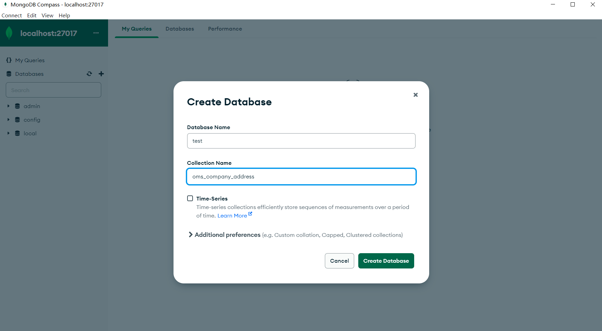
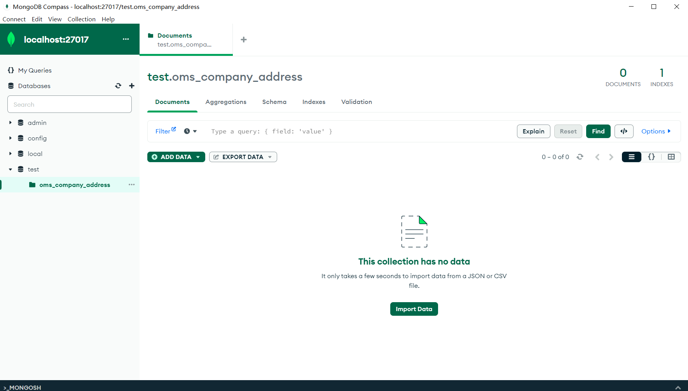
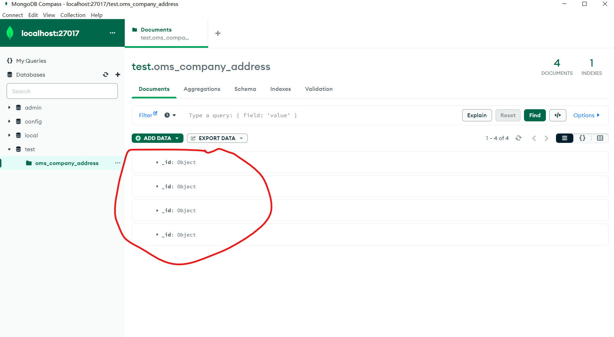
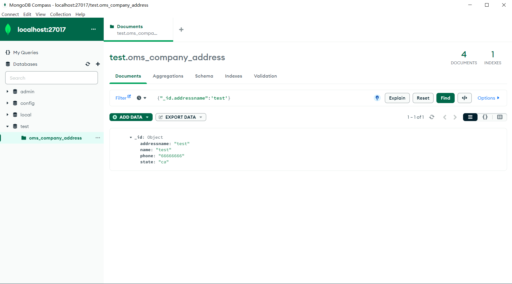
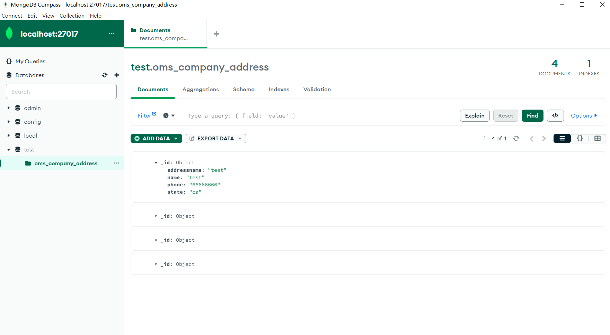
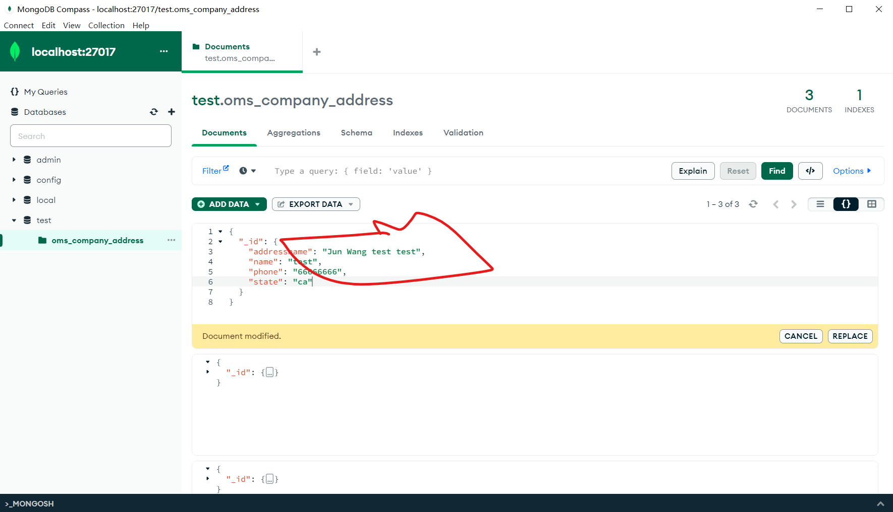
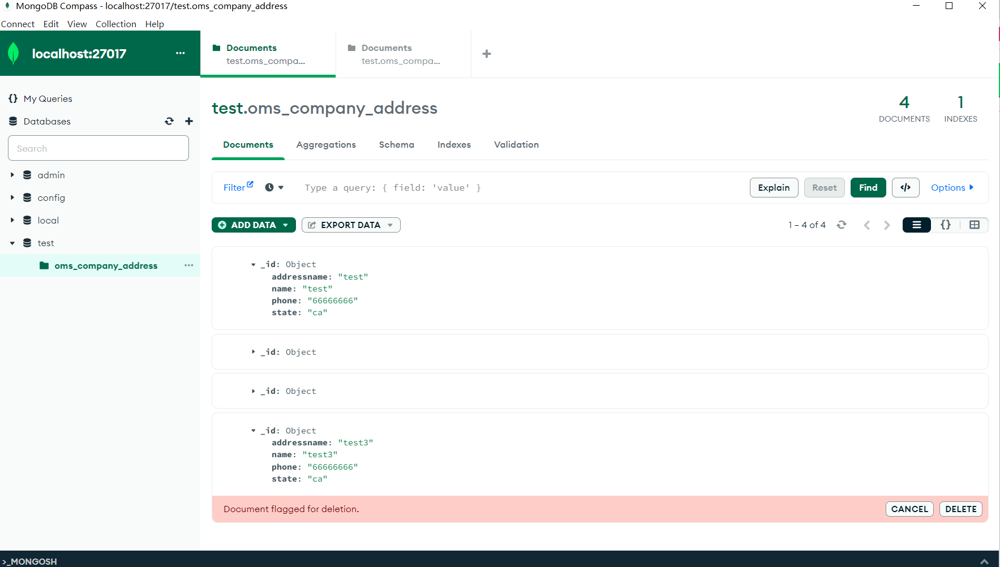
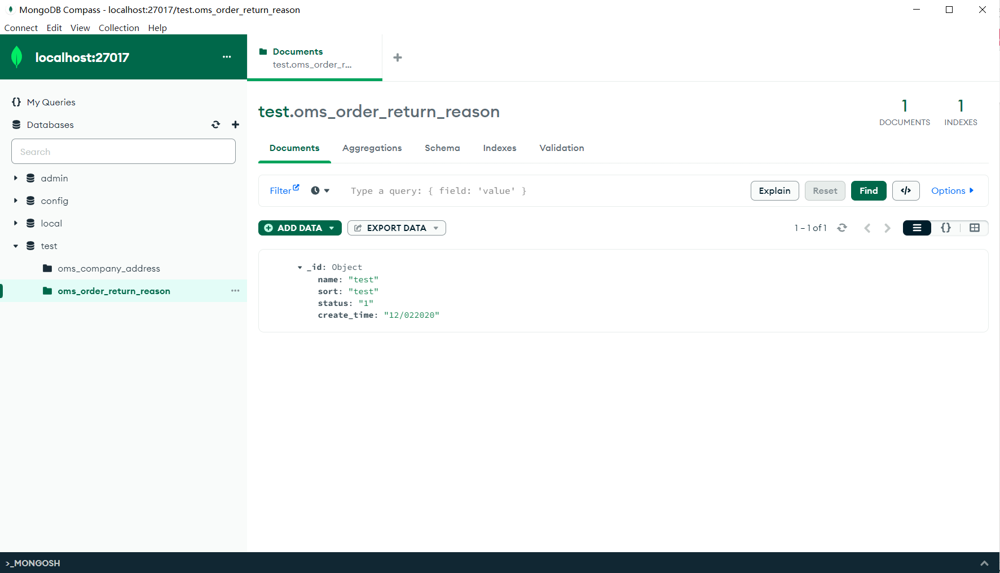

1. Create oms_company_address table<br>
```
CREATE TABLE `chuwa`.`oms_company_address` (
  `id` BIGINT NOT NULL,
  `address_name` VARCHAR(200) NULL,
  `send_status` INT(1) NULL,
  `receive_status` INT(1) NULL,
  `name` VARCHAR(64) NULL,
  `phone` VARCHAR(64) NULL,
  `province` VARCHAR(64) NULL,
  `city` VARCHAR(64) NULL,
  `region` VARCHAR(64) NULL,
  `detail_address` VARCHAR(200) NULL,
  PRIMARY KEY (`id`));
```
2. Insert some random data to oms_company_address table<br>
```
INSERT INTO `chuwa`.`oms_company_address` (`id`, `address_name`, `send_status`, `receive_status`, `name`, `phone`, `province`, `city`, `region`, `detail_address`) VALUES ('1', 'test', '1', '1', 'test', '123123123', 'test', 'test', 'test', 'test');
INSERT INTO `chuwa`.`oms_company_address` (`id`, `address_name`, `send_status`, `receive_status`, `name`, `phone`, `province`, `city`, `region`, `detail_address`) VALUES ('2', 'test2', '2', '2', 'test2', '1231213123', 'test2', 'test', 'test', 'test');
INSERT INTO `chuwa`.`oms_company_address` (`id`, `address_name`, `send_status`, `receive_status`, `name`, `phone`, `province`, `city`, `region`, `detail_address`) VALUES ('3', 'test3', '3', '3', 'test3', '123433434', 'test2', 'test', 'test', 'test');
```
3. Write a SQL query to fetch all data from oms_company_address `table<br>
```
SELECT * FROM chuwa.oms_company_address;
```
4. Write a SQL query to fetch top 3 records from oms_company_address table<br>
```
SELECT * FROM chuwa.oms_company_address order by id limit 3;
```
5. Update oms_company_address table to set all phone to 666-6666-8888<br>
```
UPDATE chuwa.oms_company_address SET phone = "666-6666-8888"
```
6. Delete one entry from oms_company_address table<br>
```
delete from chuwa.oms_company_address where id =4;
```
7. (Optional) You can also try to create other tables that listed above<br>
```
CREATE TABLE `chuwa`.`oms_order_return_reason` (
  `id` BIGINT NOT NULL,
  `name` VARCHAR(100) NULL,
  `sort` INT NULL,
  `status` INT(1) NULL,
  `create_time` DATETIME NULL,
  PRIMARY KEY (`id`));
```

1. Create test DB

<br>


2. Create oms_company_address collection (method: createCollection() )

<br>


3. Insert few random entries to oms_company_address collection (method: insert() )

<br>


4. Read one entry from oms_company_address collection (method: find() )

<br>


5. Read all entries from oms_company_address collection (method: find() )


<br>


6. Update one entry from oms_company_address collection (method: update() or save() )

7. Remove one entry from oms_company_address collection (method: remove() )

<br>
8. (Optional) You can also try to create other tables that listed above
