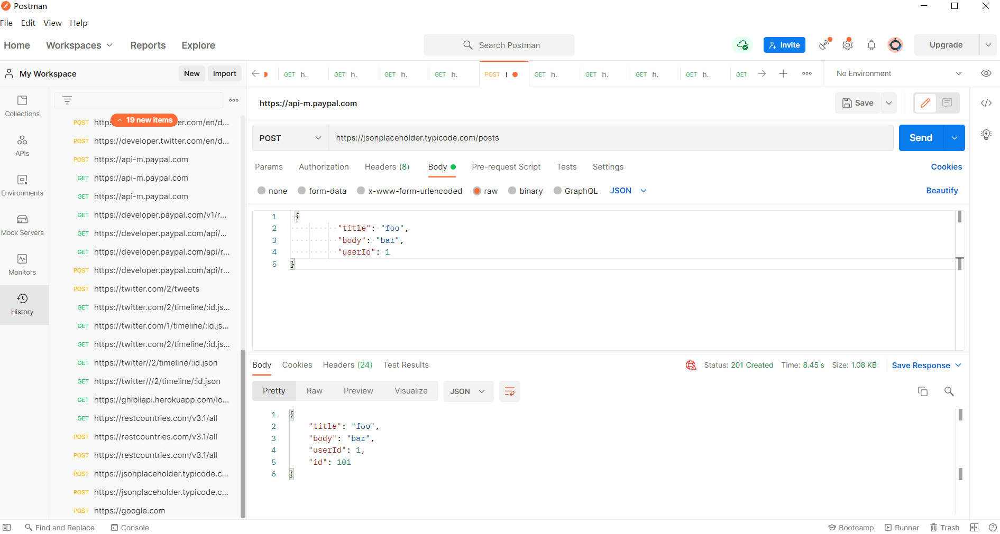
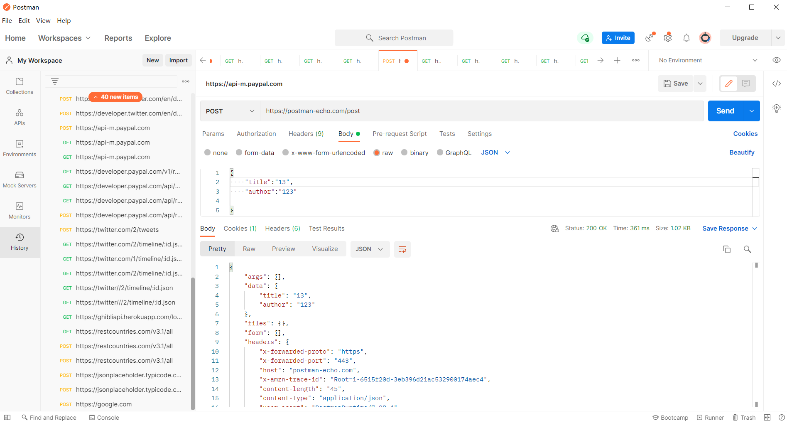
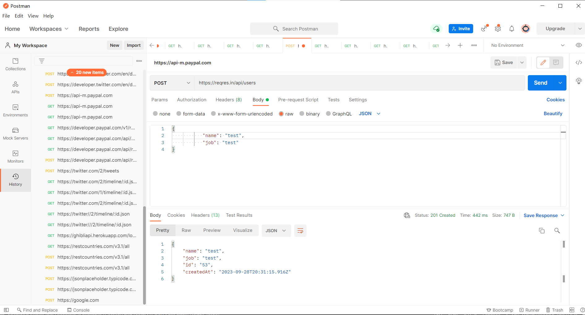
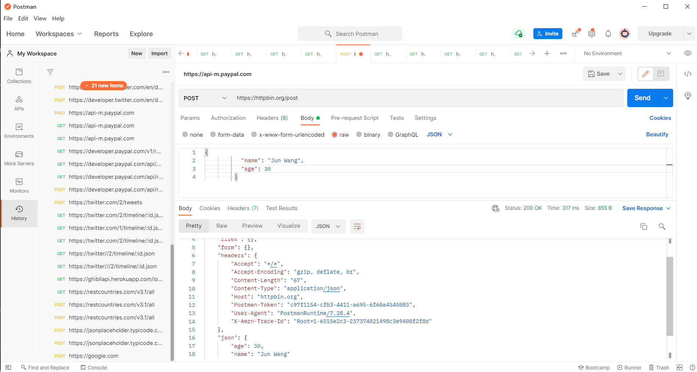
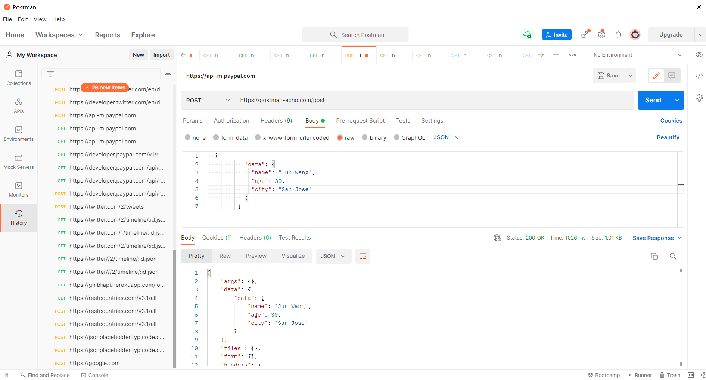
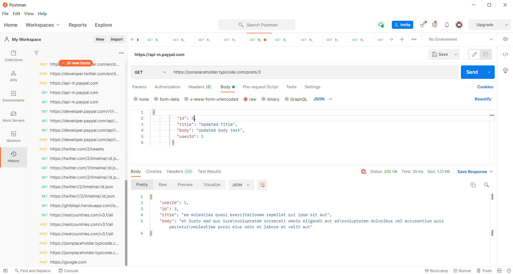
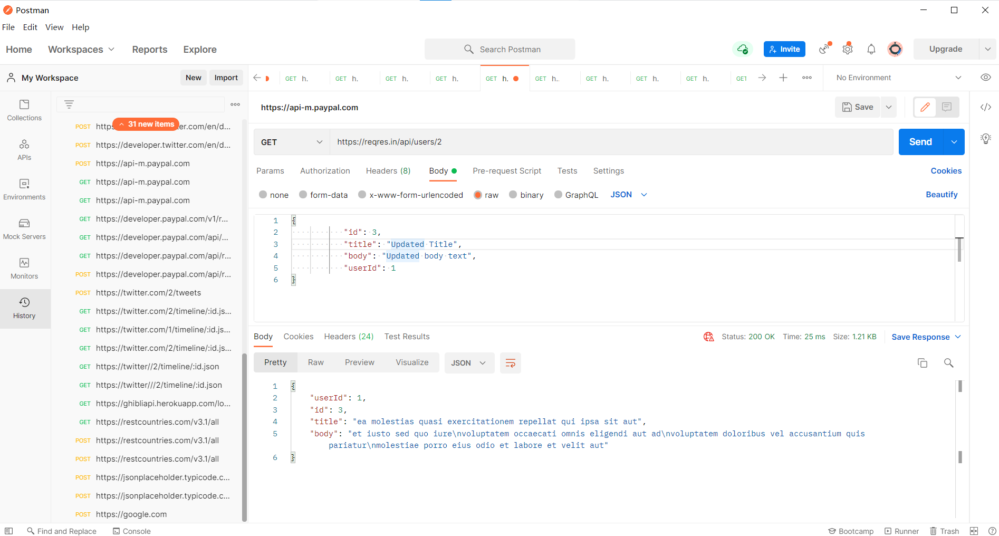
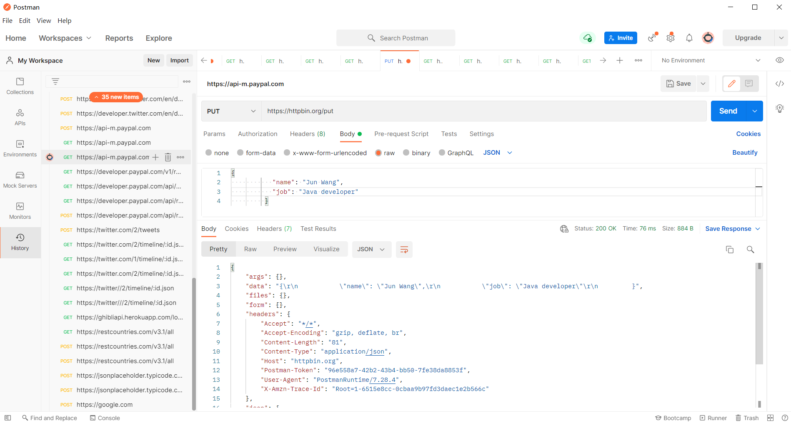
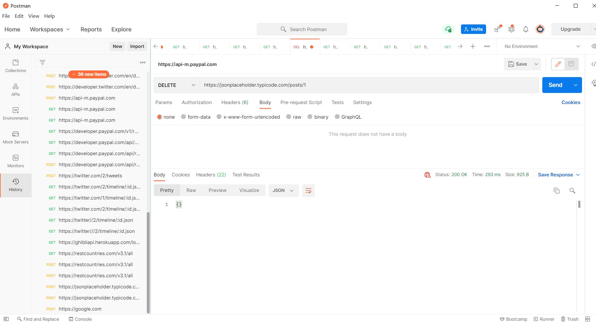
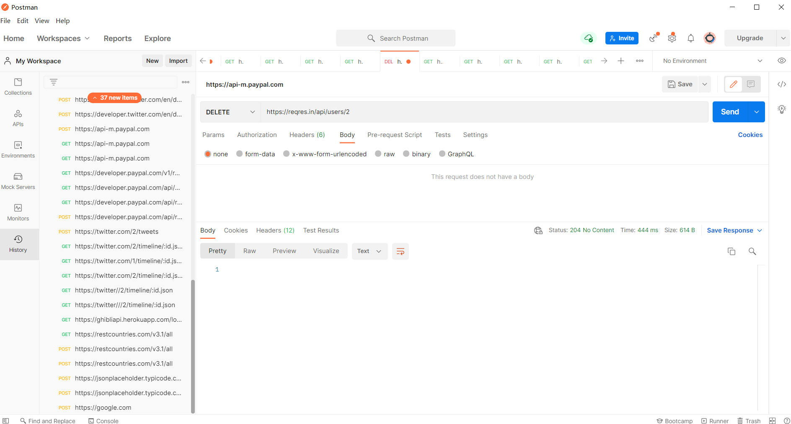

Excecise:
1. 5 GET APIs with different response type
GET https://www.google.com 200 OK
GET https://api.paypal.com/v2/reporting/transactions 401 Unauthorized response
GET https://jsonplaceholder.typicode.com/posts/2/test 404 NOT FOUND
GET https://api-m.paypal.com 403 FORBIDDEN
GET https://ghibliapi.herokuapp.com/locations 503 SERVICE UNAVAILABLE
2. 5 Post API with json request body, please also paste the response here





3. 3 PUT API with json request body, please also paste the response here



4. 2 DELETE API


5. Each example with 404, 401,500 and any http status codes you know<br>
401: <br>
HTTP 401 indicates that the client needs to provide authentication credentials to access the requested resource, and it serves as a challenge to the client to authenticate itself properly.<br>
501 Not Implemented<br>
HTTP 501 is a status code that stands for "Not Implemented" in the context of the Hypertext Transfer Protocol (HTTP). When a web server returns a 501 status code in response to a client's request, it means that the server does not support or has not implemented the functionality required to fulfill the request.<br>
500 Internal Server Error<br>
HTTP 500 is a status code that stands for "Internal Server Error" in the context of the Hypertext Transfer Protocol (HTTP). When a web server returns a 500 status code to a client, it indicates that something has gone wrong on the server's side while trying to process the client's request, and the server is unable to fulfill the request due to an unexpected condition.<br>
404 Not Found<br>
HTTP 404 is a status code that stands for "Not Found" in the context of the Hypertext Transfer Protocol (HTTP). When a web server returns a 404 status code to a client (usually a web browser), it indicates that the requested resource could not be found on the server.<br>
502 Bad Gateway<br>
HTTP 502 is a status code that stands for "Bad Gateway" in the context of the Hypertext Transfer Protocol (HTTP). It is a server error response that indicates that one server on the internet, acting as a gateway or proxy, received an invalid response from another server while attempting to fulfill the client's request.
504 Gateway Timeout<br>
HTTP 504 is a status code that stands for "Gateway Timeout" in the context of the Hypertext Transfer Protocol (HTTP). It is a server error response that indicates that a server acting as a gateway or proxy did not receive a timely response from an upstream server or the origin server while attempting to fulfill the client's request.


API Design
1. Find 2 collection of APIs example. ie. Twitter, Paypal, Youtube etc.<br>
   Paypal: <br>
   https://developer.paypal.com/api/rest/requests/
   
   <br>
   Twitter: <br>
   https://developer.twitter.com/en/docs/twitter-api/getting-started/getting-access-to-the-twitter-api<br>


2. Design a collection of APIs for a Blog Website, please specify GET POST PUT DELETE
   Design APIs for the following features<br>
    GET, `/blog/article/get/{id}`
    POST, `/blog/article/post/{id}/{content}`
    PUT, `/blog/article/{id}/{content}`
    Delete, `/blog/article/delete/{id}`

1. find the customer's payments, like credit card 1, credit card 2, paypal, Apple Pay.<br>
   ```
   GET /customer/{id}/payments/{credit_card_type}
   ```

2. Find the customer's history orders from 10/10/2022 to 10/24/2022<br>
    ```
    GET /customer/{id}/order/history/startDate="10/10/2022"&endDate="10/24/2022"
    ```
3. find the customer's delivery addresses<br>
    ```
    GET /customer/{id}/delivery/addresss 
    ```

4. If I also want to get customer's default payment and default delievery address, what kind of the API (URL) should be?<br>
    ```
    {
        "_id": {
        "default_payment": "Mastercard",
        "default_delivery": "test"
        }
    }   
    ```