# HW4 - Ke Chen - java8


## 1. What is generic in Java?  and type the generic code by yourself
- a. https://github.com/TAIsRich/chuwa-eij-tutorial/tree/main/02-java-core/src/main/java/com/chuwa/tutorial/t01_basic/generic
- find code in coding file: hw4-generic

Generics <u>allow to create classes, interfaces, and methods that operate on specified types without having to commit to a specific data type until the code is actually used.</u> This makes your code more flexible and type-safe. 

**注意generic在class和method上的写法**
- class GenericClass<T>
- public static <T1, T2, T3> void temp(T1 x, T2 y, T3 z)
- public static <T extends  Comparable\<T\>\> T maximum(T x, T y, T z)

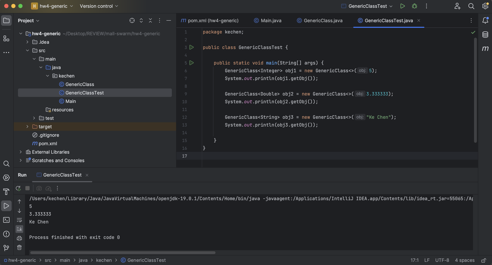

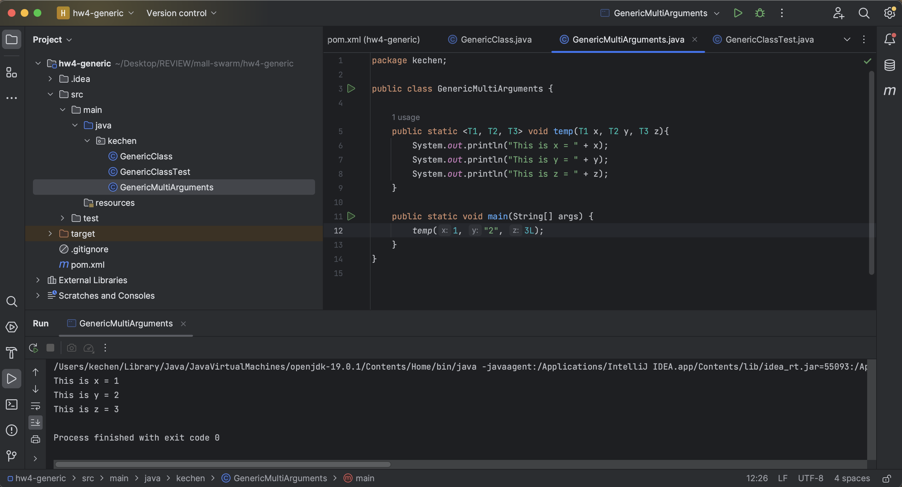

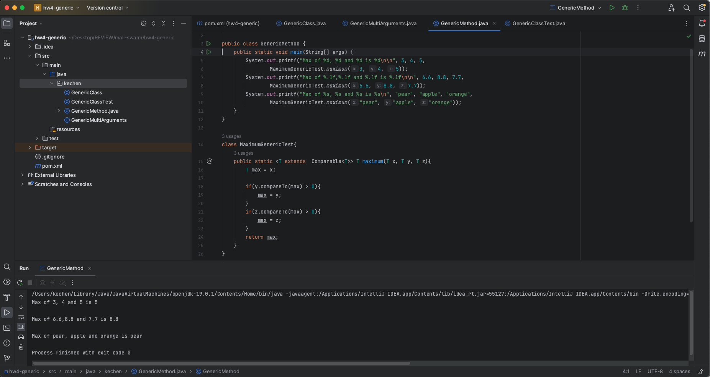

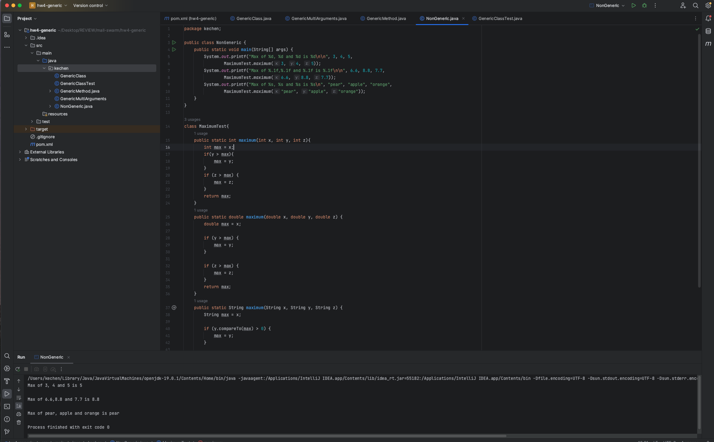


## 2. Read those codes and type it one by one by yourself. then push the code to your branch
- https://github.com/TAIsRich/chuwa-eij-tutorial/tree/main/02-java-core/src/main/java/com/chuwa/tutorial/t06_java8
- find code in coding file: hw4-java8

### default method:
- default methods are declared using the default keyword before the method signature.
- They provide a default implementation for a method within the interface.
- Classes that implement the interface can choose/not choose to override the default method or use the provided implementation.（default方法不override也不会报错，但是如果不override不是default的方法，就会报错）
- Default methods allow you to add new methods to existing interfaces without breaking backward compatibility with classes that have already implemented the interface.


### lambda
- In Java, the term `effectively final` refers to a local variable that is not explicitly declared as final, but it is used within an anonymous class or lambda expression. An effectively final variable is one that, although not declared with the final keyword, is treated as if it were final because it is not re-assigned after its initial assignment within the scope in which it is used.
- 当variable只赋值一次，没有任何变动的时候，Java默认是final。其在lambda expression的前后（前后都不行）都不能被改变（换object会报错，因为换了内存地址）
- 否则会报错：java: local variables referenced from a lambda expression must be final or effectively final
- Lambda表达式: https://juejin.cn/post/6962035387787116551#heading-0

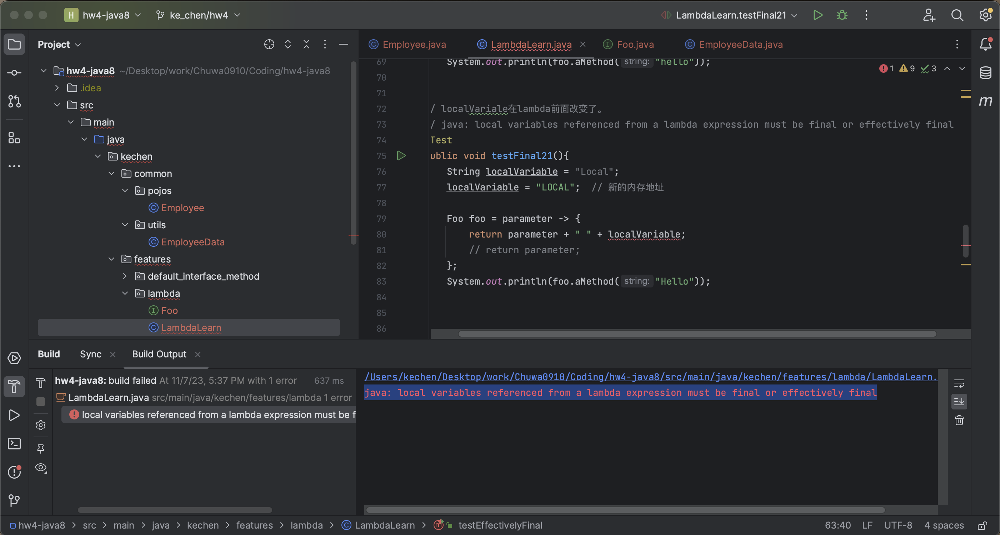

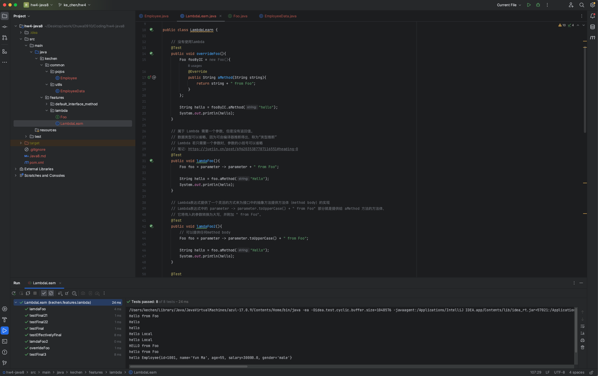

### method reference
- 方法的引用 + 构造器和数组的引用：https://juejin.cn/post/6962035387787116551#heading-0


### optional
- `Optional.ofNullable(T value)`  
    - 根据一个值（可以为null）创建一个Optional对象。如果传入的值为null，它会创建一个空的Optional对象。这种方法适用于值可能为null的场景.
- `map方法`
    - 接受一个函数，该函数将被应用于 Optional 包装的值，然后返回一个新的 Optional 包装的结果（将原始 Optional 中的值映射为新的值）。
- `orElse(T other)`
    - 如果Optional对象包含一个值，该方法返回这个值；如果Optional对象是空的，返回指定的默认值.

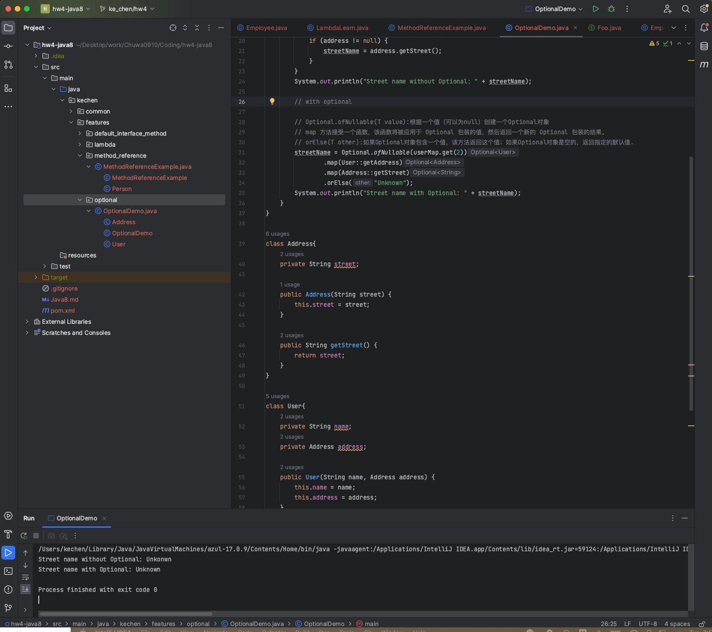

- `Optional.of(T value)`  
    - 根据一个非空值创建一个Optional对象。如果传入的值为null，这个方法会抛出NullPointerException
- `isPresent()`     
    - 该方法用于检查Optional对象是否包含值。如果包含值，返回true；如果Optional对象为空（不包含值），返回false
- `get()`    
    - 如果Optional对象包含一个值，该方法会返回这个值；如果Optional对象是空的（不包含值），则抛出一个NoSuchElementException异常
- `Optional.empty()`
    - 创建一个空的Optional对象，表示没有值。这种方法用于需要表示缺少值的场景。
- `ifPresent(Consumer<? super T> action)`     
    - 该方法用于在Optional对象包含值时执行指定的操作。如果Optional对象包含值，将该值传递给作为参数的Consumer函数；如果Optional对象为空（不包含值），不执行任何操作。
- `orElseGet(Supplier<? extends T> other)`    
    - 如果Optional对象包含一个值，该方法返回这个值；如果Optional对象是空的，使用指定的Supplier函数生成并返回一个默认值.
- `orElseThrow()`  
    - 如果Optional对象包含一个值，该方法返回这个值；如果Optional对象是空的，抛出一个NoSuchElementException异常。这个方法在Java 10中引入，与get()方法的功能相同，但命名更符合实际行为。
- `optional.filter(Predicate<? super T> predicate)`
    - 对包含在原始 Optional 中的值应用筛选条件，从而创建一个新的 Optional 对象。如果筛选条件不满足，将返回一个空的 Optional。
-`optional.flatMap()`
    - 将原始的 Optional 中的值进行扁平映射，并返回一个新的 Optional 对象。
    - 通常情况下，optional.flatMap() 用于处理嵌套的 Optional，以便更容易地访问内部值。例如，如果你有一个 Optional，它可能包含某个对象，而该对象本身也是一个 Optional，你可以使用 flatMap 来获取内部 Optional 中的值，而不必处理嵌套的 Optional 结构。

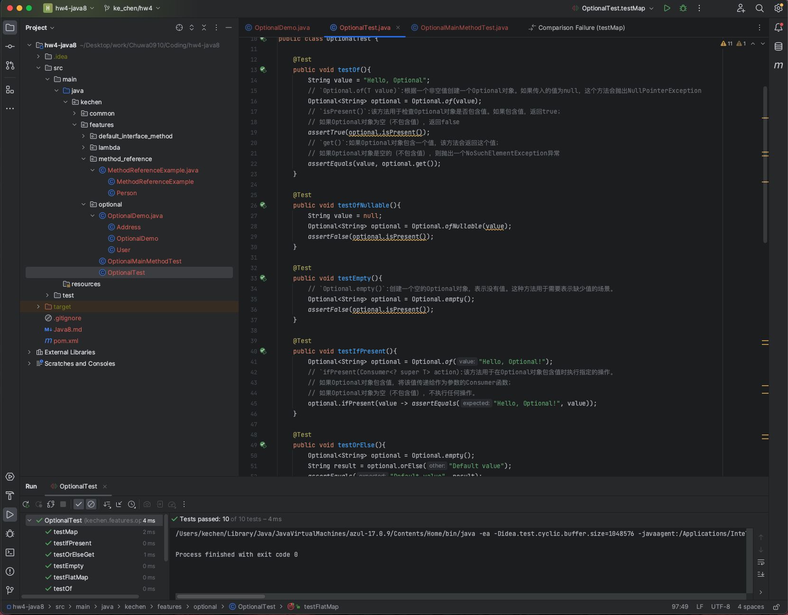

- of(T t) - 不可以为null
- ofNullable(T t) - 可以为null
- orElse(T t) - 如果当前的optional内部封装的t是非空的，则返回内部t, 如果内部的t是空的， 则返回orElse()方法中的t

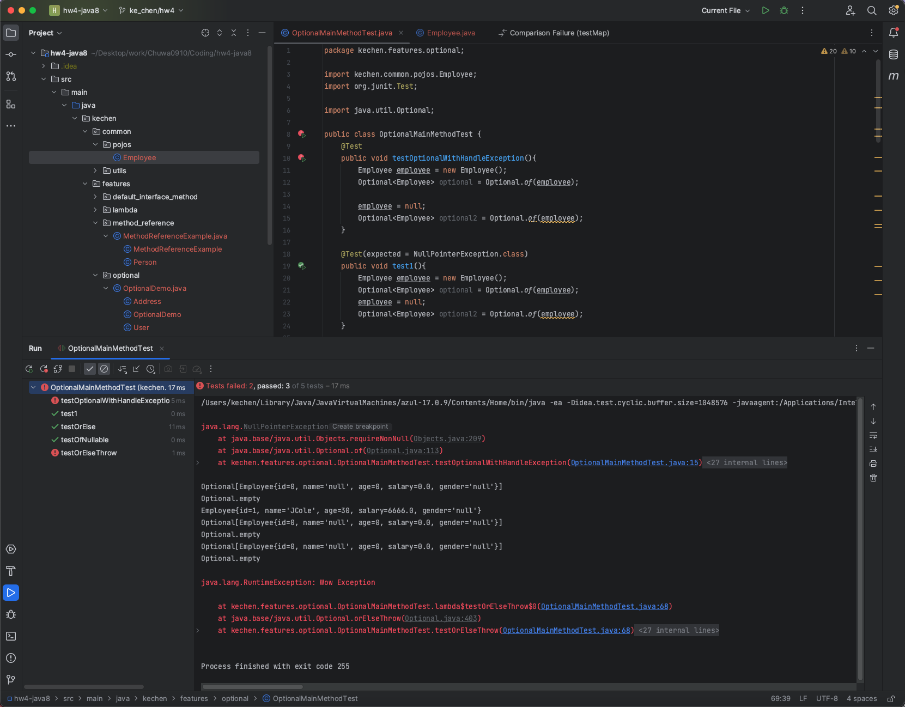


### stream API
- SteamAPI: https://juejin.cn/post/6962035387787116551#heading-0 

- 通过集合（Collection）创建Stream: Stream stream = obj.stream();
- 使用数组Arrays.stream()方法创建Stream: Stream stream = Arrays.stream(obj);
- 使用Stream.of()方法
- 使用Stream.iterate()方法
- 使用Stream.generate()方法

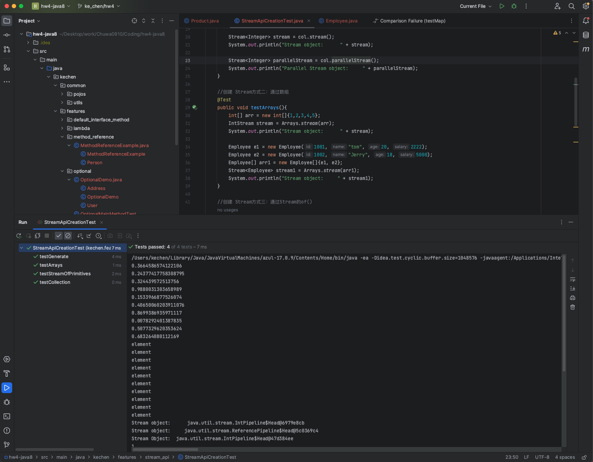

1. 筛选与切片
- filter(Predicate p) - 接受lambda, 从流中排出某些元素
- limit(long n) - 截断流，使其元素不超过给定的数量
- skip(long n) - 跳过前n个元素
- distinct() - 筛选，通过元素的hashcode(), equals()去除重复元素
2. 映射
- map(function f) element -> black box(f) -> new element - 接收一个函数作为参数，该流会被应用到每个元素上，并将其映射成一个新的元素
- mapToDouble(ToDoubleFunction f) - 接收一个函数作为参数，该函数会被应用到每个元素上，产生一个新的DoubleStrem
- mapToInt(ToIntFunction f) - 接收一个函数作为参数，该函数会被应用到每个元素上，产生一个新的IntStream
- mapToLong(ToLongFunction f) - 接收一个函数作为参数，该函数会被应用到每个元素上，产生一个新的LongStream
- flatMap(function f) - 接受一个函数作为参数，将流中的每个值都换成另一个流，然后把所有流连接成一个流
3. 排序
- sorted() - 产生一个新流，其中按自然顺序排序
- sorted(Comparator com) -> 产生一个新流，其中按比较器顺序排序

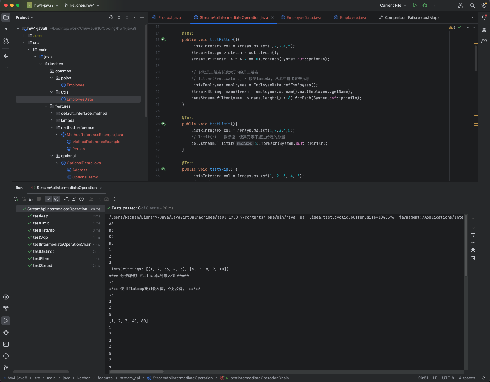

1. 匹配与查找
- allMatch(Predicate p) - 检查是否匹配所有的元素
- anyMatch(Predicate p) - 检查是否至少匹配一个元素
- noneMatch(Predicate p) - 检查是否没有匹配的元素
- findFirst - 返回第一个元素
- findAny - 返回当前流中的任意元素
- count - 返回流中元素的个数
- max(Comparator c) - 返回流中的最大值
- min(Comparator c) - 返回流中的最小值
- forEach(Consumer c) - 内部迭代(streamapi使用内部迭代，他帮你把迭代做了，外部迭代：使用Collection接口需要用户去做迭代)
- forEach(System.out::println)
2. 归约
- reduce(T identity, BinaryOperator) - 可以将流中的元素反复结合起来，得到一个值。返回T
- reduce(BinaryOperator) - 可以将流中的元素反复结合起来，得到一个值.返回 Optional<T>
3. 收集
- collect(Collector c) - 将流转换成其他形式。接收一个Collector接口的实现方法，用于给Stream中元素做汇总的方法
- .collect(Collectors.toList());

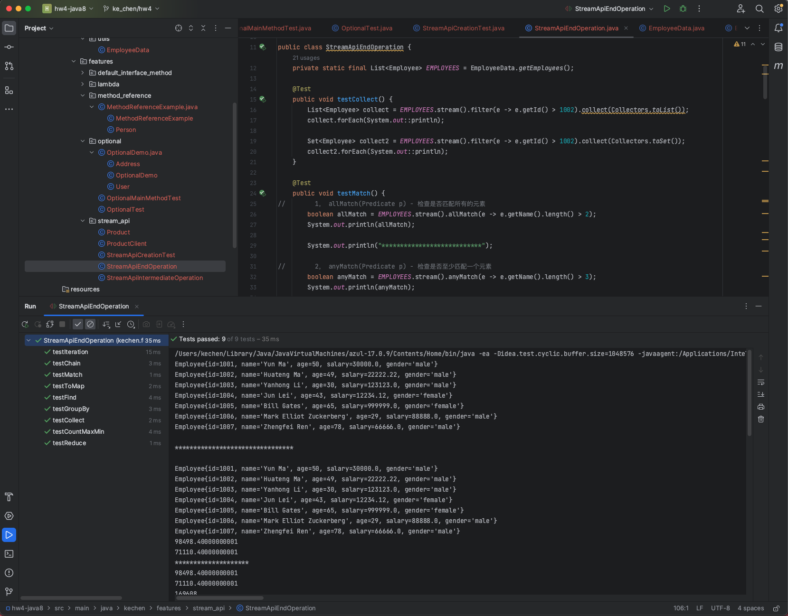

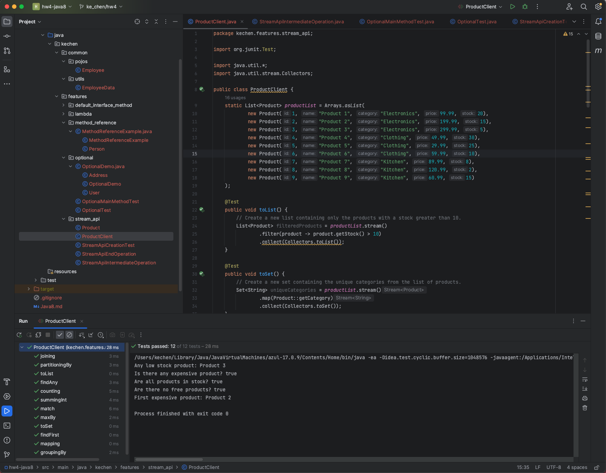


## 3. practice stream API at least 3 times 
- 15 Practical Exercises Help You Master Java Stream API: https://blog.devgenius.io/15-practical-exercises-help-you-master-java-stream-api-3f9c86b1cf82
- find code in coding file: hw4-stream_api-Exercise

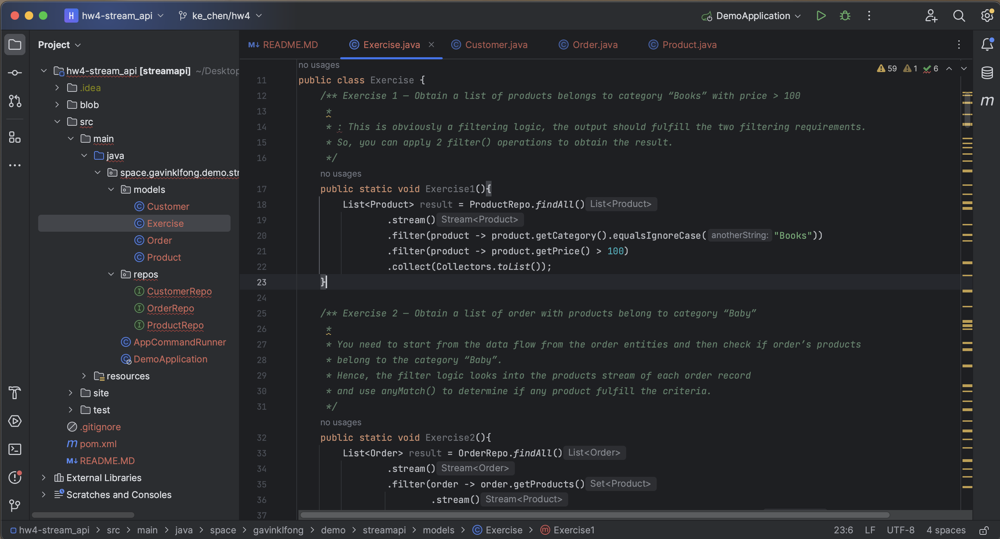


## 4. Practice Optional methods at least 2 times
- https://github.com/TAIsRich/chuwa-eij-tutorial/blob/main/02-java-core/src/main/java/com/chuwa/tutorial/t06_java8/exercise/ShoppingCartUtil.java
- find code in coding file: hw4-java8-exercise

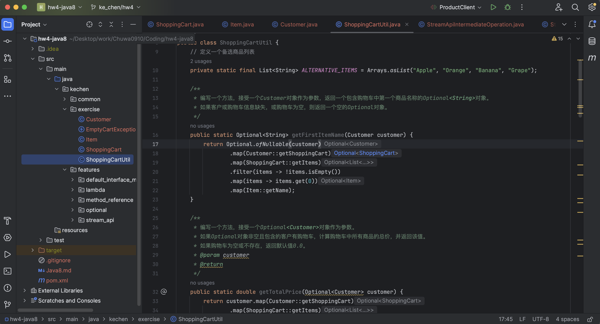


## 5. Write the Singleton design pattern include eager load and lazy load. 

### Eager Initialization (Thread-Safe):
In this approach, <u>the Singleton instance</u> is created eagerly, which means it's <u>created at the time the class is loaded.</u>类加载就会导致该单实例对象被创建.

It's inherently thread-safe because the JVM guarantees that class loading is a synchronized operation.
```java
// 饿汉式-方式1（静态变量方式）
public class Singleton {

    //私有构造方法（因为私有的话，外界无法访问到构造方法，就无法创建对象）
    private Singleton(){}

    //外界如果访问不到的话，一个对象都创建不了，所以要在该类中创建一个本类的对象，供外界使用
    private static Singleton instance = new Singleton();

    //提供一个公共的访问方式，对外提供静态方法，让外界获取该对象
    public static Singleton getInstance(){
        return instance;
    }
}
```

### Lazy Initialization with static inner class (Thread-Safe): 懒汉式 静态内部类
```java
// 懒汉式-方式4（静态内部类方式）
// 静态内部类单例模式中对象由内部类创建，由于 JVM 在加载外部类的过程中, 是不会加载静态内部类的,只有内部类的属性/方法被调用时
// 才会被加载, 并初始化其静态属性。静态属性由于被static 修饰，保证只被实例化一次，并且严格保证实例化顺序。（因为jvm只加载class一次）

//第一次加载Singleton类时不会去初始化INSTANCE，只有第一次调用getInstance，虚拟机加载SingletonHolder并初始化INSTANCE，这样不仅能确保线程安全，也能保证 Singleton 类的唯一性。

//静态内部类单例模式是一种优秀的单例模式，是开源项目中比较常用的一种单例模式。在没有加任何锁的情况下，保证了多线程下的安全，并且没有任何性能影响和空间的浪费。
public class Singleton {

    private Singleton(){}

    //定义一个静态内部类
    private static class SingletonHolder{
        // 在内部类中声明并且初始化外部类的对象
        private static final Singleton INSTANCE = new Singleton(); //因为有final就是一个常量，所以大写
    }

    // 提供公共的访问方式
    public static Singleton getInstance(){
        return SingletonHolder.INSTANCE;
    }
}
```

## 6. What is Runtime Exception? could you give me some examples?
Unchecked Exception = Runtime Exception: 

Unchecked exceptions are the one which <u>are handled at runtime because they can not be checked at compile-time</u>. 

For example: ArithmaticException, NullPointerException,ArrayIndexOutOfBoundsException, etc.

```java
ArithmaticException:
int result = 10 / 0; // Throws ArithmeticException (division by zero)

NullPointerException:
String str = null;
int length = str.length(); // Throws NullPointerException

ArrayIndexOutOfBoundsException:
int[] numbers = {1, 2, 3};
int value = numbers[5]; // Throws ArrayIndexOutOfBoundsException
```


## 7. Could you give me one example of NullPointerException?
```java
NullPointerException:
String str = null;
int length = str.length(); // Throws NullPointerException
```


## 8. What is the Optional class?
It is a public final class which is used to <u>deal with NullPointerException</u> in Java application. 

It is designed to <u>avoid Null checks and run time NullPointerExceptions.</u>

It is designed to <u>help handle situations where a value might be absent or present, without the need for explicit null checks</u>.

更优雅、更安全的方式处理可能为null的值。使用Optional对象，我们可以避免NullPointerException，并使代码更简洁、易读 

**Optional Methods:** 创建optional类对象的方法
1. create optional object:
    - `Optional.empty()`  
        - 创建一个空的Optional对象，表示没有值。这种方法用于需要表示缺少值的场景。
    - `Optional.of(T value)`  
        - 根据一个非空值创建一个Optional对象。如果传入的值为null，这个方法会抛出NullPointerException
    - `Optional.ofNullable(T value)`  
        - 根据一个值（可以为null）创建一个Optional对象。如果传入的值为null，它会创建一个空的Optional对象。这种方法适用于值可能为null的场景.
2. Get Element From Optional: 获取 Optional 容器的对象
    - `get()`    
        - 如果Optional对象包含一个值，该方法会返回这个值；如果Optional对象是空的（不包含值），则抛出一个NoSuchElementException异常
    - `orElse(T other)`   
        - 如果Optional对象包含一个值，该方法返回这个值；如果Optional对象是空的，返回指定的默认值.
    - `orElseGet(Supplier<? extends T> other)`    
        - 如果Optional对象包含一个值，该方法返回这个值；如果Optional对象是空的，使用指定的Supplier函数生成并返回一个默认值.
    - `orElseThrow()`  
        - 如果Optional对象包含一个值，该方法返回这个值；如果Optional对象是空的，抛出一个NoSuchElementException异常。这个方法在Java 10中引入，与get()方法的功能相同，但命名更符合实际行为。
3. Optional Other methods: 判断Optional容器是否包含对象
    - `isPresent()`     
        - 该方法用于检查Optional对象是否包含值。如果包含值，返回true；如果Optional对象为空（不包含值），返回false
    - `ifPresent(Consumer<? super T> action)`     
        - 该方法用于在Optional对象包含值时执行指定的操作。如果Optional对象包含值，将该值传递给作为参数的Consumer函数；如果Optional对象为空（不包含值），不执行任何操作。
    - `Optional.empty()`    
        - 创建一个空的Optional对象，表示没有值。这种方法用于需要表示缺少值的场景。
4. Optional Other methods: 映射
    - `map方法`
        - 接受一个函数，该函数将被应用于 Optional 包装的值，然后返回一个新的 Optional 包装的结果（将原始 Optional 中的值映射为新的值）。
    -`optional.flatMap()`
        - 将原始的 Optional 中的值进行扁平映射，并返回一个新的 Optional 对象。
        - 通常情况下，optional.flatMap() 用于处理嵌套的 Optional，以便更容易地访问内部值。例如，如果你有一个 Optional，它可能包含某个对象，而该对象本身也是一个 Optional，你可以使用 flatMap 来获取内部 Optional 中的值，而不必处理嵌套的 Optional 结构。
4. Optional Other methods: 过滤
    - `optional.filter(Predicate<? super T> predicate)`
        - 对包含在原始 Optional 中的值应用筛选条件，从而创建一个新的ptional 对象。如果筛选条件不满足，将返回一个空的 Optional。
5. 搭配使用:
    - of() 和 get() 方法搭配使用，明确对象非空
    - ofNullable() 和 orElse() 搭配使用，不确定对象非空
6. 注意区分：
    - of(T t) - 不可以为null
    - ofNullable(T t) - 可以为null
    - orElse(T t) - 如果当前的optional内部封装的t是非空的，则返回内部t, 如果内部的t是空的， 则返回orElse()方法中的t


## 9. What are the advantages of using the Optional class?
It is <u>a public final class</u> which is used to <u>deal with NullPointerException</u> in Java application.
更优雅、更安全的方式处理可能为null的值。使用Optional对象，我们可以避免NullPointerException，并使代码更简洁、易读.

advantage:
1. Null-Safety:

Instead of returning null when a value may be absent, you can use Optional to indicate that a value may or may not be present, making it clear that the value is optional.

2. Expressive API:

Optional provides a clear and expressive API for working with optional values. 
You can use methods like isPresent(), ifPresent(), orElse(), and orElseGet() to work with optional values in a more readable and concise manner.


## 10. What is the @FunctionalInterface?
Functional interfaces:
- <u>Has only one abstract method</u>  只包含一个抽象方法的接口，称为函数式接口
- <u>@FunctionalInterface - for sanity check</u>     在一个接口上使用 @FunctionalInterface 注解，这样做可以检查它是否是一个函数式接口。
- <u>Lambda is the implementation of the abstract method.</u>  可以通过 Lambda 表达式来创建该接口的对象。
- Functional interfaces are also known as Single Abstract Method Interfaces (SAM Interfaces).
- Can have a lot of default methods
- It can also declare methods of object class.
- 函数式接口: https://juejin.cn/post/6962035387787116551#heading-0
    
之前学过的SAM接口中，标记了  @FunctionalInterface 注解的接口有：Runnable、Comparator、FileFilters
    
作用：
Functional interfaces <u>can be used as method parameter types and return value types</u>. And parameters and return values can use Lambda expressions to simplify the code. 
可以使用函数式接口作为方法的参数类型和返回值类型使用


## 11. what is lamda?
same with Q17, see the answer in Q17


## 12. What is Method Reference?
- Java 8 Method reference is <u>used to refer method of functional interface</u>.  方法引用是用来 直接访问 类或者实例的 已经存在的 方法或者构造方法。
- 当要传递给 Lambda 体的操作，已经实现的方法了，可以使用方法引用
- 类(或对象) :: 方法名
- 我们需要把握的重点是：函数引用只是简化Lambda表达式的一种手段而已(方法引用就是 Lambda 表达式)。
- 方法的引用 + 构造器和数组的引用：https://juejin.cn/post/6962035387787116551#heading-0


方法的引用 语法：
1. 实例对象::对象的实例方法（非静态方法）
2. 类::静态方法
3. 类::实例方法（非静态方法）

构造器和数组的引用 语法：
1. 构造器引用 类::new
2. 数组引用 数组类型 []::new


## 13. What is Java 8 new features?
https://www.yuque.com/fairy-era/yg511q/me04bd#bf895a74

https://juejin.cn/post/6962035387787116551

https://www.cnblogs.com/wmyskxz/p/13527583.html

optinal：https://medium.com/swlh/how-to-write-better-code-with-java-8s-optional-b6d862f28862

### 1. Default method and static method in interface

default methods:
Java provides a facility to create default methods inside the interface. 

Methods which are defined inside the interface and tagged with default keyword are known as default methods. 

These methods are non-abstract methods and can have method body.


### 2. Lambda & Functional Interface -- 重点
1. Lambda expressions:
    - <u>To replace anonymous inner class</u>, 以前用匿名实现类表示的现在都可以用 Lambda 表达式来写。
    - <u>Work with functional interface.</u>
    - <u>Lambda 表达式的本质：an instances of functional interfaces</u> 作为函数式接口的实例 
    - Lambda表达式: https://juejin.cn/post/6962035387787116551#heading-0

    Lambda expression helps us to write our code in functional style.

2. Functional interfaces:
    - <u>Has only one abstract method</u>  只包含一个抽象方法的接口，称为函数式接口
    - <u>@FunctionalInterface - for sanity check</u>     在一个接口上使用 @FunctionalInterface 注解，这样做可以检查它是否是一个函数式接口。
    - <u>Lambda is the implementation of the abstract method.</u>  可以通过 Lambda 表达式来创建该接口的对象。
    - Functional interfaces are also known as Single Abstract Method Interfaces (SAM Interfaces).
    - Can have a lot of default methods
    - It can also declare methods of object class.
    - 函数式接口: https://juejin.cn/post/6962035387787116551#heading-0
    
    之前学过的SAM接口中，标记了  @FunctionalInterface 注解的接口有：Runnable、Comparator、FileFilters
    
    作用：
    Functional interfaces <u>can be used as method parameter types and return value types</u>. And parameters and return values can use Lambda expressions to simplify the code. 
    可以使用函数式接口作为方法的参数类型和返回值类型使用


### 3. Method references
- Java 8 Method reference is <u>used to refer method of functional interface</u>.  方法引用是用来 直接访问 类或者实例的 已经存在的 方法或者构造方法。
- 当要传递给 Lambda 体的操作，已经实现的方法了，可以使用方法引用
- 类(或对象) :: 方法名
- 我们需要把握的重点是：函数引用只是简化Lambda表达式的一种手段而已(方法引用就是 Lambda 表达式)。
- 方法的引用 + 构造器和数组的引用：https://juejin.cn/post/6962035387787116551#heading-0


方法的引用 语法：
1. 实例对象::对象的实例方法（非静态方法）
2. 类::静态方法
3. 类::实例方法（非静态方法）

构造器和数组的引用 语法：
1. 构造器引用 类::new
2. 数组引用 数组类型 []::new


### 4. Optional class -- 重点
It is a public final class which is used to <u>deal with NullPointerException</u> in Java application. 

It is designed to <u>avoid Null checks and run time NullPointerExceptions.</u>

It is designed to <u>help handle situations where a value might be absent or present, without the need for explicit null checks</u>.

更优雅、更安全的方式处理可能为null的值。使用Optional对象，我们可以避免NullPointerException，并使代码更简洁、易读 

**Optional Methods:** 创建optional类对象的方法
1. create optional object:
    - `Optional.empty()`  
        - 创建一个空的Optional对象，表示没有值。这种方法用于需要表示缺少值的场景。
    - `Optional.of(T value)`  
        - 根据一个非空值创建一个Optional对象。如果传入的值为null，这个方法会抛出NullPointerException
    - `Optional.ofNullable(T value)`  
        - 根据一个值（可以为null）创建一个Optional对象。如果传入的值为null，它会创建一个空的Optional对象。这种方法适用于值可能为null的场景.
2. Get Element From Optional: 获取 Optional 容器的对象
    - `get()`    
        - 如果Optional对象包含一个值，该方法会返回这个值；如果Optional对象是空的（不包含值），则抛出一个NoSuchElementException异常
    - `orElse(T other)`   
        - 如果Optional对象包含一个值，该方法返回这个值；如果Optional对象是空的，返回指定的默认值.
    - `orElseGet(Supplier<? extends T> other)`    
        - 如果Optional对象包含一个值，该方法返回这个值；如果Optional对象是空的，使用指定的Supplier函数生成并返回一个默认值.
    - `orElseThrow()`  
        - 如果Optional对象包含一个值，该方法返回这个值；如果Optional对象是空的，抛出一个NoSuchElementException异常。这个方法在Java 10中引入，与get()方法的功能相同，但命名更符合实际行为。
3. Optional Other methods: 判断Optional容器是否包含对象
    - `isPresent()`     
        - 该方法用于检查Optional对象是否包含值。如果包含值，返回true；如果Optional对象为空（不包含值），返回false
    - `ifPresent(Consumer<? super T> action)`     
        - 该方法用于在Optional对象包含值时执行指定的操作。如果Optional对象包含值，将该值传递给作为参数的Consumer函数；如果Optional对象为空（不包含值），不执行任何操作。
    - `Optional.empty()`    
        - 创建一个空的Optional对象，表示没有值。这种方法用于需要表示缺少值的场景。
4. Optional Other methods: 映射
    - `map方法`
        - 接受一个函数，该函数将被应用于 Optional 包装的值，然后返回一个新的 Optional 包装的结果（将原始 Optional 中的值映射为新的值）。
    -`optional.flatMap()`
        - 将原始的 Optional 中的值进行扁平映射，并返回一个新的 Optional 对象。
        - 通常情况下，optional.flatMap() 用于处理嵌套的 Optional，以便更容易地访问内部值。例如，如果你有一个 Optional，它可能包含某个对象，而该对象本身也是一个 Optional，你可以使用 flatMap 来获取内部 Optional 中的值，而不必处理嵌套的 Optional 结构。
4. Optional Other methods: 过滤
    - `optional.filter(Predicate<? super T> predicate)`
        - 对包含在原始 Optional 中的值应用筛选条件，从而创建一个新的ptional 对象。如果筛选条件不满足，将返回一个空的 Optional。
5. 搭配使用:
    - of() 和 get() 方法搭配使用，明确对象非空
    - ofNullable() 和 orElse() 搭配使用，不确定对象非空
6. 注意区分：
    - of(T t) - 不可以为null
    - ofNullable(T t) - 可以为null
    - orElse(T t) - 如果当前的optional内部封装的t是非空的，则返回内部t, 如果内部的t是空的， 则返回orElse()方法中的t


### 5. Stream API  -- 重点
Java 8 java.util.stream package consists of classes, interfaces and an enum to allow functional-style operations on the elements. 
It performs lazy computation(惰性求值). So, it executes only when it requires.
- it is a coding style to implement program logic by composing functions and executing them in a data flow.
- 一旦执行终止操作，就执行中间操作链，并产生结果。之后，不会再被使用（先结束，在执行中间操作）
- SteamAPI: https://juejin.cn/post/6962035387787116551#heading-0    

**Stream的使用主要由三部分构成：**
1.  Start（开始）: 构建stream 对象
2.  Intermediate operation（中间操作）: process数据，比如filter筛选，map转换数据
3.  Terminate operation（终止操作）：对数据搜集。 一旦有终止操作，该stream pipeline会终止。

**Create stream object：**  创建stream对象
1. 通过集合（Collection）创建Stream
    - 几乎所有的集合类（如List和Set）都可以通过调用stream()方法创建一个Stream对象。这是创建Stream的最常见方式。
    ```java
    List<String> list = Arrays.asList("apple", "banana", "cherry");
    Stream<String> stream = list.stream();
    ```
    - Java 8的 Collection 接口被扩展，提供了两个获取流的方法：
        - default Stream\<E> stream() : 返回一个顺序流
        - default Stream\<E> parallelStream() : 返回一个并行流
2. 使用Stream.of()方法
    - 使用Stream.of()方法可以直接从多个元素创建一个Stream对象
    ```java
    Stream<String> stream = Stream.of("apple", "banana", "cherry");
    ```
    - 可以调用Stream类静态方法of()，通过显示值创建一个流。可以用于接收任意数量的参数
        - public static \<T>Stream\<T> of(T...values):返回一个流
3. 使用数组Arrays.stream()方法创建Stream
    - 通过使用Arrays.stream()方法，可以从数组创建一个Stream对象
    ```java
    String[] array = {"apple", "banana", "cherry"};
    Stream<String> stream = Arrays.stream(array);
    ```
    - Java 8中的 Arrays 的静态方法 stream() 可以获取数组流
        - 调用 Arrays 类的 static\<T> Stream\<T> stream(T[] array): 返回一个流重载形式，能够处理对应基本类型的数组：
            - public static IntStream stream（int[] array）
            - public static LongStream stream（long[] array）
            - public static DoubleStream stream（double[] array）
4. 使用Stream.iterate()方法
    - Stream.iterate()方法允许创建一个无限的、有规律的序列。通常与limit()方法一起使用，以限制生成的元素数量。
    ```java
    Stream<Integer> stream = Stream.iterate(0, n -> n + 2).limit(5); // Generates 0, 2, 4, 6, 8
    ```
5. 使用Stream.generate()方法
    - Stream.generate()方法允许创建一个无限的、无规律的序列。通常与limit()方法一起使用，以限制生成的元素数量
    ```java
    Stream<Double> stream = Stream.generate(Math::random).limit(5);
    ```

**Intermediate operation:** 中间操作
- 多个中间操作可以连接起来形成一个流水线，除非流水线上触发终止操作，否则中间操作不会执行任何的处理！而在终止操作时一次性全部处理，称为<u>惰性求值 Lazy Evaluations</u>

1. 筛选与切片


2. 映射


3. 排序


**Terminate operation:** 终止操作
- 终端操作会从流的流水线生成结果。其结果可以是任何不是流的值，例如：List、 Integer，甚至是 void
- 流进行了终止操作后，不能再次使用

1. 匹配与查找


2. 归约


3. 收集


## 14. Lambda can use unchanged variable outside of lambda? what is the details?
Yes, by variable capture.

In Java, <u>lambda expressions can capture (or "close over") variables from their surrounding scope</u>. These variables are called "captured variables" or "lexical variables." 

The ability to access and use variables from the enclosing scope is known as <u>"variable capture."</u> 

***Effectively Final Variables***: 

Lambda expressions <u>can capture variables from the enclosing scope as long as those variables are effectively final</u>. If you attempt to modify an effectively final variable inside a lambda expression, it will result in a compilation error.

Example:
```java
int x = 10;        // effectively final
Runnable r = () -> {
    // Accessing the effectively final variable 'x'
    System.out.println(x);
    // x++; // This would be an error because 'x' is effectively final
};
```
***Access to Non-Final Variables***: 

lambda expressions can also <u>access instance variables and static variables</u> from the enclosing class. The lambda expression captures a reference to the variable, so any changes made to the variable's state inside the lambda will be reflected in the enclosing scope. 在lambda内部改变的也会影响外面的variable
Example:
```java
public class LambdaExample {
    private int count = 0;
    
    public void doSomething() {
        Runnable r = () -> {
            // Accessing the instance variable 'count'
            System.out.println(count);
            count++; // Modifying 'count'
        };
        r.run();
    }
}
```
***Accessing Method Parameters***: 

Lambda expressions <u>can also capture method parameters (as long as the parameters are effectively final or final)</u>. This can be useful when you want to use the parameters within the lambda expression.
Example:
```
public void process(int value) {
    Runnable r = () -> {
        // Accessing the method parameter 'value'
        System.out.println("Processing: " + value);
    };
    r.run();
}
```


## 15. Describe the newly added features in Java 8?
the smae as Q13


## 16. Can a functional interface extend/inherit another interface?
Yes, a functional interface in Java can extend or inherit from another interface. 

When you extend an interface to create a functional interface, you ensure that the extended interface has only one abstract method (the one required for it to be considered a functional interface).
```java
@FunctionalInterface
interface MyFunctionalInterface {
    void myMethod();
}

// Another interface that extends MyFunctionalInterface
interface AnotherInterface extends MyFunctionalInterface {
    void anotherMethod();
}
```


## 17. What is the lambda expression in Java and How does a lambda expression relate to a functional interface?
Lambda expressions:
- <u>To replace anonymous inner class</u>, 以前用匿名实现类表示的现在都可以用 Lambda 表达式来写。
- <u>Work with functional interface.</u>
- <u>Lambda 表达式的本质：an instances of functional interfaces</u> 作为函数式接口的实例 
- Lambda表达式: https://juejin.cn/post/6962035387787116551#heading-0

Lambda expression helps us to write our code in functional style.


## 18. In Java 8, what is Method Reference?
same as Q12


## 19. What does the String::ValueOf expression mean?
It is an example of method reference to call the valueOf method from String class.
```java
// Using a lambda expression
Function<Integer, String> intToString = (x) -> String.valueOf(x);

// Using a method reference
Function<Integer, String> intToStringReference = String::valueOf;

// Using the method reference to convert an integer to a string
String result = intToStringReference.apply(42);
System.out.println(result); // Prints "42"
```


## 20. What are Intermediate and Terminal operations?
***Intermediate operations*** are operations that transform one stream into another but do not produce a final result. 

***Terminal operations*** are operations that produce a final result or a side effect.

stream流的操作步骤：

① 创建 Stream ：通过一个数据源（如：集合、数组），获取一个流。

② 中间操作：中间操作是个操作链，对数据源的数据进行 n 次处理，但是在终结操作前，并不会真正的执行。

③ 终止操作：一旦执行终止操作，就执行中间操作链，最终产生结果并结束 Stream 。


## 21. What are the most commonly used Intermediate operations?
1. 筛选与切片
- filter(Predicate p) - 接受lambda, 从流中排出某些元素
- limit(long n) - 截断流，使其元素不超过给定的数量
- skip(long n) - 跳过前n个元素
- distinct() - 筛选，通过元素的hashcode(), equals()去除重复元素
2. 映射
- map(function f) element -> black box(f) -> new element - 接收一个函数作为参数，该流会被应用到每个元素上，并将其映射成一个新的元素
- mapToDouble(ToDoubleFunction f) - 接收一个函数作为参数，该函数会被应用到每个元素上，产生一个新的DoubleStrem
- mapToInt(ToIntFunction f) - 接收一个函数作为参数，该函数会被应用到每个元素上，产生一个新的IntStream
- mapToLong(ToLongFunction f) - 接收一个函数作为参数，该函数会被应用到每个元素上，产生一个新的LongStream
- flatMap(function f) - 接受一个函数作为参数，将流中的每个值都换成另一个流，然后把所有流连接成一个流
3. 排序
- sorted() - 产生一个新流，其中按自然顺序排序
- sorted(Comparator com) -> 产生一个新流，其中按比较器顺序排序


## 22. What is the difference between findFirst() and findAny()?
both findFirst() and findAny() are terminal operations used to retrieve elements from a stream.

findFirst() returns the first element of the stream.

findAny() returns any element from the stream, not necessarily the first one. 


## 23. How are Collections different from Stream?
集合讲的是数据，负责存储数据，Stream 流讲的是计算，负责处理数据！

1. data stored
    - Collections: Data structure holds all the data element
    - Streams: No data is stored. Have the capacity to process an infinite number of elements on demand.
2. Iteration
    - Collections: external iteration
    - Streams: internal iteration
3. times
    - Collections: can be processed any number of times
    - Streams: traversed only once
4. element access
    - Collections: elements are easy to access
    - Streams: no direct way of accessing specific elements
5. basic
    - Collections: is a data store
    - Streams: is an API to process the data