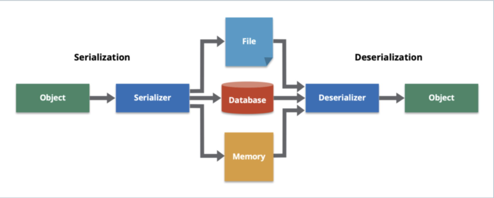

# Homework 9 (Hw41-springboot-RUD)

## 1. List all of the new annotations to your annotaitons.md and explain its role.

## 2. how do you do the debug?

- Look into the console log
- Make a debug breakpoint in corresponding code line
- Compare the running variable value with expected one

## 3. What is DTO, VO, Payload, DO, model?

- `DTO - Data Transfer Object`: an object that carries data between processes.
- `DO - Data Object`: an object that contains data.
- `VO - View Object`: an object or model used to represent data in the user interface (UI).
- `Payload`: request and response data. C ontains the actual data to be accessed or processed by the receiver(server), such as a JSON or XML object, or sometimes binary data like images or videos.
- `model`: can be refer to the same as `entity`

Overall, `DO` is more closed to `DTO`, and `VO` can be referred to the `Payload`. Five of them, can all be seen as the same thing for holding the data in a general way.

## 4. What is @JsonProperty("description_yyds") (不会的话，课上问)?

`@JsonProperty(name)` is an annotation in Jackson library.
It's often used when the JSON property name is different from the field name in the Java object, or when the JSON property name is not in camelCase.

`JsonPropertyOrder({"pageNo", "pageSize"})` defines the order of fields in the JSON

## 5. do you know what is jackson?

```
<dependency>
<groupId>com.fasterxml.jackson.core</groupId>
    <artifactId>jackson-databind</artifactId>
    <version>2.13.3</version>
    <scope>compile</scope>
</dependency>
```

Jackson is a JSON serialization/deserialization library for Java. It helps the converting between JSON an Objects.
For Example, the `ResponseEntity` generated the JSON response object from the entity object for backend and frontend communication. In CN, Alibaba use `fastjson` instead and Google use `Gson` instead.

## 6. What is spring-boot-stater?

集合，包含了 spring web 的所有 dependencies，里面互相版本兼容。

### - a. what dependecies in the below starter? do you know any starters?

```
<dependency>
    <groupId>org.springframework.boot</groupId> <artifactId>spring-boot-starter-web</artifactId>
</dependency>
```

Spring Boot Starter POMs are a set of convenient dependency descriptors that you can include in your application.

- In the Spring Boot Framework, all the starters follow a similar naming pattern: spring-boot-starter-_, where _ denotes a particular type of application.
  - Web Starter
  - Test Starter
  - JPA Data Starter
  - Mail Starter

## 7. do you know `@RequestMapping(value = "/users", method = RequestMethod.POST)` ? could you list CRUD by this style?

It's an another version of POST request annotation in SpringBoot framework. which is the same as `@PostMapping(/users")`

- Create: `@RequestMapping(value = "/users", method = RequestMethod.POST)`
- Read: `@RequestMapping(value = "/users", method = RequestMethod.GET)`
- Update: `@RequestMapping(value = "/users", method = RequestMethod.PUT)`
- Delete: `@RequestMapping(value = "/users", method = RequestMethod.DELETE)`

## 8. What is ResponseEntity? why do we need it?

```
   new ResponseEntity<>(postResponse, HttpStatus.OK);
   new ResponseEntity<>(postResponse,
   HttpStatus.CREATED);
   ResponseEntity.ok(postService.getPostById(id));
```

ResponseEntity represents the whole HTTP response: status code, headers, and body. We can use it to fully configure the HTTP response, define different HTTP response codes for different situations.

## 9. What is ResultSet in jdbc? and describe the flow how to get data using JDBC

Java ResultSet interface is a part of the java.sql package. It is one of the core components of the JDBC Framework. ResultSet Object is used to access query results retrieved from the relational databases.

```
//https://www.digitalocean.com/community/tutorials/java-resultset
Class.forName("com.mysql.jdbc.Driver");
conn = DriverManager.getConnection("jdbc:mysql://127.0.0.1:3306/empdb", "root", "root");
stmt = conn.createStatement();
ResultSet rs = stmt.executeQuery(query);
while (rs.next()) {
    Integer empId = rs.getInt(1);
    String firstName = rs.getString(2);
    String lastName = rs.getString(3);
    Date dob = rs.getDate(4);
    System.out.println("empId:" + empId);
    System.out.println("firstName:" + firstName);
    System.out.println("lastName:" + lastName);
    System.out.println("dob:" + dob);
    System.out.println("");
}
rs.close();
```

## 10. What is the ORM framework?

Object-relational mapping (ORM) is a way to align programming code with database structures. ORM uses metadata descriptors to create a layer between the programming language and a relational database.

## 11. Learn how to use ObjectMapper by this example.

    - a. https://github.com/TAIsRich/chuwa-eij-tutorial/blob/main/02-java-core/src/main/java/com/chuwa/exercise/oa/api/FoodOutletJackson.java

```
FoodOutlet foodOutlet = objectMapper.readValue(resBody, FoodOutlet.class);
String s = objectMapper.writeValueAsString(foodOutlet);
objectMapper.readTree() // learn how to use it?
```

## 12. What is the serialization and desrialization?

- https://hazelcast.com/glossary/serialization/

Serialization means converting an object into a sequence of bytes (e.g. JSON String), Deserialization is exactly the opposite.

Serialization（序列化）通常用于将 Java 对象转换为可传输或可存储的格式，比如将对象转换为字节流、JSON、XML 等格式，以便**在网络上传输**或**持久化存储**。在 Spring 框架中，Serialization 有多种应用场景：

- 数据传输
- RESTful 服务
- 缓存
- Session 管理
- 消息传递

In Java, Serialization and deserialization play a great role in the transfer of data and saving it to a database or disk. In Spring project, we use `Jackson` library as the tool.



## 13. use stream api to get the average of the array [20, 3, 78, 9, 6, 53, 73, 99, 24, 32].

`Arrays.stream(array).average(arr).orElse(Double.NaN);`

## 14. 抄写，https://github.com/TAIsRich/springboot-redbook/tree/03_post_pageable, 你也可以像我一样分 branch 添加新代码。

Done.

## 15. (Optional) 抄写 https://github.com/TAIsRich/springboot-redbook/tree/04_comment 你也可以像我一样分 branch 添加新代码。

Done.

## 16. (Optional)Try to write the CRUD api for a new application Cassandra-Blog

- a. spring 提供了相关 dependency,(https://start.spring.io/) i. Spring Data for Apache Cassandra
- b. Cassandra 十分流行，且面试问的多。
