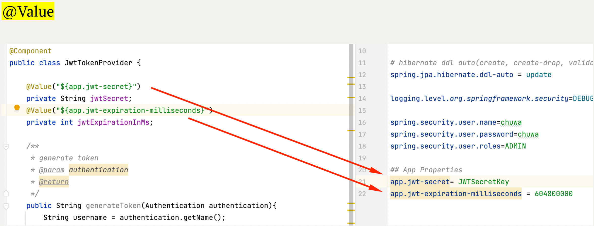

1. List all of the new annotations to your annotaitons.md and explain its role.<br>
The answer is in the annotations.md file.
2. how do you do the debug?<br>
Debugging is the process of identifying and fixing issues, bugs, or unexpected behavior in software. Debugging techniques can vary depending on the programming language and development environment you are using.<br>
    
    Reproduce the Issue:Before you can debug a problem, you need to be able to reproduce it consistently. Try to isolate the inputs or steps that trigger the issue. Having a clear, reproducible test case is crucial.<br>
    
    Use Logging:Insert logging statements in your code to track the flow of execution, variable values, and important events. Logging can help you understand what's happening in your code and identify where the issue might be occurring.<br>
    
    Debugging Tools:Most integrated development environments (IDEs) offer debugging tools. Common debugging features include setting breakpoints, stepping through code, inspecting variable values, and watching expressions. Use these tools to interactively examine your code's behavior.<br>
    
    Set Breakpoints:Place breakpoints at specific lines of code where you suspect the issue may be occurring. When your program reaches a breakpoint, it will pause execution, allowing you to inspect variables and the program's state.<br>
    
    Step Through Code:Use the debugger to step through your code line by line. This helps you understand the flow of execution and identify when and where the issue arises.<br>
    
    Inspect Variables:While debugging, you can inspect the values of variables in real-time. This is often crucial for identifying the cause of a problem. Check if variables contain the expected values or if they change unexpectedly.<br>
    
    Check for Exception/Error Messages:Look for error messages, exception stack traces, or warning messages in the console or log files. These messages can provide valuable information about what went wrong.
    
    Examine Stack Traces:When an exception occurs, carefully examine the stack trace. It will show you the sequence of function calls leading up to the error, helping you pinpoint the problem.

3. What is DTO, VO, Payload, DO, model?<br>

   DTO (Data Transfer Object):A DTO is an object that carries data between processes or layers of an application. It is often used in situations where data needs to be exchanged between different parts of a system, such as between a client and a server. DTOs typically contain fields that represent the data to be transferred and may not have any behavior (methods). They help reduce the amount of data sent over the network and encapsulate data for specific use cases.<br>
   
   VO (Value Object):A Value Object is an object that represents a descriptive aspect of the system with no conceptual identity. In other words, a Value Object is immutable and is primarily defined by its attributes or values rather than a unique identifier. They are often used to encapsulate simple pieces of data like currency amounts, dates, or measurements.<br>

   Payload:Payload refers to the data that is transmitted over a network or included in a message. It can include various types of data, such as parameters, content, or information needed for communication between different parts of a system. In web development, the payload often refers to the data sent in an HTTP request or response, such as JSON or XML data.<br>
   
   DO (Domain Object):A Domain Object represents a core concept or entity within the domain of the application. It typically encapsulates both data and behavior related to a specific domain or business logic. Domain Objects are often used in domain-driven design (DDD) to model the real-world concepts that the software application deals with.<br>
   
   Model: The term "Model" can have different meanings depending on the context:In the Model-View-Controller (MVC) architectural pattern, the "Model" represents the application's data and business logic.<br>
4. What is @JsonProperty("description_yyds")?<br>
   The @JsonProperty annotation is a Java annotation commonly used in Jackson, a popular library for handling JSON (JavaScript Object Notation) serialization and deserialization in Java applications. This annotation is used to specify the mapping between Java class properties and JSON object properties, allowing you to customize how JSON data is serialized or deserialized.<br>
   @JsonProperty("description_yyds") is used to indicate that a Java class property should be mapped to a JSON object property with the name "description_yyds" when serializing or deserializing JSON data.<br>
5. Do you know what is jackson?
```
<dependency>
<groupId>com.fasterxml.jackson.core</groupId>
<artifactId>jackson-databind</artifactId><version>2.13.3</version>
<scope>compile</scope>
</dependency>
```
Jackson is a popular open-source Java library for handling JSON (JavaScript Object Notation) data. It provides a set of APIs and tools for reading and writing JSON data in Java applications. Jackson is widely used in Java development, particularly in web services, RESTful APIs, and other applications where JSON is the primary data interchange format Parsing and Generation: Jackson can parse JSON data into Java objects (deserialization) and generate JSON data from Java objects (serialization). This makes it easy to work with JSON data in Java applications.


6. What is spring-boot-stater?
   a. what dependecies in the below starter? do you know any starters?
```
<dependency>
    <groupId>org.springframework.boot</groupId>
    <artifactId>spring-boot-starterweb</artifactId>
</dependency>
```
In the context of Spring Boot, a "starter" is a pre-configured collection of dependencies that are commonly used together to set up a specific type of application or functionality. Spring Boot starters simplify the process of adding the necessary libraries and configurations to your project, allowing you to quickly get started with various aspects of Spring-based development.<br>
spring-boot-starter-data-jpa: For Java Persistence API (JPA) and database access.<br>
spring-boot-starter-security: For adding security features.<br>
spring-boot-starter-test: For unit and integration testing.<br>
spring-boot-starter-actuator: For monitoring and managing your application.<br>
spring-boot-starter-cloud: For integrating with Spring Cloud services.<br>
7. do you know @RequestMapping(value = "/users", method =
   RequestMethod.POST) ? could you list CRUD by this style?
Create: @RequestMapping(value = "/users", method = RequestMethod.POST)<br>
Read: @RequestMapping(value = "/users", method = RequestMethod.GET)<br>
Update: @RequestMapping(value = "/users", method = RequestMethod.UPDATE)<br>
Delete: @RequestMapping(value = "/users", method = RequestMethod.DELETE)<br>
<br>

8. What is ResponseEntity? why do we need it?
```
new ResponseEntity<>(postResponse, HttpStatus.OK);
new ResponseEntity<>(postResponse, 
HttpStatus.CREATED);
ResponseEntity.ok(postService.getPostById(id));
```
ResponseEntity is a class provided by the Spring Framework, including Spring Boot, that represents an HTTP response. It is used to customize and control the response that your Spring application sends to a client, typically in the context of building RESTful web services or APIs. ResponseEntity offers more flexibility and control over the HTTP response compared to returning simple data types or objects directly from controller methods. HTTP Status Codes, Custom Headers, Response Body, Content Negotiation,Exception Handling


9. What is ResultSet in jdbc? and describe the flow how to get data using JDBC<br>
In JDBC, a ResultSet is an interface provided by Java to retrieve and manipulate the results of a database query. It represents the tabular data returned by a SELECT statement in a relational database. A ResultSet acts as a cursor that allows you to navigate through the rows of data and retrieve values from the columns.
The flow: Load JDBC Driver->Establish Database Connection->Create and Execute SQL Query->Iterate Through ResultSet->Close Resources


10. What is the ORM framework?<br>
ORM stands for Object-Relational Mapping. It is a programming technique and framework used in software development to bridge the gap between the object-oriented world of Java programming languages and the relational world of databases (such as MySQL, PostgreSQL, Oracle, etc.).<br>
The primary goal of an ORM framework is to allow developers to work with relational databases using object-oriented programming concepts and methodologies. It accomplishes this by providing a mapping layer that converts data between objects in the application and tables in the database.<br>

11. Learn how to use ObjectMapper by this example
    a. https://github.com/TAIsRich/chuwa-eij-tutorial/blob/main/02-java-cor
    e/src/main/java/com/chuwa/exercise/oa/api/FoodOutletJackson.java
```
FoodOutlet foodOutlet =
objectMapper.readValue(resBody, FoodOutlet.class);
String s =
objectMapper.writeValueAsString(foodOutlet);
objectMapper.readTree() // learn how to use it?
```
12. What is the serialization and desrialization?
    a. https://hazelcast.com/glossary/serialization/
    Serialization:
Serialization is the process of converting complex data structures, such as objects or data in memory, into a linear format, typically a byte stream or a string. The purpose of serialization is to make the data suitable for storage, transmission, or sharing. Serialized data is often platform-independent, meaning it can be deserialized on different systems.
In the context of programming languages, serialization typically involves converting objects or data structures into a format that can be saved to a file, sent over a network, or stored in a database. Common formats for serialized data include JSON, XML, binary formats, and more.
Serialization is used in scenarios like saving and loading game state, sending objects over a network, and caching data in a distributed system.<br>

    Deserialization:
    Deserialization is the reverse process of serialization. It involves taking a serialized data stream or format and reconstructing the original data structure or object from it.
    Deserialization is used to recreate objects or data structures from their serialized representations. This process allows you to work with the data as if it were in its original form.
    When deserializing data, it's essential to ensure that the data matches the expected structure and is not corrupted or tampered with. Proper error handling and validation are crucial during deserialization to avoid security vulnerabilities.<br>

13. use stream api to get the average of the array [20, 3, 78, 9, 6, 53, 73, 99, 24, 32].
```
import java.util.Arrays;

public class CalculateAverage {
    public static void main(String[] args) {
        int[] numbers = {20, 3, 78, 9, 6, 53, 73, 99, 24, 32};

        double average = Arrays.stream(numbers) 
                .average()                      
                .orElse(0.0);                   

        System.out.println("Average: " + average);
    }
}
```
14. 抄写，https://github.com/TAIsRich/springboot-redbook/tree/03_post_pageabl<br>

    The code in the coding folder.<br>


15. (Optional) 抄写 https://github.com/TAIsRich/springboot-redbook/tree/04_comm<br>

    The code in the coding folder.<br>


16. (Optional)Try to write the CRUD api for a new application Cassandra-Blog
    a. spring 提供了相关dependency,(https://start.spring.io/)
    i. Spring Data for Apache Cassandra
    b. Cassandra⼗分流⾏，且⾯试问的多。
    The code in the coding folder.