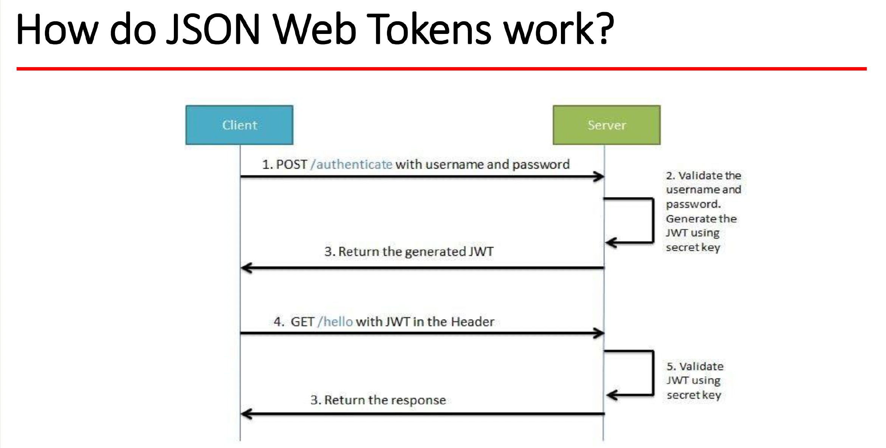

# HW45 - Grace Hu

#### 1. annotations.md
    
#### 2. What is the authentication?
**Authentication** is the process of verifying the identity of a user, device, or system trying to access a resource or perform an action.

It answers the question, "Who are you?"

#### 3. What is the authorization?
**Authorization** is the process of determining what actions, resources, or areas a properly authenticated user or system is allowed to access.

It answers the question, "What are you allowed to do?"

#### 4.What is the difference between authentication and authorization?
**Authentication** and **authorization** often work together in a security system. 

First, a user or system authenticates itself (e.g., by logging in). 

Once authenticated, the authorization process determines what actions that user or system is allowed to perform.

#### 5. What is HTTP Session?
A **session** is a server-side storage mechanism used to maintain state across multiple requests from the same user. When a user logs into a web application or performs an action that requires state management, a session is created on the server. A unique session ID is generated and sent to the client as a cookie or sometimes as a part of the URL.

**Sessions** are produced and managed by the web server or the web application running on the server. The server associates incoming requests with the correct session using the session ID received from the client.

We cannot directly access **session** data from the browser, as it is stored on the server. However, we can find the session ID in the browser, either as a cookie or occasionally as a part of the URL, depending on how the web application implements session management.

#### 6. What is Cookie?
A **cookie** is a small piece of data sent from a web server to a user's browser. The browser stores the cookie and sends it back with each subsequent request to the same server. This allows the server to identify and track users and remember their preferences or other data.

**Cookies** are produced by the web server and sent to the client through HTTP headers. When a browser receives a cookie, it stores it locally and includes it in future requests to the same server using the "Cookie" header.

We can find cookies in your browser's storage. In most browsers, we can access them through the browser's settings or developer tools under the "Application" or "Storage" tab.

#### 7. What is the difference between Session and Cookie?
A **session** is a server-side which is managed on the server whereas a **cookie** is client-side stored on the client's machine (typically in a web browser).

#### 8.How do we use session and cookie to keep user information across the application?
When a user logs into a web application or performs an action that requires state management, a **session** is created on the server. A unique session ID is generated and sent to the client as a cookie or sometimes as a part of the URL.

The browser stores the **cookie** and sends it back with each subsequent request to the same server. This allows the server to identify and track users and remember their preferences or other data.

#### 9. What is JWT?
JSON Web token(JWT) is a way to do user authorization in web apps. Once the user is logged in, each subsequent request will include the JWT, allowing the user to access resources that are permitted with that token.

#### 10. What is the spring security filter?
Spring Security utilizes the filter chain to perform most of the security features. Internally Spring Security maintains a filter chain where each filter has a specific responsibility.

The client sends the request for a resource and the application container creates a filter chain to execute the incoming request. Each HttpServletRequest passes through the filter chain based on the path of the request URI.

#### 11. describe how do JWT work

#### 12. Do you use any Encoder to encode Password?
PasswordEncoder

#### 13. What is UserDetailService? AuthenticationProvider? AuthenticationManager? AuthenticationFilter?
the **AuthenticationFilter** delegates the authentication request to the **AuthenticationManager** which uses **AuthenticationProvider** to process authentication.

The **AuthenticationProvider** uses **UserDetailsService** that implements the user management responsibility. Its primary responsibility is to find a user by its username from the cache or underlying storage.

#### 14. What is the disadvantage of Session? how to overcome the disadvantage?
1. Server-Side Storage and Scalability:

Disadvantage: Sessions are typically stored on the server, which can consume server memory and limit the scalability of the application.

Solution: To overcome this limitation, you can use distributed caching solutions like Redis or Memcached to store session data. These in-memory stores allow us to distribute session information across multiple servers, improving scalability.
2. Performance Overhead:

Disadvantage: Session management can introduce performance overhead, as reading and writing session data on each request can affect response times.

Solution: Optimize the session usage by storing only essential data in the session. Avoid storing large or unnecessary data, and use lazy loading techniques to fetch data from a server when needed instead of storing it in the session.
3. Limited Client-Side Statelessness:

Disadvantage: Sessions can make the application less stateless, which is a fundamental principle of the HTTP protocol. This can lead to difficulties in load balancing and caching.

Solution: Consider using stateless authentication mechanisms like JSON Web Tokens (JWT) for user authentication and authorization. These tokens contain user information and are cryptographically signed, allowing us to maintain user state without relying on server-side sessions.

#### 15. how to get value from application.properties?
The **@Value** allows us to inject property values directly into the beans.

    @Component
    public class JwtTokenProvider {
        @Value("${app.jwt-secret}")
        private String jwtSecret;
        @Value("${app.jwt-expiration-milliseconds}")
        private int jwtExpirationInMs;

#### 16. What is the role of configure(HttpSecurity http) and configure(AuthenticationManagerBuilder auth)?
The **configure(HttpSecurity http)** method defines access rules and security policies, while the **configure(AuthenticationManagerBuilder auth)** method configures how users are authenticated.

The **configure(HttpSecurity http)** method is used to configure security rules related to HTTP requests, access control, and authentication. 

It defines which parts of your application require authentication and authorization, as well as specify how the authentication should be performed.

The **configure(AuthenticationManagerBuilder auth)** method is used to configure the mechanism for authenticating users. 

It defines how user information is stored by specifying authentication providers, such as in-memory users, JDBC-based users, or custom user services.

#### 17. What is Spring security authentication and authorization?
**Authentication** is the process of verifying the identity of a user, device, or system trying to access a resource or perform an action.

It answers the question, "Who are you?"

**Authorization** is the process of determining what actions, resources, or areas a properly authenticated user or system is allowed to access.

It answers the question, "What are you allowed to do?"