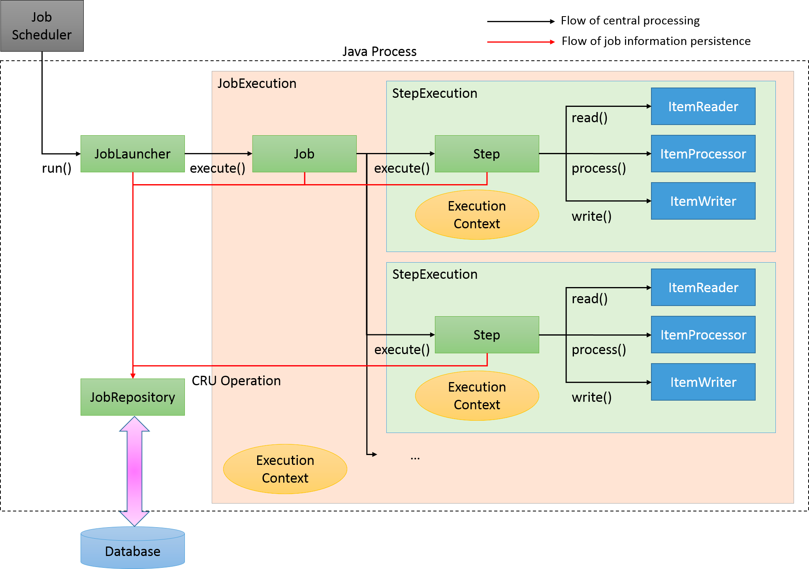
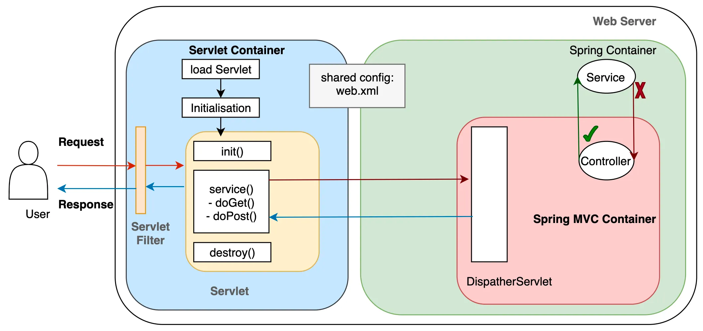
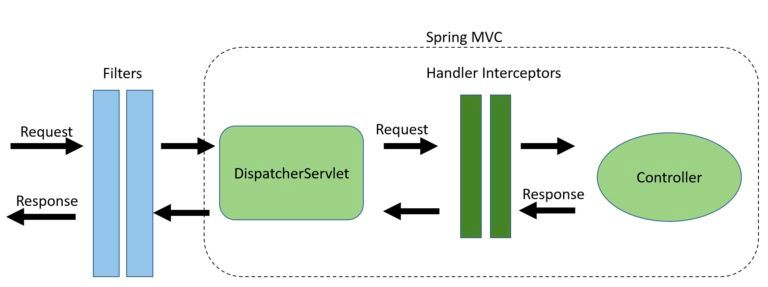
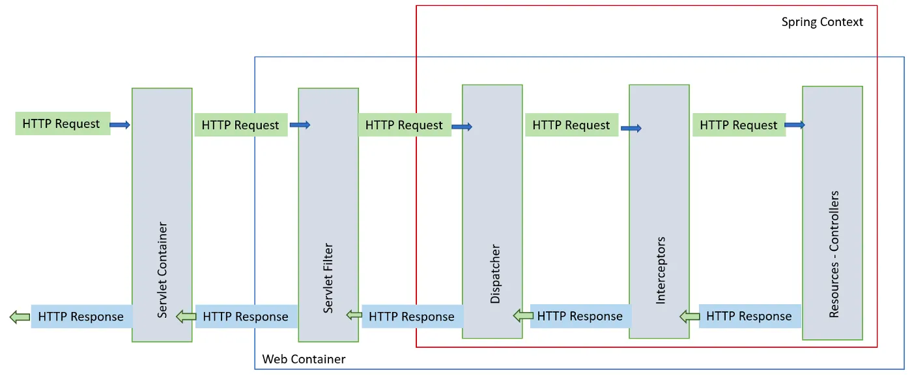

# HW46 - Grace Hu

#### 1. annotations.md
    
#### 2. Briefly reading: https://www.techgeeknext.com/spring-boot/spring-aop-interview-questions

#### 3. What is the Aspect Oriented Programming?
**Aspect-oriented Programming (AOP)** complements Object-oriented Programming (OOP) by providing another way of thinking about program structure. The key unit of modularity in OOP is the class, whereas in **AOP** the unit of modularity is the aspect. Aspects enable the modularization of concerns (such as transaction management) that crosscut multiple types and objects.

**AOP** addresses the problem of cross-cutting concerns, which would be any kind of code that is repeated in different methods and can't normally be completely refactored into its own module, like with logging or verification. So, with AOP we can leave that stuff out of the main code and define it vertically.

#### 4.What are the advantages and disadvantages of Spring AOP?
**advantages**:
- It makes code cleaner, more maintainable. It separates cross-cutting concerns(such as logging, security, and transactions) from the core business logic.
- AOP aspects are reusable across different parts of an application, reducing code duplication and promoting code reusability.
- It simplifies the process of making changes or updates to cross-cutting concerns. easier maintenance.

**disadvantages**:
- complexity of implementing and debugging AOP.
- potential performance issues due to the overhead of the AOP implementation.
- AOP is not supported by all programming languages, so developers may have to use a library or framework to enable AOP in their language.

#### 5. What is Aspect in Spring AOP?
**class** to define all AOP self methods. It encapsulates cross-cutting concerns.

#### 6. What is Pointcut in Spring AOP?
**expression** to find all main application methods to insert advice.

Pointcuts allow us to select the exact places in your codebase where we want to apply the aspect's behavior.

#### 7. What is the Join point in Spring AOP?
It is a specific point in the execution of a program, typically a method or function call, where an aspect can be applied.

#### What does it mean by Advice and its types in Spring AOP?
It is applied to join points based on the defined pointcuts. 

The advice specifies when it should run concerning specific join points.

**types**:
- @Before – Run before the method execution 
- @After – Run after the method returned a result 
- @AfterReturning – Run after the method returned a result, intercept the returned result as well. 
- @AfterThrowing – Run after the method throws an exception 
- @Around – Run around the method execution, combine all three advices above.

#### 9. Reading: https://www.javainuse.com/spring/sprbatch_interview

#### 10. When to use Spring Batch?
an environment where users have to do a lot of batch processing. Ans these steps have to be chained together or we have to create more complex workflows where we have to define which job steps can be run in parallel or have to be run sequentially

Spring Boot Batch provides reusable functions that are essential in processing large volumes of records, including logging/tracing, transaction management, job processing statistics, job restart, skip, and resource management.

#### 11. How Spring Batch works?

* JobLauncher is initiated from the job scheduler.

* Job is executed from JobLauncher.

* Step is executed from Job.

* Step fetches input data by using ItemReader.

* Step processes input data by using ItemProcessor.

* Step outputs processed data by using ItemWriter.

A flow for persisting job information:

* JobLauncher registers JobInstance in Database through JobRepository.

* JobLauncher registers that Job execution has started in Database through JobRepository.

* JobStep updates miscellaneous information like counts of I/O records and status in Database through JobRepository.

* JobLauncher registers that Job execution has completed in Database through JobRepository.

#### 12. How can we schedule a Spring Batch Job?
We use @Scheduled annotation to configure and schedule tasks.

The rules to annotate a method with @Scheduled are:

* the method should typically have a void return type (if not, the returned value will be ignored)
* the method should not expect any parameters

#### What is the cron expression?
Sometimes delays and rates are not enough, and we need the flexibility of a cron expression to control the schedule of our tasks:

EX: 

    @Scheduled(cron = "0 15 10 15 * ?")

With this configuration, Spring will schedule the annotated method to run at 10:15 AM on the 15th day of every month in Paris time.

#### 14.What is the spring task?
Tasklets are meant to perform a single task within a step. Our job will consist of several steps that execute one after the other. Each step should perform only one defined task.

#### 15. When to use Spring task?
Suppose the job to be run a single granular task then Tasklet processing is used.

#### 16. What is Filter and any filter example?

**Filters** are part of the Servlet Container of the web server. It does not belong to any framework like Struts or Spring. 

**Filters** are used to manipulate the requests and the requests can even be blocked before it reaches the Servlet. 

It can also act on responses, and modify them before reaching the client

EX: A Logging Filter that logs request details such as the IP address and the requested path before the request proceeds to the servlet.

* Server-side logging.
* Logging request parameter to log files.
* Auditing
* Server-side authentication and authorization.
* Compression and decompression.
* Encryption and decryption.
* Server-side validation.

#### 17. What is the Interceptor? What we can do with interceptor?
An **Interceptor** in Spring is similar to a Filter but is more integrated with the Spring context. 

It allows us to perform operations before and after the execution of a request handler.

**Uses**: Manipulating requests and responses, logging, authentication, and auditing are common uses of interceptors.

#### 18. In Interceptor, What is preHandle? What is postHandle?
**preHandle**: This method is called before the actual handler is executed. 

It can be used to perform operations before sending the request to the controller.

**postHandle**: This method is executed after the handler returns a ModelAndView object. 

It can be used for additional processing or to manipulate the ModelAndView object before it's rendered to the view.

#### 19. What is Swagger?
**Swagger** is the standard way of documenting the Standard APIs.

**Swagger** is primarily used for documenting API