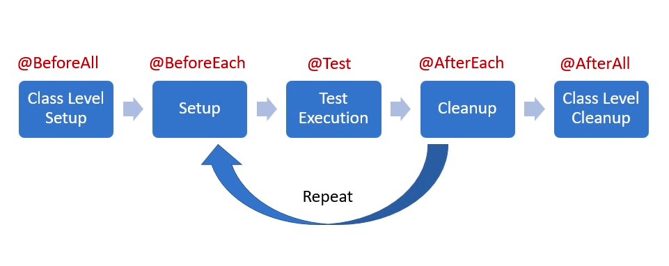

# HW47 - Grace Hu

#### 1. annotations.md
    
#### 2. what is selenium?
user-behaviour simulation

**Selenium** can simulate user interactions with a website, such as clicking links and filling out forms. 

**Selenium** is an open-source automated testing framework provides a range of tools and libraries for automating web browsers, including a WebDriver API, which allows us to control web browsers through Java.

#### 3. what is cucumber?
Given, when and then

**cucumber** is an open-source software tool used for Behavior-Driven Development, a development approach that encourages collaboration between developers, QA, non-technical participants, and business stakeholders in a software project.

requirement being part of test case

#### 4.what is JMeter?
**Apache JMeter** is an open-source software application designed for evaluating the performance and scalability of web applications. 

It simulates a heavy load on servers, networks, or objects to test their strength and analyze overall performance under different load types.

#### 5. What is the lifecircle of Junit?

#### 6. Is @BeforeAll method should be Class level(static)?
Yes it is.

#### 7. What is Mockito? and what is its limitations? what kind of tools can give help?
Mockito is a mocking framework used in Java unit testing. 

It allows developers to create and configure mock objects that can be used to isolate the system under test, ensuring that unit tests are focused only on the code being tested.

**limitations**: 

1. **Mockito** is designed for unit testing and not suitable for integration testing where actual interactions with the database or network are required.
2. lack of ability to mock final, static or private methods

**tools**: JUnit, PowerMockito(solve 2)

#### 8. What is @Mock and what is @InjectMocks?
**@Mock** is used to create a mock object. 

The mock does not retain any of the behavior of the original class; it simply returns defaults (like null, 0, false, etc.) unless its behavior is explicitly stubbed.

**@InjectMocks** is used to create an instance of a class and inject mock fields into it

#### 9. What is the stubbing (define behaviors)?
**stubbing** refers to the practice of defining specific behaviors for mock objects.

It specify what that method should return or how it should behave when it is called during the test.

#### 10. what is Mockito ArgumentMatchers
They are a set of methods to match arguments passed to methods of mocked objects.

They are used in stubbing and verification to provide flexible expectations about the arguments that my mocked methods can accept.

#### 11. what is Hamcrest Matchers
They are expressions used used for writing assertions in tests.

#### 12. do you know @spy? what is difference between @spy and @Mock?
**@Mock** does not retain any of the behavior of the original class; it simply returns defaults (like null, 0, false, etc.) unless its behavior is explicitly stubbed.

**@Spy** by default, retains the behavior of the original class. we can interact with it as though it were a real instance, but we also have the ability to override some methods as needed (similar to partial mocking).

#### 13.What is assertion?
**assertion** is a method used in writing test cases to assert that a certain condition is true. 

Assertions are the means by which we test the expected outcomes of the code.

#### 14. If you have developed a new feature, how many types of tests for this feature? and what kind of tests are written by you? what is the purpose of each type of tests?
1. Unit Tests:

   Written By: Developers.
   
   Purpose: To test individual units of code (like functions or methods) in isolation from the rest of the application.

2. Integration Tests:
   
   Written By: Developers or QA Engineers.
   
   Purpose: To test the interaction between integrated units/modules of the application to ensure they work together as expected.

3. Functional Tests:
   
   Written By: QA Engineers.
   
   Purpose: To test the feature against its functional requirements.

4. End-to-End Tests (E2E Tests):
   
   Written By: QA Engineers.
   
   Purpose: To test the entire application’s workflow from start to finish. This ensures that the entire system functions correctly and the user experience is as expected.

5. User Acceptance Testing (UAT):
   
   Written By: Business stakeholders or actual users.
   
   Purpose: To validate if the feature meets the business needs and is ready for deployment. UAT is done in an environment that simulates the real-world usage as closely as possible.

6. Performance Tests:
   
   Written By: Performance Engineers or QA Engineers.
   
   Purpose: To test how the feature performs under various conditions, including high load, stress, and scalability scenarios. This is important to ensure that the feature remains responsive and stable.

#### 15. Add unit test for CommentServiceImpl, the coverage should be 100%.
Testing each method, exception scenarios, and edge cases in the class. This level of coverage ensures that all aspects of the code are tested, including if-else branch, catch blocks or exception handling logic.

#### 16. write Integration tests for PostController. The tests should cover all scenarios.
