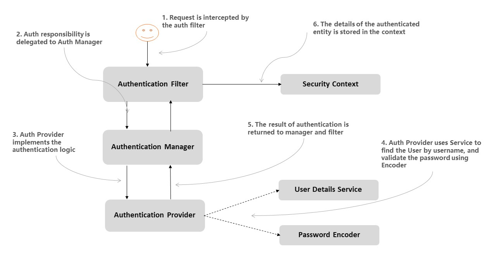

1. List all of the new learned annotations to your annotations.md 
The new annotations is in the annotations47.md file. 

2. what is selenium? 
Selenium is a popular open-source framework for automating web browsers. It provides a way to script interactions with web pages in a manner that simulates the behavior of a human user. Selenium is commonly used for various web testing and automation tasks, including:Web Testing,Regression Testing,Web Scraping,Performance Testing,Cross-browser Testing. 

3. what is cucumber? 
Cucumber is a popular open-source testing tool that is used for behavior-driven development (BDD) and acceptance testing of software applications. It allows software development teams to create and run tests in a human-readable, plain-text format, which is often referred to as "Gherkin." Cucumber is commonly used in conjunction with other testing frameworks and tools like Selenium for web application testing.Cucumber include BDD Approach,Gherkin Language,Test Automation,Cross-Functional Collaboration,Test Reporting.Overall, Cucumber is a valuable tool for teams that want to practice BDD and ensure that their software meets the specified requirements and behaves as expected through automated testing. It helps in creating a common language for discussing and documenting the behavior of software applications.

   
4. what is JMeter? 
Apache JMeter is an open-source performance testing tool designed for analyzing and measuring the performance of web applications and various other services. It is widely used for load testing, stress testing, and performance testing of software systems to ensure they can handle a large number of users or transactions without performance bottlenecks. JMeter was developed by the Apache Software Foundation and is written in Java, making it platform-independent.Key features and use cases of JMeter include Load Testing,Performance Testing,Stress Testing,Functional Testing,Protocol Support,Scripting and Test Scenarios,Plugins and Extensibility,Reporting and Analysi,Distributed Testing.JMeter is a powerful tool that is commonly used by QA and performance testing teams to identify performance bottlenecks, scalability issues, and potential areas for improvement in web applications and services. Its flexibility, extensibility, and active user community have made it a popular choice for performance testing in the software industry.

5. What is the lifecircle of Junit? 
JUnit is a widely used testing framework for Java that provides support for writing and running unit tests. The lifecycle of JUnit typically involves several phases and steps to create, execute, and analyze unit tests. the common lifecycle of JUnit includes Test Class Creation,Test Method Definition,Setup and Teardown,Assertion,Running the Tests,Regression Testing.

6. Is @BeforeAll method should be Class level(static)? 
In JUnit 5, the @BeforeAll method, as well as its counterpart @AfterAll, are used for setup and teardown tasks that apply to the entire test class. Unlike JUnit 4, in JUnit 5, these methods do not need to be static. 

7. What is Mockito? and what is its limitations? what kind of tools can give help? 
Mockito is a popular open-source Java testing framework that is used for creating and managing mock objects in unit tests. Mock objects are placeholders for real objects, and they allow you to isolate and test specific components of your code in isolation, without depending on or interacting with real dependencies.Mockito is used for Creating Mocks,Stubbing,Verification,Clean Isolation.

Limitations of Mockito:
Limited Support for Final Classes and Methods,Lack of Real Implementation,Cannot Mock Static Methods,Complex Setups.

Tools:
PowerMock,JMockit,EasyMock 

8. What is @Mock and what is @InjectMocks? 
@Mock is used to create a mock object for a class or interface. This mock object simulates the behavior of the real object without actually instantiating it. You typically use @Mock to mock dependencies that a class under test interacts with. Mock objects created using @Mock are initialized and managed by Mockito. 
@InjectMocks is used to inject the mock objects created with @Mock into an instance of the class under test. It automatically injects the mock dependencies into the appropriate fields or constructor parameters of the test class. 

9. What is the stubbing (define behaviors)? 
In the context of mocking frameworks like Mockito, stubbing refers to the process of defining the behavior of mock objects or mock methods. It involves specifying what a particular method should return or how it should behave when called during a test. Stubbing is a fundamental concept in unit testing and is used to isolate the code under test from its dependencies, focusing on specific scenarios and ensuring that the code behaves as expected. 

10. what is Mockito ArgumentMatchers 
Mockito ArgumentMatchers are a part of the Mockito mocking framework that allow you to define flexible and expressive argument matching when specifying the behavior of mock methods during stubbing. They are used to match method call arguments in a way that makes it easier to stub methods with various input values and conditions.Mockito ArgumentMatchers are especially helpful when you want to stub a method call but don't want to specify exact argument values. Instead, you want to specify the behavior based on the type or structure of the argument, or you want to match arguments with specific conditions.

11. what is Hamcrest Matchers? 
Hamcrest is a framework for writing matchers in Java that provides a more fluent and expressive way to perform assertions and create custom assertions in your test code. Hamcrest matchers make your tests more readable and maintainable by allowing you to express your expectations in a human-readable, natural language style. Hamcrest matchers can be used in various testing frameworks, such as JUnit, TestNG, and others. They are often integrated with popular testing libraries, like JUnit and Mockito, to provide a more powerful and readable syntax for writing assertions. 

12. do you know @spy? what is difference between @spy and @Mock? 
@Spy in the context of the Mockito mocking framework, which is commonly used for creating and managing mock objects in Java unit tests. Both @Spy and @Mock are used to create mock objects, but there is an important distinction between them.@Mock is used to create a completely new mock object for a class or interface. It creates an instance of the mock object and initializes it. The methods of the mock object do not have any behavior associated with them by default. When you use @Mock, you are creating a clean and empty mock object.@Spy, on the other hand, is used to create a partial mock object. It takes an existing object and converts it into a spy. This means the spy retains the real implementation of the methods by default unless you specify otherwise. You can use when...thenReturn to specify behavior for specific methods, and any un-stubbed methods will behave as they do in the real object.

13. What is assertion? 
An assertion is a fundamental concept in software testing, particularly in unit testing, and it refers to a statement or a piece of code that checks whether a specific condition or expectation holds true in a program. Assertions are used to validate that the actual behavior of the code matches the expected behavior, helping to ensure the correctness and reliability of software.Key characteristics of assertions include Condition Checking,Pass or Fail,Indicating Issues,Test Cases,Preconditions and Postconditions,Reporting and Debugging.

14. If you have developed a new feature, how many types of tests for this feature? and what kind of tests are written by you? what is the purpose of each type of tests? 
When developing a new feature, it's a good practice to apply various types of tests to ensure the feature is robust, behaves correctly, and meets the requirements. The specific types of tests you choose to use may vary based on factors like the complexity of the feature, project requirements, and development methodologies. some common types of tests may consider for a new feature such as Unit Tests,Integration Tests,Functional Tests,Acceptance Tests,Regression Tests,Performance Tests,Usability Tests.  

15. Add unit test for CommentServiceImpl, the coverage should be 100%. 

16. write Integration tests for PostController. The tests should cover all scenarios.

