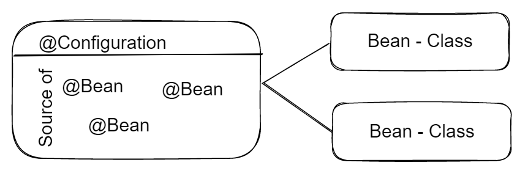

## Homework 4.2

1. **List all of the annotations you learned from class and homework to annotations.md**
    - Updated on hw4.0
<br/>

2. **Type the Comment feature for the class project.**
    - Updated on the code
<br/>

3. **In postman, call of the APIs in PostController and CommentController.**
    
    
<br/>

4. **what is JPA? and what is Hibernate?**
    - JPA: (Java Persistence API) is a specification for accessing, persisting, and managing data between Java objects / classes and a relational database.
    - Hibernate: is an implementation of JPA, just like EclipseLink, OpenJPA, etc.
<br/>

5. **What is Hiraki? what is the benefits of connection pool?**
    - Hiraki: is a JDBC driver implementation using a connection pooling mechanism.
    - Benefits of connection pool:
        - Performance: connection pool can reduce the time spent waiting for a new connection to be established, as new connections will be taken from the pool if one is available.
        - Resource management: connection pool can limit the number of connections used by an application, as well as ensuring that connections are released if they are no longer needed.
        - If not using connection pool, the application will have to create a new connection every time it needs to interact with the database, which is very expensive.
<br/>

6. **What is the `@OneToMany`, `@ManyToOne`, `@ManyToMany`? write some examples.**
    - `@OneToMany`: is used to define a many-to-one relationship between two entities.
        - Example: A post can have many comments, but a comment can only belong to one post.
    - `@ManyToOne`: is used to define a one-to-many relationship between two entities.
        - Example: A post can have many comments, but a comment can only belong to one post.
    - `@ManyToMany`: is used to define a many-to-many relationship between two entities.
        - Example: A post can have many viewers, and a viewer can view many posts.
<br/>

7. **What is the cascade = CascadeType.ALL, orphanRemoval = true? and what are the other CascadeType and their features? In which situation we choose which one?**
    - `cascade = CascadeType.ALL`: is used to propagate all operations (including Hibernate-specific ones) from a parent entity to a child entity.
    - `orphanRemoval = true`: means child entities that are no longer referenced by a parent entity should be automatically removed.
    - Other CascadeType:
        - `CascadeType.PERSIST`: If the parent entity is persisted (saved), the related child entities will also be persisted.
            - Situation: when you want to save the child entities automatically with the parent.
        - `CascadeType.MERGE`: If the parent entity is merged (i.e., updated), the related child entities will also be merged.
            - Situation: when you want to update the child entities automatically with the parent.
        - `CascadeType.REMOVE`: If the parent entity is removed (deleted), the related child entities will also be removed.
            - Situation: when you want to delete the child entities automatically with the parent.
        - `CascadeType.REFRESH`: If the parent entity is refreshed, the related child entities will also be refreshed.
            - Situation: when you want to update the state of the child entities automatically with the parent.
        - `CascadeType.DETACH`: If the parent entity is detached from the current persistence context, the related child entities will also be detached.
            - Situation: when you want to detach the child entities automatically with the parent.
<br/>

8. **What is the `fetch = FetchType.LAZY`, `fetch = FetchType.EAGER`? what is the difference? In which situation you choose which one?
    - `fetch = FetchType.LAZY`: is used to specify that a child entity should be lazily fetched from the database.
        - Situation: when you want to load the child entities only when you need them.
    - `fetch = FetchType.EAGER`: is used to specify that a child entity should be eagerly fetched from the database.
        - Situation: when you want to load the child entities immediately.
<br/>

9. **What is the rule of JPA naming convention? Shall we implement the method by ourselves? Could you list some examples?**
    - JPA naming convention:
        - The name of the method must start with `findBy`, `readBy`, `queryBy`, `countBy`, or `getBy`. 
        - The name of the method must end with the name of the entity property that you want to use for filtering records.
        - The name of the method must not contain the SQL keywords `SELECT`, `FROM`, `WHERE`, `AND`, `OR`, `IN`, or `LIKE`.
        - The name of the method should use camel case.
    - We don't need to implement the method by ourselves, Spring Data JPA (interface) will generate the method for us.
<br/>

10. **Try to use JPA advanced methods in your class project. In the repository layer, you need to use the naming convention to use the method provided by JPA.**
<br/>

11. **(Optional) Check out a new branch(https://github.com/TAIsRich/springboot-redbook/tree/hw02_01_jdbcTemplate) from branch 02_post_RUD, replace the dao layer using JdbcTemplate.**

12. **(Optional) use JDBC to read the data from database.**
<br/>

13. **type the code, you need to checkout new branch from branch 02_post_RUD, name the new branch with https://github.com/TAIsRich/springboot-redbook/tree/hw05_01_slides_JPQL.**
<br/>

14. **What is JPQL?**
    - JPQL: (Java Persistence Query Language) is a query language that allows us to execute queries against entities stored in a relational database.
<br/>

15. **What is @NamedQuery and @NamedQueries?**
    - `@NamedQuery`: is used to define a query that is statically bound to an entity.
    - `@NamedQueries`: is used to define multiple named queries.
<br/>

16. **What is @Query? In which Interface we write the sql or JPQL?**
    - `@Query`: is used to define a query that is dynamically bound to an entity.
    - We write the sql or JPQL in the repository interface.
<br/>

17. **What is HQL and Criteria Queries?**
    - HQL: (Hibernate Query Language) is an object-oriented query language, similar to SQL, but instead of operating on tables and columns, HQL works with persistent objects and their properties.
    - Criteria Queries: is a programmatic, type-safe way to express a query.
<br/>

18. **What is EnityManager?**
    - EntityManager: is used to create and remove persistent entity instances, to find entities by their primary key, and to query over entities.
<br/>

19. **What is SessionFactory and Session?**
    - SessionFactory: is used to create Session objects.
    - Session: is used to get a physical connection with a database.
<br/>

20. **What is Transaction? how to manage your transaction?**
    - Transaction: is a set of operations that must be performed as a single unit of work.
    - We can manage our transaction by using `@Transactional` annotation.
<br/>

21. **What is hibernate Caching?**
    - Hibernate Caching: is a mechanism that allows Hibernate to store the result of a query in a cache, so that, when the query is executed again, the result is retrieved from the cache instead of being regenerated by executing the query against the database.
<br/>

22. **What is the difference between first-level cache and second-level cache?**
    - First-level cache: is associated with the Session object and is enabled by default.
    - Second-level cache: is associated with the SessionFactory object and is disabled by default.
<br/>

23. **How do you understand @Transactional? (不要clone，要⾃⼰抄写并测试transactional，https://github.com/TAIsRich/tutorial-transaction)**
    - `@Transactional`: is used to specify the transactional behavior of a method or a class.
<br/>

24. **Write a simple factory design pattern.**
    ```
    // Create an product interface
    interface Button {
        void render();
    }

    // Concrete implementations for the product interface
    class WindowsButton implements Button {
        @Override
        public void render() {
            System.out.println("Rendering Windows Button");
        }
    }

    class MacButton implements Button {
        @Override
        public void render() {
            System.out.println("Rendering Mac Button");
        }
    }

    // Simple Factory to create product instances
    class ButtonFactory {
        public static Button createButton(String osType) {
            if (osType.equals("Windows")) {
                return new WindowsButton();
            } else if (osType.equals("Mac")) {
                return new MacButton();
            }
            throw new IllegalArgumentException("OS type not supported");
        }
    }

    // Use it to demonstrate the factory pattern
    public class FactoryDemo {
        public static void main(String[] args) {
            Button winButton = ButtonFactory.createButton("Windows");
            winButton.render();

            Button macButton = ButtonFactory.createButton("Mac");
            macButton.render();
        }
    }
    ```


