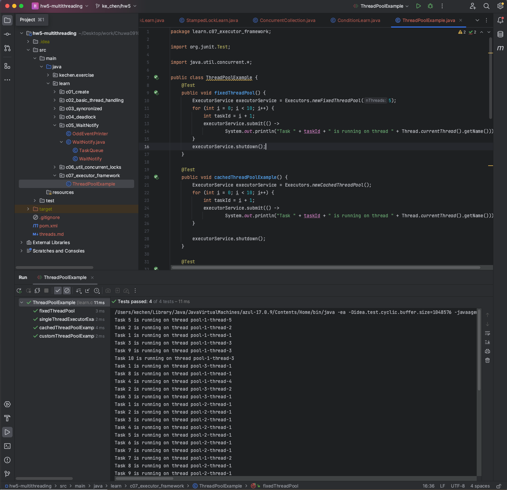

# HW5- Ke Chen - MultiThreading

## 1. Explain volatile variables in java? (we also use it in Singleton)
A volatile variable is basically a keyword that is used to ensure and address the visibility of changes to variables in multithreaded programming. 保证和解决在多线程下variables更改的可见性

This keyword cannot be used with classes and methods, instead can be used with variables. 只能够用在variable上

It is simply used to achieve thread-safety. 

If you mark any variable as volatile, then <u>all the threads can read its value directly from the main memory rather than CPU cache, so that each thread can get an updated value of the variable</u>. 每个thread都能够得到一个已经更新过的variable的值


## 2. how to create a new thread(Please also consider Thread Pool case)?   重要
- https://segmentfault.com/a/1190000038392244#

### 1. extending the thread class
```java
public class myThread extends Thread{
    @Override
    public void run(){
        System.out.println("start new thread using extends thread");
    }
}
public static void main(String args[]){
    Thread t = new myThread();    // JVM没有创建thread
    t.start();   // 此时JVM才创建新的thread
}
```

### 2. implementing runnable interface
```java
public class myRunnale implements Runnable{
    @Override
    public void run(){
        System.out.println("Start new thread using Runnable");
    }
}
public static void main(String args[]){
    Thread t = new myThread(new myRunnable());    
}
```

### 3. implements callable interface
```java
public class myCallable implements Callable<String>{
    @Override
    public String call() throws Exception{
        Thread.sleep(5000);
        return "Start new thread using Callable";
    }
}
```

### 4. using a thread pool
Java provides the ExecutorService framework for this purpose.
```java
import java.util.concurrent.ExecutorService;
import java.util.concurrent.Executors;

public class ThreadPoolExample {
    public static void main(String[] args) {
        // Create a thread pool with a fixed number of threads
        ExecutorService executor = Executors.newFixedThreadPool(5);

        // Submit tasks to the thread pool
        for (int i = 0; i < 10; i++) {
            Runnable task = new MyRunnable(); // Replace MyRunnable with your task logic
            executor.submit(task);
        }

        // Shutdown the thread pool when you're done with it
        executor.shutdown();
    }
}
```


## 3. What is callable? Difference between Runnable and Callable interface?
1. return type
- runnable has no return.
- callable has return.
2. method
- runnable uses the run() method to define a task.
- callable uses the call() method to define a task.


## 4. what is the difference between t.start() and t.run()?
1. basic
- t.start() <u>creates a new thread</u> to excute the task, invoking the run() method in that separate thread for concurrent execution.
- t.run() <u>creates no new thread</u> and excute the task in the current thread, leading to sequential execution.
2. time
- t.start(): One can call the start() method only once.  只能对一个线程对象调用 start() 方法一次(会初始化一个新的系统级线程，并在该线程中执行相关的 run() 方法。)
- t.run(): One can call the run() method multiple times.  run() 方法的每次调用都是在当前线程（通常是主线程）中执行，而不会创建新的线程。这意味着它会按照顺序执行 run() 方法，而不是并发执行。


## 5. Which way of creating threads is better: Thread class or Runnable interface?
Runnable interface.

As implementing Runnable makes your code loosely coupled as the code of thread is different from the class that assign job to the thread. 

<u>It requires less memory and also allows a class to inherit any other class.</u>


## 6. what is the thread status?    hard，知道概念
- https://segmentfault.com/a/1190000038392244#

A thread can have one of the following states during its lifetime:
1. `New`: 
- a Thread class object is created but doesn't start until call the start() method.  
- 新创建了一个线程对象，但还没有调用start()方法.
2. `Runnable`:
- <u>the thread is ready to run after calling the start() method</u>. However, the thread is not yet selected by the thread scheduler. <u>the thread scheduler picks the thread from the ready state, and the thread is running</u>. 
- Threads in this state are executing or ready to execute.
- Java线程中将就绪（ready）和运行中（running）两种状态, 笼统的称为“runnable”。
- 线程对象创建后，其他线程(比如main线程）调用了该对象的start()方法。该状态的线程位于可运行线程池中，等待被线程调度选中，获取CPU的使用权，此时处于就绪状态（ready）。就绪状态的线程在获得CPU时间片后变为运行中状态（running）
3. `Blocked` :
- A thread is waiting for a monitor lock to enter or reenter a synchronized block/method.
- This state occurs when a thread attempts to access a synchronized block that is already held by another thread.
- 表示线程阻塞于锁，试图访问另一个线程已经持有的a synchronized block
4. `Waiting`: 
- A thread is waiting indefinitely for another thread to perform a specific action.
- This state occurs when a thread is waiting, without a timeout, for another thread to perform a particular task. 
- 进入该状态的线程需要等待其他线程做出一些特定动作（通知或中断）。处于这种状态的线程不会被分配CPU执行时间，它们要等待被显式地唤醒，否则会处于无限期等待的状态
5. `Timed_waiting`:
- A thread is waiting for another thread to perform a specific action, but with a timeout specified.
- Threads in this state are waiting for a specified amount of time.
- 该状态不同于WAITING，处于这种状态的线程不会被分配CPU执行时间，不过无须无限期等待被其他线程显示地唤醒，在达到一定时间后它们会自动唤醒。
6. `Dead/Terminated`: 
- <u>A thread is in terminated or dead state when the run() method exits</u>.
- 表示该线程已经执行完毕。


## 7. difference between wait() and sleep() method   重要

Key Differences between wait() and sleep():

1. Usage Context:
- wait() <u>is used for synchronization and inter-thread communication, typically within synchronized blocks, for thread coordination.</u> 用于同步和线程间通信，通常在同步块内，用于线程协调。
- sleep() <u>is used to introduce delays or pause execution for a specified time,</u> independent of synchronization and locking. 用于在指定的时间内引入延迟或暂停执行，独立于同步和锁定。

2. Method Invocation:
- wait() <u>is invoked on an object instance</u> and releases the lock on the object, allowing other threads to access the synchronized block or method.  在对象实例上调用wait（），并释放对象上的锁，允许其他线程访问同步块或方法。
- sleep() <u>is invoked on the Thread class directly</u> and doesn't release any locks held by the thread. 直接在线程类上调用，不会释放线程持有的任何锁

3. Lock Release:
- wait() <u>releases the lock on the object</u>, allowing other threads to acquire the lock or invoke notify()/notifyAll(). 释放对象上的锁，允许其他线程获取锁或调用notify（）/notifyall（）
- sleep() <u>doesn't release any locks</u>; the thread retains its locks while it's sleeping. 不会释放任何锁；线程在睡觉时保留其锁。


### wait():
- wait() is a method available in the Object class, and it's used for thread synchronization and inter-thread communication(线程同步和线程间通信).
- <u>When a thread calls wait() on an object, it release the lock it holds on that object and enters a waiting state.</u> 当线程调用对象上的wait（）时，它释放该对象的锁并进入等待状态。
- <u>The thread remains in a waiting state until another thread calls notify() or notifyAll() on the same object, which allows the waiting thread to wake up and reacquire the lock for further execution.</u> 该线程保持等待状态，直到另一个线程对同一对象调用Notify（）或NotifyAll（），它被唤醒并获取锁以供进一步执行。

```java
synchronized (sharedObject) {
    while (conditionIsNotMet()) {
        sharedObject.wait(); // Releases lock and waits for notification
    }
}
```

### sleep():
- sleep() is a method provided by the Thread class, and it's used to <u>pause the execution of a thread for a specified amount of time.</u> 在指定的时间内暂停线程的执行
- When a thread calls sleep(milliseconds), it temporarily suspends its execution for the specified duration without releasing any locks it holds.
- <u>The thread transitions to the TIMED_WAITING state during the sleep duration and then returns to the RUNNABLE state when the sleep duration elapses or is interrupted.</u> 在睡眠持续时间内，线程过渡到定时等待状态，然后在睡眠持续时间延长或中断时返回运行状态。

```java
try {
    Thread.sleep(1000); // Pauses the current thread for 1 second
} catch (InterruptedException e) {
    // Handling interrupted exception
}
```


## 8. What is deadlock?   重要，理解概念就行
Deadlock is <u>a situation where multiple threads are blocked forever</u>.  多个线程blocked
It generally occurs when multiple threads hold locks on different resources and are waiting for other resources to complete their task.

<u>For example: Thread 1 is holding Object 1 but needs object 2 to complete processing, whereas Thread 2 is holding Object 2 but needs object 1 first. In such conditions, both of them will hold lock forever and will never complete tasks.</u>


## 9. how do threads communicate with each other?
Threads can communicate <u>using three methods i.e., wait(), notify(), and notifyAll().</u>

**笔记：**

**notify():**
- notify() is used by a thread to wake up one of the threads that are waiting on the same object's monitor (chosen non-deterministically).
- When a thread calls object.notify(), it notifies one waiting thread (if any) that it can wake up and reacquire the lock on the object. 唤醒同一个object下的waiting状态的any thread，thread之间进行竞争之后获得锁
- The awakened thread does not immediately regain the lock; it competes for the lock with other threads.

```java
synchronized (sharedObject) {
    sharedObject.notify(); // Notifies one waiting thread to wake up
}
```

**notifyAll():**
- notifyAll() is used by a thread to wake up all threads that are waiting on the same object's monitor.
- When a thread calls object.notifyAll(), it notifies all waiting threads on that object, allowing them to wake up and compete for the lock.  唤醒同一个object下的waiting状态下的all threads，thread之间进行竞争之后获得锁
- It's generally used when multiple threads are waiting for a similar condition to change.

```java
synchronized (sharedObject) {
    sharedObject.notifyAll(); // Notifies all waiting threads to wake up
}
```


## 10. what is join() method?
join() method <u>causes the currently running threads to stop executing / until the joined thread completes its task.</u> 让当前正在运行的线程停止执行，直到它加入的线程完成其任务。

It allows one thread to wait for the completion of another thread.

t1.join() t1加入，被停止的线程等待t1结束后再继续


## 11. what is yield() method?
A yield() method is a static method of Thread class and it is <u>used to give a hint to the scheduler that the current thread is willing to yield its current use of the processor</u>. 向调度器强调当前线程愿意放弃其当前对处理器的使用

This method allows the thread to voluntarily pause its execution and <u>give other threads of the same priority a chance to run.</u> 允许线程自愿暂停执行，并给具有相同优先级的其他线程一个运行的机会。

If in case there are no waiting threads or if all the waiting threads have low priority then the same thread will continue its execution. 如果在没有等待线程的情况下，或者如果所有等待线程的优先级较低，则同一线程将继续执行。


## 12. Explain thread pool.  重要
Java Thread pool represents <u>a group of threads that are waiting for the task to be allocated</u>. 等待分配任务

<u>It's a mechanism used to manage and control the creation, reusing, and lifetime of threads, providing a more efficient way of handling multiple tasks concurrently in a multithreaded environment.</u>

- Threads in the thread pool are supervised by the service provider which pulls one thread from the pool and assign a job to it.
- After completion of the given task, thread again came to the thread pool.
- The size of the thread pool depends on the total number of threads kept at reserve for execution.

线程池中的线程由服务提供商监督，服务提供商从池中提取一个线程并为其分配作业。给定的任务完成后，线程再次进入线程池。线程池的大小取决于保留执行的线程总数。

Using thread pools generally offers better performance and resource management compared to creating single threads directly. <u>Thread pools control the number of concurrent tasks, reduce the overhead of thread creation and destruction, and improve 
performance.</u> Moreover, <u>thread pools allow task queuing for pending execution</u>, automatically manage thread lifecycles, and provide more flexible error handling mechanisms. However, in some simple scenarios, using a single thread might be more 
straightforward.

使用线程池通常比直接创建单个线程具有更好的性能和资源管理。<u>线程池可以控制并发任务的数量，减少线程创建和销毁的开销</u>，提高性能。此外，线程池还可以<u>对等待执行的任务进行排队</u>，自动管理线程的生命周期，并提供更灵活的错误处理机制。然而，在某些简单的场景中，使用单个线程可能会更简单。


```java
import java.util.concurrent.*;
public class Main {
    public static void main(String[] args) {
        // 创建一个固定大小的线程池:
        ExecutorService es = Executors.newFixedThreadPool(4);
        for (int i = 0; i < 6; i++) {
            es.submit(new Task("" + i));    // 创建a thread for task
          // 不用thread pool的话，怎么创建和执行一个thread.
          // Thread t0 = new Thread(new Task(" " + i));
          // t.start();
        }
        // 关闭线程池:
        es.shutdown();
    }
}
class Task implements Runnable {
    private final String name;
    public Task(String name) {
        this.name = name;
    }
    @Override
    public void run() {
        System.out.println("start task " + name);
        try {
            Thread.sleep(1000);
        } catch (InterruptedException e) {
        }
        System.out.println("end task " + name);
    }
}
```


## 13. What is Executor Framework in Java, its different types and how to create these executors?

### What is Executor Framework:

The Executor Framework in Java, introduced in the java.util.concurrent package, provides a high-level abstraction <u>for managing and executing tasks asynchronously using a pool of threads</u>. It's designed to <u>simplify concurrent programming by decoupling task submission from task execution</u>(通过解耦提交任务+执行任务，来简化并发编程), <u>offering various types of executors to suit different task execution strategies.</u>（提供不同类型的executors来适应不同的任务执行策略）

- The executor framework is an implementation of the Producer-Consumer pattern. 是生产者-消费者模式
- The java.util.concurrent.Executors class provides a set of methods for creating ThreadPools of worker threads.
- In order to use the executor framework, we have to create a thread pool for executing the task by submitting that task to that thread pool. 必须创建一个thread pool，通过submit task到thread pool来执行task（我觉得executor framework就是用来create thread pool）

### Different types of executors in the Executor Framework and how to create these executors:

Creating executors using the Executor Framework involves <u>using the java.util.concurrent package classes (ThreadPoolExecutor, Executors) to create instances of ExecutorService or ScheduledExecutorService.</u>  

1. `ThreadPoolExecutor`:

- The ThreadPoolExecutor is a versatile executor that provides a flexible thread pool implementation with configurable core pool size, maximum pool size, work queue capacity, thread keep-alive time, and more. 
- 是一个多功能的executor，它提供了一个灵活的线程池实现，具有可配置的核心池大小、最大池大小、工作队列容量、线程保持时间等。
- It's created using the ThreadPoolExecutor class constructor, specifying the desired parameters like core pool size, maximum pool size, queue type, etc.
- 它是使用ThreadPoolExecutor类构造函数创建的，指定所需的参数，如核心池大小、最大池大小、队列类型等。\

```java
ExecutorService executor = new ThreadPoolExecutor(
    corePoolSize,
    maximumPoolSize,
    keepAliveTime,
    TimeUnit.SECONDS,
    new LinkedBlockingQueue<>()
);
```

2. `FixedThreadPool`:

The Executors.newFixedThreadPool() method creates a thread pool with a fixed number of threads. Once created, the number of threads in the pool remains constant.  创建一个固定线程数的thread pool

```java
ExecutorService executor = Executors.newFixedThreadPool(5);
```

3. `CachedThreadPool`:

The Executors.newCachedThreadPool() method creates a thread pool that dynamically adjusts the number of threads based on the workload. Threads are created on-demand and terminated after a specified idle time.  创建一个可以根据workload动态调整thread pool中的线程数

```java
ExecutorService executor = Executors.newCachedThreadPool();
```

4. `ScheduledThreadPool`:

The Executors.newScheduledThreadPool() method creates a thread pool that is suitable for scheduling tasks to be executed periodically or after a specified delay.  创建一个适合定期或在指定延迟后执行调度任务的线程池

```java
ScheduledExecutorService executor = Executors.newScheduledThreadPool(3);
```

4. `SingleThreadExecutor`:

The Executors.newSingleThreadExecutor() method creates a thread pool with a single thread. It ensures that tasks are executed sequentially in the order they are submitted.  创建一个只包含一个thread的thread pool

```java
ExecutorService executor = Executors.newSingleThreadExecutor();
```


## 14. Difference between shutdown() and shutdownNow() methods of executor
In Java's Executor Framework, both shutdown() and shutdownNow() methods are used to shut down an ExecutorService and stop accepting new tasks.  都是用来关闭an ExecutorService并且停止接受新task

- shutdown():  allows the threads in the thread pool to finish executing the tasks that they have already started or are currently executing. 允许线程池中的线程完成已经开始或正在执行的任务。
- shutdownNow():attempts to abruptly shut down the ExecutorService by interrupting the executing threads, halts the processing of waiting tasks, and returns a list of the tasks that were awaiting execution.  试图立即停止ExecutorService，中断执行线程，停止处理等待的任务，并返回正在队列中等待执行的任务列表。


## 15. What is Atomic classes? when do we use it?   重要
- 原子操作实现了无锁的线程安全；(使用 synchronized关键字 和 CAS来实现加锁效果。)
- 适用于计数器，累加器等。
- CAS（Compare-and-Swap）是一种乐观锁的实现方式，全称为“比较并交换”，是一种无锁的原子操作。
- CAS：https://javabetter.cn/thread/cas.html
- Java atomic包中的原子操作类（AtomicInteger）总结：https://javabetter.cn/thread/atomic.html#预备知识-cas操作

### what is atomic classes:
In Java, the java.util.concurrent.atomic package provides atomic classes that <u>offer atomic operations on single variables without requiring explicit synchronization using locks. </u>

These classes ensure that operations on the variables are thread-safe and indivisible, avoiding race conditions in multithreaded environments.

```java
// 假定线程 A 正在修改 count 变量，为了保证线程 B 在使用 count 的时候是线程 A 修改过后的状态，可以用 synchronized 关键字同步一手。
private long count = 0;
public synchronized void write() {
    System.out.println("ke chen");
    count++;
}
//但多个线程之间访问 write() 方法是互斥的，线程 B 访问的时候必须要等待线程 A 访问结束，有没有更好的办法呢？
//AtomicInteger 是 JDK 提供的一个原子操作的 Integer 类，它提供的加减操作是线程安全的。于是我们可以这样：
private AtomicInteger count = new AtomicInteger(0);
public void write() {
    System.out.println("ke chen");
    count.incrementAndGet();
}
```

### The primary atomic classes in Java include: 原子操作的基本数据类型
- AtomicBoolean: Provides atomic operations on a boolean variable. 以原子更新的方式更新 boolean；
- AtomicInteger: Provides atomic operations on an int variable. 以原子更新的方式更新 Integer;
- AtomicLong: Provides atomic operations on a long variable. 以原子更新的方式更新 Long；
- AtomicReference: Provides atomic operations on a reference variable. 以原子更新的方式更新 reference；

这几个类的用法基本一致，这里以 AtomicInteger 为例：
- addAndGet(int delta) ：增加给定的 delta，并获取新值。
- incrementAndGet()：增加 1，并获取新值。
- getAndSet(int newValue)：获取当前值，并将新值设置为 newValue。
- getAndIncrement()：获取当前值，并增加 1。
- 还有一些方法，可以直接查看 API，都很好理解。

### when do we use it: 
Counter， accumulator（适用于计数器，累加器等）


## 16. What is the concurrent collections? 并发集合  重要
Java提供了对应的thread-safe的集合，方便我们直接使用。

Concurrent collections in Java, available in the java.util.concurrent package, <u>are thread-safe alternatives to the traditional non-concurrent collections (such as ArrayList, HashMap, LinkedList, etc.). </u>

These concurrent collections <u>are designed to be used in multithreaded environments, providing thread safety and high-performance access to shared data structures.</u>


How to create a thread-safe collection：
1. Using Concurrent Collections:
```java
Map<String, String> map = new ConcurrentHashMap<>();
```
2. Using Collections.synchronizedXXX() Methods:
```java
Map unsafeMap = new HashMap();
Map threadSafeMap = Collections.synchronizedMap(unsafeMap);
```


## 17. what kind of locks you know?  知道存在和各个锁的特性即可

### ReentrantLock` 可重入锁
- 和synchronized一样，一个线程可以多次获取同一个锁
- 我们知道Java语言直接提供了synchronized关键字用于加锁，但这种锁一是很重，二是获取时必须一直等待，没有额外的尝试机制。
- java.util.concurrent.locks包提供的ReentrantLock用于替代synchronized加锁
- 因为synchronized是Java语言层面提供的语法，所以我们不需要考虑异常，而ReentrantLock是Java代码实现的锁，我们就必须先获取锁，然后在finally中正确释放锁。
- ReentrantLock is a lock implementation from the java.util.concurrent.locks package that offers more functionality than synchronized blocks.
- It provides features like lock interruption, timed lock attempts, condition variables (Condition), and the ability to create fair or unfair locks.

```java
private final Lock rlock = new ReentrantLock();
private int count;
public void add(int n){
    rlock.lock();   获取锁
    try{
        count += n;    加锁内容
    }finally{
        Rlock.unlock(); 必须先获取锁，然后在finally中正确释放锁
    }
}
```

### `ReadWriteLock`  悲观锁
- Multiple threads can hold the read lock simultaneously, while the write lock is exclusive. 多个线程可以同时持有读锁，而写锁是独占的。
- 只允许一个线程写入（其他线程既不能写入也不能读取）。 
- 没有写入时，多个线程允许同时读（提高性能）。
- ReadWriteLock适合读多写少的场景。
- 悲观锁，因为读的过程中是不允许写的。

```java
public class Counter{
    private final ReadWriteLock rwlock = new ReentrantReadWriteLock();
    private final Lock rlock = rwlock.readLock();   //读锁和写锁是分开的
    private final Lock wlock = rwlock.writeLock();
    private int[] counts = new int[10];

    public void inc(int index){
        wlock.lock(); // 加写锁
        try{
            counts[index] += 1;
        }finally{
            wlock.unlock(); // 释放写锁
        }
    }

    public int[] get(){
        rlock.lock(); // 加读锁
        try{
            return Arrays.copyOf(counts, counts.length);
        }finally{
            rlock.unlock(); // 释放读锁
        }
    }
}
```

### `StampedLock` 乐观锁
- Introduced in Java 8, StampedLock is an advanced lock that provides three modes: read, write, and optimistic read. 它提供了三种模式：读取、写入和乐观读取。
- It supports optimistic locking for read operations, which can be beneficial in certain scenarios with low contention. 它支持读取操作的乐观锁定，这在某些争用率较低的情况下是有益的
- 乐观锁，读的过程中允许写，但可能造成数据不一致的问题，所以需要写代码handle。
- 获得一个乐观读锁 --> 检查乐观读锁后是否有其他写锁发生 --> 获取一个乐观读锁  --> 释放乐观读锁

```java
1. long stamp = stampedLock.tryOptimisticRead();  // 获得一个乐观读锁
2. !stampedLock.validate(stamp)   // 检查乐观读锁后是否有其他写锁发生
3. stamp = stampedLock.readLock();   // 获取一个乐观读锁
4. stampedLock.unlockRead(stamp);   // 释放乐观读锁
```

```java
public class Point {
    private final StampedLock stampedLock = new StampedLock();
    private double x;
    private double y;
    public void move(double deltaX, double deltaY) {
        long stamp = stampedLock.writeLock(); // 获取写锁
      try {
            x += deltaX;
            y += deltaY;
        } finally {
            stampedLock.unlockWrite(stamp); // 释放写锁
        }
    }

    public double distanceFromOrigin() {
        long stamp = stampedLock.tryOptimisticRead(); // 获得一个乐观读锁
        // 注意下面两行代码不是原子操作
        // 假设x,y = (100,200)
        double currentX = x;
        // 此处已读取到x=100，但x,y可能被写线程修改为(300,400)
        double currentY = y;
        // 此处已读取到y，如果没有写入，读取是正确的(100,200)
        // 如果有写入，读取是错误的(100,400)
        if (!stampedLock.validate(stamp)) { // 检查乐观读锁后是否有其他写锁发生
            stamp = stampedLock.readLock(); // 获取一个悲观读锁
            try {
                currentX = x;
                currentY = y;
            } finally {
                stampedLock.unlockRead(stamp); // 释放悲观读锁
            }
        }
        return Math.sqrt(currentX * currentX + currentY * currentY);
    }
}
```


## 18. What is the difference between class lock and object lock?

1. Scope:
- Object locks <u>operate at the instance level</u>, ensuring synchronization for methods and blocks accessed by multiple threads within a specific object.
- Class locks <u>operate at the class level</u>, ensuring synchronization for static methods or blocks accessed by multiple threads across all instances of the class.
2. Usage:
- Object locks <u>are used to synchronize instance methods and blocks</u>.
- Class locks <u>are used to synchronize static methods and blocks</u>.

### class lock (Static Lock):
- Class lock or static lock is associated with the class itself rather than with its instances.
- When a static synchronized method or synchronized block is used, it locks on the class level, preventing multiple threads from accessing the synchronized static methods concurrently across all instances of the class.

```java
public class MyClass {
    public static synchronized void synchronizedStaticMethod() {
        // This method uses the class's lock
    }

    public static void synchronizedStaticBlock() {
        synchronized (MyClass.class) {
            // This block uses the class's lock explicitly
        }
    }
}
```

### Object Lock (Instance Lock): 
- Object lock or instance lock is associated with an individual instance (object) of a class.
- When a synchronized method or synchronized block is applied to an instance method or block using the synchronized keyword, it uses the object's lock to provide thread synchronization.

```java
public class MyClass {
    public synchronized void synchronizedMethod() {
        // This method uses the object's lock
    }

    public void synchronizedBlock() {
        synchronized (this) {
            // This block uses the object's lock explicitly
        }
    }
}
```


## 19. What is future and completableFuture? give me the example in your experience.  超级大重点

`Future` <u>provides a basic interface for interacting with the result of an asynchronous computation</u>, while `CompletableFuture` <u>offers a richer set of features for handling and chaining multiple asynchronous computations with more control and flexibility.</u>

- batch_payment:
    - 单线程版本
    
    - future版本
    
    - complatableFuture版本
    
    

### future interface
A Future interface <u>represents the result of an asynchronous computation that may not yet be available.</u>

<u>It provides methods like get(), cancale(), isDone() to check if the computation is completed, cancel the computation, and retrieve the result (if available).</u>

The result is retrieved using Future’s get() method when the computation has completed, and it blocks until it is completed. 

- runnable 没有返回值，callable有返回值。并且Callable接又是一个泛型接口，可以返回指定类型的结果。
- 现在的问题是，如何获得异步执行的结果？
- 当我们提交一个Callable任务后，我们会同时获得一个Future对象，然后，我们在主线程某个时刻调用Future对象的get()方法，就可以获得异步执行的结果。在调用get()时，如果异步任务已经完成，我们就直接获得结果。如果异步任务还没有完成，那么get()会阻塞，直到任务完成后才返回结果
- 一个Future<V>接又表示一个未来可能会返回的结果，它定义的方法有：
    - get()：获取结果（可能会等待）
    - get(long timeout, TimeUnit unit)：获取结果，但只等待指定的时间；
    - cancel(boolean mayInterruptIfRunning)：取消当前任务；
    - isDone()：判断任务是否已完成
- 对线程池提交一个Callable任务，可以获得一个Future对象，可以用Future在将来某个时刻获取结果

假设我们要出一个商家的过去一个月的销售订单金额。并且该步骤消耗时间很长。

传统方法（顺序执行）：
1.  获得所有订单的信息（阻塞，等待结果，数据量大，耗时间很长）
2.  获得商家信息
3.  从daily file中获得数据
4.  在数据库中创建一行含有基本信息的记录。
5.  并将订单数据处理并populate到数据库中

多线程（并发执行）:
1.  获得所有订单的信息, Future future = executor.submit(task); (不阻塞)
2.  获得商家信息
3.  从daily file中获得数据
4.  在数据库中创建一行含有基本信息的记录。
5.  future.get()获取订单数据，并将订单数据处理并populate到数据库中。
    - 可能阻塞，如果订单数据还没获取完
    - 可能不阻塞，已经有了结果。


### completableFuture

<u>CompletableFuture (introduced in Java 8) is an implementation of Future</u>.

It also represents a future result of an asynchronous computation. 

<u>CompletableFuture provides various methods like thenApply(), thenAccept(), thenCompose(), exceptionally(), handle(), etc., allowing developers to chain asynchronous computations and handle results or errors more flexibly.</u>

- An asynchronous programming tool introduced in Java 8
- Implements the Future interface, providing powerful asynchronous capabilities
- Supports chaining operations for easy combination and management of multiple asynchronous tasks
- Non-blocking asynchronous operations

使用Future获得异步执行结果时，要么调用阻塞方法get()，要么轮询看isDone()是否为true，这两种方法都不是很好，因为主线程也会被迫等待。

从Java 8开始引入了CompletableFuture，它针对Future做了改进，可以传入回调对象，当异步任务完成或者发生异常时，自动调用回调对象的回调方法。

CompletableFuture可以指定异步处理流程：
- basic method:
    - `get()`: 获取异步计算的结果，这是一个阻塞方法，会等待异步任务完成并返回结果后再继续执行下面的代码。会阻塞在 XX.get() 这一行，直到异步任务完成。

    - `complete()`: 手动完成（resolve） CompletableFuture 的计算，并将其结果设置为指定的值。
    

    - `whenComplete()`: 不对结果进行转换，而是在 CompletableFuture 完成（无论是正常完成还是异常完成）时触发操作。它接收一个 BiConsumer 参数，在 CompletableFuture 完成时会执行该操作。

- Creating a CompletableFuture:
    - `supplyAsync()`: 返回一个 CompletableFuture\<U> 对象，其中的 U 类型是 Supplier 对象的返回类型；

    - `runAsync()`: 返回一个 CompletableFuture<Void> 对象，表示异步任务没有返回值。
    

- Result Processing and Transformation:   串行化另一个cf
    - `thenApply()`: 在当前 CompletableFuture 执行完成后，执行指定的函数，并返回一个新的 CompletableFuture 对象，该对象包含函数执行后的结果。
    

    - `thenAccept()`: 在当前 CompletableFuture 执行完成后，执行指定的函数，不会返回一个新的 CompletableFuture 对象。
    

    - `thenRun()`: 在当前 CompletableFuture 执行完成后，执行指定的操作，不关心前面 CompletableFuture 的执行结果，也不会返回一个新的 CompletableFuture 对象
    

- 并行化多个cf:
    - `allOf()`: 接受一组 CompletableFuture 对象作为参数，并返回一个新的 CompletableFuture 对象。
        - 这个方法并不关心这些 CompletableFuture 对象的返回值，它只关心这些 CompletableFuture 对象是否完成。
        - 新产生的对象本身并不包含任何结果，而是用于跟踪和管理传入的 CompletableFuture 对象的完成状态。
    
    

- Combination and Linking:
    - `thenCompose()`: 将两个 CompletableFuture 对象进行连接（compose），并在一个 CompletableFuture 完成后，使用其结果去触发另一个 CompletableFuture 的执行。
    

    - `thenCombine()`: 用于将两个独立的 CompletableFuture 对象的结果进行组合操作，并返回一个新的 CompletableFuture 对象。
    

    - `thenAcceptBoth()`: 接受两个独立的 CompletableFuture 对象作为参数，并在两个 CompletableFuture 都完成后执行一个消费者操作。
    

- Exception Handling:
    - `handle()`: 对 CompletableFuture 中的结果或异常进行处理。它接收一个 BiFunction 参数，这个函数式接口能够处理正常结果和异常情况。如果 CompletableFuture 成功完成并得到结果，则此函数会被调用来处理结果；如果出现异常，则也会调用此函数来处理异常。

    - `exceptionally()`: 捕获到 CompletableFuture 中的异常。它接收一个 Function 参数，能够处理异常并返回默认值（即处理异常的结果）。
    

```java
public class FutureVsCompletableFuture {
    @Test
    public void testFuture(){
        ExecutorService executorService = Executors.newFixedThreadPool(2);

        /*
        testFuture() 使用了 Future 的 get() 方法获取异步计算的结果，这是一个阻塞方法，会等待异步任务完成并返回结果后再继续执行下面的代码。
        因此，testFuture() 方法会阻塞在 futureResult.get() 这一行，直到异步任务完成。
         */
        Future<Integer> futureResult = executorService.submit(() -> {
            TimeUnit.SECONDS.sleep(5);  //延迟
            return 10 + 20;
        });

        try{
            System.out.println("Performing other tasks...");

            int result = futureResult.get();
            System.out.println("Result from the future: " + result);

            System.out.println("----");
            for (int i = 0; i < 7; i++) {
                System.out.println("step " + i);
                try {
                    Thread.sleep(1000);
                } catch (InterruptedException e) {
                    e.printStackTrace();
                }
            }
        }catch (InterruptedException | ExecutionException e){
            e.printStackTrace();
        }finally {
            executorService.shutdown();
        }
    }

output：
Performing other tasks...
Result from the future: 30
----
step 0
step 1
step 2
step 3
step 4
step 5
step 6

    @Test
    public void testCompletableFuture(){
        // 使用了 CompletableFuture 的 thenAccept() 方法处理异步计算的结果，这是一个非阻塞方法，不会阻塞主线程继续执行后续代码。
        // 在 testCompletableFuture() 中，thenAccept() 方法处理结果的操作是一个异步回调，会在异步任务完成后执行，但不会阻塞主线程。
        CompletableFuture<Integer> completableFuture = CompletableFuture.supplyAsync(() -> {
            try{
                TimeUnit.SECONDS.sleep(5);  //延迟
            }catch (InterruptedException e){
                e.printStackTrace();
            }
            return 10 + 20;
        });

        System.out.println("Performing other tasks...");

        // Handle the result from the CompletableFuture (non-blocking)
        completableFuture.thenAccept(result -> System.out.println("Result from the CompletableFuture: " + result));

        System.out.println("----");
        // Prevent the main thread from exiting immediately
        for (int i = 0; i < 7; i++) {
            System.out.println("step " + i);
            try {
                Thread.sleep(1000);
            } catch (InterruptedException e) {
                e.printStackTrace();
            }
        }
    }

output：
Performing other tasks...
----
step 0
step 1
step 2
step 3
step 4
Result from the CompletableFuture: 30
step 5
step 6

}
```


## 20. what is ThreadLocal?  重要 
Java标准库提供了一个特殊的<u>ThreadLocal，它可以在一个线程中传递同一个对象</u>。

ThreadLocal <u>allows you to store data that is local to a particular thread, ensuring that each thread accesses its own instance of the variable.</u>

- https://www.liaoxuefeng.com/wiki/1252599548343744/1306581251653666


```java
public class MyThreadLocalExample {
    private static final ThreadLocal<Integer> threadLocalValue = new ThreadLocal<>();

    public static void main(String[] args) {
        threadLocalValue.set(42); // Set thread-local value

        Runnable task = () -> {
            int value = threadLocalValue.get(); // Get thread-local value
            System.out.println("Thread-local value: " + value);
        };

        Thread thread1 = new Thread(task);
        Thread thread2 = new Thread(task);

        thread1.start();
        thread2.start();
    }
}
```


## 21. Type the code by your self and try to understand it. (package com.chuwa.tutorial.t08_multithreading)
- https://github.com/B1gO/chuwa-eij-tutorial/tree/main/02-java-core/src/main/java/com/chuwa/tutorial/t08_multithreading
- find in file coding - hw5-multithreading - learn

### c01_create:
- using extends Thread
- using implements Runnale
- using implements Callable


### c02_basic_thread_handling:
1. daemon
    - **question: 当其它线程都运行完后，守护线程会结束么？**
        - 守护线程是指 tGod 和 tGod2。当主线程 main 运行完毕后，tGod 和 tGod2 作为守护线程将会被中止（即 JVM 退出），即使它们自己的任务（打印"上帝守护你"）还没有完成。
    - **question: 当main 运行完后，守护线程会结束么？**
        - 当 main 方法执行完毕时，Java 程序会终止。因为 tGod 和 tGod2 都是守护线程，当 main 方法结束时，它们会随着主线程的结束而立即停止，而不管它们的任务是否完成。

    

2. joinTest
- 让当前正在运行的线程停止执行，直到它加入的线程完成其任务。
- t1.join() t1加入，被停止的线程等待t1结束后再继续


3. sleepTest
- 在指定的时间内暂停线程的执行


4. InterruptTest
    - Thread.sleep(2000);
        - 暂停2毫秒. **Question, who sleep?**
        - the main thread (the thread executing the execute method) sleeps for 2 milliseconds.
        - Thread.sleep(2000) 是 execute 方法所在的主线程调用的，所以主线程sleep

    - t.interrupt();
        - 中断t线程. **Question, who is interrupted? 一定会被成功中断么？**
        - the t.interrupt() call sends an interrupt signal to the t thread (instance of MyThreadWithIsInterrupted).
        - t线程被打断

        - Whether the thread t is successfully interrupted or not：
        - depends on the state of the thread and the specific logic within its run method.

        - 对于testIsInterreputed():t线程被interrupt. run method里面是检测!isInterrupted()，不会立刻停止，在interrupt()之前完成正在运行的迭代
        - 对于testInterruptWhileTrue()：run method里面是判断true，一直都是true，所以interrupt()没有成功，进入死循环
        - 对于testInterruptSleep(): t线程正在睡眠，可以成功地响应 interrupt() 调用，，从而退出睡眠状态并抛出InterruptedException异常。
    - System.out.println("start join");
    - t.join();
        - 等待t线程结束. **Question, who is running, and who stopped?**
        - After calling t.join(), the main thread (the one running execute method) waits for the t thread to finish.

        - 对于testIsInterreputed()：t加入，main is running执行sout：end， t stopped.
        - 对于testInterruptWhileTrue()：t线程在无限循环，main线程永远等待
        - 对于testInterruptSleep(): 由于t线程已经被成功中断并退出，所以主线程不会等待超时，而是继续执行后续代码， main is running执行sout：end， t stopped.

    
    
    


### c03_syncronized:
- 当多个线程对同一个共享变量进行访问时，应当使用相同的锁对象，以确保同一时刻只有一个线程能够修改这个共享变量。
- 不同thread用不同锁去访问同一变量，会失效。


### c04_deadlock:


### c05_waitNotify:
- https://www.liaoxuefeng.com/wiki/1252599548343744/1306580911915042


### c06_util_concurrent_locks:
1. AtomicLearn


2. ReentrantLockLearn 可重入锁
- 用于替代synchronized加锁


3. ReadWriteLockLearn 悲观锁
- 只允许一个线程写入（其他线程既不能写入也不能读取）。 
- 没有写入时，多个线程允许同时读（提高性能）。
- https://www.liaoxuefeng.com/wiki/1252599548343744/1306581002092578


4. StampedLockLearn 乐观锁
- 读的过程中允许写，但可能造成数据不一致的问题，所以需要写代码handle。


5. ConcurrentCollection
- https://www.liaoxuefeng.com/wiki/1252599548343744/1306581060812834


6. conditionLearn


### c07_executor_framework:
- newFixedThreadPool
- newCachedThreadPool
- newSingleThreadExecutor
- ThreadPoolExecutor



### c08_future:
1. testFuture
- `get()` : 获取异步计算的结果，这是一个阻塞方法，会等待异步任务完成并返回结果后再继续执行下面的代码。会阻塞在 XX.get() 这一行，直到异步任务完成。


2. testCompletableFuture


3. ApiIntegration


4. CompletableFutureApiLearn
- basic method:
    - `get()`: 获取异步计算的结果，这是一个阻塞方法，会等待异步任务完成并返回结果后再继续执行下面的代码。会阻塞在 XX.get() 这一行，直到异步任务完成。

    - `complete()`: 手动完成（resolve） CompletableFuture 的计算，并将其结果设置为指定的值。
    

    - `whenComplete()`: 不对结果进行转换，而是在 CompletableFuture 完成（无论是正常完成还是异常完成）时触发操作。它接收一个 BiConsumer 参数，在 CompletableFuture 完成时会执行该操作。

- Creating a CompletableFuture:
    - `supplyAsync()`: 返回一个 CompletableFuture\<U> 对象，其中的 U 类型是 Supplier 对象的返回类型；

    - `runAsync()`: 返回一个 CompletableFuture<Void> 对象，表示异步任务没有返回值。
    

- Result Processing and Transformation:   串行化另一个cf
    - `thenApply()`: 在当前 CompletableFuture 执行完成后，执行指定的函数，并返回一个新的 CompletableFuture 对象，该对象包含函数执行后的结果。
    

    - `thenAccept()`: 在当前 CompletableFuture 执行完成后，执行指定的函数，不会返回一个新的 CompletableFuture 对象。
    

    - `thenRun()`: 在当前 CompletableFuture 执行完成后，执行指定的操作，不关心前面 CompletableFuture 的执行结果，也不会返回一个新的 CompletableFuture 对象
    

- 并行化多个cf:
    - `allOf()`: 接受一组 CompletableFuture 对象作为参数，并返回一个新的 CompletableFuture 对象。
        - 这个方法并不关心这些 CompletableFuture 对象的返回值，它只关心这些 CompletableFuture 对象是否完成。
        - 新产生的对象本身并不包含任何结果，而是用于跟踪和管理传入的 CompletableFuture 对象的完成状态。
    
    

- Combination and Linking:
    - `thenCompose()`: 将两个 CompletableFuture 对象进行连接（compose），并在一个 CompletableFuture 完成后，使用其结果去触发另一个 CompletableFuture 的执行。
    

    - `thenCombine()`: 用于将两个独立的 CompletableFuture 对象的结果进行组合操作，并返回一个新的 CompletableFuture 对象。
    

    - `thenAcceptBoth()`: 接受两个独立的 CompletableFuture 对象作为参数，并在两个 CompletableFuture 都完成后执行一个消费者操作。
    

- Exception Handling:
    - `handle()`: 对 CompletableFuture 中的结果或异常进行处理。它接收一个 BiFunction 参数，这个函数式接口能够处理正常结果和异常情况。如果 CompletableFuture 成功完成并得到结果，则此函数会被调用来处理结果；如果出现异常，则也会调用此函数来处理异常。

    - `exceptionally()`: 捕获到 CompletableFuture 中的异常。它接收一个 Function 参数，能够处理异常并返回默认值（即处理异常的结果）。
    

- batch_payment:
    - 单线程版本
    
    - future版本
    
    - complatableFuture版本
    

### c09_ForkJoin:
- 类似于MapReduce. parallel operating system 也是用的这个原理，利用GPU的计算也是这个原理
- Fork/Join是一种基于“分治”的算法：通过分解任务，并行执行，最后合并结果得到最终结果
- Fork/Join任务的原理：判断一个任务是否足够小，如果是，直接计算，否则，就分拆成几个小任务分别计算。这个过程可以反复“裂变”成一系列小任务。
- ForkJoinPool线程池可以把一个大任务分拆成小任务并行执行，任务类必须继承自RecursiveTask或RecursiveAction。
- 使用Fork/Join模式可以进行并行计算以提高效率。
- 使用ForkJoin: https://www.liaoxuefeng.com/wiki/1252599548343744/1306581226487842

### c10_ThreadLocal:


## 22. Read those interview questions and pick some important questions to this home work.
done. all interview questions are include in this homework.


## 23. write a code to create 2 threads, one thread print 1,3,5,7,9, another thread print 2,4,6,8,10. 
- solution is in com.chuwa.tutorial.t08_multithreading.c05_waitNotify.OddEventPrinter)
- find in file coding - hw5-multithreading - exercise - Q23

- a. One solution use synchronized, wait and notify 
- b. One solution use ReentrantLock, await and signal

```
Thread-0: 1
Thread-1: 2
Thread-0: 3
Thread-1: 4
Thread-0: 5
Thread-1: 6
Thread-0: 7
Thread-1: 8
Thread-0: 9
Thread-1: 10
Process finished with exit code 0
```

solution use synchronized, wait and notify:


solution use ReentrantLock, await and signal: 


## 24. create 3 threads, one thread ouput 1-10, one thread output 11-20, one thread output 21-22. threads run sequence is random. 
- solution is in com.chuwa.exercise.t08_multithreading.PrintNumber1
- find in file coding - hw5-multithreading - exercise - Q24

```
Thread-0: 1
Thread-0: 2
Thread-0: 3
Thread-0: 4
Thread-0: 5
Thread-0: 6
Thread-0: 7
Thread-0: 8
Thread-0: 9
Thread-0: 10
Thread-2: 11
Thread-2: 12
Thread-2: 13
Thread-2: 14
Thread-2: 15
Thread-2: 16
Thread-2: 17
Thread-2: 18
Thread-2: 19
Thread-2: 20
Thread-1: 21
Thread-1: 22
Thread-1: 23
Thread-1: 24
Thread-1: 25
Thread-1: 26
Thread-1: 27
Thread-1: 28
Thread-1: 29
Thread-1: 30
```


## 25. completable future:
- find in file coding - hw5-multithreading - exercise - Q25

- a. Homework 1: 
    - Write a simple program that uses CompletableFuture to asynchronously get the sum and product of two integers, and print the results.
    
- b. Homework 2: 
    - Assume there is an online store that needs to fetch data from three APIs: products, reviews, and inventory. Use CompletableFuture to implement this scenario and merge the fetched data for further processing. (需要找public api去模拟)
        - i.  Sign In to Developer.BestBuy.com
        - ii. Best Buy Developer API Documentation (bestbuyapis.github.io)
        - iii.  可以用fake api https://jsonplaceholder.typicode.com/
    
- c.  Homework 3: 
    - For Homework 2, implement exception handling. If an exception occurs during any API call, return a default value and log the exception information.
    


