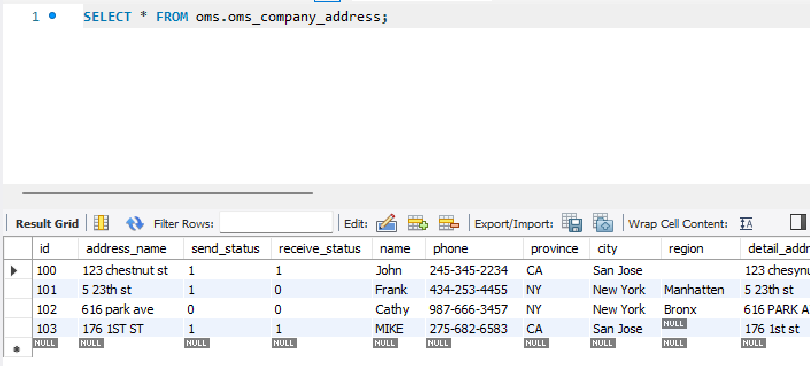

# hw6

## Mysql exercise

1.  Create  `oms_company_address`  table

```
Table: 
oms_company_address

Columns:
id int PK
address_name varchar(200)
send_status int
receive_status int
name varchar(64)
phone varchar(64)
province varchar(64)
city varchar(64)
region varchar(64)
detail_address varchar(200)
```
2.  Insert some random data to  `oms_company_address`  table
3.  Write a SQL query to fetch all data from  `oms_company_address`  `table

4.  Write a SQL query to fetch top 3 records from  `oms_company_address`  table  

`SELECT * FROM oms_company_address LIMIT 3;`
5.  Update  `oms_company_address`  table to set all  phone to 666-6666-8888  

`UPDATE oms_company_address SET phone = '666-6666-8888'`
6.  Delete one entry from  `oms_company_address`  table  

`DELETE FROM oms_company_address WHERE id = 101;`

## MongoDB exercise

1.  Create  test DB  

`use test`
2.  Create  `oms_company_address`  collection  (method: createCollection() )

`db.createCollection("oms_company_address")`
3.  Insert few random entries to  `oms_company_address`  collection (method: insert() )

```mongodb-json
db.oms_company_address.insert([
    { name: "Company A", address: "123 Main St", phone: "555-123-4567" },
    { name: "Company B", address: "456 Elm St", phone: "555-987-6543" },
    { name: "Company C", address: "789 Oak St", phone: "555-555-5555" }
])
```
result:
```mongodb-json
{
  acknowledged: true,
  insertedIds: {
    '0': ObjectId("65143ef5c38e3937c010dac6"),
    '1': ObjectId("65143ef5c38e3937c010dac7"),
    '2': ObjectId("65143ef5c38e3937c010dac8")
  }
}
```
4.  Read one entry from  `oms_company_address`  collection (method: find() )

`db.oms_company_address.findOne({name: "apple"})`  

result:
```mongodb-json
{
  _id: ObjectId("65143ef5c38e3937c010dac6"),
  name: 'apple',
  address: '123 Main St',
  phone: '555-123-4567'
}
```
5.  Read all entries from  `oms_company_address`  collection (method: find() )

`db.oms_company_address.find()`

result:
```mongodb-json
{
  _id: ObjectId("65143ef5c38e3937c010dac6"),
  name: 'apple',
  address: '123 Main St',
  phone: '555-123-4567'
}
{
  _id: ObjectId("65143ef5c38e3937c010dac7"),
  name: 'IBM',
  address: '456 Elm St',
  phone: '555-987-6543'
}
{
  _id: ObjectId("65143ef5c38e3937c010dac8"),
  name: 'Meta',
  address: '789 Oak St',
  phone: '555-555-5555'
}
```
6.  Update one entry from  `oms_company_address` collection (method: update() or save() )

```mongodb-json
db.oms_company_address.updateOne(
   { name: "apple" },
   {
      $set: {
         address: "1 park ave",
         phone: "666-666-6666"
      }
   }
)
```
result:
```mongodb-json
{
  acknowledged: true,
  insertedId: null,
  matchedCount: 1,
  modifiedCount: 1,
  upsertedCount: 0
}
```
7.  Remove one entry from  `oms_company_address` collection (method: remove() )

`db.oms_company_address.deleteOne({ name: "apple" })`

result:
```mongodb-json
{
  acknowledged: true,
  deletedCount: 1
}
```

## Postman

- 5 GET APIs with different response type
   - GET https://google.com -> 200 OK
   - GET https://herokuapp.com -> 403 Forbidden
   - GET https://google.com/aabbcc -> 404 Not Found
   - GET https://122.gov.cn -> 405 Not Allowed
   - GET https://ghibliapi.herokuapp.com -> 503 Service Unavailable
- 5 Post API with json request body, please also paste the response here
   - POST https://my-json-server.typicode.com/hxwang-463/jsonRepo/inventory with 
     ```json
     {
     "id": 100,
     "instock":20
     }
     ```
     return: 201 Created with 
     ```json
     {
     "id": 100,
     "instock": 20
     }
     ```
  - POST https://my-json-server.typicode.com/hxwang-463/jsonRepo/inventory with
    ```json
    {
    "id": 1,
    "instock":20
    }
    ```
    return: 500Internal Server Error with Error: Insert failed, duplicate id
  - POST https://my-json-server.typicode.com/hxwang-463/jsonRepo/products with
     ```json
     {
     "id": 100,
     "name":"watch",
     "price":300
     }
     ```
    return: 201 Created with
     ```json
     {
     "id": 100,
     "name":"watch",
     "price":300
     }
     ```
  - POST https://my-json-server.typicode.com/hxwang-463/jsonRepo/products with
     ```json
     {
     "id": 101,
     "name":"bag"
     }
     ```
    return: 201 Created with
     ```json
     {
     "id": 101,
     "name":"bag"
     }
     ```
  - POST https://my-json-server.typicode.com/hxwang-463/jsonRepo/reviews with
     ```json
     {
     "id": 100,
     "reviews":[
         "good",
         "i like this", 
         "great"
     ]
     }
     ```
    return: 201 Created with
     ```json
     {
     "id": 100,
     "reviews":[
         "good",
         "i like this", 
         "great"
     ]
     }
     ```

- 3 PUT API with json request body, please also paste the response here
   - PUT https://my-json-server.typicode.com/hxwang-463/jsonRepo/products with
     ```json
     {
     "id": 1,
     "name": "ipad",
     "price": 800
     }
     ```
     return 404 Not Found
   - PUT https://my-json-server.typicode.com/hxwang-463/jsonRepo/products/1 with
     ```json
     {
     "id": 1,
     "name": "ipad",
     "price": 800
     }
     ```
     return 200 OK with
     ```json
     {
     "id": 1,
     "name": "ipad",
     "price": 800
     }
     ```
   - PUT https://my-json-server.typicode.com/hxwang-463/jsonRepo/products/2 with
     ```json
     {
     "price": 600
     }
     ```
     return 200 OK with
     ```json
     {
     "price": 600,
     "id": 2
     }
     ```
- 2 DELETE API
  - DELETE https://my-json-server.typicode.com/hxwang-463/jsonRepo/products/1  
  return 200 OK
  - DELETE https://my-json-server.typicode.com/hxwang-463/jsonRepo/products/100  
  return 404 Not Found
- Each example with 404, 401, 500 and any http status codes you know
  - 404 Not Found:  
  DELETE https://my-json-server.typicode.com/hxwang-463/jsonRepo/products/100  
  - 401 Unauthorized:  
  GET https://cs.nyu.edu/courses/fall22/CSCI-GA.2436-001/
  - 500 Internal Server Error:  
  POST https://docs.google.com/document/d/1CqSFGZli3v-KScp6GPjlqgu-hln2Ozz0m9Nqh8WXhLQ/edit
  - In previous examples, I also have return code 200, 201, 403, 405, 503.

## API design
- **Twitter**: https://t.co/twitter-api-postman can see all Twitter api on postman.  
- **PayPal**: https://developer.paypal.com/api/rest/ can fork all PayPal api on postman.
- Design a collection of APIs for a Blog Website:  
    - get all blogs:  
      `GET {{base_url}}/blogs`
    - get one blog with its id:  
      `GET {{base_url}}/blogs/{id}`
    - create a new blog:  
      `POST {{base_url}}/blogs/{id}`
    - update a blog:  
      `PUT {{base_url}}/blogs/{id}`
    - delete a post:  
      `DELETE {{base_url}}/blogs/{id}`
- Find the customer's payments, like credit card 1, credit card 2, PayPal, Apple Pay.  
  `GET {base_url}/customers/{id}/payments`
- Find the customer's history orders from 10/10/2022 to 10/24/2022  
  `GET {base_url}/customers/{id}/orders?afterDate=10102022&beforeDate=10242022`
- FInd the customer's delivery addresses  
  `GET {base_url}/customers/{id}/addresses`
- If I also want to get customer's default payment and default delivery address, what kind of the API(URL) should be?  
  I will put this default payment and default delivery address under the id endpoint, so that it will be very dedicated.  
  `GET {base_url}/customers/{id}`