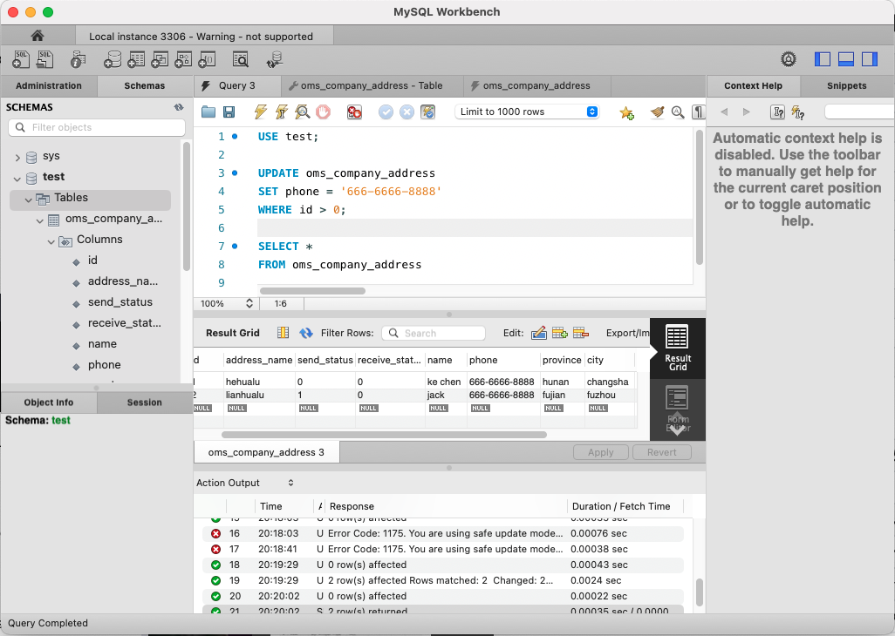

# HW6 - Ke Chen - DB&REST-APIs

## MySQL Exercise

- Download MySQL Community Server and MySQLWorkBench(SQL IDE) (version 8.x):
    - https://dev.mysql.com/downloads/
- MySQLWorkbench使用教程： 
    - https://c.biancheng.net/view/2625.html
- 新手入门 MySQL 数据库保姆级图解教程：
    - https://zhuanlan.zhihu.com/p/642882342

**1. Create oms_company_address table**
```
CREATE SCHEMA `test` ;
```


```
CREATE TABLE `test`.`oms_company_address` (
  `id` BIGINT NOT NULL,
  `address_name` VARCHAR(200) NULL,
  `send_status` INT(1) NULL,
  `receive_status` INT(1) NULL,
  `name` VARCHAR(64) NULL,
  `phone` VARCHAR(64) NULL,
  `province` VARCHAR(64) NULL,
  `city` VARCHAR(64) NULL,
  `region` VARCHAR(64) NULL,
  `detail_address` VARCHAR(200) NULL,
  PRIMARY KEY (`id`));
```


**2. Insert some random data to oms_company_address table**
```
INSERT INTO `test`.`oms_company_address` (`id`, `address_name`, `send_status`, `receive_status`, `name`, `phone`, `province`, `city`, `region`, `detail_address`) VALUES ('1', 'hehualu', '0', '0', 'ke chen', '123', 'hunan', 'changsha', 'furong', 'hehualu');
INSERT INTO `test`.`oms_company_address` (`id`, `address_name`, `send_status`, `receive_status`, `name`, `phone`, `province`, `city`, `region`, `detail_address`) VALUES ('2', 'lianhualu', '1', '0', 'jack', '456', 'fujian', 'fuzhou', 'yuelu', 'lianhualu');
```


**3. Write a SQL query to fetch all data from oms_company_address table**
```
use test;

SELECT *
FROM oms_company_address
```


**4. Write a SQL query to fetch top 1 records from oms_company_address table**
```
USE test;

SELECT *
FROM oms_company_address
LIMIT 1;
```


**5. Update oms_company_address table to set all phone to 666-6666-8888**
```
USE test;

UPDATE oms_company_address
SET phone = '666-6666-8888'
WHERE id > 0;
```




**6. Delete one entry from oms_company_address table**
```
USE test;

DELETE FROM oms_company_address
WHERE id = 2;
```


**7. (Optional) You can also try to create other tables that listed above**
Take table : oms_order_operate_history as an example
```
CREATE TABLE `test`.`oms_order_operate_history` (
  `id` BIGINT NOT NULL,
  `order_id` BIGINT NULL,
  `operate_man` VARCHAR(100) NULL,
  `create_time` DATETIME NULL,
  `order_status` INT(1) NULL,
  `note` VARCHAR(500) NULL,
  PRIMARY KEY (`id`));
```


## MongoDB Exercise

- 官网 
    - mangodb documentation：https://www.mongodb.com/docs/manual/crud/ (优先官网教学，再找辅助)
- 辅助：
    - https://zhuanlan.zhihu.com/p/610562915
- Install and open MongoDB Community Edition on macOS:
    - https://www.mongodb.com/docs/manual/tutorial/install-mongodb-on-os-x/


**1. Create test DB (syntax: use de_name)**
- 假如已经存在的数据库会直接切换到指定的数据库。
- 当创建一个新的数据库需要创建一个集合(table)的时候才会把数据库持久化到磁盘中,可能一开始创建数据库时，是在内存中的，还没有持久化到磁盘。新建集合时，就持久化了.(当你是用命令在：show dbs的时候不会出现没有数据的数据库，要等加了之后才会有显示)。

```
> use test 
```


**2. Create oms_company_address collection (method: createCollection())**
```
db.createCollection("oms_company_address")
```


**3. Insert few random entries to oms_company_address collection**


- Insert Documents: https://www.mongodb.com/docs/manual/tutorial/insert-documents/

```
db.oms_company_address.insertMany([
    {id: 1, address_name: 'hehualu', send_status: 0, receive_status: 0, name: 'Ke Chen', phone: '123', province: 'Hunan', city: 'Changsha', region: 'Furongqu', detail_address: 'hehualu'},
    {id: 2, address_name: 'juhualu', send_status: 1, receive_status: 0, name: 'Jack', phone: '456', province: 'Fujian', city: 'Fuzhou', region: 'kaifuqu', detail_address: 'juhualu'}
])
```


**4. Read one entry from oms_company_address collection**


- Query Documents: https://www.mongodb.com/docs/manual/tutorial/query-documents/
- Query on Embedded/Nested Documents: https://www.mongodb.com/docs/manual/tutorial/query-embedded-documents/
- Query an Array: https://www.mongodb.com/docs/manual/tutorial/query-arrays/
- Query an Array of Embedded Documents: https://www.mongodb.com/docs/manual/crud/

```
db.oms_company_address.find({ id: 1 })   // = SELECT * FROM oms_company_address WHERE id = 1
```


**5. Read all entries from oms_company_address collection**
```
db.oms_company_address.find({})    //  = SELECT * FROM oms_company_address
```

.png)


**6. Update one entry from oms_company_address collection**


- Update Documents: https://www.mongodb.com/docs/manual/tutorial/update-documents/

```
db.oms_company_address.updateOne(
    {id: 2},
    {
        $set: {send_status : 1, phone: '234'}
    }
)
```


**7. Remove one entry from oms_company_address collection**


- Delete Documents: https://www.mongodb.com/docs/manual/tutorial/remove-documents/

```
db.oms_company_address.deleteOne({ id: 2 })
```


**8. (Optional) You can also try to create other tables that listed above**
Take table : oms_order_operate_history as an example
```
db.createCollection("oms_order_operate_history")
{ "ok" : 1 }

db.oms_order_operate_history.insertMany([
    {id: 1, order_id: 233, operate_man: 'Jack', create_time: 9/18/2023, order_status: 0, note: 'order 35'},
    {id: 2, order_id: 333, operate_man: 'Tom', create_time: 9/20/2023, order_status: 1, note: 'null'},
    {id: 3, order_id: 433, operate_man: 'Jack', create_time: 9/25/2023, order_status: 0, note: 'not null'},
])
```


## Postman Exercise

- Public REST APIs
    - https://www.postman.com/cs-demo/workspace/public-rest-apis/collection/8854915-454a2dc7-dcbe-41cf-9bfa-da544fcd93a2?ctx=documentation
    - https://jsonplaceholder.typicode.com
- API 练习网站:
    - https://reqres.in
- 如何使用postman(新手入门):
    - https://www.jb51.net/article/233970.htm


**1. 5 GET APIs with different response type**

1. JSON Response:
   - Endpoint: `https://jsonplaceholder.typicode.com/posts/1`

2. XML Response:
   - Endpoint: `https://www.w3schools.com/xml/note.xml`

3. HTML Response:
   - Endpoint: `https://www.example.com`

4. Image Response:
   - Endpoint: `https://via.placeholder.com/150`

5. CSV Response:
   - Endpoint: `https://samplecsvs.s3.amazonaws.com/Sacramentorealestatetransactions.csv`


**2. 5 Post API with json request body, please also paste the response here**

1. Create User:
   - Endpoint: `https://jsonplaceholder.typicode.com/users`
   
   
2. create post:
   - Endpoint: `https://jsonplaceholder.typicode.com/posts`
   

3. Create Task:
   - Endpoint: `https://jsonplaceholder.typicode.com/todos`
   

4. Add Comment:
   - Endpoint: `https://jsonplaceholder.typicode.com/comments`
   

5. Create Album:
   - Endpoint: `https://jsonplaceholder.typicode.com/albums`
   


**3. 3 PUT API with json request body, please also paste the response here**

1. **Update User**:
   - Endpoint: `https://jsonplaceholder.typicode.com/users/1`
   
   
2. **Update Post**:
   - Endpoint: `https://jsonplaceholder.typicode.com/posts/1`
   

3. **Update Album**:
   - Endpoint: `https://jsonplaceholder.typicode.com/albums/1`
   


**4. 2 DELETE API**

1. **Delete User**:
   - Endpoint: `https://jsonplaceholder.typicode.com/users/1`
   - This request will delete the user with ID 1 from the JSONPlaceholder API.

2. **Delete Post**:
   - Endpoint: `https://jsonplaceholder.typicode.com/posts/1`
   - This request will delete the post with ID 1 from the JSONPlaceholder API.


**5. Each example with 404,401,500 and any http status codes you know**


1. **404 Not Found**:
   - Endpoint: `https://jsonplaceholder.typicode.com/posts/1000`
   - This request attempts to retrieve a post with ID 1000, which does not exist in the JSONPlaceholder API. It should return a `404 Not Found` status code.
   

2. **401 Unauthorized**:
   - Endpoint: `https://placeholder.api/restricted`
   - This request attempts to access a restricted endpoint that requires authentication. Without proper authorization, it should return a `401 Unauthorized` status code.

3. **500 Internal Server Error**:
   - Endpoint: `https://placeholder.api/internal-error`
   - This request triggers an internal server error on the server-side, causing it to respond with a `500 Internal Server Error` status code.

4. **Example with Any Other HTTP Status Code**:
   - Endpoint: `https://jsonplaceholder.typicode.com/comments?postId=`
   - This request attempts to retrieve comments without specifying a post ID. Depending on the API's design, it may return various status codes such as `400 Bad Request`, `403 Forbidden`, or any other relevant status code for the specific scenario.


## API Design

REST Resource Naming Guide/Convention
1.  Use `JSON` as the Format for Sending and Receiving Data
2.  Use `Nouns` Instead of Verbs in Endpoints
    1. POST   /api/Users                    (NOT /api/createUser)
    2. GET   /api/users/{id}                (NOT /api/getUser)
    3. DELETE /api/users/{id}               (NOT  /api/deleteUser)
    4. UPDATE/PATCH/PUT /api/users/{id}  ->  UPDATE /api/users/101
3.  Use `Status Codes` in Error Handling
4.  Use `nouns` to represent resources
    1. basic
        - http://api.example.com/device-management/managed-devices  
        - http://api.example.com/device-management/managed-devices/{device-id}  
        - http://api.example.com/user-management/users 
        - http://api.example.com/user-management/users/{id}
    2.  document
        - http://api.example.com/device-management/managed-devices/{device-id} 
        - http://api.example.com/user-management/users/{id} 
        - http://api.example.com/user-management/users/admin
        - What is the document in the above google drive url example?
    3.  collection
        - http://api.example.com/device-management/managed-devices 
        - http://api.example.com/user-management/users 
        - http://api.example.com/user-management/users/{id}/accounts
    4.  store
        - http://api.example.com/song-management/users/{id}/playlists
    5.  controller
        - http://api.example.com/cart-management/users/{id}/cart/checkout 
        - http://api.example.com/song-management/users/{id}/playlist/play 
5.  Consistency is the key
    1.  Use forward `slash (/)` to indicate hierarchical relationships
        - http://api.example.com/device-management1
        - http://api.example.com/device-management/managed-devices
        - http://api.example.com/device-management/managed-devices/{id}
        - http://api.example.com/device-management/managed-devices/{id}/scripts
        - http://api.example.com/device-management/managed-devices/{id}/scripts/{id}
    2.  Do `NOT use trailing forward slash (/)` in URIs
        - http://api.example.com/device-management/managed-devices/ 
        - http://api.example.com/device-management/managed-devices  (This is much better version)
    3.  Use `hyphens (-)` to improve the readability of URIs
        - http://api.example.com/device-management/manageddevices
        - http://api.example.com/device-management/managed-devices   (This is much better version)
    4. Do `not use underscores ( _ )`
        - http://api.example.com/inventory-management/managedEntities/{id}/install_Script_Location  (Less readable)
        - http://api.example.com/inventory-management/managed-entities/{id}/install-script-location  (More readable)
    5. Use `lowercase letters` in URIs
        - http://api.example.org/my-folder/my-doc       //1
        - HTTP://API.EXAMPLE.ORG/my-folder/my-doc       //2
        - http://api.example.org/My-Folder/my-doc       //3
6.  Do `NOT use file extensions`       
    - http://api.example.com/device-management/managed-devices.xml  (Do not use it)
    - http://api.example.com/device-management/managed-devices  (This is correct URI)
7. `Never use CRUD function names(or Verbs) in URIs`
    - HTTP GET http://api.example.com/device-management/managed-devices  (Get all devices)
    - HTTP POST http://api.example.com/device-management/managed-devices  (Create new Device)
    - HTTP GET http://api.example.com/device-management/managed-devices/{id}  (Get device for given Id)
    - HTTP PUT http://api.example.com/device-management/managed-devices/{id}  (Update device for given Id)
    - HTTP DELETE http://api.example.com/device-management/managed-devices/{id}  (Delete device for given Id)
8.  Use query component to `filter` URI collection
    1. basic
        - http://api.example.com/device-management/managed-devices
        - http://api.example.com/device-management/managed-devices?region=USA
        - http://api.example.com/device-management/managed-devices?region=USA&brand=XYZ
        - http://api.example.com/device-management/managed-devices?region=USA&brand=XYZ&sort=installation-date
    2. Paging
        - https://api.spotify.com/v1/artists/12vsllerkjdsasjc/albums?album_type=SINGLE&offset=50&limit=30
9. Be Clear with `Versioning` (mobile app -- forward/backward compatibale APIs
    - https://mysite.com/api/v1/posts (user without address)
    - https://mysite.com/api/v2/posts (user with address, creditCard info)


**1. Find 2 collection of APIs example. ie. Twitter, Paypal, Youtube etc.  -- 命名规范**

1. **Twitter APIs:**
    - **Twitter REST API:** Offers access to various Twitter functionalities like posting tweets, fetching user information, managing followers, searching tweets, and more.
    - **Twitter Streaming API:** Provides real-time access to Twitter's stream of data, allowing users to monitor and receive tweets based on specific keywords, locations, or users.
    - **Twitter Ads API:** Enables programmatic management of Twitter advertising campaigns, allowing advertisers to create and manage ad campaigns, retrieve analytics, and more.

2. **PayPal APIs:**
    - **PayPal REST API:** Offers various payment functionalities, allowing businesses to accept payments, process refunds, manage subscriptions, and access transaction details.
    - **PayPal Payouts API:** Enables mass payments, allowing businesses to send payments to multiple recipients at once, such as payouts to vendors or partners.
    - **PayPal Identity API:** Provides identity verification services, allowing businesses to authenticate users and reduce fraud through identity verification.

3. **YouTube APIs:**
    - **YouTube Data API:** Offers programmatic access to YouTube's data, allowing developers to retrieve video information, upload videos, manage playlists, and perform searches.
    - **YouTube Analytics API:** Provides access to YouTube's analytics data, allowing creators and developers to retrieve metrics and insights about their videos' performance.
    - **YouTube Live Streaming API:** Enables live streaming functionalities, allowing developers to create, manage, and control live streaming events on YouTube.


**2. Design a collection of APIs for a Blog Website, please specify GET POST PUT DELETE**

**Blog Post Endpoints:**

1. GET /posts
   - Description: Retrieve all blog posts.
   - Response: List of all blog posts.

2. GET /posts/{post_id}
   - Description: Retrieve a specific blog post by ID.
   - Response: Details of the specified blog post.

3. POST /posts
   - Description: Create a new blog post.
   - Request Body: Contains details of the new blog post.
   - Response: Details of the newly created blog post.

4. PUT /posts/{post_id}
   - Description: Update a specific blog post by ID.
   - Request Body: Contains updated details of the blog post.
   - Response: Details of the updated blog post.

5. DELETE /posts/{post_id}
   - Description: Delete a specific blog post by ID.
   - Response: Confirmation of successful deletion.

**Comments Endpoints:**

1. GET /posts/{post_id}/comments
   - Description: Retrieve all comments for a specific blog post.
   - Response: List of comments associated with the specified post.

2. POST /posts/{post_id}/comments
   - Description: Add a new comment to a specific blog post.
   - Request Body: Contains details of the new comment.
   - Response: Details of the newly added comment.

3. PUT /posts/{post_id}/comments/{comment_id}
   - Description: Update a specific comment on a blog post.
   - Request Body: Contains updated details of the comment.
   - Response: Details of the updated comment.

4. DELETE /posts/{post_id}/comments/{comment_id}
   - Description: Delete a specific comment on a blog post.
   - Response: Confirmation of successful deletion.

**User Authentication:**

1. POST /login
    - Description: Authenticate a user.
    - Request Body: Contains user credentials (username/password).
    - Response: Authentication token or user session information.

2. POST /logout
    - Description: Log out a user (invalidate session/token).
    - Response: Confirmation of successful logout.


## Design APIs for the following features (思考：path variable 怎么用？有sub resources, 哪些地方该用复数)

**1. find the customer's payments, like credit card 1, credit card 2, paypal, Apple Pay.**
- GET /api/customers/{customer_id}/payments
- Description: Retrieve a list of the customer's payment methods.
- Response: List of payment methods (credit cards, PayPal, Apple Pay, etc.).
- Example: /api/customers/123/payments

**2. Find the customer's history orders from 10/10/2022 to 10/24/2022**
- GET /api/customers/{customer_id}/orders
- Description: Retrieve a list of the customer's orders within a specified date range
- Query Parameters: `start_date`, `end_date` (e.g., `/orders?start_date=2022-10-10&end_date=2022-10-24`)
- Response: List of orders made by the customer within the specified date range.
- Example: /api/customers/123/orders?start_date=2022-10-10&end_date=2022-10-24

**3. find the customer's delievery  addresses**
- GET /api/customers/{customer_id}/addresses
- Description: Retrieve a list of the customer's delivery addresses.
- Response: List of delivery addresses saved by the customer.
- Example: /api/customers/123/addresses

**4. If I also want to get customer's default payment and default delievery address, what kind of the API (URL) should be?**
- GET /api/customers/{customer_id}/defaults
- Description: Retrieve the customer's default payment and default delivery address.
- Response: JSON object containing the default payment method and default delivery address.   
- Example: /api/customers/123/defaults

Regarding answers above about path variables and pluralization:
- Path Variables: `{customer_id}` is a path variable representing a specific customer's unique identifier. It's used to identify the customer in the API endpoints.
- Subresources: The use of `/customers/{customer_id}` as a base URL indicates a nested or subresource structure, where customer-related data is accessed under the `customers` resource.
- Pluralization: In RESTful API design, resource names are often pluralized (e.g., `/customers` instead of `/customer`) to denote collections of resources.