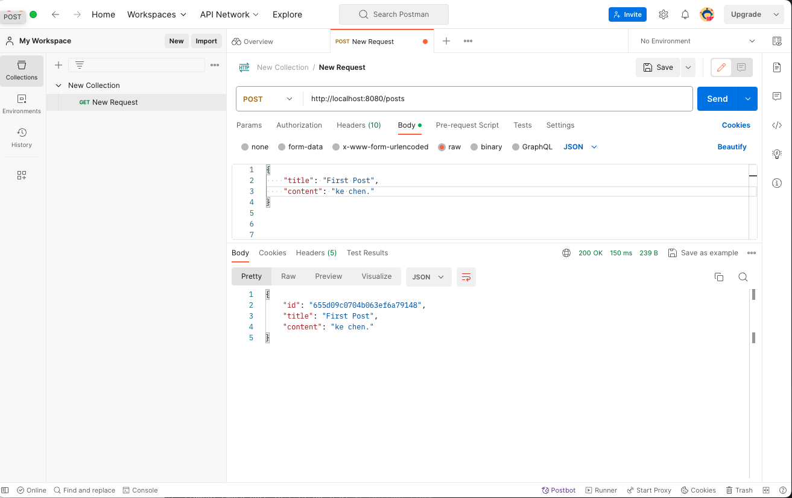

# hw7 - Ke Chen

## 1.create a file to list all of the annotaitons you learned and known, and explain the usage and how do you understand it. you need to update it when you learn a new annotation. Please organize those annotations well, like annotations used by entity, annotations used by controller.
1.  File name: annotations.md
2.  you'd better also list a code example under the annotations.

find in ShortQuestion: annotations.md


## 2. explain how the below annotaitons specify the table in database?

The annotations @Column typically used in Java Persistence API (JPA) or Hibernate <u>to specify how a Java class field maps to a database table column</u>. 

```
@Column(columnDefinition = "varchar(255) default 'John Snow'")
private String name;
```
- This annotation is used to specify the column-level details for the name field.(在数据库里面也是name，如果需要大写，借助name = "Name"来规定)
- It defines a VARCHAR column with a maximum length of 255 characters and a default value of 'John Snow'.


```
@Column(name="STUDENT_NAME", length=50, nullable=false, unique=false)
private String studentName;
```
- This annotation is used to specify the column-level details for the studentName field.
- The column will be named "STUDENT_NAME" in the database table.
- length=50 specifies that the maximum length of the VARCHAR column is 50 characters.
- nullable=false indicates that this column cannot contain null values
- unique=false specifies that the values in this column do not have to be unique.


## 3. What is the default column names of the table in database for  @Column ?

When you use the @Column annotation without specifying the name attribute, it will use the default column names based on the field names in your Java class. 

```
@Column
private String firstName;
```
The default column name in the database would be "firstName".

```
@Column
private String operatingSystem;
```
The default column name in the database would be "operatingSystem".


## 4. What are the layers in springboot application? what is the role of each layer?

There are 4 layers and classes present in it:
1. Presentation Layer: Authentication & Json Translation
2. Business Layer: Bussiness Logic, Validation & Authorization
3. Persistence Layer: Storage Logic
4. Database Layer: Actual Database


- https://www.codingninjas.com/studio/library/spring-boot-architecture

Presentation Layer:
The presentation layer handles the HTTP requests, translates the JSON parameter to object, and authenticates the request and transfer it to the business layer. In short, it consists of views i.e., frontend part.

Business Layer:
The business layer handles all the business logic. It consists of service classes and uses services provided by data access layers. It also performs authorization and validation.

Persistence Layer:
The persistence layer contains all the storage logic and translates business objects from and to database rows.

Database Layer:
In the database layer, CRUD (create, retrieve, update, delete) operations are performed


## 5. Describe the flow in all of the layers if an API is called by Postman.

- The Postman(client) makes the HTTP requests (PUT or GET).
- The request goes to the controller, and the controller maps that request and handles it. After that, it calls the service logic if required.
- In the service layer, all the business logic performs. It performs the logic on the data that is mapped to JPA with model classes. 
- A JSP page is returned to the user if no error occurred.


Now we have validator classes, view classes, and utility classes.

Spring Boot uses all the modules of Spring-like Spring MVC, Spring Data, etc. The architecture of Spring Boot is the same as the architecture of Spring MVC, except one thing: there is no need for DAO and DAOImpl classes in Spring boot.


## 6. What is the application.properties? do you know application.yml?

**application.properties:** application.properties is <u>a text-based configuration file in key-value format</u>. 

It's a traditional way of configuring Spring Boot applications.

Properties are defined using the key = value syntax.

Example application.properties file:
```java
# Database configuration
spring.datasource.url = jdbc:mysql://localhost:3306/mydb
spring.datasource.username = myuser
spring.datasource.password = mypassword

# Server configuration
server.port = 8080
```

**application.yml:** application.yml is <u>a YAML (YAML Ain't Markup Language) configuration file using indentation and a colon (:) to separate keys and values</u>.</u> 

It provides a more human-readable format for configuration.

It's often preferred for its readability and conciseness, especially for complex configurations.

Example application.yml file:
```java
# Database configuration
spring:
  datasource:
    url: jdbc:mysql://localhost:3306/mydb
    username: myuser
    password: mypassword

# Server configuration
server:
  port: 8080
```


## 7. Create a Project, name it with mongo-blog, write a POST API for mongo-blog, change database to MongoDB

- find in coding file - hw7-mongo-blog
- Spring Boot and MongoDB https://www.mongodb.com/compatibility/spring-boot

**Step 1: Create a Spring Boot Project**

use Spring Initializr (https://start.spring.io/) or IDE (such as IntelliJ IDEA or Eclipse) to create a new Spring Boot project with the following dependencies:
- Spring Web
- Spring Data MongoDB

**Step 2: Set up MongoDB Configuration**

Create a application.properties or application.yml file in src/main/resources directory and configure MongoDB connection properties:

```properties
// application.properties:
spring.data.mongodb.host=localhost
spring.data.mongodb.port=27017
spring.data.mongodb.database=mongo-blog
```

**Step 3: Create a Model Class**

Create a Post class to represent the blog post entity.

```java
package kechen.hw7mongoblog.model;

import org.springframework.data.annotation.Id;
import org.springframework.data.mongodb.core.mapping.Document;

@Document(collection = "posts")
public class Post {

    @Id
    private String id;
    private String title;
    private String content;

    // Constructors, getters, setters...
}
```

**Step 4: Create a Controller with a POST API**

Create a PostController class to handle HTTP requests related to blog posts.

```java
package kechen.hw7mongoblog.Controller;

import kechen.hw7mongoblog.model.Post;
import kechen.hw7mongoblog.repository.PostRepository;
import org.springframework.web.bind.annotation.PostMapping;
import org.springframework.web.bind.annotation.RequestBody;

public class PostController {
    private final PostRepository postRepository;

    public PostController(PostRepository postRepository) {
        this.postRepository = postRepository;
    }

    @PostMapping("/posts")
    public Post createPost(@RequestBody Post post) {
        return postRepository.save(post);
    }
}
```

**Step 5: Create a Repository Interface**

Create a PostRepository interface to perform CRUD operations on the Post entity.

```java
package kechen.hw7mongoblog.repository;

import kechen.hw7mongoblog.model.Post;
import org.springframework.data.mongodb.repository.MongoRepository;

public interface PostRepository extends MongoRepository<Post, String> {
}
```

**Step 6: Run the Application**
Run Spring Boot application. The MongoDB database named : mongo-blog will be created, and the /posts endpoint will be available to receive POST requests to create new blog posts.


open mongodb using command : mongsh, test the POST API by sending a JSON POST request (using tools like Postman or cURL) to http://localhost:8080/posts with a JSON body representing a blog post.

