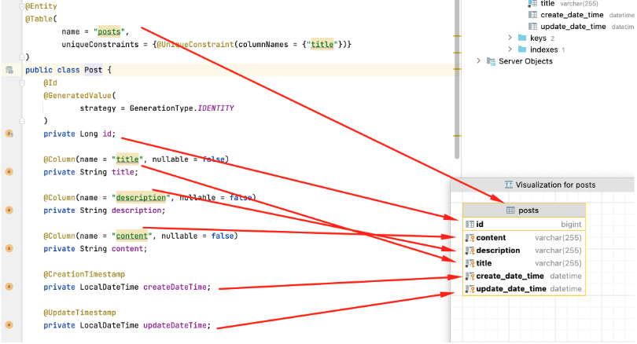
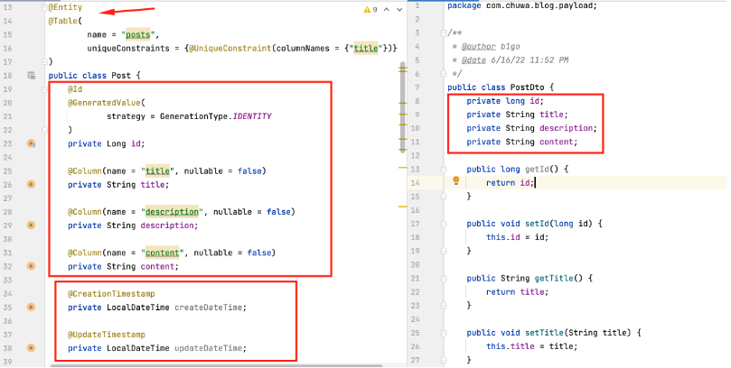

# HW8 - Ke Chen - SpringBoot-redbook

**find in file coding : hw8-springboot-redbook**


## 1. In your redbook application, write the code for RUD APIs

**find in file coding : hw8-springboot-redbook related to post**

### 01_post
In this branch:
- https://github.com/TAIsRich/springboot-redbook.git
- you need to call the new APIs in your postman.
- You need to type it line by line and try your best to understand it. DO NOT COPY PASTE

**Step1. create database & configure datasource:**

- create database(可以直接在idea里面创建)

    ```
    create database redbook;
    or
    CREATE SCHEMA `redbook` DEFAULT CHARACTER SET utf8 ;
    ```

- update:application.propertites

    ```
    # 指定了应用程序运行时使用的端口号为 8080。这意味着应用程序将在 localhost 上的 8080 端口运行。
    server.port=8080

    # datasource
    # 设置了应用程序连接到 MySQL 数据库的 URL。它指定了数据库的位置（localhost:3306）、数据库名称（redbook），
    spring.datasource.url = jdbc:mysql://localhost:3306/redbook?

    # 并且设置了一些连接参数useSSL=false：禁用 SSL 连接，serverTimezone=UTC ：指定时区。
    useSSL=false&serverTimezone=UTC
    spring.datasource.username= root
    spring.datasource.password= chen010919CHAN!

    # hibernate properties
    # 指定了 Hibernate 在与 MySQL 数据库交互时使用的方言（即数据库特定的语言和行为）为 MySQL 5 的 InnoDB 引擎方言。
    # spring.jpa.properties.hibernate.dialect = org.hibernate.dialect.MySQL5InnoDBDialect

    # MySQL8
    spring.jpa.properties.hibernate.dialect = org.hibernate.dialect.MySQL8Dialect

    # 指定了 Hibernate 在启动时处理数据库模式的策略。在这种情况下，它设置为 update，表示 Hibernate 会根据实体类的变化来更新数据库模式
    # hibernate ddl auto(create, create-drop, validate, update)
    spring.jpa.hibernate.ddl-auto = update
    ```


**Step2. entity层**



Questions:

1. Why do we need to mapping database table to entity ?

    mapping a database table to an entity via ORM frameworks like JPA promotes cleaner code, faster development cycles, and better maintenance of applications by bridging the gap between the object-oriented world of programming languages and the relational world of databases.

2. What is difference between entity(@Entity) and pojo(NO @entity)?

    - Spring JPA will know this pojo with @Entity is used to mapped to database.
    - pojo without @enity is not used to be mapped to database.

3. Why do we have create date time and update Date time ?

    By including both createDateTime and updateDateTime fields in an entity, developers can effectively track the lifecycle of the data, maintain a history of changes, and enable better transparency and accountability in the system.

4. If we didn't specify column name, what is the default column name ?

    - CamalCase驼峰命名法: 首字母小写，后续单词的首字母大写，单词之间没有空格或下划线,  
    - pascalCase帕斯卡命名法: 所有单词的首字母均大写，单词之间没有空格或下划线)
    - SomeThingColumn --> some_thing 
    - something --> something 


**Step3. Repository层:提供对table级别的CRUD**

    ```
    @Repository
    public interface PostRepository extends JpaRepository<Post, Long> {
    }
    ```

**Step4. payload层 Dto(Data Transfer Object): UserEntity. -> UserBasicDto**

- DTOs 主要用作数据传输的容器，在应用程序的不同部分之间传输数据。
- DTO is the only java class (created within the payload package )

Question: 

what is the difference between Entity and DTO.
- Entities are domain objects representing the data stored in the database,
- DTOs are used for transferring data between different parts of an application.




**Step5. Service 业务逻辑层**

- body里面包含了title，description，content(payload)，获取之后换成entity
- 调用Dao的save 方法，将entity的数据存储到数据库MySQL, save()会返回存储在数据库中的数据
- 将save() 返回的数据转换成controller/前端 需要的数据，然后return给controll

```
    @Service
    public class PostServiceImpl implements PostService {

        @Autowired
        private PostRepository postRepository;

        @Override
        public PostDto createPost(PostDto postDto) {
            // 把payload转换成entity，这样dao才能把该数据存到数据库中。
            Post post = new Post();
            if (postDto.getTitle() != null) {
                post.setTitle(postDto.getTitle());
            } else {
                post.setTitle("");
            }

            post.setDescription(postDto.getDescription());
            post.setContent(post.getContent());
            // 此时已成功把request body的信息传递给entity(body里面包含了title，description，content(payload)，获取之后换成entity)

            // 调用Dao的save 方法，将entity的数据存储到数据库MySQL
            // save()会返回存储在数据库中的数据
            Post savedPost = postRepository.save(post);

            // 将save() 返回的数据转换成controller/前端 需要的数据，然后return给controller
            PostDto postResponse = new PostDto();
            postResponse.setId(savedPost.getId());
            postResponse.setTitle(savedPost.getTitle());
            postResponse.setDescription(savedPost.getDescription());
            postResponse.setContent(savedPost.getContent());

            return postResponse;
        }
}
```

**Step6. Controller层**

```
    @RestController
    @RequestMapping("/api/v1")
    public class PostController {

        @Autowired
        private PostService postService;

        @PostMapping("/posts")
        public ResponseEntity<PostDto> createPost(@RequestBody PostDto postDto){
            PostDto postResponse = postService.createPost(postDto);
            // 将创建的帖子的 PostDto 对象封装在 ResponseEntity 中并返回。
            // 同时，使用 HTTP 状态码 HttpStatus.CREATED 表示请求成功创建了一个资源。
            return new ResponseEntity<PostDto>(postResponse, HttpStatus.CREATED);
        }
    }
```

**Step7. postman测试：**

- 在主程序里面启动


- postman里面进行测试


### 02_post_RUD

In this branch, you need to learn;
- in PostServiceImpl, define 2 private methods.
    - mapToEntity
    - mapToDTO
- add package exception
    - ResourceNotFoundException
- add RUD operations in service layer and controller layer.
- Use Postman to call each API to check the response.

**Step1: define mapToEntity + mapToDTO, change C in service layer**
```
    /*
    // 把payload转换成entity，这样dao才能把该数据存到数据库中。
    Post post = new Post();
    if (postDto.getTitle() != null) {
        post.setTitle(postDto.getTitle());
    } else {
        post.setTitle("");
    }

    post.setDescription(postDto.getDescription());
    post.setContent(postDto.getContent());
    // 此时已成功把request body的信息传递给entity(body里面包含了title，description，content(payload)，获取之后换成entity)
     */
        
    // covert DTO to Entity
    Post post = mapToEntity(postDto);

    /*
    // 将save() 返回的数据转换成controller/前端 需要的数据，然后return给controller
    PostDto postResponse = new PostDto();
    postResponse.setId(savedPost.getId());
    pPostDto postResponse = mapToDTO(savedPost);ostResponse.setTitle(savedPost.getTitle());
    postResponse.setDescription(savedPost.getDescription());
    postResponse.setContent(savedPost.getContent());
    */

    PostDto postResponse = mapToDTO(savedPost);

    return postResponse;

    private Post mapToEntity(PostDto postDto){
        Post post = new Post();
        post.setTitle(postDto.getTitle());
        post.setDescription(postDto.getDescription());
        post.setContent(postDto.getContent());

        return post;
    }

    private PostDto mapToDTO(Post post){
        PostDto postDto = new PostDto();
        postDto.setId(post.getId());
        postDto.setTitle(post.getTitle());
        postDto.setDescription(post.getDescription());
        postDto.setContent(post.getContent());

        return postDto;
    }
```

**Step2: finish R in service and controller layer**

```
// service层:

    List<PostDto> getAllPost();

    PostDto getPostById(long id);

// serviceImpl:

    @Override
    public List<PostDto> getAllPost() {
        List<Post> posts = postRepository.findAll();
        List<PostDto> postDtos = posts
                .stream()
                .map(post -> mapToDTO(post))
                .collect(Collectors.toList());
        return postDtos;
    }

    @Override
    public PostDto getPostById(long id) {
        Post post = postRepository.findById(id).orElseThrow(() -> new ResourceNotFoundException("Post", "id", id));
        return mapToDTO(post);
    }

// exception层

    package kechen.hw8springbootredbook.exception;
    /**
    * 在这个特定的例子中，@ResponseStatus(value = HttpStatus.NOT_FOUND) 告诉 Spring 在处理对应的请求时，
    * 如果发现资源不存在（例如，从数据库查询数据为空），则返回 HTTP 状态码 404（NOT_FOUND）给客户端。
    */

    @ResponseStatus(value = HttpStatus.NOT_FOUND)
    public class ResourceNotFoundException extends RuntimeException{
        private  String resourceName;
        private String fieldName;
        private long fieldValue;

        public ResourceNotFoundException(String resourceName, String fieldName, long fieldValue) {
            // Post not found with id : '1'
            super(String.format("%s not found with %s : '%s'", resourceName, fieldName, fieldValue));
            this.resourceName = resourceName;
            this.fieldName = fieldName;
            this.fieldValue = fieldValue;
        }

        public String getResourceName() {
            return resourceName;
        }

        public void setResourceName(String resourceName) {
            this.resourceName = resourceName;
        }

        public String getFieldName() {
            return fieldName;
        }

        public void setFieldName(String fieldName) {
            this.fieldName = fieldName;
        }

        public long getFieldValue() {
            return fieldValue;
        }

        public void setFieldValue(long fieldValue) {
            this.fieldValue = fieldValue;
        }
    }

// controller层:

    @GetMapping
    public List<PostDto> getAllPosts(){
        return postService.getAllPost();
    }

    @GetMapping("/{id}")
    // 告诉 Spring MVC 将 URL 中名为 id 的部分提取出来，并将其赋值给方法参数 id。
    // name = "id" 这个属性是可选的，如果路径变量的名字与方法参数的名字相同，你可以省略 name 属性
    // = public ResponseEntity<PostDto> getPostById(@PathVariable long id){
    public ResponseEntity<PostDto> getPostById(@PathVariable(name = "id") long id){
        // ResponseEntity.ok() 是一个静态方法，用于创建一个 HTTP 状态码为 200（OK）的响应
        return ResponseEntity.ok(postService.getPostById(id));
    }
```

postman测试：


**Step3: finish U in service and controller layer**

```
// service层:

    PostDto updatePost(PostDto postDto, long id);

// serviceImpl:

    @Override
    public PostDto updatePost(PostDto postDto, long id) {
        Post post = postRepository.findById(id).orElseThrow(() -> new ResourceNotFoundException("Post","id",id));
        post.setTitle(postDto.getTitle());
        post.setDescription(postDto.getDescription());
        post.setContent(postDto.getContent());

        Post updatePost = postRepository.save(post);
        return mapToDTO(updatePost);
    }

// controller层:

    @PutMapping("/{id}")
    public ResponseEntity<PostDto> updatePostById(@RequestBody PostDto postDto, @PathVariable(name = "id") long id){
        PostDto postResponse = postService.updatePost(postDto,id);
        return new ResponseEntity<>(postResponse, HttpStatus.OK);
    }
```

postman测试：


**Step4: finish D in service and controller layer**

```
// service层:

    void deletePostById(long id);

// serviceImpl:

    @Override
    public void deletePostById(long id) {
        Post post = postRepository.findById(id).orElseThrow(() -> new ResourceNotFoundException("Post", "id", id));
        postRepository.delete(post);
    }

// controller层:

    @DeleteMapping("/{id}")
    public ResponseEntity<String> deletePost(@PathVariable(name = "id") long id){
        postService.deletePostById(id);
        return new ResponseEntity<>("Post entity deleted successfully.", HttpStatus.OK);
    }
```

**postman测试：**


### 03_post_pageable

In this branch:
- create util package and under this package create AppConstants class
- in PostController and PostService, remove old getAllPosts();
- add pageable getAllPosts()
- Practice pageable Api

**Step1: util**

```
    package kechen.hw8springbootredbook.util;

    public class AppConstants {
        public static final String DEFAULT_PAGE_NUMBER = "0";
        public static final String DEFAULT_PAGE_SIZE = "10";
        public static final String DEFAULT_SORT_BY = "id";
        public static final String DEFAULT_SORT_DIR = "asc";
}
```

**Step2: create class PostResponse under payload**

主要储存的是List<PostDto>，对PostDto的查找进行了分页处理

```
    package kechen.hw8springbootredbook.payload;

    import java.util.List;

    public class PostResponse {
        private List<PostDto> content;
        private int pageNo;
        private int pageSize;
        private long totalElements;
        private int totalPages;
        private boolean last;

    省略constrctor和setter，getter方法
```

**Step3: in PostController and PostService, remove old getAllPosts()**

```
// Service
    /**
     * 分页
     * @param pageNo
     * @param pageSize
     * @param sortBy
     * @param sortDir
     * @return
     */
    PostResponse getAllPost(int pageNo, int pageSize, String sortBy, String sortDir);

// ServiceImpl

    @Override
    public PostResponse getAllPost(int pageNo, int pageSize, String sortBy, String sortDir) {
        // Sort 对象根据传入的 sortDir 参数判断排序方式是升序还是降序，并且根据 sortBy 参数指定的字段进行排序。
        // 假设现在 sortDir 是 "DESC"，sortBy 是 "createDateTime"，那么上面的代码将创建一个 Sort 对象，按照创建日期字段降序排序。
        // 相反，如果 sortDir 是 "ASC"，则会按照升序排序。
        // 如果 sortBy 是 "title"，则将根据标题字段进行排序。
        // variable = (condition) ? expressionTrue : expressionFalse;

        // 如果 sortDir 的值（排序方向）是 ASC（升序），则 sort 对象使用 Sort.by(sortBy).ascending() 来创建一个按指定字段升序排序的 Sort 对象；
        // 否则，使用 Sort.by(sortBy).descending() 来创建一个按指定字段降序排序的 Sort 对象
        Sort sort = sortDir.equalsIgnoreCase(Sort.Direction.ASC.name()) ? Sort.by(sortBy).ascending()
                :Sort.by(sortBy).descending();

        //create pageable instance
        // PageRequest是Spring Data中的一个类，用于创建分页请求对象
        // 用于根据传入的页数 (pageNo)、页面大小 (pageSize) 和排序规则 (sort) 来构建PageRequest分页请求对象
        PageRequest pageRequest = PageRequest.of(pageNo,pageSize,sort);
        // PageRequest pageRequest = PageRequest.of(pageNo, pageSize, Sort.by(sortBy));
        // PageRequest pageRequest = PageRequest.of(pageNo, pageSize, Sort.by(sortBy).descending());

        //根据分页后查找的数据
        //Page是Spring Data中表示分页查询结果的接口。它是一个包含有关分页信息和实际数据内容的对象。
        Page<Post> pagePosts = postRepository.findAll(pageRequest);

        //get content for page object
        List<Post> posts = pagePosts.getContent();
        List<PostDto> postDtos = posts
                .stream()
                .map(post -> mapToDTO(post))
                .collect(Collectors.toList());

        PostResponse postResponse = new PostResponse();
        postResponse.setContent(postDtos);
        postResponse.setPageNo(pagePosts.getNumber());
        postResponse.setPageSize(pagePosts.getSize());
        postResponse.setTotalElements(pagePosts.getTotalElements());
        postResponse.setTotalPages(pagePosts.getTotalPages());
        postResponse.setLast(pagePosts.isLast());
        return postResponse;
    }

// Controller
    @GetMapping
    public PostResponse getAllPosts(
            // 将 HTTP 请求中的查询参数（Query Parameters）与控制器方法的参数进行绑定。
            @RequestParam(value = "pageNo", defaultValue = AppConstants.DEFAULT_PAGE_NUMBER,required = false) int pageNo,
            @RequestParam(value = "pageSize", defaultValue = AppConstants.DEFAULT_PAGE_SIZE, required = false) int pageSize,
            @RequestParam(value = "sortBy", defaultValue = AppConstants.DEFAULT_SORT_BY, required = false) String sortBy,
            @RequestParam(value = "sortDir", defaultValue = AppConstants.DEFAULT_SORT_DIR, required = false) String sortDir
    ){
                return postService.getAllPost(pageNo,pageSize,sortBy,sortDir);
    }
```

**postman测试：**


### 04_comment

- README.md: https://github.com/B1gO/springboot-redbook/blob/04_comment/README.md 

**Step1 entity层: create comment entity**
```
    @Entity
    @Table(name = "comments")
    public class Comment {

        @Id
        @GeneratedValue(strategy = GenerationType.IDENTITY)
        private Long id;

        // 它表示在 JSON 序列化和反序列化过程中，该字段将使用指定的名称：name
        // 如果是@jsonProperty("full name"),那么在 JSON 中将其表示为不同的名称： full_name
        @JsonProperty("name")
        private String name;
        private  String email;
        private String body;

        // manyToOne:多个comments对应一个post
        // 指定加载关联实体的方式。
        // 在加载实体时不会立即加载关联的实体数据，而是在访问关联属性时才会触发加载，这种方式也被称为延迟加载。
        @ManyToOne(fetch = FetchType.LAZY)
        // post_id 列被用作连接 Comment 实体和 Post 实体的外键
        // 这个外键列不允许为空。这意味着每个评论（Comment）必须与一个有效的帖子（Post）相关联，否则将会触发数据库的约束违规错误。
        @JoinColumn(name = "post_id", nullable = false)
        private Post post;

        @CreationTimestamp
        private LocalDateTime createDateTime;

        @UpdateTimestamp
        private  LocalDateTime updateDateTime;

        //省略constructor, getter and setter
```

**Step2. Repository层:提供对table级别的CRUD**
```
    @Repository
    public interface CommentRepository extends JpaRepository<Comment, Long> {
        // name convention
        List<Comment> findByPostId(long postId);
    }
```

**Step3. payload层**
```
// CommentDto
    public class CommentDto {
        private Long id;
        private String name;
        private  String email;
        private String body;

    //省略构造器，setter and getter
```

**Step4. exception**
```
    @ResponseStatus(value = HttpStatus.NOT_FOUND)
    public class BlogAPIException extends RuntimeException{
        private HttpStatus httpStatus;
        private String message;

        public BlogAPIException(HttpStatus httpStatus, String message) {
            this.httpStatus = httpStatus;
            this.message = message;
        }

        public BlogAPIException(String message, HttpStatus httpStatus, String message1) {
            super(message);
            this.httpStatus = httpStatus;
            this.message = message1;
        }

        //省略setter，getter方法
```

**Step5. Service 业务逻辑层**
```
// Service:

    public interface CommentService {

        CommentDto createComment(long postId, CommentDto commentDto);

        List<CommentDto> getCommentByPostId(long postId);

        CommentDto getCommentById(long postId, long commentId);

        CommentDto updateComment(CommentDto commentDtoRequest, long postId, long commentId);

        void deleteComment(long postId, long commentId);
    }

// ServiceImpl:

    @Service
    public class CommentImpl implements CommentService {

        @Autowired
        private CommentRepository commentRepository;

        @Autowired
        private PostRepository postRepository;

        @Override
        public CommentDto createComment(long postId, CommentDto commentDto) {
            Comment comment = mapToEntity(commentDto);
            // retrieve post entity by id， 通过传进来的postid找到帖子
            Post post = postRepository.findById(postId).orElseThrow(() -> new ResourceNotFoundException("Post", "id", postId));
            //讲post与comment相关联，这样在保存评论时，评论中的 post_id 外键列将包含相关联的帖子的主键值，确保这条评论与相应的帖子建立了关联
            comment.setPost(post);

            Comment savedComment = commentRepository.save(comment);
            return mapToDto(savedComment);
        }

        @Override
        public List<CommentDto> getCommentByPostId(long postId) {
            List<Comment> comments = commentRepository.findByPostId(postId);
            return comments
                    .stream()
                    .map(comment -> mapToDto(comment))
                    .collect(Collectors.toList());
        }

        @Override
        public CommentDto getCommentById(long postId, long commentId) {
            Post post = postRepository.findById(postId).orElseThrow(() -> new ResourceNotFoundException("Post", "id", postId));
            Comment comment = commentRepository.findById(commentId).orElseThrow(() -> new ResourceNotFoundException("Post", "id", commentId));
            if (!comment.getPost().getId().equals(post.getId())) {
                throw new BlogAPIException(HttpStatus.BAD_REQUEST, "Commnet does not belong to post");
            }
            return mapToDto(comment);
        }

        @Override
        public CommentDto updateComment(CommentDto commentDtoRequest, long postId, long commentId) {
            Post post = postRepository.findById(postId)
                    .orElseThrow(() -> new ResourceNotFoundException("Post", "id", postId));

            Comment comment = commentRepository.findById(commentId)
                    .orElseThrow(() -> new ResourceNotFoundException("Comment", "id", commentId));

            if (!comment.getPost().getId().equals(post.getId())) {
                throw new BlogAPIException(HttpStatus.BAD_REQUEST, "Comment does not belong to post");
            }

            comment.setName(commentDtoRequest.getName());
            comment.setEmail(commentDtoRequest.getEmail());
            comment.setBody(commentDtoRequest.getBody());

            Comment updatedComment = commentRepository.save(comment);

            return mapToDto(updatedComment);
        }

        @Override
        public void deleteComment(long postId, long commentId) {
            Post post = postRepository.findById(postId).orElseThrow(() -> new ResourceNotFoundException("Post", "id", postId));

            Comment comment = commentRepository.findById(commentId)
                    .orElseThrow(() -> new ResourceNotFoundException("Comment", "id", commentId));

            if (!comment.getPost().getId().equals(post.getId())) {
                throw new BlogAPIException(HttpStatus.BAD_REQUEST, "Commnet does not belong to post");
            }

            commentRepository.delete(comment);
        }

        private CommentDto mapToDto(Comment comment){
            CommentDto commentDto = new CommentDto();
            commentDto.setId(comment.getId());
            commentDto.setName(comment.getName());
            commentDto.setEmail(comment.getEmail());
            commentDto.setBody(comment.getBody());
            return commentDto;
        }

        private Comment mapToEntity(CommentDto commentDto){
            Comment comment = new Comment();
            comment.setId(commentDto.getId());
            comment.setName(commentDto.getName());
            comment.setEmail(commentDto.getEmail());
            comment.setBody(commentDto.getBody());
            return comment;
        }
    }
```

**Step6. Controller层**
```
    @RestController
    @RequestMapping("api/v1")
    public class CommentController {

        @Autowired
        private CommentService commentService;

        @PostMapping("/posts/{postId}/comments")
        public ResponseEntity<CommentDto> createComment(@PathVariable(value = "postId") long postId,
                                                        @RequestBody CommentDto commentDto){
            return new ResponseEntity<>(commentService.createComment(postId, commentDto), HttpStatus.CREATED);
        }

        @GetMapping("/posts/{postId}/comments")
        public List<CommentDto> getCommentsByPostId(@PathVariable(value = "postId") long postId){
            return commentService.getCommentByPostId(postId);
        }

        @GetMapping("/posts/{postId}/comments/{commentId}")
        public ResponseEntity<CommentDto> getCommentsById(
                @PathVariable(value = "postId") Long postId,
                @PathVariable(value = "commentId") Long commentId) {
            CommentDto commentDto = commentService.getCommentById(postId, commentId);
            return new ResponseEntity<>(commentDto, HttpStatus.OK);
        }

        @PutMapping("/posts/{postId}/comments/{commentId}")
        public ResponseEntity<CommentDto> updateComment(@PathVariable(value = "postId") Long postId,
                                                        @PathVariable(value = "commentId") Long commentId,
                                                        @RequestBody CommentDto commentDtoRequest) {
            CommentDto updateComment = commentService.updateComment(postId, commentId, commentDtoRequest);
            return new ResponseEntity<>(updateComment, HttpStatus.OK);
        }

        @DeleteMapping("/posts/{postId}/comments/{commentId}")
        public ResponseEntity<String> deleteComment(@PathVariable(value = "postId") Long postId,
                                                    @PathVariable(value = "ommentId") Long commentId) {
            commentService.deleteComment(postId, commentId);

            return new ResponseEntity<>("Comment deleted Successfully", HttpStatus.OK);
        }
    }
```

**postman测试：**
- test create one comment


- test get comments


- test update comment


- test delete comment 


## 2. GraphQL implementation: add mutation for create POST 

**Step1: 设置graphql in application.properties**

```
    #add here
    spring.profiles.active=prod

    spring.graphql.graphiql.enabled=true
```

**Step2: schema.graphqls**

```
    type Query{
        # 接受一个 ID 参数，并返回一个 Post 类型的对象
        postById(id: ID): Post
    }

    type Post{
        # Post 类型定义了包含 id、title、description 和 content 字段的文章类型。每个字段具有特定的数据类型（ID、String），这些字段对应于文章的不同属性。
        id:ID
        title: String
        description: String
        content: String
    }

    type Mutation{
        # 接受 title、description 和 content 参数，并返回一个新创建的 Post 类型对象
        createPost(title:String!, description:String!, content:String!) : Post!
    }
```

**Step3: postGraphQLController**
```
    /**
    * GraphQL是一种由Facebook开发的查询语言和运行时环境，用于API和数据层的交互。它允许客户端以更灵活、更高效的方式来获取所需的数据，相比于传统的RESTful API，GraphQL具有以下特点：
    *
    * 1. 灵活性和精确性： 客户端可以精确地指定需要获取的数据，而不会收到不需要的数据。通过定义特定的查询，客户端能够精确获取所需数据。
    * 2. 单一端点： 与RESTful API不同，GraphQL通常只有一个端点（通常是/graphql），客户端可以发送查询来获取所需的数据。这消除了对多个端点的依赖，提高了API的一致性和可维护性。
    * 3. 类型系统： GraphQL拥有强大的类型系统，定义了数据模型和查询结构。这使得开发人员能够清晰地了解API所提供的数据类型和结构。
    * 4. 即时文档： GraphQL具有自描述的能力，客户端可以查看可用的数据类型和操作，并根据文档指南编写查询。
    * 5. 批量查询： 客户端可以在一个请求中获取多个资源，减少了网络通信的开销。
    * 总的来说，GraphQL旨在提供更灵活、更高效、更精确的数据查询和交互方式，使得客户端能够按需获取所需数据。
    */

    @Controller
    public class PostGraphQLController {
        private final PostService postService;

        public PostGraphQLController(PostService postService) {
            this.postService = postService;
        }

        /*
        @GetMapping("/{id}")
        public ResponseEntity<PostDto> getPostById(@PathVariable(name = "id") long id){
            return ResponseEntity.ok(postService.getPostById(id));
        }
        */
        @QueryMapping("/graphql")
        public PostDto getPostById(@Argument Long id){
            return postService.getPostById(id);
        }

        /*
        @PostMapping("/posts")
        public ResponseEntity<PostDto> createPost(@RequestBody PostDto postDto){
            PostDto postResponse = postService.createPost(postDto);
            return new ResponseEntity<>(postResponse, HttpStatus.CREATED);
        }
        */
        @MutationMapping("/graphql/posts")
        public PostDto createPost(@Argument String title, @Argument String description, @Argument String content){
            PostDto postDto = new PostDto();

            postDto.setTitle(title);
            postDto.setDescription(description);
            postDto.setContent(content);

            return postService.createPost(postDto);
        }
    }

```

**postman测试：**

使用 Postman 测试 GraphQL 端点时，需要发送 POST 请求到相应的 GraphQL API URL，并在请求的 body 中使用 GraphQL 查询语法。
在这个项目中GraphQL API URL 是应用程序的URL，通常是 `http://localhost:8080/graphql`

1. 打开 Postman 并创建一个新的POST的请求。
2. 输入 GraphQL API URL，例如 `http://localhost:8080/graphql`。
4. 在请求的 body 部分选择 `graphql`
5. 在 body 中编写 GraphQL 查询。例如：

```
query{
    getPostById(id:2){
        id
        title
        content
    }
}
```
6. 点击发送按钮来执行请求，并查看返回的结果。

对于执行创建文章的 Mutation，可以在请求 body 中编写类似以下的内容：

```
{
    query{
    mutation{
        createPosttitle: \"Sample Title\", description: \"Sample Description\", content: \"Sample Content\"){
            id
            title
            description
            content
        }
    }
}
```


## 3. Add new Entity/Table/Type Authors

**find in file coding : hw8-springboot-redbook realted to author**

similar to Q1, just follow the steps in Q1.

1.  Create CRUD REST APIs for Author

    step1: create Author Entity

    step2: create AuthorRespository

    step3: create payload: AuthorDto

    step4: Create AuthorService and AuthorServiceImpl

    step5: create AuthorController

2.  Create Query & Mutation GraphQL APIs for Author

    step1: 更改schema.graphqls

    step2: create authorGraphQLController