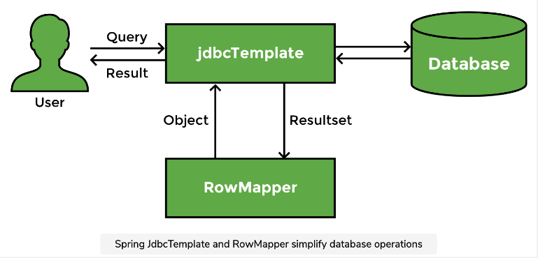
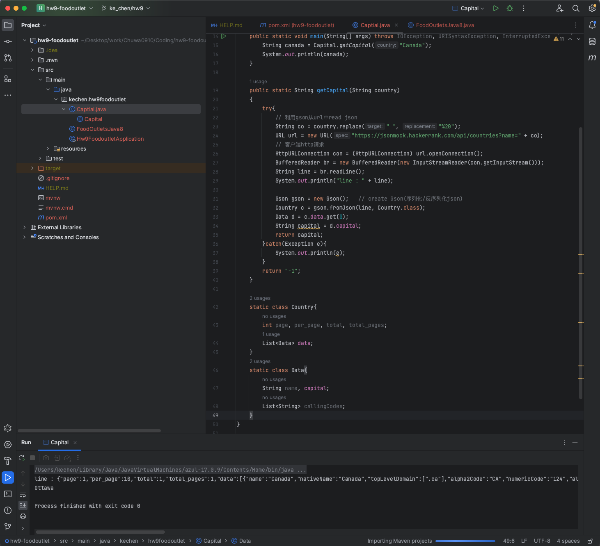
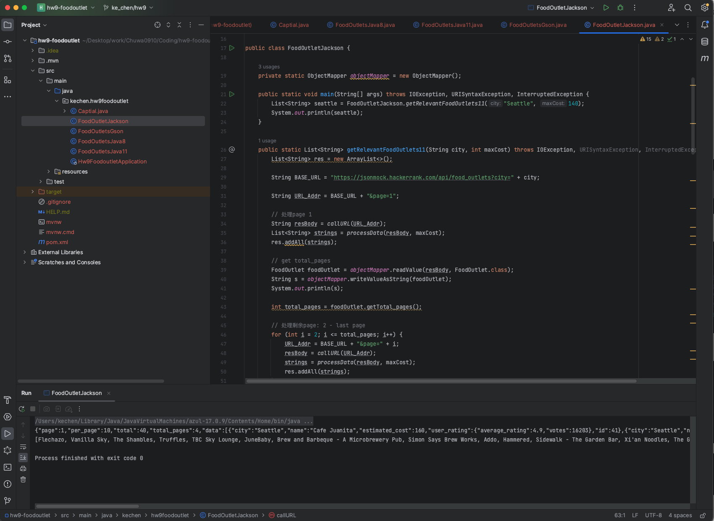
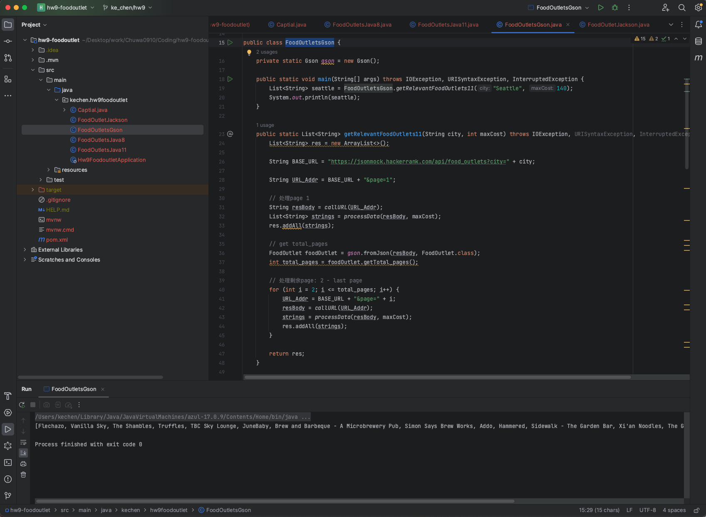
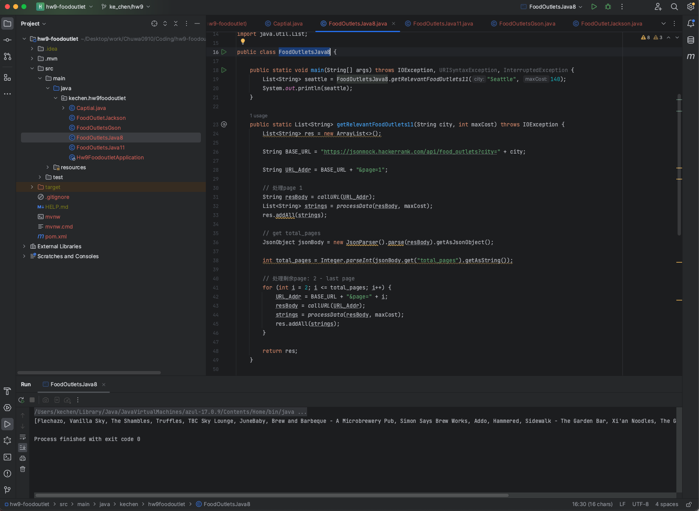
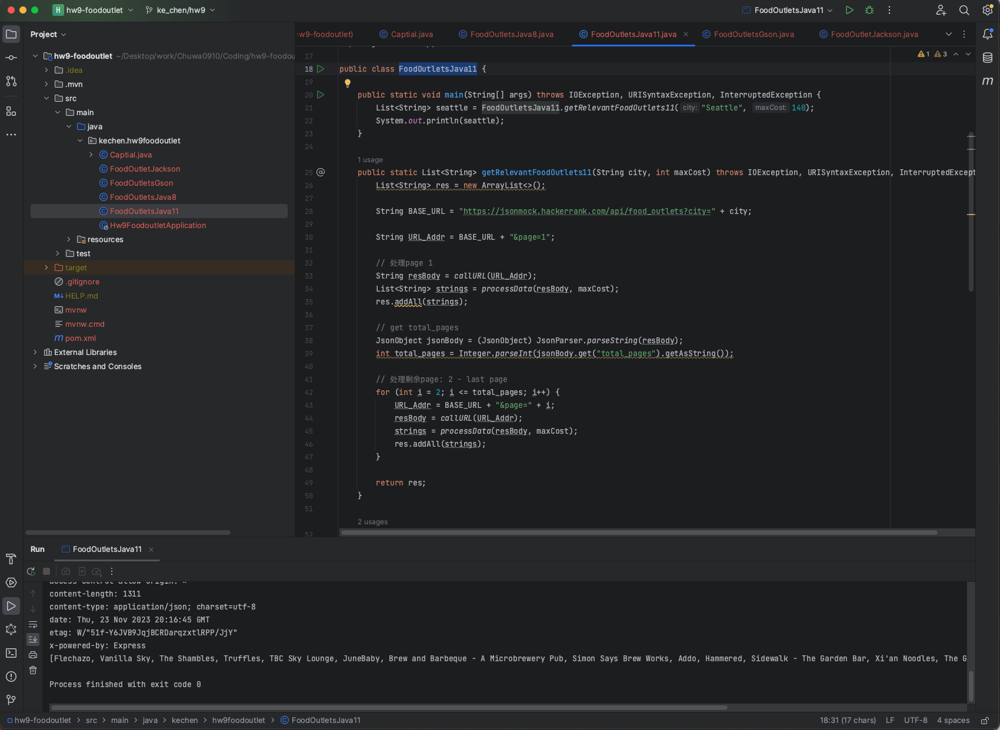
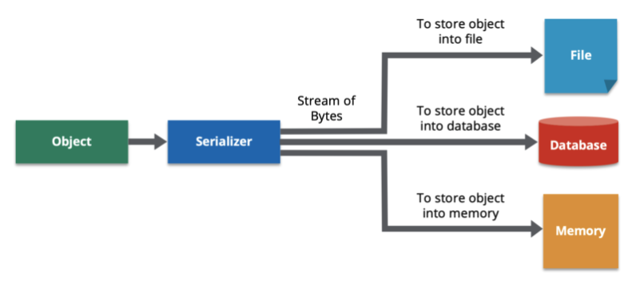
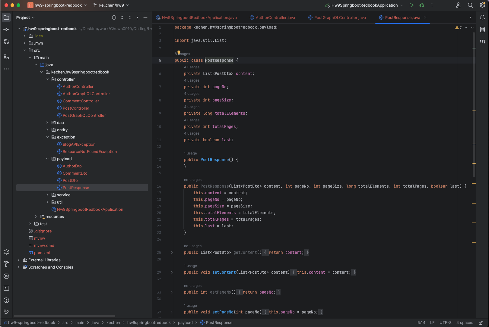
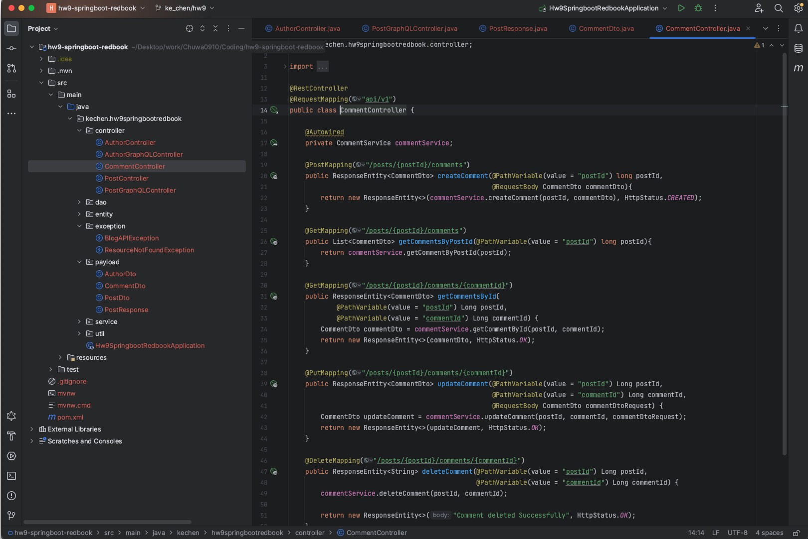

# hw9 - Ke Chen - springboot-RUD

## 1. List all of the new annotations to your annotaitons.md and explain its role.

**find in files ShortQuestions: annotations.md**


## 2.  how do you do the debug? 主要要答：log

1. `Logging`: Use logging frameworks(Log4j or Logback) to add informative log messages at different levels.

2. `IDEs`: Utilize breakpoints, watches, and console output in IDEs for interactive debugging.

3. `Exception Handling`: Implement try-catch blocks to handle exceptions and log details.

4. `Unit/Integration Testing`: Writing unit tests and integration test can help to identify the issues.

4. `Debugging Tools`: Explore command-line debugging tools like jdb and bundled JDK tools.

5. `Collaboration`: Involve team members for code reviews and pair debugging.


## 3.  What is DTO, VO, Payload, DO, model?

- `DTO` (Data Transfer Object): a design pattern used for transferring data between different layers of an application
- `VO` (Value Object): is used to represent immutable values without identity.
- `Payload` is the actual data being sent.
- `DO`(Domain Object): represent entities or concepts in the business logic layer.
- `Model` : is an object used to represent data. 

DTO是一种设计模式，用于传输数据以及在不同层（比如业务逻辑层和持久化层）之间传递数据

DOs typically correspond one-to-one with tables or entities in a database and are responsible for storing business data and rules.


## 4.  What is @JsonProperty("description_yyds") ?

`@JsonProperty()` is a Jackson annotation used in Java to <u>specify the mapping between JSON property names and Java object fields during serialization and deserialization.</u> 在jason序列化和反序列化的过程中用括号里面的value替换field的值。

```java
    @Entity
    @Table(name = "comments")
    public class Comment {
        @Id
        @GeneratedValue(strategy = GenerationType.IDENTITY)
        private long id;

        //在json序列化和反序列化的过程中，把object field：name替换成json property name。
        @JsonProperty("name")
        private String name;
        private String email;
        private String body;
    }
```


## 5. do you know what is jackson?
```
     <dependency> 
        <groupId>com.fasterxml.jackson.core</groupId>
        <artifactId>jackson-databind</artifactId>
        <version>2.13.3</version>
        <scope>compile</scope>
    </dependency>
```

Jackson is <u>a Java library for JSON (JavaScript Object Notation) serialization and deserialization</u>. 

It <u>provides a set of high-performance APIs to work with JSON data in Java applications</u>. 

Jackson is commonly used in Java applications, including web services, RESTful APIs, and data exchange between different systems, to handle JSON data.


## 6.  What is spring-boot-stater? what dependecies in the below starter? do you know any starters?

```
    <dependency>
        <groupId>org.springframework.boot</groupId>
        <artifactId>spring-boot-starter-web</artifactId>
    </dependency>
```

**What is spring-boot-stater?**

spring-boot-starter is not a specific starter itself but rather <u>a naming convention to include dependencies and configuration settings related to specific functionalities</u> into project.

For instance, if you want to work with Spring Data JPA, instead of manually specifying all the dependencies required for JPA support, you can simply include the spring-boot-starter-data-jpa starter in your project. This starter contains all the necessary dependencies for JPA, such as the JPA API, Hibernate, database drivers, and other related libraries.

**what dependecies in the below starter?**

The `spring-boot-starter-web` dependency is <u>a starter for building web applications with Spring Boot.</u> 

It includes the necessary dependencies for setting up a basic web application using Spring MVC, including the embedded Tomcat server, Spring Web, and other components required for handling web-related tasks.

**do you know any starters?**

Some other starters provided by Spring Boot include:

- `spring-boot-starter-data-jpa`: Starter for using Spring Data JPA with Hibernate for database access.
- `spring-boot-starter-security`: Starter for securing your application with Spring Security.
- `spring-boot-starter-test`: Starter for writing unit tests in Spring Boot applications.
- `spring-boot-starter-thymeleaf`: Starter for using Thymeleaf as a template engine in web applications.
- `spring-boot-starter-actuator`: Starter for using Spring Boot Actuator for monitoring and managing your application.


## 7 Do you know @RequestMapping(value = "/users", method = RequestMethod.POST) ? could you list CRUD by this style?

**Do you know  @RequestMapping(value = "/users", method = RequestMethod.POST) ?**

the annotated method is responsible for <u>handling POST requests to the /users endpoint.</u> 处理到/users的post request

映射HTTP请求的路径和HTTP请求方法到相应的处理方法。

@RequestMapping(“/path”)表示该控制器处理所有“/path”的URL请求。RequestMapping是一个用来处理请求地址映射的注解，可用于类或方法上。

该注解有六个属性：
- `params`:指定request中必须包含某些参数值是，才让该方法处理。
- `headers`:指定request中必须包含某些指定的header值，才能让该方法处理请求。
- `value`:指定请求的实际地址，指定的地址可以是URI Template 模式
- `method`:指定请求的method类型， GET、POST、PUT、DELETE等
- `consumes`:指定处理请求的提交内容类型（Content-Type），如application/json,text/html;
- `produces`:指定返回的内容类型，仅当request请求头中的(Accept)类型中包含该指定类型才返回


**could you list CRUD by this style?**

- C: @PostMapping("/users")
- R: @GetMapping("/users/{id}")
- U: @UpdateMapping("/users/{id}")
- D: @DeleteMapping("/users/{id}")


## 8.  What is ResponseEntity? why do we need it?

```
    new ResponseEntity<>(postResponse, HttpStatus.OK);
    new ResponseEntity<>(postResponse, HttpStatus.CREATED);
    ResponseEntity.ok(postService.getPostById(id));
```

**What is ResponseEntity?**
ResponseEntity in Spring <u>represents an HTTP response.</u>

**why do we need it?**
<u>It allows to costomize the HTTP status code, headers, and body of the response returned from a controller method</u>.


## 9.  What is ResultSet in jdbc? and describe the flow how to get data using JDBC

**What is ResultSet in jdbc?**

In JDBC (Java Database Connectivity), a `ResultSet` is <u>an interface</u> that <u>represents the result set of a database query</u>. 

It provides methods for retrieving and manipulating data retrieved from a relational database. 

A `ResultSet` typically consists of rows and columns(包含rows和columns), where each row represents a record in the result set, and each column represents a field or attribute of that record.


**describe the flow how to get data using JDBC**
1. load driver
2. establising a connection
3. creating a prepared statement or query
4. execute the query
5. looping through the result set to get the objects
6. close the connection

```
public Employee getEmployeeById(int id) throws Exception {
        Employee employee = new Employee();
        Connection conn = null;
        Statement stmt = null;
        ResultSet rs = null;
        
        try() {
            // 1, load Driver
            Class.forName("com.mysql.cj.jdbc.Driver");
            // 2， connect to Database;  （url, username, password）
            Connection connection = DriverManager.getConnection("jdbc:mysql://localhost:3306/mydatabase", "un", "pw");
            // 3， define sql statement
            String sql = "SELECT *  emp WHERE ID = " + id;
            // 4, create a statement object
            Statement statement = connection.createStatement();
            // 5, use statement object to execute sql statement;
            ResultSet resultSet = statement.executeQuery(sql); // the result is return to ResultSet
            
            while(rs.next()) {
                // 6, get ResultSet's data to java object(employee), Retrieve Data from ResultSet
                int id = employee.setId(rs.getInt("id"));
                String name = employee.setName(rs.getString("name"));
            }
            return employee;
        } catch (SQLException e) {
            ...
        }finally{
            // 7, close conections and other resource.
            rs.close();
            stmt.close();
            conn.close();
        }
        return null;
    }
}
```

Spring JdbcTemplate and RowMapper simplify database operations:



```
/**
 * GET/SELECT
 */
public List<Player> getAllPlayers() {
    String sql = "SELECT * FROM PLAYER";
    return jdbcTemplate.query(
                    sql, 
                    new BeanPropertyRowMapper<Player>(Player.class), 
                );
}

/**
 * POST/Insert
 */
public Player getPlayerById(int id) {
    String sql = "SELECT * FROM PLAYER WHERE ID = ?";
    return jdbcTemplate.queryForObject(
                        sql, 
                        new BeanPropertyRowMapper<Player>(Player.class), 
                        new Object[] {id}
                    );
}

/**
 * POST/Insert
 */
public int insertPlayer(Player player){
    String sql = "INSERT INTO PLAYER (ID, Name, Nationality,Birth_date, Titles) " + "VALUES (?, ?, ?, ?, ?)";
    return jdbcTemplate.update( sql, new Object[] { 
                                player.getId(), 
                                player.getName(), 
                                player.getNationality(), 
                                new Timestamp(player.getBirthDate().getTime()), player.getTitles()  }
                            );
}

/**
 * UPDATE
 */
public int updatePlayer(Player player){
    String sql = "UPDATE PLAYER " + "SET Name = ?, Nationality = ?, Birth_date = ? , Titles = ? " + "WHERE ID = ?";
    return jdbcTemplate.update( sql, new Object[] { 
                                   player.getName(), 
                                   player.getNationality(), 
                                   new Timestamp(player.getBirthDate().getTime()), 
                                   player.getTitles(), 
                                   player.getId() }
                              );
}

/**
 * DELETE
 */
public int deletePlayerById(int id) {
    String sql="DELETE FROM PLAYER WHERE ID = ?";
    return jdbcTemplate.update(sql, new Object[] {id});
}

/**
 * DDL
 */
public void createTournamentTable() {
    String sql = "CREATE TABLE TOURNAMENT (ID INTEGER, NAME VARCHAR(50), LOCATION VARCHAR(50), PRIMARY KEY (ID))";
    jdbcTemplate.execute(sql);
    System.out.println("Table created");
}
```


## 10. What is the ORM framework?

ORM <u>stands for Object-Relational Mapping</u>. 

It is a programming technique and a framework that <u>enables developers to interact with relational databases using object-oriented programming languages like Java, Python, C#, and others</u>. 

It simplifies the interaction between the object-oriented and relational paradigms, enabling developers to work with objects rather than dealing directly with database tables and SQL queries.

Popular ORM frameworks in Java: `Hibernate`, `Java Persistence API (JPA)`, EclipseLink.


## 11. Learn how to use ObjectMapper by this example.

**find in coding file: hw9-foodoutlet**

https://github.com/TAIsRich/chuwa-eij-tutorial/blob/main/02-java-core/src/main/java/com/chuwa/exercise/oa/api/

```
    FoodOutletJackson.java
    FoodOutlet foodOutlet = objectMapper.readValue(resBody, FoodOutlet.class);
    String s = objectMapper.writeValueAsString(foodOutlet);
    objectMapper.readTree() // learn how to use it?
```

1. 题目描述在PDF文件，先阅读下面文章，再尝试自己写。
2. 答案包含了java 8, java 11怎么做HTTP call。String 和Json的转换也有两个版本。
3. 如果答案也看不懂，则先照抄一遍，能理解多少是多少。

### 1. read and learn the IO: 
https://www.liaoxuefeng.com/wiki/1252599548343744/1255945227202752

**IO:**

    IO是指Input/Output，即输入和输出。以内存为中心：

    Input指从外部读入数据到内存，例如，把文件从磁盘读取到内存，从网络读取数据到内存等等。

    Output指把数据从内存输出到外部，例如，把数据从内存写入到文件，把数据从内存输出到网络等等。

**InputStream / OutputStream 输入字节流/输出字节流:**

    字节流传输的最小数据单位是`byte`

**Reader / Writer (输出)字符流/ (输入)字符流**

    字符流传输的最小数据单位是`char`

**同步和异步:**

    同步IO是指，读写IO时代码必须等待数据返回后才继续执行后续代码，它的优点是代码编写简单，缺点是CPU执行效率低。

    异步IO是指，读写IO时仅发出请求，然后立刻执行后续代码，它的优点是CPU执行效率高，缺点是代码编写复杂。


### 2. read and learn the HTTP: 
https://www.liaoxuefeng.com/wiki/1252599548343744/1319099982413858

**HTTP:**

HTTP是HyperText Transfer Protocol的缩写，翻译为超文本传输协议，它是基于TCP协议之上的一种请求-响应协议。

HTTP请求的格式：HTTP Header和HTTP Body两部分构成

```
// header
POST /login HTTP/1.1
Content-Type: application/json
Content-Length: 38

// body
{
    "username":"bob",
    "password":"123456"
}
```

HTTP响应的格式： 也是由Header和Body两部分组成
```
HTTP/1.1 200 OK // 响应的第一行总是HTTP版本 响应代码 响应说明
Content-Type: text/html
Content-Length: 133251

<!DOCTYPE html>
<html><body>
<h1>Hello</h1>
...
```

- http1.0版本：对于最早期的HTTP/1.0协议，每次发送一个HTTP请求，客户端都需要先创建一个新的TCP连接，然后，收到服务器响应后，关闭这个TCP连接。
- http1.1版本：HTTP/1.1协议允许在一个TCP连接中反复发送-响应。因为HTTP协议是一个请求-响应协议，客户端在发送了一个HTTP请求后，必须等待服务器响应后，才能发送下一个请求，这样一来，如果某个响应太慢，它就会堵住后面的请求。
- http2.0版本：HTTP/2.0允许客户端在没有收到响应的时候，发送多个HTTP请求，服务器返回响应的时候，不一定按顺序返回，只要双方能识别出哪个响应对应哪个请求，就可以做到并行发送和接收。


**HttpClient (客户端的http编程):**

客户端的http编程：发送一个HTTP请求，接收服务器响应后，获得响应内容。只不过浏览器进一步把响应内容解析后渲染并展示给了用户，而我们使用Java进行HTTP客户端编程仅限于获得响应内容。

早期的JDK版本是通过HttpURLConnection访问HTTP，代码编写比较繁琐，并且需要手动处理InputStream，所以用起来很麻烦。

从Java 11开始，引入了新的HttpClient，使用链式调用的API，能大大简化HTTP的处理。

使用GET请求获取文本内容代码如下：
```
import java.net.URI;
import java.net.http.*;
import java.net.http.HttpClient.Version;
import java.time.Duration;
import java.util.*;

public class Main {
    // 全局HttpClient(首先需要创建一个全局HttpClient实例，因为HttpClient内部使用线程池优化多个HTTP连接，可以复用：)
    static HttpClient httpClient = HttpClient.newBuilder().build();

    public static void main(String[] args) throws Exception {
        String url = "https://www.sina.com.cn/";
        HttpRequest request = HttpRequest.newBuilder(new URI(url))
            .header("User-Agent", "Java HttpClient").header("Accept", "*/*")    // 设置Header:
            .timeout(Duration.ofSeconds(5))       // 设置超时:
            .version(Version.HTTP_2).build();       // 设置版本:
        HttpResponse<String> response = httpClient.send(request, HttpResponse.BodyHandlers.ofString());

        // HTTP允许重复的Header，因此一个Header可对应多个Value:
        Map<String, List<String>> headers = response.headers().map();
        for (String header : headers.keySet()) {
            System.out.println(header + ": " + headers.get(header).get(0));
        }
        System.out.println(response.body().substring(0, 1024) + "...");
    }
}
```

使用post请求，要准备好发送的Body数据并正确设置Content-Type：
```
String url = "http://www.example.com/login";
String body = "username=bob&password=123456";
HttpRequest request = HttpRequest.newBuilder(new URI(url))
    .header("Accept", "*/*")        // 设置Header:
    .header("Content-Type", "application/x-www-form-urlencoded")   
    .timeout(Duration.ofSeconds(5))     // 设置超时:  
    .version(Version.HTTP_2)       // 设置版本:  
    .POST(BodyPublishers.ofString(body, StandardCharsets.UTF_8)).build();       // 使用POST并设置Body:

HttpResponse<String> response = httpClient.send(request, HttpResponse.BodyHandlers.ofString());
String s = response.body();
```


### 3. read and learn xml and Json: 
https://www.liaoxuefeng.com/wiki/1252599548343744/1255945389334784 （如何使用Java读写XML和JSON。）

**XML (在实际应用中很少用到，通常了解一下就可以了):**

XML是可扩展标记语言（eXtensible Markup Language）的缩写，它是一种数据表示格式，可以描述非常复杂的数据结构，常用于传输和存储数据。

XML的结构：

- 首行必定是<?xml version="1.0"?>，可以加上可选的编码。
- 紧接着，如果以类似<!DOCTYPE note SYSTEM "book.dtd">声明的是文档定义类型（DTD：Document Type Definition），DTD是可选的。
- 接下来是XML的文档内容，一个XML文档有且仅有一个根元素，根元素可以包含任意个子元素，元素可以包含属性，例如，<isbn lang="CN">1234567</isbn>包含一个属性lang="CN"，且元素必须正确嵌套。如果是空元素，可以用<tag/>表示。
- 使用DOM，SAX和Jackson解析XML

```
<?xml version="1.0" encoding="UTF-8" ?>
<!DOCTYPE note SYSTEM "book.dtd">
<book id="1">
    <name>Java核心技术</name>
    <author>Cay S. Horstmann</author>
    <isbn lang="CN">1234567</isbn>
    <tags>
        <tag>Java</tag>
        <tag>Network</tag>
    </tags>
    <pubDate/>
</book>
```

**JSON 取代 XML:**

JSON是JavaScript Object Notation的缩写，它去除了所有JavaScript执行代码，只保留JavaScript的对象格式。

```
{
    "id": 1,
    "name": "Java核心技术",
    "author": {
        "firstName": "Abc",
        "lastName": "Xyz"
    },
    "isbn": "1234567",
    "tags": ["Java", "Network"]
}
```

<u>使用Java如何对JSON进行读写 ： 利用Jackson解析JSON(直接在JSON和JavaBean之间转换)</u>

**反序列化(把JSON解析为JavaBean):**


**序列化(把JavaBean变为JSON):**
```
ObjectMapper mapper = new ObjectMapper();   // 核心代码是创建一个ObjectMapper对象
String json = mapper.writeValueAsString(book);
```


### 4. read and has basic understanding of Gson. know what is serialization。 
work with JSON in Java using Gson library: https://zetcode.com/java/gson/

**3 types of API**

We use three different Gson APIs to work with JSON. 
Gson has three types of API:
- Data binding API
    - Data binding API converts JSON to and from POJO using property accessors. Gson processes JSON data using data type adapters. It is similar to XML JAXB parser.
- Tree model API
    - Tree model API creates an in-memory tree representation of the JSON document. It builds a tree of JsonElements. It is similar to XML DOM parser.
- Streaming API
    - Streaming API is a low-level API that reads and writes JSON content as discrete tokens with JsonReader and JsonWriter. These classes read data as JsonTokens. This API has the lowest overhead and is fast in read/write operations. It is similar to Stax parser for XML.


**create Gson:**

Gson is the main class for using Gson library. 

There are two basic ways to create Gson:
- new Gson()
    - toJson() : serializes the specified object into its equivalent JSON representation. 序列化
    - fromJson() : deserializes the specified JSON into an object of the specified class.  反序列化
- new GsonBuilder().create()
    - GsonBuilder builds Gson with various configuration settings.
    - Gson gson = new GsonBuilder()
        .setFieldNamingPolicy(FieldNamingPolicy.UPPER_CAMEL_CASE)
        .create();
    -  GsonBuilder follows the builder pattern, and it is typically used by first invoking various configuration methods to set desired options, and finally calling create.


**Gson output modes:**

- compact
- pretty
    - Gson gson = new GsonBuilder().setPrettyPrinting().create();   // The example pretty prints the JSON output.


**Serializing null values:**

Gson by default does not serialize fields with null values to JSON. If a field in a Java object is null, Gson excludes it. We can force Gson to serialize null values via the GsonBuilder by using serializeNulls method.

- builder.serializeNulls();


**Java Gson write list:**

writes a list of JSON objects into a file.

**Java Gson read into array**

**Java Gson read JSON from URL**

**Java Gson excluding fields with @Expose**

**Java Gson data binding API**
- Gson data binding API write
- Gson data binding API read

**Java Gson tree model API**
- Gson tree model write
- Gson tree model read

**Java Gson streaming API**
- Gson JsonWriter
- Gson JsonReader


### 题目1：
REST API: Relevant Food Outlets

A REST API contains information about food outlets across multiple cities. Given the city name, and maximum cost for 2 persons. The goal is to use the API to get the list of food outlets that belongs to this city and have an estimated cost less than or equal to given cost. The API returns paginated data. (用API来获得所在城市的the list of outlets，并且给出一个estimated cost要求少于或者等于限定值, API返回分页数据)

To access the information, perform an HTTP GET request to:
`https://jsonmock.hackerrank.com/api/food_outlets?city=<city>&page=<pageNumber>` where `<city>` is the city to get the food outlets for and `<pageNumber>` is an integer that denotes the page of the result to return.

For example, a GET request to
`https://jsonmock.hackerrank.com/api/food_outlets?city=Seattle&page=2` returns data associated with <u>city Seattle</u>, and on the <u>second page</u> of the results.

Similary, a GET request to 
`https://jsonmock.hackerrank.com/api/food_outlets?city=Houston&page=1` returns data associated with <u>city Houston</u>, and on the <u>first page</u> of the results.

The response to such a request is a JSON with the following 5 fields:

- `page`: The current page of the results
- `per_page`: The maximum number of records returned per page.
- `total`: The total number of records in the database
- `total_pages` The total number of pages with results;
- `data`: Either an empty array or an array of outlet objects. Each object has the following schema:
    - `city`: city we queried for where the outlet is located[STRING]
    - `name`: name of the outlet[STRING]
    - `estimated_cost`: estimated cost for 2 persons[INTEGER]
    - `user_rating`: 
        - `average_rating`: average rating of the outlet[FLOAT]
        - `votes`: total votes for the outlet[INTEGER]
    - `id`: unique identifier of the outlet[INTEGER]

Given a string city, numerical maximum cost for 2 persons maxCost, return the list of food outlet names that are located in this city and have an estimated cost less than or equal to given maxCost.

Function Description
Complete the function `getRelevantFoodOutlets` in the editor below. Please perform pagination in order to get all results.
`getRelevantFoodOutlets` has the following parameter(s): 
    - `String city`: string denoting the city of the food outlet
    - `int maxCost`: max cost for 2 people

Returns:
An array of Strings denoting the food outlet names that are located in this city and have an estimated cost less than or equal to given maxCost. The names in the array must be ordered in the order they appear in the API response.

Constraints:
The given city will always have data returned from the API.

Note:
Required libraries can be imported in order to solve the question.








### 题目3：
Meaning of AVL Tree:

A: a BST with the properity that each node has equal difference between left and right sub tree

B: A tree having a finite member of nodes

C: A tree having a single node

D: None of the node

The correct answer is A: 

An AVL tree is a type of self-balancing binary search tree (BST) where the heights of the two child subtrees of any node differ by at most one. This balancing is maintained after every insertion or deletion operation, ensuring that the tree remains balanced, and therefore, efficient for search, insertion, and deletion operations.


## 12. What is the serialization and desrialization?

https://hazelcast.com/glossary/serialization/

**Serialization** is <u>the process of converting an object</u>—a combination of code and data represented within a region of data storage—<u>into a stream of bytes</u> that saves the state of the object in an easily transmittable form. 

The <u>reverse process—constructing a data structure or object from a series of bytes</u>—is **deserialization**. 




## 13. use stream api to get the average of the array [20, 3, 78, 9, 6, 53, 73, 99, 24, 32].
```java
import java.util.Arrays;

public class Main {
    public static void main(String[] args) {
        int[] numbers = {20, 3, 78, 9, 6, 53, 73, 99, 24, 32};
    
        // use `.orElse(Double.NaN)` to handle the case where the stream is empty (e.g., if the array is empty)
        // `Double.NaN` represents a "Not-a-Number" value

        double average = Arrays
            .stream(numbers)
            .average()
            .orElse(Double.NaN);
        
        System.out.println("Average: " + average);
    }
}

output:
Average: 41.4
```


## 14. 抄写，https://github.com/TAIsRich/springboot-redbook/tree/03_post_pageable，你也可以像我一样分branch添加新代码。

**find in Coding file: hw9-springboot-redbook**




## 15. (Optional) 抄写 https://github.com/TAIsRich/springboot-redbook/tree/04_comment你也可以像我一样分branch添加新代码。

**find in Coding file: hw9-springboot-redbook**





## 16. (Optional) Try to write the CRUD api for a new application Cassandra-Blog

- https://www.bilibili.com/video/BV1aQ4y1Z7Nj
- spring 提供了相关dependency,(https://start.spring.io/)
    -  Spring Data for Apache Cassandra
- Cassandra十分流行，且面试问的多。